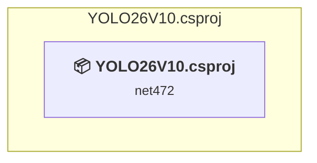

# Projects and dependencies analysis

This document provides a comprehensive overview of the projects and their dependencies in the context of upgrading to .NETCoreApp,Version=v8.0.

## Table of Contents

- [Executive Summary](#executive-Summary)
  - [Highlevel Metrics](#highlevel-metrics)
  - [Projects Compatibility](#projects-compatibility)
  - [Package Compatibility](#package-compatibility)
  - [API Compatibility](#api-compatibility)
- [Aggregate NuGet packages details](#aggregate-nuget-packages-details)
- [Top API Migration Challenges](#top-api-migration-challenges)
  - [Technologies and Features](#technologies-and-features)
  - [Most Frequent API Issues](#most-frequent-api-issues)
- [Projects Relationship Graph](#projects-relationship-graph)
- [Project Details](#project-details)

  - [YOLO26V10.csproj](#yolo26v10csproj)

## Executive Summary

### Highlevel Metrics

| Metric | Count | Status |
| :--- | :---: | :--- |
| Total Projects | 1 | All require upgrade |
| Total NuGet Packages | 4 | 1 need upgrade |
| Total Code Files | 29 |  |
| Total Code Files with Incidents | 18 |  |
| Total Lines of Code | 5982 |  |
| Total Number of Issues | 3170 |  |
| Estimated LOC to modify | 3168+ | at least 53.0% of codebase |

### Projects Compatibility

| Project | Target Framework | Difficulty | Package Issues | API Issues | Est. LOC Impact | Description |
| :--- | :---: | :---: | :---: | :---: | :---: | :--- |
| [YOLO26V10.csproj](#yolo26v10csproj) | net472 | 🟡 Medium | 1 | 3168 | 3168+ | WinForms, Sdk Style = True |

### Package Compatibility

| Status | Count | Percentage |
| :--- | :---: | :---: |
| ✅ Compatible | 3 | 75.0% |
| ⚠️ Incompatible | 0 | 0.0% |
| 🔄 Upgrade Recommended | 1 | 25.0% |
| ***Total NuGet Packages*** | ***4*** | ***100%*** |

### API Compatibility

| Category | Count | Impact |
| :--- | :---: | :--- |
| 🔴 Binary Incompatible | 2541 | High - Require code changes |
| 🟡 Source Incompatible | 627 | Medium - Needs re-compilation and potential conflicting API error fixing |
| 🔵 Behavioral change | 0 | Low - Behavioral changes that may require testing at runtime |
| ✅ Compatible | 5194 |  |
| ***Total APIs Analyzed*** | ***8362*** |  |

## Aggregate NuGet packages details

| Package | Current Version | Suggested Version | Projects | Description |
| :--- | :---: | :---: | :--- | :--- |
| Microsoft.ML.OnnxRuntime.Gpu | 1.19.2 |  | [YOLO26V10.csproj](#yolo26v10csproj) | ✅Compatible |
| OpenCvSharp4 | 4.10.0.20240616 |  | [YOLO26V10.csproj](#yolo26v10csproj) | ✅Compatible |
| OpenCvSharp4.runtime.win | 4.10.0.20240616 |  | [YOLO26V10.csproj](#yolo26v10csproj) | ✅Compatible |
| System.Resources.Extensions | 10.0.0 | 8.0.0 | [YOLO26V10.csproj](#yolo26v10csproj) | NuGet 패키지 업그레이드를 권장합니다. |

## Top API Migration Challenges

### Technologies and Features

| Technology | Issues | Percentage | Migration Path |
| :--- | :---: | :---: | :--- |
| Windows Forms | 2541 | 80.2% | Windows Forms APIs for building Windows desktop applications with traditional Forms-based UI that are available in .NET on Windows. Enable Windows Desktop support: Option 1 (Recommended): Target net9.0-windows; Option 2: Add <UseWindowsDesktop>true</UseWindowsDesktop>; Option 3 (Legacy): Use Microsoft.NET.Sdk.WindowsDesktop SDK. |
| GDI+ / System.Drawing | 625 | 19.7% | System.Drawing APIs for 2D graphics, imaging, and printing that are available via NuGet package System.Drawing.Common. Note: Not recommended for server scenarios due to Windows dependencies; consider cross-platform alternatives like SkiaSharp or ImageSharp for new code. |
| Legacy Configuration System | 2 | 0.1% | Legacy XML-based configuration system (app.config/web.config) that has been replaced by a more flexible configuration model in .NET Core. The old system was rigid and XML-based. Migrate to Microsoft.Extensions.Configuration with JSON/environment variables; use System.Configuration.ConfigurationManager NuGet package as interim bridge if needed. |

### Most Frequent API Issues

| API | Count | Percentage | Category |
| :--- | :---: | :---: | :--- |
| T:System.Windows.Forms.Button | 195 | 6.2% | Binary Incompatible |
| T:System.Windows.Forms.Label | 174 | 5.5% | Binary Incompatible |
| T:System.Windows.Forms.GroupBox | 138 | 4.4% | Binary Incompatible |
| T:System.Windows.Forms.AnchorStyles | 107 | 3.4% | Binary Incompatible |
| T:System.Windows.Forms.ComboBox | 84 | 2.7% | Binary Incompatible |
| T:System.Drawing.Bitmap | 64 | 2.0% | Source Incompatible |
| T:System.Windows.Forms.ProgressBar | 63 | 2.0% | Binary Incompatible |
| T:System.Windows.Forms.TextBox | 61 | 1.9% | Binary Incompatible |
| T:System.Windows.Forms.DialogResult | 60 | 1.9% | Binary Incompatible |
| T:System.Windows.Forms.DockStyle | 51 | 1.6% | Binary Incompatible |
| T:System.Windows.Forms.TableLayoutPanel | 48 | 1.5% | Binary Incompatible |
| P:System.Windows.Forms.Control.Name | 46 | 1.5% | Binary Incompatible |
| P:System.Windows.Forms.Control.Size | 44 | 1.4% | Binary Incompatible |
| P:System.Windows.Forms.Control.Location | 44 | 1.4% | Binary Incompatible |
| P:System.Windows.Forms.Control.TabIndex | 42 | 1.3% | Binary Incompatible |
| P:System.Windows.Forms.Control.Enabled | 41 | 1.3% | Binary Incompatible |
| T:System.Windows.Forms.PictureBox | 39 | 1.2% | Binary Incompatible |
| T:System.Drawing.Imaging.PixelFormat | 38 | 1.2% | Source Incompatible |
| T:System.Windows.Forms.Control.ControlCollection | 36 | 1.1% | Binary Incompatible |
| P:System.Windows.Forms.Control.Controls | 36 | 1.1% | Binary Incompatible |
| M:System.Windows.Forms.Control.ControlCollection.Add(System.Windows.Forms.Control) | 36 | 1.1% | Binary Incompatible |
| T:System.Windows.Forms.MessageBoxIcon | 34 | 1.1% | Binary Incompatible |
| T:System.Windows.Forms.MessageBoxButtons | 34 | 1.1% | Binary Incompatible |
| T:System.Drawing.Font | 33 | 1.0% | Source Incompatible |
| T:System.Windows.Forms.ProgressBarStyle | 33 | 1.0% | Binary Incompatible |
| T:System.Windows.Forms.FlatStyle | 30 | 0.9% | Binary Incompatible |
| P:System.Windows.Forms.Label.Text | 30 | 0.9% | Binary Incompatible |
| T:System.Windows.Forms.Panel | 27 | 0.9% | Binary Incompatible |
| T:System.Windows.Forms.BorderStyle | 24 | 0.8% | Binary Incompatible |
| T:System.Drawing.Graphics | 22 | 0.7% | Source Incompatible |
| P:System.Drawing.Image.Width | 21 | 0.7% | Source Incompatible |
| T:System.Drawing.Drawing2D.SmoothingMode | 21 | 0.7% | Source Incompatible |
| P:System.Windows.Forms.Control.ForeColor | 21 | 0.7% | Binary Incompatible |
| T:System.Windows.Forms.SizeType | 20 | 0.6% | Binary Incompatible |
| T:System.Windows.Forms.NumericUpDown | 19 | 0.6% | Binary Incompatible |
| T:System.Windows.Forms.ComboBox.ObjectCollection | 18 | 0.6% | Binary Incompatible |
| P:System.Windows.Forms.ComboBox.Items | 18 | 0.6% | Binary Incompatible |
| P:System.Drawing.Image.Height | 17 | 0.5% | Source Incompatible |
| T:System.Windows.Forms.MessageBox | 17 | 0.5% | Binary Incompatible |
| M:System.Windows.Forms.MessageBox.Show(System.Windows.Forms.IWin32Window,System.String,System.String,System.Windows.Forms.MessageBoxButtons,System.Windows.Forms.MessageBoxIcon) | 17 | 0.5% | Binary Incompatible |
| P:System.Windows.Forms.Control.Dock | 17 | 0.5% | Binary Incompatible |
| F:System.Windows.Forms.AnchorStyles.Right | 17 | 0.5% | Binary Incompatible |
| P:System.Windows.Forms.Control.Anchor | 17 | 0.5% | Binary Incompatible |
| T:System.Drawing.SolidBrush | 16 | 0.5% | Source Incompatible |
| M:System.Drawing.SolidBrush.#ctor(System.Drawing.Color) | 16 | 0.5% | Source Incompatible |
| T:System.Drawing.FontStyle | 16 | 0.5% | Source Incompatible |
| F:System.Windows.Forms.MessageBoxButtons.OK | 15 | 0.5% | Binary Incompatible |
| F:System.Windows.Forms.DockStyle.Fill | 15 | 0.5% | Binary Incompatible |
| F:System.Windows.Forms.AnchorStyles.Top | 15 | 0.5% | Binary Incompatible |
| F:System.Windows.Forms.MessageBoxIcon.Warning | 14 | 0.4% | Binary Incompatible |

## Projects Relationship Graph

Legend:
📦 SDK-style project
⚙️ Classic project

## Project Details

### YOLO26V10.csproj

#### Project Info

- **Current Target Framework:** net472
- **Proposed Target Framework:** net8.0-windows
- **SDK-style**: True
- **Project Kind:** WinForms
- **Dependencies**: 0
- **Dependants**: 0
- **Number of Files**: 35
- **Number of Files with Incidents**: 18
- **Lines of Code**: 5982
- **Estimated LOC to modify**: 3168+ (at least 53.0% of the project)

#### Dependency Graph

Legend:
📦 SDK-style project
⚙️ Classic project

### API Compatibility

| Category | Count | Impact |
| :--- | :---: | :--- |
| 🔴 Binary Incompatible | 2541 | High - Require code changes |
| 🟡 Source Incompatible | 627 | Medium - Needs re-compilation and potential conflicting API error fixing |
| 🔵 Behavioral change | 0 | Low - Behavioral changes that may require testing at runtime |
| ✅ Compatible | 5194 |  |
| ***Total APIs Analyzed*** | ***8362*** |  |

#### Project Technologies and Features

| Technology | Issues | Percentage | Migration Path |
| :--- | :---: | :---: | :--- |
| Legacy Configuration System | 2 | 0.1% | Legacy XML-based configuration system (app.config/web.config) that has been replaced by a more flexible configuration model in .NET Core. The old system was rigid and XML-based. Migrate to Microsoft.Extensions.Configuration with JSON/environment variables; use System.Configuration.ConfigurationManager NuGet package as interim bridge if needed. |
| GDI+ / System.Drawing | 625 | 19.7% | System.Drawing APIs for 2D graphics, imaging, and printing that are available via NuGet package System.Drawing.Common. Note: Not recommended for server scenarios due to Windows dependencies; consider cross-platform alternatives like SkiaSharp or ImageSharp for new code. |
| Windows Forms | 2541 | 80.2% | Windows Forms APIs for building Windows desktop applications with traditional Forms-based UI that are available in .NET on Windows. Enable Windows Desktop support: Option 1 (Recommended): Target net9.0-windows; Option 2: Add <UseWindowsDesktop>true</UseWindowsDesktop>; Option 3 (Legacy): Use Microsoft.NET.Sdk.WindowsDesktop SDK. |

