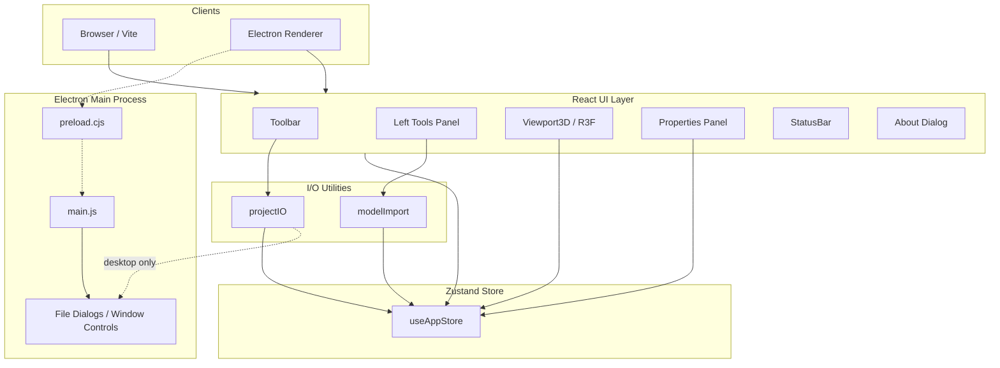
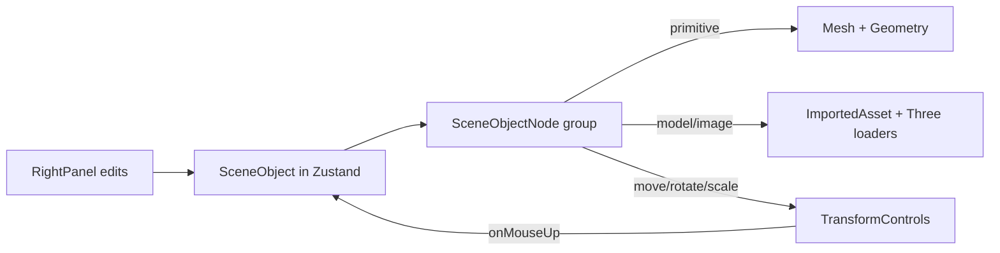

# Architecture

**3D Drawing Tool** — system architecture overview  
Author: SHKWON (`knix008@naver.com`) · Version 1.0.0

## 1. Goals

- One codebase for **Web** and **desktop** (Windows / macOS / Linux)
- Interactive 3D scene editing with primitives and imported assets
- Theme (Dark/Light) and language (KO/EN) without platform branching in UI
- Persist full projects including imported models as portable `.3ddraw` files
- Package desktop installers with optional shortcuts via electron-builder

## 2. High-Level Architecture



## 3. Runtime Modes

| Mode | Entry | Notes |
|------|--------|------|
| Electron (default) | `npm start` | Frameless Windows/desktop app, native dialogs, IPC |
| Web | `npm run dev` → Vite → `index.html` | File save/open via browser download / file picker |
| Electron prod | Packaged `dist/` + `electron/` | `base: './'` asset paths |

Detection: `window.electronAPI?.isElectron` (exposed by preload).

## 4. Layer Responsibilities

### 4.1 Presentation (`src/components/`)

| Component | Role |
|-----------|------|
| `Toolbar` | File ops, grid/axes toggles, theme, language, about, window chrome |
| `LeftPanel` | Transform tools, import, primitives, duplicate/delete |
| `Viewport3D` | R3F canvas, lights, grid, axes+labels, objects, gizmo, DnD import |
| `ImportedAsset` | Loaders for GLB/GLTF/OBJ/STL/FBX/PLY/images |
| `RightPanel` | Selected object props, lighting, viewport flags |
| `AboutDialog` | Version, author SHKWON, email |
| `StatusBar` | Object count / selection summary |

### 4.2 State (`src/store/useAppStore.ts`)

Single Zustand store holds:

- `theme`, `language`, `tool`
- `objects[]`, `selectedId`
- `lights`, `viewport`
- `projectName`, project lifecycle actions

Actions: `addShape`, `addImportedAsset`, `updateObject`, `deleteSelected`, `duplicateSelected`, `exportProject` / `importProject`, `newProject`.

Theme/language also persist to `localStorage`.

### 4.3 Domain Types (`src/types.ts`)

- **Primitives:** box, sphere, cylinder, cone, torus, plane  
- **Imported:** `model` / `image` with `modelUrl`, `modelFormat`, `sourceFileName`  
- Shared transform & material fields on `SceneObject`  
- `ProjectData` is the serializable project document

### 4.4 I/O

| Module | Responsibility |
|--------|----------------|
| `utils/projectIO.ts` | Save/open `.3ddraw`; Electron dialogs or browser APIs |
| `utils/modelImport.ts` | Multi-file picker / DnD → data URL → `addImportedAsset` |

Imported binaries are stored as **data URLs** inside the project JSON so restore works without external files.

### 4.5 Electron (`electron/`)

| File | Role |
|------|------|
| `main.js` | Frameless `BrowserWindow`, IPC for window + file dialogs |
| `preload.cjs` | `contextBridge` → `window.electronAPI` |

IPC handlers: minimize / maximize / close, save/open project, `openExternal`.

### 4.6 i18n & Theming

- **i18next** resources: `src/i18n/locales/ko.json`, `en.json`
- **CSS variables** on `[data-theme='dark'|'light']` in `styles/global.css`

## 5. 3D Scene Pipeline



- Camera: `OrbitControls` (orbit / pan / zoom)
- Selection: mesh/group click; empty click clears selection
- Axes: `axesHelper` + Billboard `Text` labels (X/Y/Z)
- Corner orientation: `GizmoHelper` / `GizmoViewport`
- Imports are normalized to ~unit size and placed for transform editing (default tool: **move**)

## 6. Supported Import Formats

| Format | Loader | Object type |
|--------|--------|-------------|
| GLB / GLTF | `GLTFLoader` | `model` |
| OBJ | `OBJLoader` | `model` |
| STL | `STLLoader` | `model` |
| FBX | `FBXLoader` | `model` |
| PLY | `PLYLoader` | `model` |
| PNG / JPG / WEBP | `useTexture` + plane | `image` |

## 7. Packaging

- **Icons:** `public/icon.svg` → `scripts/generate-icons.mjs` → `build/`
- **electron-builder** config in `package.json` → `release/`
- Windows NSIS: assisted installer, desktop & start-menu shortcut options

## 8. Directory Map

```
src/
  App.tsx                 # Shell layout + keyboard delete
  main.tsx                # React bootstrap
  types.ts                # Domain types
  components/             # UI + 3D
  store/useAppStore.ts    # Global state
  i18n/                   # Translations
  utils/                  # projectIO, modelImport
  styles/global.css       # Themes & layout
electron/
  main.js
  preload.cjs
public/icon.svg
build/                    # Generated installer icons
scripts/generate-icons.mjs
```

## 9. Extension Points

- New primitive: extend `PrimitiveType`, geometry switch, LeftPanel entry, i18n keys
- New import format: extend `ModelFormat` + branch in `ImportedAsset` / `modelImport`
- Undo/redo: wrap store mutations with a history stack
- Multi-select: change `selectedId` → `selectedIds[]` and TransformControls attachment

## 10. Security Notes (Electron)

- `contextIsolation: true`, `nodeIntegration: false`
- Renderer talks to Node only through preload-exposed APIs
- External URLs opened via `shell.openExternal` (about email)
