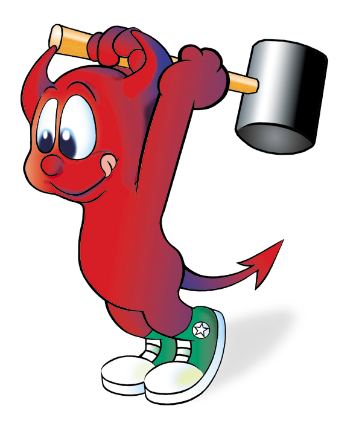

# CaptureMaster GTK v1.0 🔨

<div align="center">



**크로스 플랫폼 스크린 캡처 애플리케이션**

*Linux & macOS 지원*

</div>

## 📋 개요

CaptureMaster는 GTK3 기반의 경량 스크린 캡처 도구입니다. C언어로 작성되었으며, 순수 GTK API를 사용하여 Linux와 macOS에서 네이티브하게 동작합니다.

### 특징
- 🎯 순수 C 언어로 구현된 경량 애플리케이션
- 🔧 GTK3 기반으로 크로스 플랫폼 호환성 보장
- 📦 모듈화된 구조로 유지보수 용이
- 🖼️ GdkPixbuf를 활용한 이미지 처리
- 🔨 daemon_hammer.jpg 아이콘 사용

## ✨ 주요 기능

- ✅ 전체 화면 캡처 (구현 완료)
- ✅ 선택 영역 캡처 (구현 완료)
- ✅ 창 단위 캡처 (구현 완료)
- ✅ PNG/JPEG 형식 저장
- 🔄 지연 캡처 타이머 (3초/5초/10초)
- 📋 클립보드 자동 복사
- ⌨️ 커스텀 단축키 설정

## 🔧 시스템 요구사항

### Linux
- GTK+ 3.0 이상
- GCC 또는 Clang
- pkg-config
- X11 또는 Wayland

### macOS
- macOS 10.12 이상
- GTK+ 3.0 (Homebrew 통해 설치)
- Xcode Command Line Tools
- pkg-config

## 📦 의존성 설치

### 자동 설치 (권장)

```bash
make install-deps
```

### 수동 설치

#### Ubuntu/Debian
```bash
sudo apt-get update
sudo apt-get install libgtk-3-dev build-essential pkg-config
```

#### Fedora/RHEL
```bash
sudo dnf install gtk3-devel gcc make pkg-config
```

#### Arch Linux
```bash
sudo pacman -S gtk3 base-devel pkg-config
```

#### macOS (Homebrew 필요)
```bash
brew install gtk+3 pkg-config
```

## 🚀 빌드 및 실행

### 의존성 확인
```bash
make check-deps
```

### 빌드
```bash
make
```

### 실행
```bash
make run
# 또는
./capturemaster
```

### 디버그 빌드
```bash
make debug
```

## 🏗️ 프로젝트 구조

```
CaptureMasterGTKV10/
├── main.c              # 메인 애플리케이션 진입점
├── ui.c                # GTK UI 컴포넌트 (GTK 의존 레이어)
├── ui.h                # UI 인터페이스 헤더
├── capture.c           # 플랫폼 별 스크린 캡처 구현
├── capture.h           # 캡처 API 헤더
├── utils.c             # 플랫폼 독립 유틸리티 함수
├── utils.h             # 유틸리티 헤더
├── daemon_hammer.jpg   # 프로그램 아이콘 (윈도우 타이틀바에 표시)
├── Makefile            # 크로스 플랫폼 빌드 시스템
├── README.md           # 프로젝트 문서
└── .gitignore          # Git 제외 파일 목록
```

### 모듈 설명

- **main.c**: 애플리케이션 초기화 및 메인 이벤트 루프
- **ui.c/h**: GTK 의존적인 UI 컴포넌트 (다른 UI 프레임워크로 포팅 가능)
- **capture.c/h**: GdkPixbuf를 사용한 스크린 캡처 로직
- **utils.c/h**: 파일 I/O, 경로 처리, 시간 관리 등 범용 함수

## 🎮 사용 방법

### GUI 모드
1. 애플리케이션 실행: `./capturemaster`
2. 캡처 모드 선택:
   - 🖥️ **전체 화면 캡처**: 모든 모니터의 화면을 캡처
   - ✂️ **영역 선택 캡처**: 마우스로 영역을 드래그하여 선택
   - 🪟 **창 캡처**: 특정 창을 선택하여 캡처
3. 저장 경로 설정 (기본: `~/Pictures`)
4. 이미지 형식 선택 (PNG/JPEG)
5. 지연 시간 설정 (선택 사항)
6. '캡처' 버튼 클릭

### 저장 파일 형식
캡처된 이미지는 타임스탬프가 포함된 파일명으로 자동 저장됩니다:
```
screenshot_20260427_123456.png
```

## 🛠️ 개발

### 빌드 타겟

| 타겟 | 설명 |
|------|------|
| `make` | 기본 빌드 (최적화 활성화) |
| `make debug` | 디버그 빌드 (심볼 포함, -g -DDEBUG) |
| `make clean` | 빌드 산출물 제거 |
| `make distclean` | 전체 클린 (빌드 디렉토리 포함) |
| `make run` | 빌드 후 실행 |
| `make info` | 빌드 환경 정보 출력 |
| `make check-deps` | 의존성 확인 |
| `make install-deps` | 의존성 자동 설치 |

### 컴파일러 플래그
- `-Wall -Wextra`: 모든 경고 활성화
- `-O2`: 최적화 레벨 2
- `-std=c11`: C11 표준 사용
- `-g -DDEBUG`: 디버그 모드 (debug 타겟)

### 코드 스타일
- 들여쓰기: 공백 4칸
- 함수명: `snake_case`
- 구조체명: `PascalCase`
- 상수: `UPPER_CASE`

## 🐛 문제 해결

### 컴파일 오류

**증상**: `GTK not found` 또는 `pkg-config: command not found`
```bash
make install-deps
```

**증상**: `size_t` 또는 `usleep` 관련 경고
- 이미 해결됨: `utils.c`에 `_DEFAULT_SOURCE`와 `_POSIX_C_SOURCE` 정의
- `capture.h`에 `<stddef.h>` 포함

### 실행 오류

**증상**: 아이콘이 표시되지 않음
- `daemon_hammer.jpg` 파일이 실행 파일과 같은 디렉토리에 있는지 확인
- JPG 형식이 지원되지 않으면 PNG로 변환하여 시도해볼 수 있음

**증상**: macOS에서 창이 표시되지 않음
```bash
brew install xquartz
# XQuartz 설치 후 로그아웃/로그인 필요
```

**증상**: 캡처 후 빈 이미지가 저장됨
- Wayland 사용 시: `GDK_BACKEND=x11` 환경 변수 설정
- X11 권한 문제: `xhost +local:` 실행

### 빌드 시스템

**증상**: `make: *** No rule to make target` 오류
```bash
make distclean
make
```

**증상**: 플랫폼이 올바르게 감지되지 않음
```bash
make info  # 현재 설정 확인
```

## � 기술 스택

- **언어**: C11
- **UI 프레임워크**: GTK+ 3.0
- **이미지 처리**: GdkPixbuf
- **빌드 시스템**: GNU Make
- **지원 플랫폼**: Linux (X11/Wayland), macOS

## 📊 성능

- 메모리 사용량: ~15-20MB (실행 시)
- 시작 시간: < 1초
- 캡처 속도: 즉시 (지연 없음)
- 바이너리 크기: ~50KB (stripped)

## 🗺️ 로드맵

- [x] 기본 UI 구현
- [x] 전체 화면 캡처
- [x] 영역 선택 캡처
- [x] 창 캡처
- [x] PNG/JPEG 저장
- [ ] 클립보드 복사 기능
- [ ] 단축키 설정
- [ ] 이미지 편집 기능 (주석, 화살표)
- [ ] 비디오 녹화
- [ ] Windows 포팅

## 📄 라이선스

MIT License

## 👥 기여

이슈 및 풀 리퀘스트를 환영합니다!

### 기여 방법
1. Fork the repository
2. Create your feature branch (`git checkout -b feature/AmazingFeature`)
3. Commit your changes (`git commit -m 'Add some AmazingFeature'`)
4. Push to the branch (`git push origin feature/AmazingFeature`)
5. Open a Pull Request

## 📮 연락처

프로젝트 관련 문의사항이 있으시면 이슈를 등록해 주세요.

## 🙏 감사의 말

- GTK+ 프로젝트 팀
- GdkPixbuf 개발자들
- 오픈소스 커뮤니티

---

**Note**: 이 프로젝트는 교육 및 개발 목적으로 만들어졌습니다. daemon_hammer 아이콘은 프로그램의 시각적 정체성을 나타냅니다.
