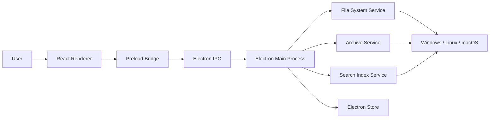
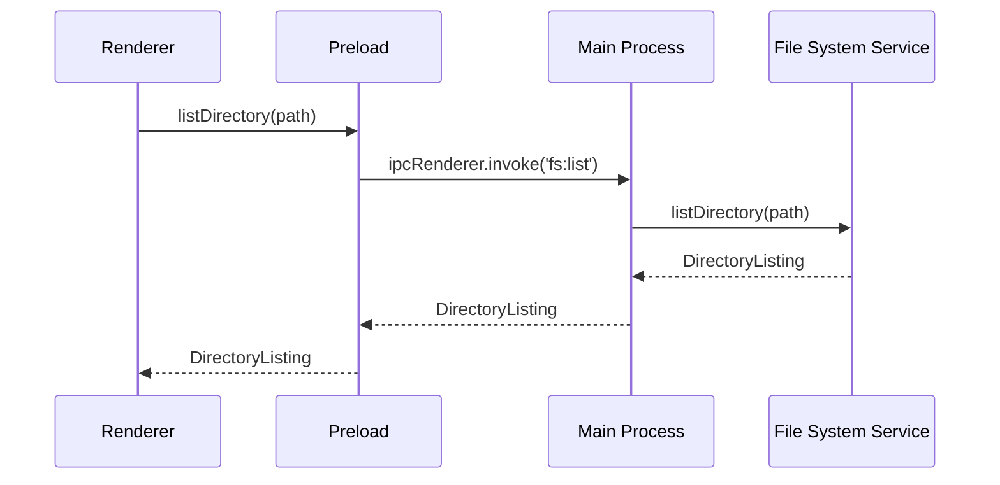
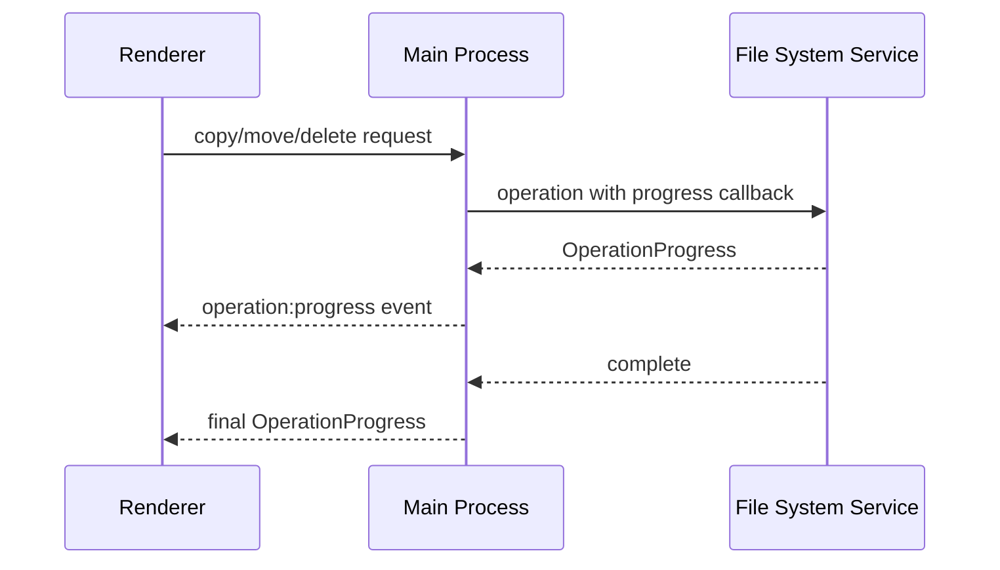
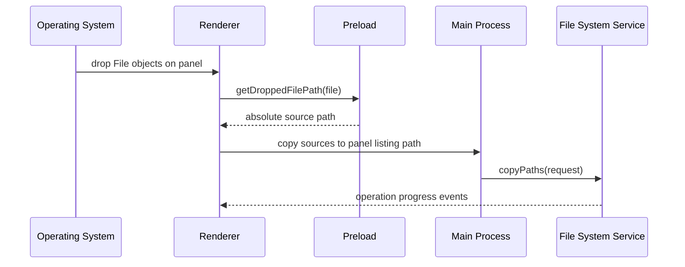
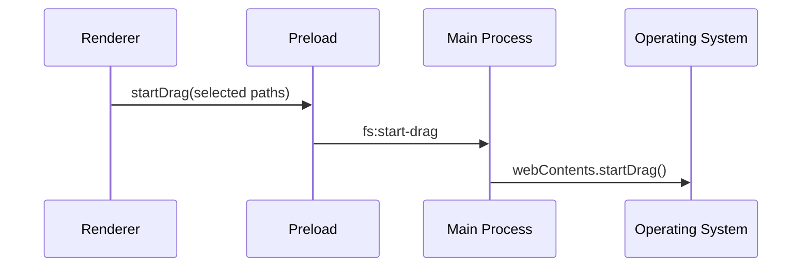

# Architecture

## Overview

Command Center is an Electron desktop application with a React renderer. The app keeps privileged file-system operations in the Electron main process and exposes a narrow IPC API to the browser-like renderer through `preload.ts`.

## Process Responsibilities

### Renderer

Location: `src/`

The renderer owns UI state and user interaction:

- Dual-pane file list layout
- Active panel and selected files
- Current-directory dropdowns and root-location tree overlays
- Search controls and preview display
- Toolbar, context menu, theme, and language state
- Keyboard shortcuts and internal clipboard state
- Drag-over, drop-target, and native drag-start interaction state
- Operation progress and index status display
- Directory loading and error dialogs

The renderer does not directly use Node.js file-system APIs.

### Preload Bridge

Location: `electron/preload.ts`

The preload script exposes `window.commandCenter` through `contextBridge`. This keeps `contextIsolation` enabled while allowing the renderer to call a constrained API.

Key API groups:

- App info and preferences
- Directory listing and file operations
- Preview reading
- Search and index search
- Archive compression/extraction
- Dialogs and folder watching
- Dropped-file path lookup through Electron `webUtils`
- Native file drag start through IPC
- Progress and index status subscriptions

### Main Process

Location: `electron/main.ts`

The main process creates the Electron window, stores a module-level `BrowserWindow` reference for the app lifetime, loads either the Vite development server or built renderer, and registers IPC handlers.

It coordinates:

- File operation calls
- Archive operation calls
- Search index control
- Dialog ownership
- Native drag-out through `webContents.startDrag`
- Progress event forwarding
- Persistent preferences through `electron-store`

## Services

### File System Service

Location: `electron/fileSystem.ts`

Responsible for:

- Listing directories
- Copying, moving, deleting, renaming
- Creating files and folders
- Opening files and revealing paths in the OS shell
- Reading text/image/basic metadata preview
- Recursive direct search
- Watching the active directory with `chokidar`

The service uses Node.js `fs/promises` and Electron `shell`/`dialog` APIs.

### Archive Service

Location: `electron/archive.ts`

Responsible for:

- ZIP creation with `archiver`
- ZIP extraction with `unzipper`
- Split ZIP part reassembly
- Split output creation
- Preventing ZIP path traversal during extraction

Temporary archive work files are created under the OS temp directory.

### Search Index Service

Location: `electron/searchIndex.ts`

Responsible for:

- Scanning configured root paths
- Holding an in-memory file-name index
- Reporting index status to the renderer
- Supporting cancellation
- Returning fast file-name search results

The index currently lives in memory. Persisting the index to disk can be added later if startup-time search state must survive app restarts.

## Data Flow

### Directory Navigation

### File Operation Progress

### External Drop Into a Panel

### Native Drag Out

## Error Handling

Renderer-controlled actions route failures to a modal error dialog. The dialog shows the user-facing message and exposes copyable diagnostics including time, app version, platform, active panel, current paths, stack trace, and raw error details where available.

Unhandled renderer errors and unhandled Promise rejections are also captured and routed to the same dialog.

## Web Mode

When the app runs in a normal browser without `window.commandCenter`, it enters limited web mode. The UI still renders, but full disk access and desktop-only operations are disabled because browsers cannot safely expose arbitrary local file-system access.

## Packaging

Electron Builder reads the `build` section in `package.json`.

Configured targets:

- Windows: NSIS installer and portable executable
- Linux: AppImage, deb, rpm
- macOS: dmg, zip

Windows installer filenames use the package version. The current version is `1.0.0`, so the setup artifact is `Command Center Setup 1.0.0.exe`.

macOS artifacts should be produced on macOS for signing, notarization, and DMG reliability.

## Security Notes

- `contextIsolation` is enabled.
- `nodeIntegration` is disabled.
- Renderer access to privileged APIs is limited to the preload bridge.
- ZIP extraction validates target paths and skips entries that escape the selected destination.
- File-system access is local and user initiated.
- Drag/drop uses Electron APIs to convert user-provided `File` objects into local paths and to start OS-native drags.
