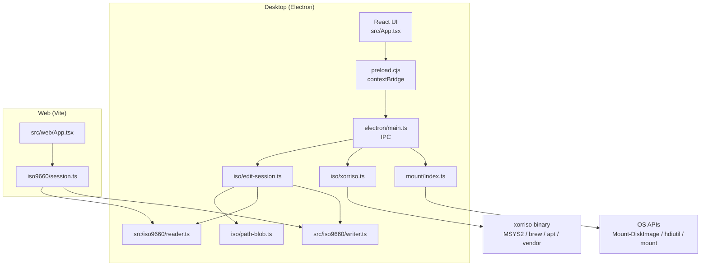

# Architecture — ISO Maker Multi-OS

이 문서는 ISO Maker의 구성, 데이터 흐름, OS별 엔진 선택, 패키징을 설명합니다.

---

## 1. 목표와 범위

| 목표 | 방식 |
|------|------|
| 대용량 ISO를 안정적으로 열기·편집 | main 프로세스 편집 세션 + fs 기반 Blob (`path-blob`, 4GB+ `openAsBlob` 우회) |
| 부팅 가능 ISO 생성·전체 추출 | **xorriso**에 위임 |
| 데스크톱에서 트리 편집 → 새 ISO 저장 | ISO9660 세션 변형 후 `writer` / 또는 xorriso 생성 |
| 웹에서 가볍게 보기/고치기 | 브라우저용 **ISO9660** 리더/세션 편집기 |
| 웹 마운트·완전 부팅 재구성 | **범위 밖** |

---

## 2. 전체 구성



- **데스크톱 UI**와 **웹 UI**는 진입점만 다르고, ISO9660 파서(`src/iso9660/`)는 공유합니다.
- Electron은 `"type": "module"`이라 preload는 **CommonJS** (`electron/preload.cjs`)로 유지합니다.
- 편집 세션·드래그 임시 파일·저장은 **main**에서만 수행합니다.

---

## 3. 계층

### 3.1 Presentation (`src/`)

- `App.tsx` — 탭(내용 / 생성 / 부팅 / 마운트), 도구 모음, 변경 로그 패널·스플리터, 상태바, 미저장 종료/열기 다이얼로그
- `Toolbar.tsx` — 아이콘+라벨 도구 모음 (About 그룹 우측 고정)
- `components/IsoTreeView.tsx` — 접이식 트리, 필터, Ctrl/⌘·Shift 다중 선택, 드래그 인/아웃
- `components/ContextMenu.tsx` — 추출·추가·폴더·이름변경·삭제·경로 복사
- `i18n/` — `ko` / `en`, 테마 `light` / `dark`
- `web/App.tsx` — 브라우저용 편집기

### 3.2 Electron main (`electron/`)

| 모듈 | 역할 |
|------|------|
| `main.ts` | 창(1480×900, min 1480×700), IPC, dirty 종료 확인, `startDrag` |
| `preload.cjs` | `window.isoMaker` API |
| `paths.ts` | 패키징/`resources` 경로 해석 |
| `iso/path-blob.ts` | 대용량 ISO용 올바른 `Blob.size` + 청크 읽기 |
| `iso/edit-session.ts` | 열기·추가/삭제/이름변경·드래그 아웃 준비·저장 |
| `iso/archive-open.ts` | AppImage(squashfs)·Docker/tar 추출 → 디렉터리 트리 세션 |
| `iso/archive-save.ts` | 트리 materialize → tar / AppImage(런타임+mksquashfs) 재포장 |
| `iso/xorriso.ts` | extract / create / bootable, 엔진 탐지 |
| `iso/tree-serialize.ts` | 렌더러용 트리 JSON |
| `mount/index.ts` | 플랫폼별 마운트·언마운트 |
| `last-path.ts` | 마지막 사용 경로 (`userData`) |

### 3.3 ISO9660 library (`src/iso9660/`)

| 파일 | 역할 |
|------|------|
| `binary.ts` | 섹터·both-endian·문자열 |
| `reader.ts` | Primary/Joliet, multi-extent, `.img` 파티션 offset 스캔, 볼륨 경계 검증 |
| `image-formats.ts` | `.iso`/`.img`/AppImage/Docker tar 필터·저장 이름 헬퍼 |
| `writer.ts` / `session.ts` | 트리 변형·새 ISO 작성 |
| `types.ts`, `tree-types.ts` | 공유 타입 |

**대용량 파일:** Node `fs.openAsBlob()`는 4GiB 초과 시 `size`가 uint32로 잘릴 수 있어, `stat.size`와 다르면 `openIsoBlob`이 fs 백엔드 Blob으로 대체합니다.

---

## 4. 편집 세션 흐름

```
ISO 파일 ──openIsoBlob──▶ IsoEditSession
        │                    │
        │                    ├─ 트리 IPC → IsoTreeView
        │                    ├─ 추가/삭제/mkdir/rename (dirty)
        │                    ├─ prepareDragOut → temp → startDrag
        │                    └─ save → writer → 새 .iso
        └─ (선택) xorriso extract/create/bootable
```

- 저장은 **순수 ISO9660(+Joliet) 데이터 이미지**이며 부팅 정보는 보존되지 않을 수 있습니다.
- 창 닫기 / 앱 종료 시 dirty이면 렌더러 다이얼로그(저장 후 종료 / 저장 안 함 / 취소).

---

## 5. IPC 계약 (요약)

`window.isoMaker`:

- 대화상자: `openFile`, `openFiles`, `openDirectory`, `saveFile`, `openPath`
- 세션: `openEditSession`, `addPathsToSession`, `removeFromSession` / `removeManyFromSession`, `mkdirInSession`, `renameInSession`, `exportFileFromSession` / `exportFilesToDirectory`, `prepareDragOut` / `prepareDragOutMany`, `saveEditSession`, `isEditDirty`, `closeEditSession`
- 드래그: `startDrag`, `getPathForFile`
- 종료: `onCloseRequest`, `ackCloseRequest`, `decideClose`
- 작업: `extractIso`, `createIso`, `createBootableIso`, `mountIso`, `unmountIso`, `getEngineInfo`
- 이벤트: `onProgress`, `onNavigate`, `onSessionUpdated`

---

## 6. xorriso 연동 (Windows 주의점)

1. **바이너리 탐지:** MSYS2/Cygwin → `vendor/xorriso/<platform>/` → `process.resourcesPath` → PATH  
2. **경로 변환:** MSYS는 `C:\...` 대신 `/c/Users/...` (`toXorrisoPath`)  
3. **환경 변수:** `MSYS2_ARG_CONV_EXCL=*`, `MSYS_NO_PATHCONV=1`  
4. **Windows 추출:** 심볼릭 링크는 `best_effort`로 건너뛰고 나머지 계속 추출

---

## 7. 마운트

| OS | 구현 |
|----|------|
| Windows | PowerShell `Mount-DiskImage` / `Dismount-DiskImage` |
| macOS | `hdiutil attach` / `detach` |
| Linux | `fuseiso` 또는 `mount` |

마운트는 읽기 전용 탐색용입니다. ISO 수정은 편집 세션 또는 추출 후 폴더에서 수행합니다.

---

## 8. 웹 모드

- 진입: `web.html` + `vite.config.web.ts` (포트 **5174**)
- Blob 로드 → 트리/파일 편집 → 새 ISO 다운로드
- **제한:** 부팅 메타데이터 미보존, 마운트 없음, xorriso 없음

---

## 9. UI / 빌드 / 패키징

| 항목 | 기술 |
|------|------|
| 번들 | Vite 6 + React 19 + TypeScript |
| 데스크톱 | `vite-plugin-electron` |
| 패키징 | `electron-builder` + NSIS (`electron-builder.yml`) |
| NSIS 커스텀 | `build/installer.nsh` |
| 아이콘 | `assets/` · `public/` |
| 버전 | `package.json` ↔ `src/version.ts` |

스크립트:

- `npm start` / `npm run start:web`
- `npm run build` / `npm run build:web`
- `npm run dist:win` / `dist:mac` / `dist:linux` — 플랫폼별 패키지 → `release/` 후 루트 복사
- `npm run dist` — `dist:win` 별칭
- `npm run dist:all` — `-mwl` (macOS 타깃은 mac 호스트 필요)
- `npm run dist:dir` — Windows 압축 해제 앱만
- `npm run typecheck`

| 타깃 | 형식 | 아티팩트 이름 |
|------|------|----------------|
| Windows | NSIS | `ISO Maker-Setup-<ver>.exe` |
| macOS | DMG | `ISO Maker-<ver>-<arch>.dmg` |
| Linux | AppImage | `ISO Maker-<ver>.AppImage` |

### NSIS 설치 동작

- **assisted installer** (`oneClick: false`) — 설치 경로 변경 가능
- **바로가기 페이지** — 바탕화면 / 시작 메뉴 각각 선택 (`installer.nsh`)
- **기존 설치 제거** — 설치 시작 시 이전 버전을 완전 삭제(앱 종료, uninstaller + 잔여 폴더·레지스트리·AppData·바로가기)
- `extraResources`: `assets/`, `vendor/xorriso/`

---

## 10. 보안·프로세스 경계

- Renderer: `nodeIntegration: false`, `contextIsolation: true`, `sandbox: false`
- DevTools 비활성 (`devTools: false`)
- 파일 시스템·xorriso·세션·드래그 temp는 **main만**
- `app.setAppUserModelId('com.shkwon.isomaker')`

---

## 11. 확장 포인트

- `vendor/xorriso/<platform>/` 동봉으로 오프라인 배포
- 저장 시 부팅 정보 보존이 필요하면 El Torito 파싱·재기록 계층 추가
- macOS/Linux 타깃은 `electron-builder.yml`에 정의되어 있으며 필요 시 `electron-builder --mac` / `--linux`로 빌드
