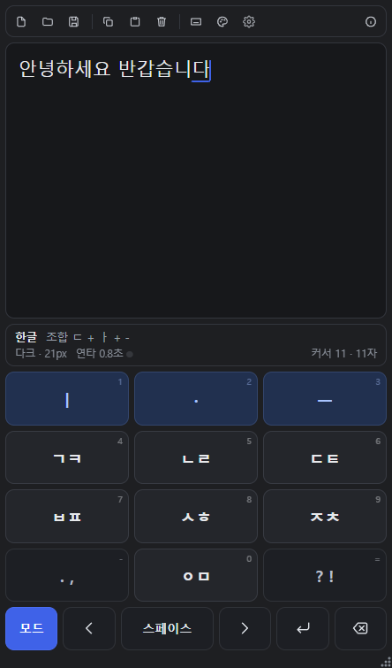
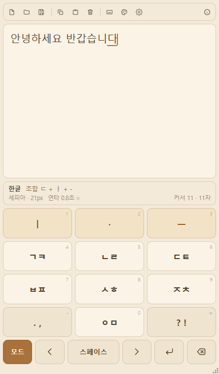
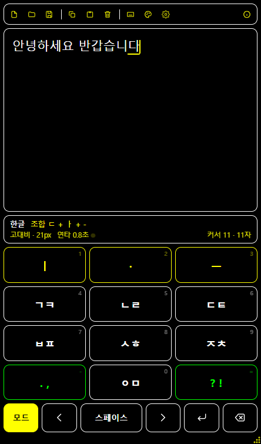
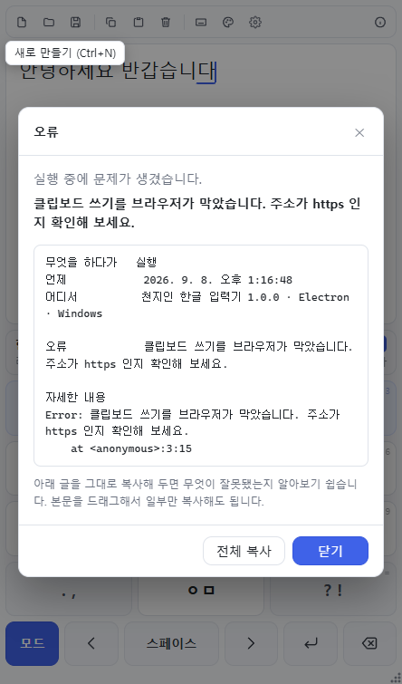
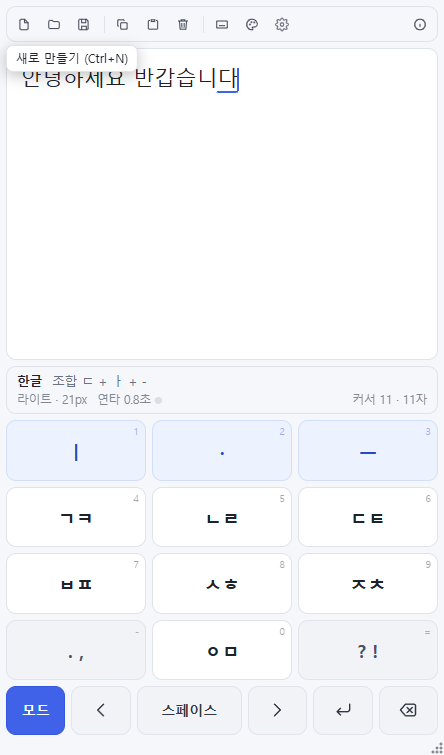

# 천지인 한글 입력기 (멀티OS)

12키 천지인 자판으로 한글을 조합하는 프로그램입니다.
**웹 · Windows · macOS · Linux** 에서 같은 코드, 같은 엔진으로 돕니다.

`KoreanChunJiInC++` 의 C 판을 자바스크립트로 옮긴 것입니다.
조합 오토마타는 한 줄씩 대조해 옮겼고, 원본의 회귀 시험 585항목을
그대로 가져와 **584항목 전부 통과**합니다.
(빠진 하나는 C 의 NULL 포인터 시험이라 자바스크립트에는 해당이 없습니다.)


## 무엇인가요

- 화면 위쪽은 편집 영역, 아래쪽은 천지인 12키 + 기능 버튼 한 줄
- 마우스·손가락으로 키패드를 눌러도 되고, 물리 키보드로 쳐도 됩니다
- 한글 / 영문 소문자 / 영문 대문자 / 숫자 / 기호 다섯 가지 입력 모드
- 조합 중인 낱자를 상태줄에 보여 주고, 조합 중인 글자에는 밑줄이 붙습니다
- 아래아(`·`, `‥`) 중간 상태도 편집 영역에 그대로 보입니다
- UTF-8 텍스트 파일 열기 / 저장, 클립보드 복사 / 붙여넣기
- 툴바 · 설정 창 · 테마 4종(라이트 · 다크 · 세피아 · 고대비)
- 메뉴 막대 없이 툴바와 단축키로 다 되고, 상태줄이 프로그램 상태를 보여 줍니다
- 문제가 생기면 무엇이 어떻게 틀어졌는지 창으로 알려 주고, 통째로 복사할 수 있습니다

### 테마

| 라이트 | 다크 | 세피아 | 고대비 |
|---|---|---|---|
|  |  |  |  |

`F3` 이나 툴바의 팔레트 버튼으로 돌려 가며 씁니다.

## 빠르게 써 보기

```bash
npm install

npm test          # 엔진 회귀 시험 584항목
npm run web       # 브라우저에서 열기  (http://localhost:5173)
npm start         # 데스크톱 앱 (Electron, 코드를 고치면 바로 반영)
```

배포판 만들기:

```bash
npm run build:win     # release/Chunjiin Setup 1.0.0.exe
npm run build:mac     # release/*.dmg
npm run build:linux   # release/*.AppImage, *.deb
npm run build         # dist/ - 정적 웹 서버에 그대로 올리면 됩니다
```

배포판을 만들면 `release/` 에 놓이고, 손 닿는 자리에 두려고 **프로젝트 루트로도 복사**합니다.
자세한 것과 자주 걸리는 것은 [Build.md](Build.md) 를 보세요.

## 자판

```
  ㅣ     ·      ㅡ          키 0  1  2
  ㄱㅋ   ㄴㄹ   ㄷㅌ         키 3  4  5
  ㅂㅍ   ㅅㅎ   ㅈㅊ         키 6  7  8
  . ,    ㅇㅁ   ? !          키 9  10 11
```

`모드`  `◀`  `스페이스`  `▶`  `↵`  `⌫` 가 맨 아랫줄에 있습니다.

사용법은 [UsersGuide.md](UsersGuide.md) 를 보세요.

## 확인된 것

| 무엇 | 어떻게 | 결과 |
|---|---|---|
| 조합 엔진 | `npm test` (34구역 584항목) | 전부 통과 |
| C 원본과 대조 | `../KoreanChunJiInC++/build/test_engine.exe` 와 나란히 | 585 대 584, 차이는 NULL 시험 하나뿐 |
| 화면 동작 | `npm run test:app` (17개 검사) | 키패드로 `한글`·`hi` 입력, 대화상자 3종, 모드 5종 순환, 툴바 안 잘림, 정보 버튼 오른쪽 끝, 상태줄 2줄, 오류 창 복사, 툴팁, 손잡이 — 전부 통과 |
| 테마 | `scripts/shot.cjs` | 4종 모두 원본 색과 같음 |
| 웹 빌드 | `npm run build` | `dist/` 생성 |
| 창 크기 손잡이 | 손잡이를 끌어 실제 창 크기 비교 | 460×820 → 580×880 |
| `npm start` | 창이 뜨는지 · 닫으면 포트가 풀리는지 | 둘 다 확인 |
| Windows 배포판 | `npm run build:win` 연속 2회 | 설치 프로그램 생성 + 루트 복사 |

macOS · Linux 배포판은 그 운영체제에서 만들어야 하므로 여기서는 확인하지 않았습니다.

## 화면

| 오류 알림 | 설명 풍선 |
|---|---|
|  |  |

## 문서

| 문서 | 내용 |
|---|---|
| [UsersGuide.md](UsersGuide.md) | 자판, 모음 조합표, 단축키, 화면 설명 |
| [Build.md](Build.md) | 개발·빌드·시험, 각 운영체제 배포판, 자주 걸리는 것 |
| [Architecture.md](Architecture.md) | 파일 구성, 오토마타 설계, C 판과의 대응표 |

## 파일 구성

```
KoreanChunJiinMultiOSV10/
├─ src/
│  ├─ engine/                      화면도 Node 도 모르는 순수 자바스크립트
│  │  ├─ chunjiin.js     유니코드 조합 · 겹받침 · 상태 자료구조 (C 의 chunjiin.c)
│  │  └─ input.js        천지인 오토마타 + 편집 API           (C 의 input.c)
│  ├─ ui/
│  │  ├─ Editor.jsx      편집 영역 (캐럿을 직접 그린다)
│  │  ├─ Keypad.jsx      12키 + 기능 버튼
│  │  ├─ Toolbar.jsx     툴바
│  │  ├─ StatusBar.jsx   상태줄
│  │  ├─ Modal.jsx       대화상자 껍데기
│  │  ├─ SettingsDialog.jsx / HelpDialog.jsx / AboutDialog.jsx
│  │  ├─ ErrorDialog.jsx 오류를 구체적으로 보여 주고 복사하게 한다
│  │  ├─ Tooltip.jsx     0.13초 만에 뜨는 설명 풍선
│  │  ├─ ResizeGrip.jsx  오른쪽 아래 크기 조절 손잡이
│  │  └─ Icons.jsx       인라인 SVG 아이콘
│  ├─ App.jsx            키보드 · 명령 · 설정을 엮는다  (C 의 main.c)
│  ├─ themes.js          테마 4종 (C 의 THEMES 표)
│  ├─ settings.js        설정 저장 (C 는 레지스트리, 여기서는 localStorage)
│  ├─ platform.js        웹 / Electron 을 같은 얼굴로 감싼다
│  ├─ version.js         앱 이름 · 판 · 빌드 시각
│  ├─ main.jsx           진입점
│  └─ styles.css         색은 모두 CSS 변수 - 값은 themes.js 에서 온다
├─ electron/
│  ├─ main.js            창 · 파일 대화상자 · CSP (메뉴 막대는 두지 않는다)
│  ├─ windowResize.js    오른쪽 아래 손잡이로 창 크기 바꾸기
│  └─ preload.cjs        렌더러에 놓아 주는 좁은 다리
├─ tests/engine.test.mjs 자소 조합 회귀 시험 (34구역 584항목)
├─ scripts/
│  ├─ dev.mjs            npm start - Vite 와 Electron 을 함께 쥐고 함께 내린다
│  ├─ run-electron.mjs   ELECTRON_RUN_AS_NODE 를 지우고 띄우는 런처
│  ├─ clean-release.mjs  빌드 전에 release/ 를 비운다 (EPERM 예방)
│  ├─ copy-installer.mjs 만들어진 설치 파일을 프로젝트 루트로 복사
│  ├─ gen-icons.mjs      build/icon.ico 에서 리눅스용 아이콘 묶음을 꺼낸다
│  ├─ smoke.cjs          창을 띄워 17가지를 확인 (npm run test:app)
│  ├─ probe.js           그 검사 목록 (창 안에서 도는 코드)
│  └─ shot.cjs           화면 갈무리 (docs/images 를 만든 것)
├─ build/                아이콘 (C 판 assets 에서 가져옴)
├─ docs/images/          문서에 쓰는 화면 갈무리
└─ index.html, vite.config.js, package.json
```

## 라이선스

별도 명시가 없습니다. 사내/개인 용도로 자유롭게 쓰세요.
