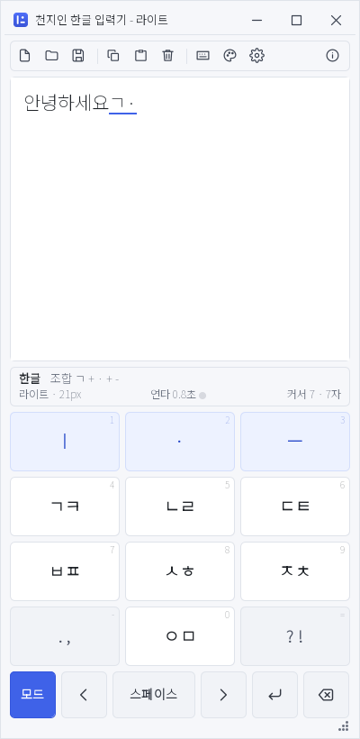
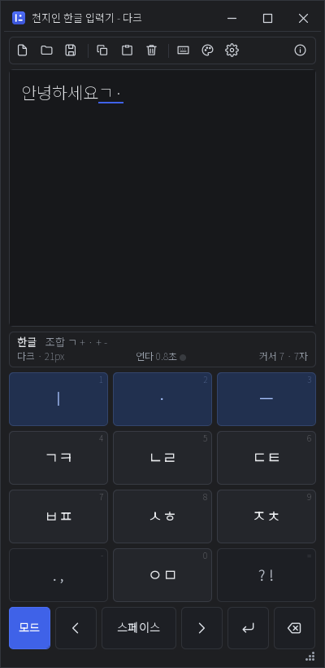
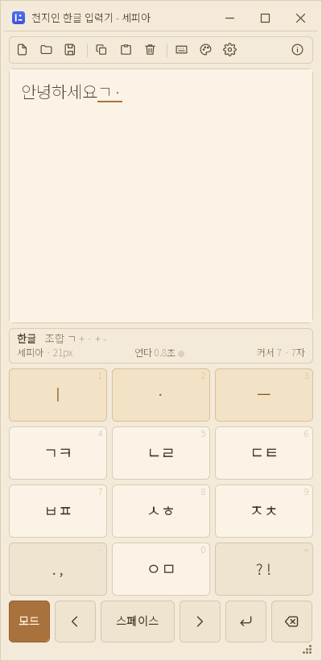
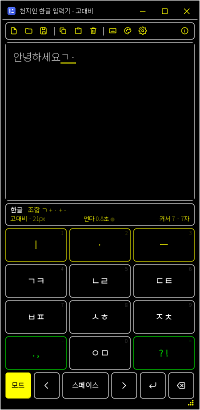

# 천지인 한글 입력기 (Java)

12키 천지인 자판으로 한글을 조합하는 프로그램입니다.
**Windows · macOS · Linux** 에서 같은 코드, 같은 엔진으로 돕니다.

`KoreanChunJiinMultiOSV10` 의 자바스크립트 판(그리고 그 원본인 `KoreanChunJiInC++` 의 C 판)을
**Java + Swing** 으로 옮긴 것입니다.
조합 오토마타는 한 줄씩 대조해 옮겼고, 회귀 시험 584항목을 그대로 가져와
**584항목 전부 통과**합니다.

의존성이 하나도 없습니다. JDK 17 이상만 있으면 `javac` 와 `jar` 만으로 빌드됩니다.



## 무엇인가요

- 화면 위쪽은 편집 영역, 아래쪽은 천지인 12키 + 기능 버튼 한 줄
- 마우스로 키패드를 눌러도 되고, 물리 키보드로 쳐도 됩니다
- 한글 / 영문 소문자 / 영문 대문자 / 숫자 / 기호 다섯 가지 입력 모드
- 조합 중인 낱자를 상태줄에 보여 주고, 조합 중인 글자에는 밑줄이 붙습니다
- 아래아(`·`, `‥`) 중간 상태도 편집 영역에 그대로 보입니다
- UTF-8 텍스트 파일 열기 / 저장, 클립보드 복사 / 붙여넣기
- 툴바 · 설정 창 · 테마 4종(라이트 · 다크 · 세피아 · 고대비)
- 제목줄까지 직접 그려서 테마 색이 창 맨 위까지 이어집니다
- 메뉴 막대 없이 툴바와 단축키로 다 되고, 상태줄이 프로그램 상태를 보여 줍니다
- 문제가 생기면 무엇이 어떻게 틀어졌는지 창으로 알려 주고, 통째로 복사할 수 있습니다

## 빠르게 써 보기

```bash
./test.sh         # 엔진 회귀 시험 584항목
./run.sh          # 빌드하고 창을 띄운다
```

Windows PowerShell:

```powershell
.\test.ps1
.\run.ps1
```

옛 명령 프롬프트(`cmd.exe`)나 바로 가기에서는:

```
test.bat
test.bat -q
```

`run` 은 언제나 먼저 다시 빌드합니다. 고친 코드가 반영되지 않은 예전 JAR 이 도는 일이 없습니다.

JDK 가 없으면 스크립트가 **받아서 깔지 물어봅니다.** 미리 준비할 것이 없습니다.

## 설치 파일 만들기

```bash
./package.sh              # 운영체제에 맞는 설치 파일
./package.sh --portable   # 설치 없이 풀어 쓰는 압축본
```

```powershell
.\package.ps1             # Chunjiin-1.0.0.exe (설치 프로그램)
.\package.ps1 -Portable   # Chunjiin-1.0.0-win-portable.zip
```

```
package.bat               # cmd.exe 에서 (같은 일을 한다)
package.bat -portable
```

Windows 에서 `exe`/`msi` 를 만들려면 WiX 가 필요한데, 없으면 **알아서 받아서 씁니다.**
관리자 권한도, .NET 3.5 도 필요 없습니다.

만들어진 것은 `release/` 에 놓이고, 손 닿는 자리에 두려고 **프로젝트 루트로도 복사**합니다.

> **받는 쪽에는 자바가 필요 없습니다.**
> `jlink` 가 이 프로그램이 실제로 쓰는 모듈만 골라 작은 자바 런타임을 만들고,
> `jpackage` 가 그것을 설치 파일 안에 넣습니다. 설치 중에 무엇을 더 내려받지도 않고,
> 이미 깔린 자바가 있어도 건드리지 않습니다. 버전이 서로 어긋날 일이 없습니다.

> **다시 깔면 옛 것을 통째로 지웁니다.**
> 빌드마다 새 제품이 되도록 만들어서, 옛 빌드가 깔려 있으면 그것을 먼저 통째로 지우고
> 새로 깝니다. 이미 깔린 상태에서 설치 파일을 다시 실행하면 그냥 지워 버리지 않고
> "고치기 / 지우기" 를 묻습니다. 자세한 것은 [Build.md](Build.md) 를 보세요.

> **만드는 쪽도 JDK 하나면 됩니다.**
> Windows 의 `exe`/`msi` 는 WiX Toolset 3.14 가 있어야 하는데, 없으면 스크립트가
> **알아서 받아** `tools/wix314` 에 풀고 그대로 이어서 빌드합니다.
> 관리자 권한도, .NET 3.5 도 필요 없습니다. 받아 오지 않게 하려면 `-NoWix` (`--no-wix`).

자세한 것과 자주 걸리는 것은 [Build.md](Build.md) 를 보세요.

## 자판

```
  ㅣ     ·      ㅡ          키 0  1  2
  ㄱㅋ   ㄴㄹ   ㄷㅌ         키 3  4  5
  ㅂㅍ   ㅅㅎ   ㅈㅊ         키 6  7  8
  . ,    ㅇㅁ   ? !          키 9  10 11
```

`모드`  `◀`  `스페이스`  `▶`  `↵`  `⌫` 가 맨 아랫줄에 있습니다.

### 테마

| 라이트 | 다크 | 세피아 | 고대비 |
|---|---|---|---|
|  |  |  |  |

`F3` 이나 툴바의 팔레트 버튼으로 돌려 가며 씁니다.

사용법은 [UsersGuide.md](UsersGuide.md) 를 보세요.

## 확인된 것

| 무엇 | 어떻게 | 결과 |
|---|---|---|
| 조합 엔진 | `./test.sh` (34구역 584항목) | 전부 통과 |
| 자바스크립트 판과 대조 | 같은 키 시퀀스 · 같은 기대값 표를 그대로 옮김 | 584 대 584, 차이 없음 |
| 화면 동작 | `./test.sh --app` (26항목) | 창 뜸, 키패드로 `한글`·`많` 입력, 영문 `hi`, 모드 5종 순환, 테마 4종 순환, 편집·커서, 대화상자 여닫기, 클립보드 복사 — 전부 통과 |
| Windows 설치 파일 | `.\package.ps1` · `./package.sh` (WiX 없는 상태에서) | WiX 자동 내려받기 → `Chunjiin-1.0.0.exe` (33MB, 런타임 내장) 생성 + 루트 복사 |
| WiX 가 반만 받아진 상태 | `tools\wix314` 에서 `light.exe` 를 치우고 실행 | 반쪽임을 알아채고 다시 받아 이어서 빌드 |
| 다시 깔기 | ProductCode 가 다른 두 빌드를 차례로 무인(`/qn`) 설치 | 옛 제품이 지워지고 **항목이 하나만** 남음. 설치 로그에 `RemoveExistingProducts` 실행 확인 |
| MSI 검사 | `smoke.exe` (WiX ICE 검증) | 오류 0개 (`ICE61` 경고는 같은 판도 지우려고 일부러 둔 설정 탓) |
| 바탕화면 아이콘 | 설치 뒤 바로가기 아이콘 확인 | 천지인 아이콘 (기본 자바 아이콘 아님) |
| Windows 포터블 | `.\package.ps1 -Portable` | `Chunjiin-1.0.0-win-portable.zip` (32MB) 생성 + 루트 복사 |
| 빌드 | `./build.sh`, `.\build.ps1` | `dist/Chunjiin.jar` 생성, 컴파일 경고 0개 |
| JDK 고르기 | `PATH` 앞자리에 JDK 8 이 있는 기계 | 낡았다고 알리고 JDK 17 이상을 찾아 씀 |
| `cmd.exe` | `test.bat -q`, `package.bat -portable` | 한글 정상, 종료 코드 그대로 전달 |

## 짜임새

```
src/main/java/com/shkwon/chunjiin/
  engine/          조합 오토마타 (화면도 파일도 모른다)
    Chunjiin.java    유니코드 음절 조합, 겹받침 판정   <- C 판 chunjiin.c
    Input.java       천지인 오토마타, 편집 API, 라벨   <- C 판 input.c
    ChunjiinState.java, HangulState.java, Mode.java, Slot.java
  ui/              Swing 화면
    MainFrame.java   키보드 · 명령 · 설정을 엮는다     <- C 판 main.c
    EditorPanel.java, KeypadPanel.java, ToolbarPanel.java, StatusBar.java
    SettingsDialog.java, HelpDialog.java, AboutDialog.java, ErrorDialog.java
    TitleBar.java, WindowResizer.java, ResizeGrip.java, ModalDialog.java
    Icons.java, KeyButton.java, Fonts.java
  Main.java        진입점
  Theme.java       테마 4종                          <- C 판 THEMES 표
  Settings.java    설정 저장 (java.util.prefs)       <- C 판 레지스트리
  Platform.java    파일 · 클립보드
  Version.java

src/test/java/com/shkwon/chunjiin/
  EngineTest.java    엔진 회귀 시험 584항목
  AppSmokeTest.java  창까지 띄우는 화면 시험 26항목
  UiDriver.java      창을 띄우고 키를 눌러 주는 도우미
  Screenshots.java   docs/images 의 테마 4종 그림을 찍는다

scripts/
  find-jdk.sh        쓸 JDK 를 고르고 환경을 맞춘다. 없으면 깔지 물어본다
  Find-Jdk.ps1       같은 것 (Windows PowerShell 용)
```

빌드 도구를 쓰지 않습니다. Maven 도 Gradle 도 없고 내려받을 의존성도 없습니다.
스크립트가 `javac` 와 `jar` 를 직접 부릅니다.

```
build.sh    build.ps1                컴파일하고 JAR 로 묶는다
run.sh      run.ps1                  빌드하고 창을 띄운다
test.sh     test.ps1    test.bat     시험을 돌린다
package.sh  package.ps1 package.bat  설치 파일을 만든다
clean.sh    clean.ps1                빌드 결과를 지운다
```

`.sh` 는 Linux · macOS 용이고 Windows 의 Git Bash · WSL 에서도 돕니다.
`.ps1` 은 Windows PowerShell 용입니다. `.bat` 둘은 `cmd.exe` 에서 `.ps1` 을 부르는
얇은 껍데기라 스스로 하는 일이 없습니다 — 둘이 어긋날 일이 없다는 뜻입니다.

JDK 를 찾는 규칙은 `scripts/find-jdk` 한 군데에만 있고 나머지 전부가 그것을 거칩니다.
`PATH` 앞자리에 옛 JDK 가 있어도 **버전을 확인해서** 17 이상만 골라 씁니다.

더 깊은 이야기는 [Architecture.md](Architecture.md) 에 있습니다.

## 만든이

SHKWON (knix008@naver.com)
