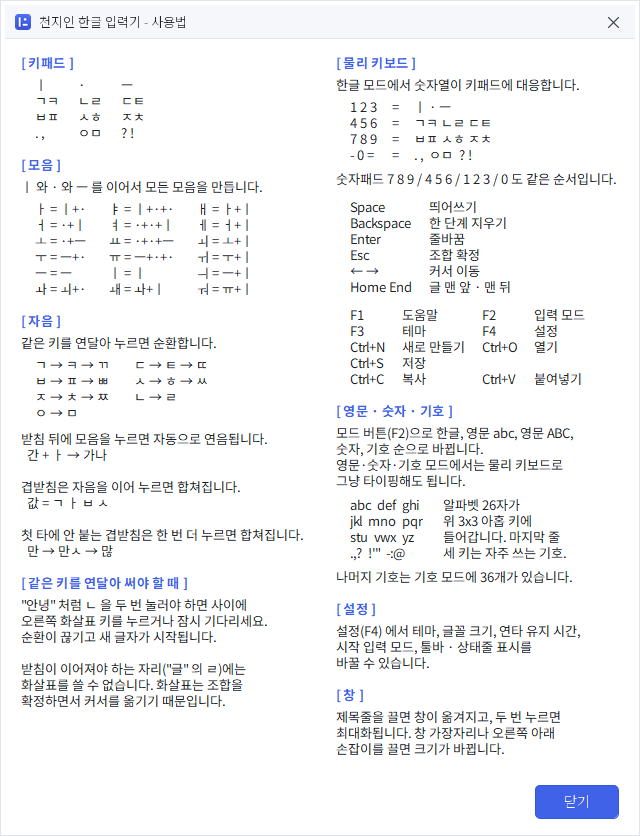
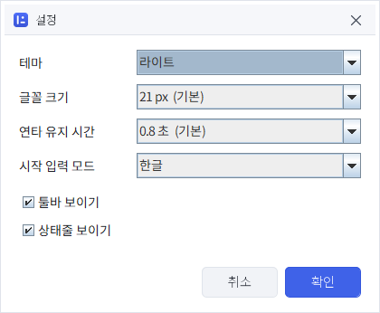

# 사용 설명서

## 화면


```
┌──────────────────────────────┐
│ 🗋 🗁 🖫 │ 🗐 📋 🗑 │ ⌨ 🎨 ⚙     ⓘ │  툴바 (ⓘ 는 언제나 오른쪽 끝)
├──────────────────────────────┤
│                              │
│  안녕하세요ㄱ·               │  편집 영역
│                              │  (조합 중인 글자에 밑줄이 붙습니다)
├──────────────────────────────┤
│ 한글   조합 ㄱ + · + -        │  상태줄 1줄 - 지금 치고 있는 것
│ 라이트 · 21px  연타 0.8초 ●  커서 7 · 7자 │  2줄 - 설정과 위치
├──────────────────────────────┤
│   ㅣ      ·       ㅡ         │
│   ㄱㅋ    ㄴㄹ    ㄷㅌ       │  천지인 12키
│   ㅂㅍ    ㅅㅎ    ㅈㅊ       │
│   . ,     ㅇㅁ    ? !        │
│ 모드 ◀ 스페이스 ▶ ↵ ⌫       │  기능 버튼
│                           ⣇ │  크기 조절 손잡이
└──────────────────────────────┘
```

메뉴 막대는 없습니다. 모든 명령이 툴바 버튼과 단축키에 있습니다.

한글 모드에서는 키마다 오른쪽 위에 물리 키보드 대응 글자가 작게 붙습니다.
버튼에 마우스를 올리면 설명 풍선이 곧바로 뜹니다.

### 상태줄 보는 법

프로그램이 지금 어떤 상태인지는 모두 상태줄에서 봅니다.

| 칸 | 뜻 |
|---|---|
| `한글` | 지금 입력 모드 (F2 로 바꿉니다) |
| `조합 ㄱ + · + -` | 만들고 있는 글자의 초성 · 중성 · 종성. `-` 는 아직 비었다는 뜻 |
| `라이트 · 21px` | 지금 테마와 편집 영역 글꼴 크기 |
| `연타 0.8초 ●` | 연타 순환이 유지되는 시간. **●에 불이 들어와 있으면** 지금 같은 키를 누르면 순환이 이어집니다. 불이 꺼지면 새 글자로 들어갑니다 |
| `커서 7 · 7자` | 커서 위치와 전체 글자 수 |

오른쪽 끝에는 방금 한 일(`저장했습니다` 같은)이 잠깐 떴다 사라집니다.
문제가 생기면 그 자리에 `… 실패` 딱지가 남고, **눌러서 다시 열어 볼 수 있습니다.**

### 창 제목줄

제목줄도 프로그램이 직접 그립니다. 그래서 테마 색이 창 맨 위까지 이어집니다.
끌면 창이 옮겨지고, 두 번 누르면 최대화됩니다.
오른쪽 끝에 최소화 · 최대화 · 닫기 단추가 있습니다.

### 창 크기

창 가장자리를 끌면 여덟 방향으로 크기가 바뀝니다.
오른쪽 아래 구석의 점 여섯 개(`⣇`)를 끌어도 됩니다.

기본 크기는 400 × 820 이고, 툴바 단추가 잘리지 않는 폭 아래로는 줄지 않습니다.

## 한글 입력

### 모음

`ㅣ`, `·`(아래아), `ㅡ` 세 개를 조합해서 모든 모음을 만듭니다.

| 모음 | 입력 | 모음 | 입력 | 모음 | 입력 |
|---|---|---|---|---|---|
| ㅏ | `ㅣ·` | ㅗ | `·ㅡ` | ㅐ | `ㅏㅣ` |
| ㅑ | `ㅣ··` | ㅛ | `··ㅡ` | ㅒ | `ㅑㅣ` |
| ㅓ | `·ㅣ` | ㅜ | `ㅡ·` | ㅔ | `ㅓㅣ` |
| ㅕ | `··ㅣ` | ㅠ | `ㅡ··` | ㅖ | `ㅕㅣ` |
| ㅡ | `ㅡ` | ㅣ | `ㅣ` | ㅢ | `ㅡㅣ` |
| ㅚ | `ㅗㅣ` | ㅘ | `ㅚ·` | ㅙ | `ㅘㅣ` |
| ㅟ | `ㅜㅣ` | ㅝ | `ㅠㅣ` | ㅞ | `ㅝㅣ` |

아래아를 한 번 누르면 `·`, 두 번 누르면 `‥` 가 편집 영역에 그대로 보입니다.
초성이 이미 있으면 `ㄱ·` 처럼 초성과 함께 보입니다.

### 자음

같은 키를 연달아 누르면 순환합니다.

| 키 | 순환 |
|---|---|
| ㄱㅋ | ㄱ → ㅋ → ㄲ |
| ㄴㄹ | ㄴ → ㄹ |
| ㄷㅌ | ㄷ → ㅌ → ㄸ |
| ㅂㅍ | ㅂ → ㅍ → ㅃ |
| ㅅㅎ | ㅅ → ㅎ → ㅆ |
| ㅈㅊ | ㅈ → ㅊ → ㅉ |
| ㅇㅁ | ㅇ → ㅁ |

거센소리와 된소리가 모두 순환에 들어 있어서 획추가 · 쌍자음 키는 없습니다.
그 자리에는 문장부호 키 `. ,` 와 `? !` 가 있고, 이 두 키도 연타하면 순환합니다.

### 같은 자음이 연달아 나올 때

`한글` 의 `글` 은 `ㄴㄹ` 키를 두 번 연달아 눌러야 하는데,
그냥 누르면 순환해서 받침이 `ㄹ` 로 바뀌지 않고 `ㄴ` 에서 돕니다.
**0.8초 기다리면** 순환이 끊기고 다음 타는 새 자음으로 들어갑니다.

```
한글  =  ㅅㅎ ㅅㅎ ㅣ ·  ㄴㄹ  (대기)  ㄱㅋ ㅡ  (대기)  ㄴㄹ ㄴㄹ
```

기다리는 시간은 `설정 > 연타 유지 시간` 에서 0.4 ~ 2.0초로 바꿀 수 있습니다.

`▶` 키는 순환을 끊는 동시에 **조합을 확정하고 커서를 옮깁니다.**
그래서 다음 글자를 새로 시작할 때 씁니다.
받침이 이어져야 하는 자리(`글` 의 `ㄹ`)에는 쓸 수 없고, 기다려야 합니다.

```
안녕  =  ㅇㅁ ㅣ ·  ㄴㄹ   ▶   ㄴㄹ · · ㅣ ㅇㅁ
```

### 받침과 연음

받침을 넣은 뒤 모음을 누르면 받침이 다음 글자의 초성으로 자동으로 넘어갑니다.

```
간 + ㅏ  →  가나
```

겹받침(`ㄳ ㄵ ㄶ ㄺ ㄻ ㄼ ㄽ ㄾ ㄿ ㅀ ㅄ`)은 자음을 이어 누르면 저절로 합쳐집니다.

```
값  =  ㄱ  ㅣ ·  ㅂ  ㅅ
```

첫 타에 겹받침이 안 되는 경우(`많`, `삶`, `핥`처럼 ㅎ · ㅁ · ㅌ 가 필요한 받침)에는
글자가 잠깐 떨어져 나왔다가 한 번 더 누르면 도로 합쳐집니다.

```
많  =  ㅇㅁ ㅇㅁ  ㅣ ·  ㄴㄹ  ㅅㅎ  ㅅㅎ
       ㅁ         ㅏ    ㄴ     ㅅ     ㅎ
       마 → 만 → 만ㅅ → 많
```

### 지우기

`⌫` 는 조합 중이면 낱자 하나씩, 조합이 끝났으면 글자 하나씩 지웁니다.

```
값 → ⌫ → 갑 → ⌫ → 가 → ⌫ → 기 → ⌫ → ㄱ → ⌫ → (없음)
```

## 영문 · 숫자 · 기호

`모드` 버튼(또는 `F2`)을 누르면
`한글 → 영문 abc → 영문 ABC → 숫자 123 → 기호 !@# → 한글` 순으로 바뀝니다.

영문 모드의 키 배열은 이렇습니다.

```
  abc     def      ghi
  jkl     mno      pqr
  stu     vwx      yz
  . , ?   ! ' "    - : @
```

한 키에 **세 글자까지만** 둡니다. 그래서 알파벳 26자가 위 3x3 아홉 키를 채우고,
마지막 줄 세 키가 자주 쓰는 기호를 맡습니다.
나머지 기호는 기호 모드에 있습니다.
띄어쓰기는 아래쪽 `스페이스` 버튼이나 스페이스바를 쓰면 되므로 키패드에는 없습니다.

휴대전화식 멀티탭입니다. `abc` 키를 연달아 누르면 `a → b → c` 로 바뀌고,
0.8초가 지나면 다음 글자로 넘어갑니다. 기호 키도 똑같이 순환합니다.

### 기호 모드

`모드` 를 눌러 `기호 !@#` 로 오면 36개 기호를 넣을 수 있습니다. 역시 한 키에 세 개씩입니다.

```
  . , :   ? ! ;   ' " `
  - _ ~   + = *   / \ |
  ( ) &   [ ] ^   { } %
  < > #   @ $ ₩   ※ … ・
```

### 숫자 모드

숫자 모드는 순환이 없습니다. 키 하나에 글자 하나입니다.

```
  1  2  3
  4  5  6
  7  8  9
  *  0  #
```

영문 · 숫자 · 기호 모드에서는 **물리 키보드로 그냥 타이핑**해도 됩니다.

## 물리 키보드

| 키 | 동작 |
|---|---|
| `1`~`9`, `0`, `-`, `=` | **한글 모드에서만** 12키에 대응 |
| 숫자패드 `7 8 9` / `4 5 6` / `1 2 3` / `0`, `/`, `*` | 모든 모드에서 12키에 대응 |
| `Space` | 띄어쓰기 |
| `Backspace` | 한 단계 지우기 |
| `Enter` | 줄바꿈 |
| `←` `→` | 커서 이동 (조합이 확정되고 연타 순환도 끊깁니다) |
| `Home` `End` | 글 맨 앞 / 맨 뒤로 (줄 단위가 아니라 글 전체 기준) |
| `Delete` | 커서 뒤 글자 삭제 |
| `Esc` | 조합 확정 |
| `F1` | 사용법 |
| `F2` | 입력 모드 전환 |
| `F3` | 다음 테마 |
| `F4` | 설정 |
| `Ctrl+C` `Ctrl+V` | 복사 · 붙여넣기 |
| `Ctrl+S` `Ctrl+O` `Ctrl+N` | 저장 · 열기 · 새로 만들기 |

macOS 에서는 `Ctrl` 자리에 `⌘` 를 씁니다.

한글 모드의 숫자열 대응은 화면 배치와 같은 순서입니다.

```
 1  2  3      ㅣ    ·     ㅡ
 4  5  6      ㄱㅋ  ㄴㄹ  ㄷㅌ
 7  8  9      ㅂㅍ  ㅅㅎ  ㅈㅊ
 -  0  =      . ,   ㅇㅁ  ? !
```

## 파일

- **저장** 은 UTF-8(BOM 포함) 텍스트 파일로 씁니다.
- **열기** 는 UTF-8 파일을 읽습니다. BOM 이 있으면 건너뜁니다.
- 편집 영역은 최대 4095자까지 담습니다.
- 운영체제의 파일 대화상자를 씁니다. 마지막에 쓴 폴더를 기억해 둡니다.

## 깔기와 지우기

설치 파일은 두 가지입니다. 어느 쪽이든 **자바를 따로 깔지 않아도 됩니다.**
안에 자바 런타임이 들어 있고, 이미 깔린 자바가 있어도 건드리지 않습니다.

| | |
|---|---|
| `Chunjiin-1.0.0.exe` | 설치 프로그램. 시작 메뉴와 바로 가기를 만듭니다 |
| `Chunjiin-1.0.0-win-portable.zip` | 풀어서 바로 쓰는 것. 설치하지 않습니다 |

### 새 판을 깔 때

**전에 깔아 둔 것을 먼저 지울 필요가 없습니다.** 새 설치 파일을 그냥 실행하면
옛 것을 통째로 지우고 새로 깝니다. `프로그램 추가/제거` 에 두 개가 남거나 하지
않습니다. 설정은 프로그램이 아니라 사용자 쪽에 저장되므로 그대로 남습니다
(아래 **설정** 참고).

### 똑같은 설치 파일을 다시 실행하면

이때는 `고치기 / 지우기` 를 묻습니다. 이미 깔려 있는 것과 **같은 판**이라
새로 깔 것이 없기 때문입니다. 파일이 망가진 것 같으면 `고치기` 를 고르세요.

### 지우기

`설정` → `앱` → `설치된 앱` 에서 `Chunjiin` 을 지우면 됩니다.
설정은 함께 지워지지 않습니다. 그것까지 없애려면 아래 **설정** 의 자리를 지우세요.

## 자주 묻는 것

**다른 프로그램에 바로 입력되나요?**
아니요. 이 프로그램은 자체 편집 영역에 글을 만드는 도구입니다.
`Ctrl+C` 로 복사해서 다른 곳에 붙여 넣으세요.

**편집 영역을 마우스로 클릭해서 커서를 옮길 수 있나요?**
됩니다. 클릭하면 그 자리로 커서가 가고, 조합 중이던 글자는 확정됩니다.

**아래아(`·`)만 찍고 스페이스를 눌렀더니 그대로 남습니다.**
일부러 그렇게 두었습니다. 모음이 덜 만들어진 것인지 `·` 를 넣으려던 것인지
알 수 없으므로 임의로 지우지 않습니다. 필요 없으면 `⌫` 로 지우면 됩니다.

**`.` 을 두 번 눌렀는데 `,` 가 됩니다.**
문장부호 키는 연타하면 순환합니다. `..` 를 넣으려면 사이에 0.8초 기다리거나
`▶` 를 한 번 누르세요.

**설치할 때 자바를 따로 깔아야 하나요?**
아니요. 설치 파일 안에 자바 런타임이 들어 있습니다.
이미 깔린 자바가 있어도 건드리지 않으므로 버전이 어긋날 일도 없습니다.

**새 판을 깔기 전에 전에 것을 지워야 하나요?**
아니요. 새 설치 파일을 그냥 실행하면 옛 것을 통째로 지우고 새로 깝니다.
`프로그램 추가/제거` 에 두 개가 남지 않습니다.

**다시 깔면 설정이 날아가나요?**
아니요. 설정은 프로그램이 아니라 사용자 쪽에 따로 저장됩니다.
지우고 다시 깔아도 테마·글꼴 크기·연타 시간이 그대로 남습니다.
일부러 되돌리려면 아래 **설정** 에 적힌 자리를 지우세요.

## 툴바

버튼에 마우스를 올리면 설명 풍선이 곧바로 뜹니다.

| 버튼 | 하는 일 | 단축키 |
|---|---|---|
| 새 문서 | 새로 만들기 | `Ctrl+N` |
| 폴더 | 열기 | `Ctrl+O` |
| 디스크 | 저장 | `Ctrl+S` |
| 복사 · 붙여넣기 | 클립보드 | `Ctrl+C` · `Ctrl+V` |
| 휴지통 | 전체 지우기 | |
| 자판 | 입력 모드 전환 | `F2` |
| 팔레트 | 테마 전환 | `F3` |
| 톱니 | 설정 | `F4` |
| ⓘ | 프로그램 정보 | |

`ⓘ` 는 창을 아무리 넓혀도 **언제나 맨 오른쪽**에 붙어 있습니다.
사용법은 툴바에 두지 않았습니다. `F1` 을 누르거나 `ⓘ` 창의 `사용법` 버튼으로 엽니다.



창들은 스크롤바를 두지 않습니다. 내용이 다 보이는 크기로 뜹니다.

## 문제가 생기면

무엇이 잘못되면 그냥 조용히 넘어가지 않고 창을 띄워 알려 줍니다.

- 무엇을 하다가 · 언제 · 어디서 · 어떤 오류인지가 한자리에 나옵니다
- `전체 복사` 를 누르면 그 내용이 통째로 클립보드에 들어갑니다
- 본문을 드래그해서 일부만 복사해도 됩니다
- 창을 닫아도 상태줄에 딱지가 남습니다. 누르면 다시 열립니다

## 설정



`설정`(F4) 에서 바꿀 수 있습니다. 고르는 즉시 화면에 적용되고,
`확인` 을 누르면 저장됩니다. `취소` 하면 열기 전 상태로 돌아갑니다.

| 항목 | 값 |
|---|---|
| 테마 | 라이트 · 다크 · 세피아 · 고대비 |
| 글꼴 크기 | 16 · 18 · 21 · 24 · 28 · 32 px |
| 연타 유지 시간 | 0.4 ~ 2.0 초 |
| 시작 입력 모드 | 한글 · 영문 abc · 영문 ABC · 숫자 · 기호 |
| 툴바 보이기 | 켜기 / 끄기 |
| 상태줄 보이기 | 켜기 / 끄기 |

테마는 툴바의 팔레트 버튼이나 `F3` 으로도 바꿉니다.

| 라이트 | 다크 | 세피아 | 고대비 |
|---|---|---|---|
|  |  |  |  |

설정은 `java.util.prefs` 에 저장됩니다.
Windows 에서는 레지스트리 `HKCU\Software\JavaSoft\Prefs\com\shkwon\chunjiin`,
macOS 는 `~/Library/Preferences`, Linux 는 `~/.java/.userPrefs` 아래에 놓입니다.
지우면 기본값으로 돌아갑니다. 정확한 자리는 `ⓘ` 창에도 나옵니다.
