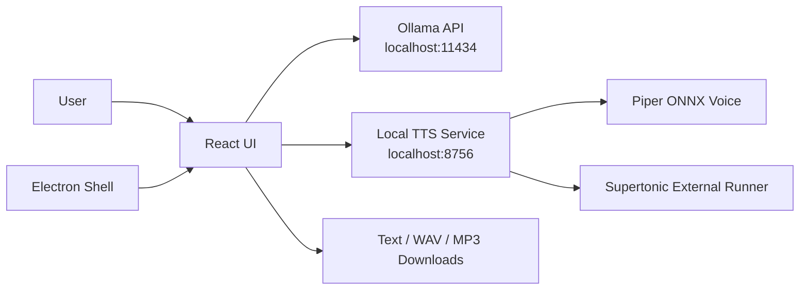

# LangTrans V1.0.0 Architecture

## Overview

LangTrans V1.0.0 is a local-first translation and speech application. The renderer UI runs as a Vite React app in the browser or inside Electron. Translation is sent to a local Ollama server. Speech synthesis is intentionally separated into a local Python TTS service so ONNX, Piper, and Supertonic-style engines can be configured without changing the UI.



## Runtime Components

- `src/App.tsx`: main React application. It owns language selection, Ollama requests, toolbar actions, file input, drag and drop, output saving, TTS playback, waveform rendering, status bar, error dialogs, and program info.
- `src/App.css` and `src/index.css`: application layout, themes, toolbar, panes, status bar, modal dialogs, drag/drop feedback, and waveform styling.
- `electron/main.cjs`: Electron main process. It creates a frameless desktop window, sets the app icon, loads either Vite dev server or production `dist/index.html`, and exposes window actions through IPC.
- `electron/preload.cjs`: safe renderer bridge for minimize, maximize/restore, and close actions.
- `tts-service/server.py`: FastAPI service for speech synthesis. It routes each request to either a Piper ONNX profile or an external Supertonic-compatible command.
- `tts-service/config.example.json`: example language/voice routing configuration.

## Translation Flow

1. The user enters text manually, pastes text, opens a text file, or drops a file onto the input pane.
2. The UI builds a concise translation prompt using the selected input and output languages.
3. The UI sends `POST /api/generate` to the configured Ollama endpoint.
4. The response is displayed in the output pane.
5. Errors are shown in a modal dialog with detailed information that can be copied.

## TTS Flow

1. The user clicks read aloud, save WAV, or save MP3.
2. The UI sends `POST /synthesize` to the local TTS service with `text`, `language`, `voice_id`, and `output_format`.
3. The TTS service resolves the voice profile from `config.json`.
4. For `piper_onnx`, the service invokes Piper with the configured ONNX model path.
5. For `external`, the service renders a command from the configured argument template and runs it locally.
6. WAV is returned directly. MP3 export converts WAV through `ffmpeg`.
7. During playback, the UI decodes the WAV blob, draws a waveform, and updates the active playback position.

## TTS Voice Routing

The default intended routing is:

- Korean: `ko-supertonic`, an external Supertonic-compatible command profile.
- English: `en-piper-onnx`, a separate Piper ONNX voice profile.
- Optional Korean ONNX: `ko-piper-onnx` can be configured if a Korean Piper model is available.

The UI uses language-to-voice mapping in `src/App.tsx`. The service remains authoritative for actual executable paths and model files through `tts-service/config.json`.

## Desktop Packaging

Electron Builder is configured in `package.json`:

- Windows target: NSIS installer.
- macOS target: DMG.
- Linux target: AppImage.
- Windows installer mode: assisted installer, not one-click.
- Desktop and Start Menu shortcut options are enabled.
- App and installer icon: `src/assets/app-icon.ico` / `src/assets/app-icon.png`.

Build output goes to `release/`, which is ignored by Git.

Target-specific scripts are provided for each platform:

- `npm run build:web`: Vite web build only, output to `dist/`.
- `npm run build:windows`: web build followed by Electron Builder Windows NSIS target.
- `npm run build:macos`: web build followed by Electron Builder macOS DMG target.
- `npm run build:linux`: web build followed by Electron Builder Linux AppImage target.
- `npm run build:desktop`: web build followed by Electron Builder's default current-OS target.
- `npm run build:all`: requests Windows, macOS, and Linux targets in one command.

Cross-platform packaging can require OS-specific tooling and Electron Builder cache/download access. The scripts define the targets; the build machine still needs to support the requested target.

## Data and File Boundaries

- User-selected input files are read in the renderer with browser `File` APIs.
- Exported text and audio files are generated as browser downloads.
- TTS model files and private service config are local-only and ignored by Git.
- No cloud service is required except the local services the user chooses to run.

## Error Handling

The renderer centralizes user-visible failures through a copyable error dialog. Translation and TTS failures include endpoint, model or voice, requested format, and backend error details when available. The status bar mirrors the latest high-level state for quick scanning.

## Validation Commands

```powershell
npm run lint
npm run build:web
python -m py_compile tts-service\server.py
```

Use `npm run build:windows`, `npm run build:macos`, or `npm run build:linux` to validate packaging when Electron Builder can access its cache/downloads and the local environment supports the requested installer target.