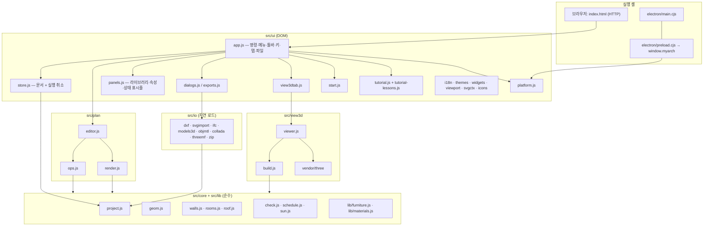
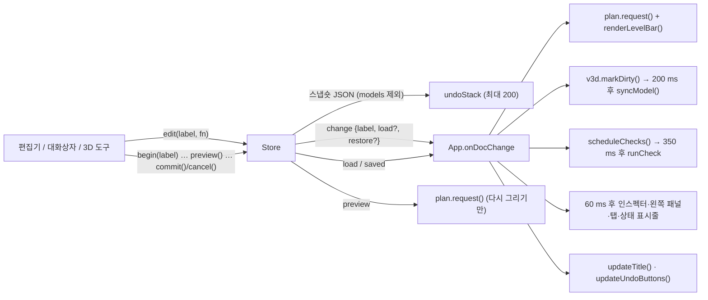
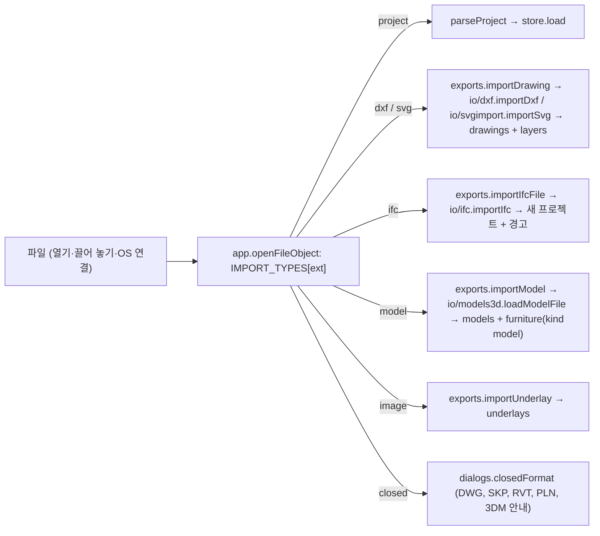
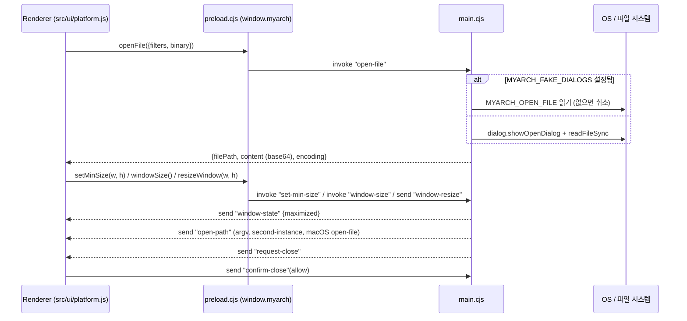

# Architecture

**MyArchitecture 10.0** — 평면도, 3D, BIM, SketchUp 방식 매싱을 갖춘 건축 설계 프로그램 (Web, Windows, macOS, Linux)
Author: SHKWON (`knix008@naver.com`) · Version 10.0.0

이 문서는 이 코드베이스를 처음 보는 개발자를 위한 구조 설명서입니다. 모든 내용은 현재 소스를 기준으로 하며, 식별자는 `코드`로, 파일은 저장소 루트 기준 상대 링크로 표기합니다.

---

## 1. 목표와 설계 원칙

- **코드 하나로 웹과 데스크톱.** 브라우저에서는 [index.html](index.html)을 HTTP로 열고, 데스크톱에서는 Electron이 같은 `index.html`을 `loadFile`로 엽니다. 차이는 [src/ui/platform.js](src/ui/platform.js) 한 파일이 감춥니다. Electron 쪽은 [electron/preload.cjs](electron/preload.cjs)가 `window.myarch`를 노출하고, 이것이 없으면 `platform.js`가 브라우저 API(파일 선택 `<input>`, 다운로드, `showSaveFilePicker`, `localStorage`, `window.print`)로 대신합니다.
- **번들러 없음, 프레임워크 없음.** 모든 소스는 순수 ES 모듈이며 브라우저가 그대로 읽습니다. 무거운 모듈(3D 뷰어, 파일 형식, 튜토리얼)은 `import()`로 필요할 때만 불러옵니다.
- **three.js r186을 저장소에 포함(vendoring).** [scripts/vendor-three.mjs](scripts/vendor-three.mjs)가 `node_modules/three`(0.186.1)에서 `three.module.js`, `three.core.js`, 쓰는 애드온만 [src/vendor/three](src/vendor/three)로 복사하면서 `'three'` 같은 bare import를 상대 경로로 고쳐 씁니다 (`npm run vendor`).
- **설계 전체가 JSON 객체 하나** (`.myarch`). 저장은 `JSON.stringify`, 실행 취소는 스냅숏, 기하·검사·집계·파일 변환 엔진은 모두 프로젝트의 **순수 함수**라 DOM 없이 Node에서 단위 테스트됩니다.
- 한국어/영어 UI(영어 문장 자체가 번역 키), 40개 테마, 키보드 중심 편집, 실제 프로그램을 조작하는 대화형 튜토리얼.
- CSP(`script-src 'self'`)가 [index.html](index.html)에 걸려 있으므로 인라인 스크립트는 쓰지 않습니다.

## 2. 전체 구조



의존 방향은 위에서 아래로만 흐릅니다. `src/core`와 `src/lib`는 DOM을 모르고(`lib/furniture.js`의 `drawFurniturePlan`은 전달받은 canvas 컨텍스트에만 그립니다), `src/io`는 `core`만 압니다. 예외는 [src/view3d/build.js](src/view3d/build.js)가 [src/plan/render.js](src/plan/render.js)의 `phaseVisible`을 가져다 쓰는 것 하나입니다.

## 3. 디렉터리 구성

| 경로 | 내용 |
| --- | --- |
| [index.html](index.html) | 앱 골격: `#titlebar`(브랜드, `#menubar`, `#tabbar`, `#doc-title`, `#title-search`, `#title-right`), `#toolbar`, `#workspace`(왼쪽 패널·스플리터·`#center`의 `#view-start`/`#view-plan`/`#view-3d`·오른쪽 패널), `#statusbar`(`#status-cells` + `#size-grip`), 인쇄용 `#print-area` |
| [style/app.css](style/app.css) | 전체 스타일. `.app`은 grid 행 `titlebar / toolbar / minmax(0,1fr) workspace / status bar`. 색은 전부 CSS 변수(테마가 `:root`에 주입) |
| [src/core](src/core) | 데이터 모델과 순수 기하·검사·집계 엔진 |
| [src/plan](src/plan) | 2D 평면 편집기(도구, 스냅, 변환, 그리기) |
| [src/view3d](src/view3d) | three.js 건물 생성과 뷰어 |
| [src/io](src/io) | 파일 형식 입출력(DXF, SVG, IFC, 3D 모델, OBJ/MTL, DAE, 3MF, ZIP) |
| [src/lib](src/lib) | 가구 카탈로그(44종, 8개 범주)와 재질(21종, 절차적 패턴) |
| [src/ui](src/ui) | 애플리케이션 셸: 명령, 메뉴, 패널, 대화상자, 3D 탭, 튜토리얼, 다국어, 테마 |
| [src/vendor/three](src/vendor/three) | three.js r186 + 애드온(OrbitControls, 로더들, 익스포터들) — 직접 수정 금지 |
| [electron/](electron) | `main.cjs`(메인 프로세스), `preload.cjs`(IPC 브리지) |
| [scripts/](scripts) | 실행·서버·테스트·빌드·패키징·예제·문서 스크린숏·튜토리얼 녹화·아이콘 렌더링 |
| [test/unit](test/unit) | `node --test` 단위 테스트 12개 파일 |
| [test/smoke](test/smoke) | 실제 Electron 앱을 CDP로 조작하는 GUI 스모크 테스트 |
| [sample/](sample) | 예제 프로젝트 9개 + `index.json` ([scripts/create-samples.mjs](scripts/create-samples.mjs)가 코드로 생성) |
| [assets/](assets) | 아이콘(`icon.*`, `icons/NxN.png`), 문서 아이콘(`file-icon.*`), `art/hero.png` |
| [docs/](docs) | 매뉴얼용 스크린숏 `docs/images/{ko,en}/*.webp` |
| [build/](build) | NSIS 스크립트 `installer.nsh`, 설치 프로그램 BMP |

## 4. 데이터 모델 (`.myarch`)

[src/core/project.js](src/core/project.js)가 형식을 정의합니다. `FORMAT = "myarch"`, `FORMAT_VERSION = 1`.

```text
project = {
  format: "myarch", version: 1,
  meta:     { title, author, company, client, address, rev, date, comment,
              scale (1:100), north (°), latitude, longitude, timezone },   // 대지 위치 = 일조 분석
  defaults: DEFAULTS { wallThickness 200, wallHeight 2800, doorWidth 900, doorHeight 2100,
                       windowWidth 1200, windowHeight 1200, windowSill 900, slab 200,
                       columnSize 400, stairWidth 1000, textSize 300 },
  levels:   [{ id, name, elevation, height, slab }],        // elevation 순으로 정렬
  wallTypes:[{ id, name, exterior, layers: [{ material, thickness, function }] }],
  grids:    [{ id, x1, y1, x2, y2, label }],                // 구조 그리드: 모든 층에 공통
  costs:    { currency: "KRW", wall, floor, roof, door, window, opening, stair, column, furniture },
  layers:   [{ id, name, color, visible }],                  // CAD 레이어 (drawings용)
  // 층에 속하는 컬렉션 (LEVEL_COLLECTIONS) — 각 항목에 level
  walls, rooms, columns, stairs, furniture, roofs, solids, dimensions, texts, drawings, underlays,
  openings: [...],                                           // 벽에 속함 (wall + at), 층은 벽을 따름
  models:   [{ id, name, format, size, outline, data /* base64 GLB */ }],
  scenes:   [{ id, name, camera, style, section, phase }],
  view:     { level },
}
```

- `LEVEL_COLLECTIONS`는 층에 붙는 11개 컬렉션, `COLLECTIONS`는 여기에 `openings`를 끼운 목록입니다. `findItem(p, id)`은 `COLLECTIONS`와 `grids`를 찾아 `{kind, obj}`를 돌려주고, UI 전반이 이 `kind` 문자열(`"walls"`, `"openings"` …)로 항목 종류를 구별합니다.
- **`normalizeProject`** 가 유일한 입구입니다. 빠진 컬렉션·id·기본값을 채우고, 숫자를 강제하고, 사라진 층의 항목은 첫 층으로, 사라진 벽의 개구부는 버리고, 점이 3개 미만인 방·지붕·매스를 버립니다. `wallTypes`가 지정된 벽은 두께를 레이어 합(`wallTypeThickness`)으로 덮어씁니다. 벽 `height: null`은 "층 높이"를 뜻합니다(`wallHeight(p, w)`). 모든 항목에 `phase`(`PHASES = existing | new | demolish`, 기본 `new`)와 자유 BIM 속성 `props`가 있습니다. `drawings`가 참조하는 레이어가 없으면 레이어를 만들어 줍니다.
- **개구부**: `{wall, kind: door|window|opening, at (벽 중심선 위 중심 위치), width, height, sill, hinge: start|end, side: ±1, type}`. 태그(D01, W01, O01)는 `openingTags`가 층→y→x 순서로 매기며, 항목에 `tag`가 있으면 그것을 씁니다.
- **매스(solids)**: SketchUp식 푸시/풀 덩어리 `{pts, z0, height, taper (0–1, 윗면 축소율), material}`.
- **지붕**: `{pts, kind: flat|gable|hip|shed, pitch (0–75°), overhang, thickness, rot?, offset?, auto?}`. `auto`는 "최상층 위 지붕" 명령이 만든 것이라 다시 실행하면 교체됩니다.
- **가구**: `{kind, x, y, rot, w, d, h, elevation, color?}`. `kind: "model"`이면 `model`이 `project.models`의 자산 id를 가리킵니다(가져온 3D 모델 = 가구).
- **언더레이**: 추적용 이미지 `{src (data URL), x, y, w, h, rot, opacity}`.

**단위와 좌표계.** 평면은 밀리미터, x 오른쪽, **y 아래쪽**(화면 기준, `meta.north`가 북쪽을 회전). 3D는 미터이고 **X = 평면 x, Z = 평면 y, Y = 위**입니다(`build.js`의 `W(x, y, z) = [x·M, z·M, y·M]`, `M = 0.001`). IFC는 z-up에 y가 북쪽이라 평면 `(x, y, z) ↔ IFC (x, −y, z)`, 3MF는 `(X, −Z, Y)`로 바꿉니다. 각도는 화면 기준 반시계(입력 `3600<90`도 반시계).

## 5. 기하 코어 (`src/core`)

### 5.1 [geom.js](src/core/geom.js)

`uid`, 점·선분 거리(`closestOnSegment`, `pointSegDist`), 교차(`lineIntersect`, `segIntersect`), 다각형(`polygonArea` 부호 있음, `polygonCentroid`, `labelPoint`, `pointInPolygon`, `bounds`), Sutherland–Hodgman 반평면 자르기 `clipHalfPlane`, 변마다 다른 거리로 안쪽 오프셋하는 **`offsetPolygon(pts, d|d[])`**(방 감지와 지붕 처마가 사용), `convexHull`, 최소 외접 회전 사각형 `orientedRect`(박공·모임 지붕의 바탕), 귀 자르기 `triangulate`, `snapAngle`, 단위 표시 `fmtLen`/`fmtArea`.

### 5.2 벽 — [walls.js](src/core/walls.js)

벽은 **중심선 + 두께**입니다. 벽 국소 좌표: `u`는 `(x1,y1)`에서 중심선을 따라, `v`는 왼쪽 법선 `(−dy, dx)` (`wallFrame`, `wallUV`, `wallPoint`).

**`wallOutlines(walls, {draw})`** 가 한 층의 모든 벽을 사각형(또는 허브 점이 붙은 오각·육각형)으로 바꿉니다.

1. `joints()`가 끝점을 `TOL = 2 mm` 격자로 묶어 접합점 표를 만듭니다.
2. 접합점마다 그 점에서 **나가는 방향의 팔(arm)** 을 만들고 각도로 정렬합니다.
3. **T 접합**: 접합점이 다른 벽의 *중간*에 놓이면 그 벽을 양방향 두 개의 **가상 팔**(`virtual: true`)로 추가합니다. 반폭은 3D용(`draw=false`)이면 벽 두께의 절반이라 T의 끝이 상대 벽 *면*에서 잘리고, 평면 그리기용(`draw=true`)이면 0이라 상대 벽 *중심선*까지 늘어나 채우기에 이음매가 생기지 않습니다.
4. **n방향 마이터**: 각 실제 팔의 왼쪽 면을 다음 팔의 오른쪽 면과, 오른쪽 면을 이전 팔의 왼쪽 면과 교차시켜 모서리를 얻습니다. 거의 반대 방향인 벽처럼 교점이 터무니없이 멀면(`sameSide`, 반폭의 4배 기준) 직각 절단으로 둡니다.
5. **허브 점**: 가상 팔 없이 실제 끝이 3개 이상 모이면(T자 세 끝, 십자 네 끝) 각 윤곽에 접합점 자체(`hub`)를 꼭짓점으로 넣어, 이웃 모서리 사이 쐐기들이 구멍 없이 가운데를 메웁니다.
6. 결과는 `Map(wallId → {poly, tee: [시작, 끝]})`, 다각형 순서는 `[startLeft, endRight, (hub), endLeft, startRight, (hub)]`.

개구부: `openingSpans(p, w)`는 벽 길이로 잘린 `[{o, u1, u2}]`, `slicePoly(w, poly, a, b)`는 윤곽을 `u ∈ [a, b]`로 자르고, `wallPieces`는 개구부 사이의 단단한 조각(평면 그리기용, 얇은 조각 제거)을 돌려줍니다. 편집 보조: `wallAt`(점 아래 벽), `fitOpening`(벽 안에 들어오게), `wallSnapPoints`, `endsAt`, **`splitWall`**(지점 `u`에서 둘로 나누고 개구부를 새 벽으로 재배치), **`mergeCollinear`**(같은 두께·높이의 일직선 벽이 다른 벽 없이 끝끼리 만나면 합치고 개구부 `at`을 옮김).

### 5.3 방 — [rooms.js](src/core/rooms.js)

`wallGraph`가 벽 중심선을 교차점·T 접점에서 쪼개 평면 그래프(노드 병합 1 mm)를 만들고, `graphFaces`가 각 반변(half-edge)에서 **가장 급하게 꺾는** 방향으로 걸으며 면을 찾습니다. 부호 있는 면적이 양수면 유계 면(방), 음수면 바깥 면입니다. **`detectRooms(walls, {minArea = 0.5 m²})`** 은 유계 면을 *그 변을 이루는 벽 두께의 절반씩* `offsetPolygon`으로 안쪽 오프셋해 실내 면(순면적)을 얻고 `cleanup`(중복·일직선 꼭짓점 제거)합니다. `buildingOutlines`는 바깥 면을 바깥으로 키워 건물 외곽(자동 지붕용), `roomAtPoint`는 클릭 지점을 둘러싼 가장 작은 방(방 도구), `suggestRoomName`은 면적으로 이름을 추천합니다.

### 5.4 지붕 — [roof.js](src/core/roof.js)

`roofBase(p, roof)` = 층 바닥 + 층 높이 + `offset`(벽 위). `roofModel(roof, base)`이 `{outline, lines (용마루·추녀), faces [[x,y,z]…], gables, peak, flat}`을 돌려주며 평면 그리기와 3D가 같은 결과를 씁니다. 평지붕은 다각형을 처마만큼 키운 슬래브, 박공·모임·외쪽 지붕은 `orientedRect`의 회전 사각형(`rot`로 방향 90° 전환) 위에 놓이고, 경사면이 벽선에서 `base`를 지나므로 처마는 그만큼 낮게 걸립니다.

### 5.5 모델 검사 — [check.js](src/core/check.js)

ERC/DRC에 해당하는 건축 검사. `runCheck(p)` → `[{severity, code, key, vars, message, x, y, ids, level}]`. `key`는 영어 메시지 틀로, UI가 `t(key, vars)`로 번역합니다. `CHECKS`(14종): `wall-short`, `wall-duplicate`, `opening-outside`, `opening-overlap`, `opening-tall`, `door-blocked`(문 회전 영역에 가구, 의자류 제외), `furniture-wall`, `room-small`, `room-overlap`, `room-no-door`, `stair-top`, 그리고 간섭 검사 `clash-furniture`, `clash-stair`(계단과 벽), `clash-column`(문·창 속의 기둥). 다각형 겹침은 꼭짓점 포함 + 변 교차로 판단합니다.

### 5.6 집계와 견적 — [schedule.js](src/core/schedule.js)

`roomSchedule`, `openingSchedule`, `levelSummary`, `projectTotals`, `wallTypeSchedule`, **`costEstimate`**(벽은 개구부를 뺀 면 면적, 바닥은 방 면적, 지붕은 평면 면적 기준 m² 단가, 나머지는 개수 단가; 가구는 `props.price`가 우선; `phase !== "new"`인 항목은 제외 — 기존은 비용 없음, 철거는 빠짐), `toCSV`(Excel이 한글을 읽도록 UTF-8 BOM, CRLF).

### 5.7 태양 위치 — [sun.js](src/core/sun.js)

NOAA/Spencer 근사식: `sunPosition(lat, lon, date, tz)` → `{azimuth (북에서 시계 방향), altitude, declination}`, `daylight()`은 하루를 5분 간격으로 훑어 일출·일몰을 구합니다. 3D 탭이 설정의 `sunStudy`, 월·일·시와 `meta.latitude/longitude/timezone`으로 그림자 방향을 계산합니다.

### 5.8 라이브러리 — [src/lib](src/lib)

- [furniture.js](src/lib/furniture.js): 가구마다 자기 좌표계의 상자·원기둥·구 부품 목록(`parts(w, d, h)`)을 가지며, **평면 기호(`drawFurniturePlan`)와 3D 모델(`furnitureParts`)이 같은 부품 목록에서 나오므로** 늘 일치합니다. `makeFurniture`, `furnitureCorners`(검사·선택용 회전 사각형).
- [materials.js](src/lib/materials.js): `MATERIALS`(색 + 캔버스에 그리는 절차적 패턴 + 타일 크기 mm + 용도), `DEFAULT_MATERIAL`, `paintPattern`.

## 6. 스토어와 실행 취소 — [src/ui/store.js](src/ui/store.js)



- **`edit(label, fn)`**: 변경 전 프로젝트를 JSON 스냅숏으로 떠 두고 `fn(project)`로 직접 바꿉니다. `fn`이 `false`를 돌려주면 "바뀐 것 없음"으로 보고 기록하지 않습니다.
- **`begin(label)` / `preview()` / `commit()` / `cancel()`**: 드래그용. 누를 때 `begin`, 움직이는 동안 객체를 직접 고치고 `preview()`(기록 없이 `preview` 이벤트), 놓을 때 `commit()`으로 한 단계가 됩니다. 스냅숏이 같으면 기록하지 않습니다. `begin` 중의 `edit`은 별도 단계를 만들지 않습니다.
- **`snapshot()`은 `models`를 뺀** 프로젝트를 직렬화합니다. 가져온 GLB 자산은 크고 한번 들어오면 바뀌지 않으므로, 복원(`parse`) 때 현재 `models` 배열을 다시 붙입니다.
- `revision`은 모든 변경·미리보기·불러오기에서 증가하여, 캐시 무효화 기준으로 쓸 수 있습니다.
- `undoLabel()` / `redoLabel()`은 툴바 버튼 툴팁("실행 취소: 벽 추가")과 토스트에, `history()`는 실행 취소 기록 대화상자에 쓰입니다.
- 이벤트: `load`, `change`, `preview`, `saved`. 구독은 `store.on(type, fn)`이 해제 함수를 돌려줍니다.

## 7. 평면 편집기 (`src/plan`)

### 7.1 도구와 키 — [editor.js](src/plan/editor.js)

`PLAN_TOOLS`가 도구 목록(아이콘·라벨·단축키·힌트)이며, `app.registerCommands()`가 이것으로 `plan.<id>` 명령을 만듭니다.

| 도구 | 키 | 포인터 처리기 |
| --- | --- | --- |
| select | Esc | `pointerSelect` |
| wall, line | W, L | `pointerChain` (연속 점) |
| room, roof, massPoly | A, O, — | `pointerArea` (클릭 = 자동, Shift+클릭 = 직접 그리기) |
| door, window | D, N | `pointerOpening` |
| column, furniture | C, F | `pointerPlace` (F는 가구 선택 창부터) |
| stair | S | `pointerStair` |
| dimension, measure, grid, massRect, massCircle | K, M, G, B, U | `pointerMeasure` (두 점) |
| text | T | `placeText` |

편집기 단축키(`onKey`): Ctrl+C/X/V/D/A, 화살표 이동(Shift = 격자 ×10), R 90° 회전(Shift+R −15°), X/Y 대칭(문은 X로 열림 방향 반전), H 경첩 교환, E 속성, Delete 삭제, Esc는 체인 종료 → 도구 해제 → 선택 해제 순.

**체인과 길이 입력.** 벽·선 도구는 `chain = {tool, pts, ids}`를 유지하며, **벽은 클릭할 때마다 바로 한 단계로 추가**됩니다(`store.edit("Add wall")`). 첫 점을 다시 클릭하면 닫고 끝나며, Enter/Esc/더블클릭으로 끝내고, Backspace는 마지막 벽을 지웁니다(`undoChainPoint`). 체인 중 숫자를 누르면 `typeLength`가 커서 옆에 입력칸을 띄우고 `parseLength`가 `3600`, `3.6m`, `360cm`, `12'6"`, `3600<90`(길이<각도)을 해석합니다. 벽 두께는 설정의 `wallType`(레이어 합) 또는 `wallThickness`, 단계(phase)는 `drawPhase`를 따릅니다.

**선택과 드래그.** 빈 곳 드래그는 기본이 화면 이동(설정 `emptyDrag`), Shift/Ctrl+드래그는 상자 선택(왼→오른쪽 = 완전히 포함, 오른→왼쪽 = 걸침). 그룹 항목은 그룹 전체가 선택되고 Alt는 하나만. 이동은 4 px 이상 움직였을 때 `store.begin("Move"|"Reshape")`, 격자 스냅된 오프셋을 `ops.moveItems(..., {stretch: !alt})`로 적용 — 이어진 벽 끝이 함께 따라옵니다. 핸들 드래그는 벽 끝(`moveWallEnd`: 맞닿은 끝 모두), 방·지붕 꼭짓점, 치수·그리드 끝점을 고칩니다.

**층 막대.** 캔버스 위 `page-bar`가 층 버튼(클릭 = 전환, 더블클릭 = 이름 바꾸기, 우클릭 = 메뉴)을 그리고, `addLevel({copyFrom, wallsOnly})`이 위층을 복제합니다.

**우클릭 메뉴.** 맨 위는 항상 `app.undoMenuItems()`(실행 취소/다시 실행), 그 아래는 항목에 따라: 벽이면 문·창 추가, 벽 나누기, 일직선 벽 합치기; 개구부면 방향·경첩; 공통으로 비슷한 항목 선택, BIM 속성, 회전·복제·복사, 3D에서 보기, 삭제. 빈 곳이면 붙여넣기, 방 감지, 자동 치수, 그리드선, 전체 맞춤.

### 7.2 스냅과 변환 — [ops.js](src/plan/ops.js)

**`snapPoint(p, level, x, y, {grid, tol, from, ortho, exclude, onWall, endpoints})`** 의 우선순위:
1. 끝점·꼭짓점(벽 끝, 방 꼭짓점, 기둥 중심, CAD 선 꼭짓점) — 허용 거리 안의 가장 가까운 점.
2. `from`과 `ortho`가 있으면: 방향을 45° 단위로, 길이를 격자 단위로 맞춘 뒤, 그 광선이 근처 다른 벽 중심선과 만나면 **정확히 그 위에서** 끝내고(`kind: "wall"`), 수평·수직이면 다른 벽 끝과 줄을 맞춰 안내선(`guide`)을 그립니다.
3. `onWall`이면 벽 중심선 위 점(벽을 따라 격자 간격).
4. 아니면 격자.

그 밖에 `hitTest`(맨 위 항목과 핸들, mm 허용 거리), `boxSelect`, 내부 `transformItems`를 공유하는 `moveItems` / `rotateItems` / `mirrorItems` / `scaleItems`(가구·매스·기둥은 높이도 함께 → 균일 3D 배율), `copyItems` / `pasteItems`, `deleteItems`, `groupMembers`, `pointAtLength`.

### 7.3 그리기 — [render.js](src/plan/render.js)

모두 **월드 밀리미터로 canvas API에 그립니다.** 그래서 같은 코드가 편집기, SVG 내보내기·인쇄([svgctx.js](src/ui/svgctx.js)의 `SvgContext`), 시작 페이지 썸네일을 그립니다. 선 굵기는 `lw`(화면에선 1 px, 인쇄에선 용지 mm × 축척).

`drawPlan(ctx, p, th, opts)`의 그리기 순서:
1. 언더레이 이미지 → 2. 아래층 유령(흐리게) → 3. 구조 그리드(모든 층 공통) → 4. 방 바닥 → 5. 매스(색칠된 바닥 모양, 축소된 윗면 점선, 높이) → 6. CAD 선(`drawings`) → 7. 가구·계단(벽보다 아래) → 8. **벽과 개구부** → 9. 기둥 → 10. 위에 있는 지붕(점선: 외곽·용마루·추녀) → 11. 방 이름·면적, 치수, 글자 → 12. 선택·호버 윤곽과 검사 문제 표시.

벽은 **합집합처럼** 그립니다: 모든 조각을 두 배 굵기로 먼저 외곽선 긋고 그 위에 채우므로, 이웃 벽 사이 이음매는 채우기에 덮이고 바깥 경계만 남습니다. 철거 벽은 점선 외곽만, 레이어가 있는 벽 유형은 확대하면 레이어 사이 가는 선이 보입니다. `phaseVisible(it, filter)`이 단계 보기(`all | new | existing`)를 결정합니다. `PLAN_THEMES`의 `dark`/`light` 기본 팔레트에 현재 테마의 색조(`canvasColors(th).plan`)를 덮어써서 `app.planPalette()`가 만듭니다.

### 7.4 뷰포트 — [src/ui/viewport.js](src/ui/viewport.js)

`Viewport`가 canvas, devicePixelRatio, `screen = world × scale + offset`, 휠 확대(커서 기준, `zoomSpeed`), 가운데·우클릭 드래그·Space·손 모드 이동, 터치 핀치, `request()` → 한 번의 `requestAnimationFrame`을 담당합니다. 편집기는 `onRender`, `onPointer`, `onViewChange` 콜백으로 연결됩니다.

**적응형 5×5 격자.** `gridCell(step)`은 스냅 격자 × 5의 거듭제곱 중 **화면에서 한 칸이 10–50 px**인 값을 고릅니다. 확대·축소하면 칸 크기가 ×5/÷5로 바뀌므로 5칸마다 그어지는 굵은(진한 색) 선이 만드는 5×5 블록이 어떤 배율에서도 고른 간격을 유지합니다. `drawGrid`는 선 또는 점 스타일, `drawRulers`는 위·왼쪽 20 px 눈금자를 그립니다.

## 8. 3D (`src/view3d`)

### 8.1 건물 생성 — [build.js](src/view3d/build.js)

- **`Geo`** 누산기가 삼각형·법선·UV를 모아 `BufferGeometry` 하나로 만듭니다. UV는 미터 단위 월드 좌표(수평면은 (x, z), 수직면은 (면을 따른 거리, y))라 재질 패턴이 모든 면에서 실제 크기로 보입니다.
- `prism`(평면 다각형 → 기둥체), `taperedPrism`(매스 윗면 축소), `slab3d`, `planarWall`(지붕 박공면).
- **벽**: `wallOutlines(walls)`(3D용, `draw=false`)의 윤곽을 `slicePoly`로 개구부마다 잘라, 개구부 구간은 창턱 아래와 머리 위만 기둥체로 쌓아 **실제로 구멍이 난** 벽을 만듭니다. 개구부 메시(`openingMeshes`: 틀, 유리, 문짝 — `openDoors`면 75° 열림)를 따로 붙입니다.
- 방 바닥(층 슬래브 두께), 기둥(사각·원형), 계단, 가구(부품 목록 또는 가져온 GLB를 `loadModel`로 비동기 적재 후 `onAsync`), 매스, 지붕(`roofModel`).
- **재질**: `makeMaterials(THREE)`가 `surface(id)`(절차적 패턴을 캔버스 텍스처로, 타일 크기에 맞춘 `repeat`), `color(hex, opts)`, `glass/frame/door`를 캐시합니다. 유형이 있는 벽은 페인트(`material`)가 없으면 첫 레이어(외부 마감) 재질을 보입니다. 단계 보기가 `all`일 때 철거 항목은 반투명 빨강.
- **`buildBuilding(THREE, p, mats, opts)`** — `opts: {openDoors, furniture, roofs, solids, levels: Set (보이는 층), phase, loadModel, onAsync}`. 층마다 `Group`(`userData.level`)을 만들고, **모든 메시에 `userData {id, kind, level}`** 을 달아 선택·교차 강조·페인트·푸시/풀이 프로젝트 항목을 찾게 합니다. `modelExtent(p)`는 프레이밍용 범위.

### 8.2 뷰어 — [viewer.js](src/view3d/viewer.js)

`createViewer(container, options)`가 클로저 API를 돌려줍니다(`setProject`, `setOptions`, `setView`, `zoomToFit`, `highlight`, `onPick`, `onTool`, `orbit`, `pan`, `setNavMode`, `walkKey`, `getCamera`/`setCamera`, `screenshot`, `exportFile`, `exportRoot`, `stats`, `helperInfo`, `rebuild`, `dispose`, `three`). `DEFAULT_OPTIONS`가 옵션의 전체 목록입니다.

- **탐색**: `OrbitControls` 기반 orbit, pan 모드(왼쪽 드래그 = 이동), **walk**(1인칭: W/A/S/D·화살표, Q/E 상하, Shift 달리기, 드래그로 둘러보기, 휠 전진). `VIEW_DIRS`(iso, top, front, back, left, right, bird)로 애니메이션 이동, 더블클릭 지점으로 확대.
- **투영**: 원근 ↔ 직교(`setProjection`, 직교 카메라를 원근 화면과 맞춤). 입면도 = 직교 + 선 그리기 + 정면.
- **스타일**: `realistic`, `white`, `lines`(25° `EdgesGeometry` 윤곽선, 조명 끔), `xray`. 원래 재질은 `userData.baseMaterial`에 보관하고 바꿔 끼우기만 합니다.
- **단면**: `section`(mm 높이)이 있으면 `renderer.clippingPlanes`에 수평면 하나. 3D 탭은 현재 층 바닥 + 1.2 m를 씁니다.
- **태양**: 방위각(+ `north`)·고도에서 방향광 위치와 그림자 카메라 범위를 정합니다.
- **적응형 3D 격자** — 평면과 같은 규칙: `gridPxPerUnit()`(직교는 화면 높이/시야 높이, 원근은 대상까지 거리와 FOV, walk는 눈높이 기준)으로 미터당 픽셀을 구하고, `gridCellFor(px)`가 1 m(또는 1 ft)에서 시작해 한 칸이 **12–60 px**이 되도록 ×5/÷5합니다(… 0.2 m, 1 m, 5 m, 25 m …). `buildGrid()`는 카메라가 보는 곳을 중심으로 양쪽 60칸을 깔고, **5칸마다의 블록선은 `ribbons()`로 만든 `GRID_MAJOR_PX`(1.5 px) 폭의 평면 띠**(WebGL 선은 굵기와 상관없이 1 px이므로 사각형으로 그림)로, 너무 진하지 않게 낮은 불투명도로 그리고, 나머지는 더 흐린 1 px 선입니다. 매 프레임 `fitGrid()`가 칸 크기가 바뀌었거나, 중심에서 블록 4개 이상 벗어났거나, 배율이 20% 넘게 흘렀을 때만 다시 만듭니다. 축 눈금 라벨도 함께 붙습니다.
- **선택**: 4 px 이하로 움직인 왼쪽 클릭이 레이캐스트 → `onPick` 콜백. 강조는 재질 복제본에 emissive 파랑.
- **SketchUp식 도구**(`opts.tool`): `pushpull`(매스나 벽의 **윗면**을 잡아 끌면 수직 평면과의 교점으로 높이 변화 `dy`를 mm로 `pushStart/push/pushEnd` 이벤트 발행), `paint`(`paint` 이벤트), `tape`(두 점 거리선 + 라벨). 뷰어는 프로젝트를 고치지 않고 이벤트만 보내며, 3D 탭이 스토어를 고칩니다.
- **내보내기**: `exportRoot({scale})`이 보이는 메시만 월드 변환을 구워 새 그룹으로 만들고, `exportFile`이 GLB/glTF/STL/OBJ/PLY/USDZ 익스포터를 지연 로드합니다.

### 8.3 3D 탭 — [src/ui/view3dtab.js](src/ui/view3dtab.js)

- `ensure()`가 처음 쓸 때 `viewer.js`(와 three.js)를 `import()`합니다. `markDirty()` → 200 ms 디바운스 → `syncModel()`이 `setProject`로 다시 만듭니다(3D 탭이 열려 있을 때만).
- `onTool`: `pushStart`에서 `store.begin("Push/Pull")`, `push`마다 높이를 50 mm 단위(매스 최소 100, 벽 최소 300)로 고치고 `preview()` + 30 ms 뒤 다시 만들기, `pushEnd`에서 `commit()`. `paint`는 방이면 `floor`, 가구면 `color`, 그 밖에는 `material`을 한 단계로 바꿉니다.
- 장면(scenes): `addScene`(카메라·스타일·단면·단계 저장, 실행 취소 가능), `goScene`, `playScenes`(순환 재생).
- **`resetView()`**: 도구 없음, orbit, 단면 없음, 모든 층 보임 등 기본 상태로 되돌립니다 — 튜토리얼이 시작할 때 부릅니다.
- **우클릭 메뉴**(`bindContextMenu`): 움직이지 않은 우클릭만(우클릭 드래그는 이동). 맨 위 실행 취소/다시 실행, 그다음 iso/top/front, walk/단면/직교/문 열기, 푸시/풀·페인트·줄자, 장면 추가·스크린숏. 선택된 항목이 있으면 "평면에서 보기"가 맨 위에 붙습니다.
- 키: 1–7 시점, P pan, V walk, O 직교, X 단면, G 격자, 화살표 회전(Shift = 이동), Esc 도구/모드 해제.
- 왼쪽 패널(`renderPanel`: 층 표시, 스타일, 일조, 장면, 재질 팔레트)과 선택 항목 인스펙터(`renderInspector`)도 여기서 그립니다.

## 9. 파일 형식



| 모듈 | 역할 |
| --- | --- |
| [src/io/dxf.js](src/io/dxf.js) | ASCII DXF R12–R2018 가져오기: 모델 공간을 2D 아핀 행렬로 훑으며 블록 삽입·OCS·y 반전을 합성, 상사 변환이면 원·호 유지(아니면 폴리라인), 단위는 헤더 또는 범위로 추정(`guessUnits`), CP949 텍스트 디코딩. 내보내기: 한 층의 평면을 AutoCAD R12(AC1009)로, `DXF_LAYERS` 규칙, ACI 색 |
| [src/io/svgimport.js](src/io/svgimport.js) | DOM 없는 작은 XML 토크나이저 + 변환 행렬 누적, 베지어를 변환 후 적응 분할, "SVG" 레이어로 |
| [src/io/ifc.js](src/io/ifc.js) | **IFC4 / IFC2X3 왕복**. `exportIfc(project, {schema})`: 사이트·건물·층, 벽(`IfcWallStandardCase`/`IfcWall` + `IfcMaterialLayerSetUsage`), 개구부(`IfcOpeningElement` + `IfcRelVoidsElement`/`IfcRelFillsElement`로 문·창), 공간, 슬래브, 지붕, 계단, 기둥, 가구, 그리드, 속성 세트·분류·단계. `parseStep` + `importIfc`: 아무 STEP 텍스트를 엔티티 맵으로 읽고 `IfcLocalPlacement`/매핑 항목을 3×4 행렬로 풀어, 아는 요소는 평면 항목으로 바꾸고 나머지는 `warnings`·`stats`로 요약. `ifcGuid`는 22자 압축 GUID |
| [src/io/models3d.js](src/io/models3d.js) | OBJ(+MTL), STL, PLY, glTF/GLB, FBX, DAE, 3MF, 3DS, VRML, AMF를 three.js 로더로 읽어 미터·Y-up·XZ 중심·바닥 Y=0으로 정규화, 크기(mm)·윗면 윤곽·GLB로 구운 base64 자산을 만듦. 단위가 없는 형식은 범위로 추정(>300 → mm, >30 → cm, 그 외 m). 익스포터 공용 도우미(`collectMeshes`, 재질 색·이름) |
| [src/io/objmtl.js](src/io/objmtl.js) | OBJ + MTL 쓰기(월드 좌표로 구움, 축척 1 = m, 1000 = mm) |
| [src/io/collada.js](src/io/collada.js) | COLLADA 1.4.1 쓰기(SketchUp·Blender용, `<unit>`이 축척을 따름) |
| [src/io/threemf.js](src/io/threemf.js) | 3MF 패키지 쓰기(Z-up mm, 정점 병합, `basematerials` 색) |
| [src/io/zip.js](src/io/zip.js) | STORE 전용 ZIP 쓰기/읽기(CRC-32, UTF-8 이름) — OBJ 묶음과 3MF가 사용 |

[src/ui/exports.js](src/ui/exports.js)는 위 모듈들의 UI 쪽입니다.

- **인쇄/PDF**: `printDialog` → 층마다 `sheetSvg`(용지 `PAPER` A4–A0·Letter·Tabloid, 축척 고정 또는 "맞춤"이면 표준 축척 중 가장 가까운 값, 테두리와 표제란)를 `#print-area`에 깔고 `platform.printPage()` / `printToPDF()`.
- **평면 이미지**: `exportPlanSvg`(`planSvg`), `exportPlanPng`.
- **DXF/IFC 내보내기**: `exportDxfFile`, `exportIfcFile`.
- **3D 내보내기**: `EXPORT_3D` 목록(GLB, glTF, OBJ+MTL ZIP, DAE, STL, 3MF, PLY, USDZ; FBX는 안내만) → `export3d(app, format, unit)`. 3D 뷰에 보이는 것만 나가며, 3MF는 항상 mm.

## 10. UI 셸 — [src/ui/app.js](src/ui/app.js)

`App` 하나가 전체를 묶고 `window.myarchApp`으로 노출됩니다(디버깅과 스모크 테스트용).

**초기화(`init`)**: 설정 읽기 → 언어·테마 → `PlanEditor`, `StartPage`, `View3DTab` 생성 → `registerCommands` → `buildMenus` → `buildTitleRight` → `bindKeys` → 스플리터·끌어 놓기 → 스토어 구독 → 크기 조절 손잡이(`initSizeGrip`) → 시작 탭 → 자동 저장 복구 확인 → 처음 실행이면 환영 창, 설정이 "마지막 파일"이면 최근 파일 열기.

**명령 레지스트리.** `registerCommands()` 안의 `C(id, label, icon, key, run, extra)`가 `this.commands`(Map)에 등록하고, 메뉴·툴바·단축키·명령 팔레트(Ctrl+K)·튜토리얼·스모크 테스트가 모두 `app.run(id)`으로 실행합니다. `extra.enabled()`가 거짓이면 실행하지 않고, `extra.checked()`는 메뉴의 체크 표시와 툴바의 `on` 상태가 됩니다. 비동기 실패는 토스트로 보고합니다. 접두어: `file.*`, `edit.*`, `view.*`, `plan.*`(PLAN_TOOLS에서 자동), `build.*`, `v3d.*`, `tools.settings`, `help.*`, `palette`.

**메뉴.** `buildMenus()`의 `M`: File, Edit, View, Draw, Build, BIM, 3D, Help. `@import`/`@export` 같은 가상 항목은 하위 선택 창(`dialogs.importPicker`/`exportPicker`)을 엽니다. 메뉴는 `contextMenu`로 그려지며, 하나가 열린 상태에서 다른 루트에 마우스를 올리면 바로 바뀝니다.

**제목 표시줄.** 별도의 탭 줄은 없습니다. [index.html](index.html)의 `#titlebar` 안에 브랜드 → 메뉴 막대 → **보기 탭**(`#tabbar`: 시작 / 평면도 F2 / 3D 보기 F3, 평면 탭에는 검사 오류·경고 개수 배지) → 문서 제목(`#doc-title`, 창 끌기 영역) → **검색 버튼**(`#title-search .search-btn`, 돋보기 아이콘 하나, 툴팁 "Search commands, rooms, furniture… (Ctrl+K)", 명령 팔레트를 엶) → `#title-right`(무작위 테마 + 테마 드롭다운, 언어 국기 토글, 설정, 정보)가 놓입니다. Windows/Linux에서는 Electron `titleBarOverlay`가 오른쪽에 OS 창 버튼을 그리고, `applyTheme()`이 `platform.setTitleBarTheme`으로 그 색을 테마에 맞춥니다.

**툴바와 최소 창 너비.** `renderToolbar()`가 탭마다 버튼을 다시 만듭니다(3D 탭은 `v3d.renderToolbar`). 원칙은 **아무것도 숨기지 않는 것**입니다. `fitToolbar(bar)`가 툴바에 필요한 너비를 재고(화면보다 넓으면 `compact` → 그래도 넓으면 `wrap`), `titleBarNeed()`가 제목 표시줄 항목 전부의 자연 너비(문서 제목은 최대 360 px)를 잽니다. 창 최소 너비는 `max(툴바 필요, min(화면, 제목 표시줄 필요))` × UI 배율로, 지금까지 본 최댓값으로만 올라가며 `platform.setMinSize(w, 700)` → IPC `set-min-size`로 전달됩니다. 화면이 제목 표시줄 한 줄보다 좁으면 `html.titlebar-wrap`이 제목 표시줄을 두 줄로 접습니다(이때 `.app` 첫 행은 `auto`). 실행 취소/다시 실행 버튼은 툴바를 다시 만들지 않고 `updateUndoButtons()`가 활성 상태와 툴팁(`undoLabel`/`redoLabel`)만 갱신합니다.

**상태 표시줄.** `panels.renderStatus`가 탭별 칸을 그립니다. 평면: 힌트, 커서 X/Y(표시 단위, Y는 위가 양수), 현재 층(클릭 = 층 속성), 격자 크기(클릭 = 10–1000 mm 메뉴), 스냅, 직교, 대략 축척 1:N(96 dpi 기준), 단위 순환(mm → cm → m → ft), 선택 개수. 3D: 탐색 모드, 원근/직교, 단면, 스타일, 삼각형 수, 선택 개수. 시작: 최근 파일 수, 테마, 벽 개수. 모든 탭 끝에 검사 결과 칸(클릭 = F5). 맨 오른쪽 **크기 조절 손잡이**(`#size-grip`)는 `initSizeGrip()`이 처리합니다: 누를 때 `platform.windowSize()`(IPC `window-size`)로 시작 크기를 받고, 포인터 캡처가 창 크기 변경으로 끊기므로 창 전체에서 `pointermove`를 듣다가 rAF마다 `resizeWindow`(IPC `window-resize`, 최소 크기 이하로는 줄지 않음)를 보냅니다. 창이 최대화·전체 화면이면 `window-state` 이벤트로 `html.win-maximized`가 붙어 숨겨지고, 브라우저에서는 `can-resize`가 없어 보이지 않습니다.

**최근 파일.** `addRecent`는 경로 기준 중복 제거 후 맨 앞에 넣고 `recentLimit`(기본 10)개로 자릅니다. `removeRecent`(하나 빼기), `clearRecent`(`file.clearRecent`), 열기 실패한 경로는 자동 제거. 시작 페이지가 목록을 보여 줍니다.

**패널과 레일.** 왼쪽 = 평면에서는 가구 라이브러리, 3D에서는 3D 보기 옵션; 오른쪽 = 속성 인스펙터와 검사 문제 목록([panels.js](src/ui/panels.js)). 시작 탭에서는 양쪽 다 없습니다. 패널을 닫으면 아이콘과 제목만 있는 좁은 **레일**이 남아 클릭으로 다시 엽니다. 너비는 스플리터로 200–520 px.

**선택 교차 연결.** `onSelection("plan"|"3d", ids)`가 반대쪽을 강조하고(`crossLock`으로 되먹임 방지, 설정 `crossProbe`), `crossProbe(ids, target)`은 탭을 바꾸며 보여 줍니다.

**키보드.** `bindKeys()`: 모달이 열려 있으면 무시 → Ctrl 조합(저장·열기·새로·인쇄·가져오기·팔레트·찾기·설정·단축키·패널·그룹, 입력 중이 아닐 때 Z/Y/+/−) → F키(F1 매뉴얼, F2 평면, F3/F4 3D, F5 검사, F8 직교, F9 스냅) → 입력 중이면 중단 → Home 맞춤 → 평면 `plan.onKey` 또는 3D `v3d.onKey` → Space(누르는 동안 이동).

**다국어.** [i18n.js](src/ui/i18n.js)의 `t(key, vars)`는 **영어 문장 자체가 키**이고 `{name}` 자리 표시자를 채웁니다. 한국어는 [i18n-ko.js](src/ui/i18n-ko.js)(약 970개 항목). 빠진 번역은 영어로 보일 뿐 깨지지 않습니다. [scripts/i18n-keys.mjs](scripts/i18n-keys.mjs)(`npm run i18n:check`)가 `t("…")` 호출과 명령 라벨, 메뉴 이름, 도구 힌트, 가구·재질 이름, 검사 메시지 등을 모아 빠진 키를 보고하고, [test/unit/i18n.test.mjs](test/unit/i18n.test.mjs)가 같은 검사를 테스트로 돌립니다. [scripts/i18n-add.mjs](scripts/i18n-add.mjs)는 JSON에서 번역을 추가합니다. 언어가 바뀌면 `onLanguage` → `refreshAll()`.

**테마.** [themes.js](src/ui/themes.js)의 `THEMES` 40개(어두운 20, 밝은 20)는 배경·패널·글자·강조색 몇 개만 정하고, `uiTokens(th)`가 대비를 확인하며 CSS 변수 전체를, `canvasColors(th)`가 캔버스 팔레트를 파생합니다. 시스템 테마(OS 밝기 추종), 무작위 테마, 사용자 정의 테마(`customThemes` 설정, `dialogs.customThemeEditor`).

**설정.** [dialogs.js](src/ui/dialogs.js)의 `SETTING_DEFAULTS`가 기본값의 단일 출처이고, `settingsDialog`는 탭 6개(일반, 모양, 단위·격자, 평면도, 3D 보기, 출력)입니다. 설정은 데스크톱에서 `userData/settings.json`, 웹에서 `localStorage["myarch.settings"]`에 저장됩니다. 자동 저장은 두 환경 모두 `localStorage["myarch.autosave"]`(기본 30초, 변경이 있을 때만)이며, 다음 실행에서 복구를 묻습니다. `uiScale`은 데스크톱에서 `setZoomFactor`(IPC `set-zoom`, 0.75–1.5), 웹에서 CSS `zoom`.

그 밖의 UI 파일: [widgets.js](src/ui/widgets.js)(`h()` DOM 도우미, `modal`, `toast`, `contextMenu`, `quickPick`, `popupInput`, `stepper`, `tabs`, `pager`), [start.js](src/ui/start.js)(빠른 작업, 최근 파일, 예제 카드와 실시간 썸네일), [icons.js](src/ui/icons.js), [flags.js](src/ui/flags.js), [svgctx.js](src/ui/svgctx.js).

## 11. 튜토리얼

[src/ui/tutorial.js](src/ui/tutorial.js)의 `TutorialPlayer`는 `help.tutorial` 명령에서 지연 로드됩니다. 레슨은 [src/ui/tutorial-lessons.js](src/ui/tutorial-lessons.js)의 `LESSONS`로 **16개 레슨, 83단계**(둘러보기, 벽, 문과 창, 방, 가구, 편집, 치수·글자·그리드, 층과 계단, 지붕과 기둥, 매싱, BIM, 모델 검사, 3D 심화, 가져오기/내보내기, 설정, 예제의 고급 기능). 단계 형태:

```text
{ title: {ko, en}, text: {ko, en},
  run: async (ctx) => { … ctx.click / ctx.key / ctx.command … ctx.expect(cond, msg) },
  practice: { todo: {ko, en}, setup?, check: (ctx, mem) => bool, targets: (ctx) => [...] } }
```

- **보기(watch) 모드**: 움직이는 커서가 실제 툴바·메뉴·캔버스 지점으로 가서 **진짜 포인터·키보드 이벤트**를 보냅니다(0.5–4배속). 모든 단계가 `ctx.expect`로 결과를 확인하므로 레슨이 그대로 종단 간 테스트입니다.
- **따라 하기(practice) 모드**: 할 일을 보여 주고 대상 위치를 표시한 뒤, 스토어 변경과 DOM 변화를 감시하며 `check`가 참이 되면 다음으로 넘어갑니다. "보여 주기"로 그 단계만 시연할 수 있습니다.
- `fresh` 레슨(1, 2, 16)은 새 프로젝트나 예제에서 시작합니다. 중간 레슨으로 바로 가면 `ensureReady()`가 이번 세션에서 마지막으로 끝낸 레슨 다음(그 사이에 `fresh` 레슨이 있으면 가장 가까운 그것)부터 대상 직전까지의 단계를 즉시 재생해 상태를 만듭니다.
- **BASELINE**: 튜토리얼이 열려 있는 동안 `SETTING_DEFAULTS`(모양 관련 `KEEP_OWN` — UI 배율, 애니메이션, 힌트, 자동 저장, 최근 파일 수, 시작 동작 — 제외) + `phaseView: "all"`, `drawPhase: "new"`, `sunStudy: false`, 양쪽 패널 열림을 적용하여 사용자의 격자·스냅·단위 설정과 무관하게 단계가 설명대로 동작하게 합니다. 열 때 `v3d.resetView()`와 선택 도구로 되돌리고, `close()`가 원래 설정을 복원합니다.
- **`runAll({from, to})`**: 애니메이션 없이 모든 단계를 실행해 `[{lesson, step, ok, error}]` 보고서를 돌려줍니다. **`verifyPractice()`**: 각 단계를 실행하면서 그 practice `check`가 결과를 알아보는지 표본 검사합니다. 둘 다 GUI 스모크 테스트가 부릅니다.

## 12. Electron 메인 프로세스와 IPC



[electron/preload.cjs](electron/preload.cjs)가 `contextBridge`로 노출하는 `window.myarch`: `isElectron`, `platform`, `arch`, `versions`, `getVersion`, `loadSettings`/`saveSettings`, `openFile`, `readPath`, `saveFile`, `writeFile`, `print`, `printToPDF`, `openExternal`, `openManual`, `setZoom`, `onOpenPath`, `onRequestClose`/`confirmClose`, `setMinSize`, `windowSize`, `resizeWindow`, `onWindowState`, `setTitleBar`, `listSamples`/`readSample`, `pathForFile`(끌어 놓은 파일의 경로). 이진 데이터는 IPC에서 base64로 오갑니다.

[electron/main.cjs](electron/main.cjs):

- **사용자 데이터**: `%APPDATA%\MyArchitecture`, `~/Library/Application Support/MyArchitecture`, `~/.config/MyArchitecture`. 명령줄 `--user-data-dir`가 우선합니다(테스트·CDP가 실제 설정을 건드리지 않도록).
- **단일 인스턴스**(`requestSingleInstanceLock`, user-data 디렉터리별). 두 번째 실행은 인자를 넘기고 종료하며, 기존 창이 복원·포커스되고 `open-path`로 파일을 엽니다. 지원 확장자 `SUPPORTED_EXTENSIONS`만 argv에서 받습니다.
- **창**: 1440×900(작업 영역보다 크지 않게), 최소 1024×700, `show: false` 후 `ready-to-show`. Windows/Linux는 `titleBarStyle: "hidden"` + **`titleBarOverlay`**(높이 38), macOS는 `hiddenInset` 신호등. `set-title-bar`가 오버레이 색을 테마에 맞춥니다.
- **`set-min-size`**: 렌더러가 요구한 너비·높이를 `[1024×700, 2400×1600]`으로 제한하고 *창이 있는 화면의 작업 영역 − 16*을 넘지 않게 한 뒤, 창 테두리 두께를 더해 `setMinimumSize`. 현재 내용 영역이 더 작으면 키우고 **`keepOnScreen`** 으로 작업 영역 안으로 밀어 넣습니다(필요할 때만 줄임).
- **파일 대화상자**: `open-file`(다중 선택 지원), `read-path`, `save-file`(텍스트 `content` 또는 `contentBase64`), `write-file`(경로가 있는 Ctrl+S, 대화상자 없음).
- **`MYARCH_FAKE_DIALOGS`**: 폴더 경로가 설정되면 저장 대화상자는 그 폴더에 제안 이름으로 쓰고, 열기 대화상자는 `MYARCH_OPEN_FILE`을 읽고(없으면 취소), 인쇄는 그 폴더에 `print.pdf`를 씁니다. 자동 테스트가 창에 막히지 않습니다.
- **인쇄/PDF**: 렌더러가 `.print-area`에 용지를 직접 배치하고, `print`는 시스템 인쇄 대화상자, `print-to-pdf`는 `printToPDF`(`preferCSSPageSize`)로 저장.
- **매뉴얼 창**: `open-manual`이 `docs/USERSGUIDE.{ko,en}.html`을 별도 창(sandbox, 제목 고정)으로 엽니다.
- **예제**: 개발 중에는 `sample/`, 패키지에서는 `resources/sample`. `read-sample`은 `^[\w.-]+\.myarch$`만 허용.
- **닫기**: `close` 이벤트를 막고 `request-close`를 보내면 렌더러가 저장 여부를 묻고 `confirm-close(true)`로 답합니다.
- 보안: `contextIsolation: true`, `nodeIntegration: false`, `will-navigate`와 새 창 요청은 막고 `http(s):`/`mailto:`만 외부 브라우저로.

## 13. 테스트

| 명령 | 내용 |
| --- | --- |
| `npm test` | [scripts/test.mjs](scripts/test.mjs)가 `test/unit/*.test.mjs` 13개를 **파일마다 따로** `node --test`(+ [test-reporter.mjs](scripts/test-reporter.mjs)의 JSON 줄)로 실행하고, `CATEGORIES`별로 묶어 시간과 함께 출력합니다: 핵심 모델·기하(core, walls, rooms) 269, 평면 편집(plan, store) 91, 검사·집계(check, schedule) 87, 3D 모델(view3d) 124, CAD 교환(dxf) 46, BIM 교환(ifc) 14, 3D 교환(export3d) 18, 예제(samples) 83, 다국어(i18n) 5 — **합계 737개**. `npm test -- ifc dxf`로 파일 이름 필터, `--json out.json`으로 결과 저장. 환경에서 `ELECTRON_RUN_AS_NODE`를 지웁니다 |
| `npm run smoke` | [test/smoke/gui-smoke.mjs](test/smoke/gui-smoke.mjs) — 실제 Electron 앱을 임시 프로필로 띄워 CDP로 **실제 마우스·키보드 입력**을 보내는 GUI 검사 **104개**(시작, 예제 9개 각각 열기·검사 통과·3D 생성, 마우스로 그리기, BIM, 3D, 형식별 내보내기와 다시 가져오기, 최근 파일, 패널·설정 — **실제 창 크기**가 페이지와 정확히 맞고 UI 배율 100/125%에서도 화면 안에 있는지, 크기 조절 손잡이 드래그 —, 등록된 모든 명령을 평면과 3D에서 실행, 튜토리얼 `runAll` 한국어·영어와 `verifyPractice`). 렌더러의 잡히지 않은 예외가 하나라도 생기면 그 단계가 실패합니다. `MYARCH_FAKE_DIALOGS`로 저장 파일을 임시 폴더에 받아 검사합니다. `--only 3d,export`, `--keep`, `--shots dir` |
| [test/smoke/driver.mjs](test/smoke/driver.mjs) | `launch({width, height, args, env})`: 무작위 포트로 `--remote-debugging-port`, 임시 `--user-data-dir`, `index.html` 페이지 타깃에 Node 내장 `WebSocket`으로 연결. 창 크기는 에뮬레이션이 아니라 `window.myarch.resizeWindow`로 **실제 창**을 맞춥니다(실패할 때만 `Emulation.setDeviceMetricsOverride`). `ev`, `click`, `move`, `drag`, `key`, `shot`, `errors` |
| `npm run build:docs` | [scripts/docs-shots.mjs](scripts/docs-shots.mjs) — 같은 드라이버로 기능별 스크린숏을 `docs/images/<lang>/*.webp`와 캡션 `shots.json`으로 저장(`--lang ko`, `--only plan-`) |
| `npm run record:tutorial` | [scripts/record-tutorial.mjs](scripts/record-tutorial.mjs) — 튜토리얼 보기 모드를 정상 속도로 재생하며 DevTools 스크린캐스트를 ffmpeg로 25 fps MP4 인코딩(`MyArchitecture-Tutorial.mp4`; `--lang en --out --speed --lessons 1-3`; `FFMPEG` 환경 변수) |
| `npm run i18n:check` | 빠진 한국어 번역 키 보고 |
| `npm run build:samples` | 예제를 코드로 다시 만들고 검증(방 감지·이름, 검사 오류 없음, 3D 생성, DXF/IFC 쓰기) |

단위 테스트는 core·plan·io·view3d를 DOM 없이 직접 import합니다(3D 테스트는 three.js를 Node에서 돌림). 타입 검사나 단위 테스트가 잡지 못하는 렌더러 전용 오류는 스모크 테스트가 잡으므로, UI를 바꿨다면 둘 다 돌려야 합니다.

## 14. 빌드와 패키징

| 스크립트 | 목적 |
| --- | --- |
| `npm start` | [build-info.mjs](scripts/build-info.mjs)(버전·커밋·빌드 시각 → `src/buildinfo.js`) 후 [start.mjs](scripts/start.mjs)가 `ELECTRON_RUN_AS_NODE`를 지우고 Electron 실행 |
| `npm run serve` | [serve.mjs](scripts/serve.mjs) — 캐시 없는 정적 서버, 포트 8642(`PORT`), `-- dist/web`으로 웹 빌드 제공 |
| `npm run build:web` | [build-web.mjs](scripts/build-web.mjs) — `index.html`, `style`, `src`(vendor 포함), `assets`, `sample`, `docs`를 그대로 `dist/web`에 복사. ES 모듈이라 `file://`로는 안 되고 HTTP(S)로 제공해야 함 |
| `npm run vendor` | three.js 다시 복사(버전 변경 후) |
| `npm run build:art` (= `build:icons`) | [render-art.mjs](scripts/render-art.mjs)가 [scripts/art/art.js](scripts/art/art.js)(three.js 장면)를 숨은 Electron 창에서 렌더링해 `assets/icon.png/.ico/.icns`, `assets/icons/NxN.png`, `assets/file-icon.*`, `assets/art/hero.png`, `build/installerSidebar.bmp`(164×314), `build/installerHeader.bmp`(150×57)를 씀 |
| `npm run build:installer` | [create-installer.mjs](scripts/create-installer.mjs) — `FILE_TYPES` 표에서 NSIS include(`build/installer-associations.nsh`)와 JSON 사본 생성. `.myarch`는 내장(electron-builder `fileAssociations`)이라 선택지에 없고, 다른 형식이 없으면 연결 선택 페이지 자체가 빠짐(`MYARCH_ASSOC_COUNT == 0`) |
| `npm run build:clean` | [prepare-dist.mjs](scripts/prepare-dist.mjs) — 이 폴더에서 띄운 앱 프로세스를 끝내고 낡은 `release/win-unpacked*` 제거 |
| `npm run dist:win` / `dist:mac` / `dist:linux` / `build:all` | [package.mjs](scripts/package.mjs)가 electron-builder 실행(Windows에서 백신이 잡고 있는 디렉터리 이름 바꾸기 EPERM을 재시도, `ELECTRON_RUN_AS_NODE` 제거): NSIS x64 / dmg+zip(서명 없음) / AppImage+deb+tar.gz. [copy-installers.cjs](scripts/copy-installers.cjs)가 결과를 루트로 복사 |

[build/installer.nsh](build/installer.nsh): 언어 선택(한국어/영어), 기존 설치가 있으면 완전히 제거한다고 알리고(확인/취소) 그 언인스톨러를 조용히 실행(같은 버전 덮어쓰기에서 파일이 안 바뀌는 문제 방지), 그다음 `%APPDATA%\MyArchitecture`를 지울지 따로 묻습니다(예/아니요). `docs/`는 `app.asar` 안에, `sample/`과 아이콘은 `extraResources`로 들어갑니다.

## 15. 확장 지점

- **명령 추가**: `App.registerCommands()`에 `C("group.name", "English label", "icon", "Key", () => …, { enabled, checked })`. 메뉴에 넣으려면 `buildMenus()`의 `M`, 툴바면 `renderToolbar()`, 단축키가 Ctrl 조합이면 `bindKeys()`의 `map`에도. 라벨의 한국어를 `i18n-ko.js`에 추가하세요(모든 명령은 스모크 테스트의 "Every command"가 실행합니다).
- **평면 도구 추가**: `PLAN_TOOLS`에 `{icon, label, key, hint}` → `plan.<id>` 명령과 단축키가 자동으로 생깁니다. `PlanEditor.pointer()`에서 기존 처리기(`pointerChain`, `pointerArea`, `pointerMeasure`, `pointerPlace` …)에 연결하거나 새로 만들고, 결과는 반드시 `store.edit`/`begin…commit`으로. 미리보기는 `renderOverlay`. Draw 메뉴와 툴바에 넣으세요.
- **새 항목 종류(컬렉션)**: `project.js`의 `LEVEL_COLLECTIONS`(또는 `COLLECTIONS`), `newProject`, `normalizeProject`의 기본값 → `ops.hitTest`/`boxSelect`/`transformItems`/`copyItems` → `render.js`의 `drawPlan` → `build.js`의 `buildBuilding`(메시에 `userData`) → 필요하면 IFC·DXF.
- **가구 추가**: [furniture.js](src/lib/furniture.js)의 `CATALOG`에 `{kind, cat, name, w, d, h, color, parts: (w, d, h) => [B(…), C(…), S(…)]}`. 평면 기호·3D·썸네일·검사가 모두 이 부품 목록을 씁니다. 의자류는 `check.js`의 `SEATS`도 고려.
- **재질 추가**: [materials.js](src/lib/materials.js)의 `MATERIALS`(`pattern`은 `paintPattern`에 구현된 것 중 하나).
- **파일 형식 추가**: `src/io/<fmt>.js`에 순수 함수(`importX(text) → {project 조각 | drawings, warnings}`, `exportX(project | root)`)를 만들고, 가져오기는 `app.js`의 `IMPORT_TYPES`와 `importFilters()`, `exports.js`의 처리 함수(지연 `import()`)에 연결합니다. 데스크톱에서 파일 연결까지 원하면 `main.cjs`의 `SUPPORTED_EXTENSIONS`와 `create-installer.mjs`의 `FILE_TYPES`. 3D 내보내기는 `EXPORT_3D`와 `export3d()`.
- **검사 추가**: `check.js`의 `CHECKS`에 `[code, 설명]`을 넣고 `runCheck` 안에서 `add(severity, code, "English message {var}", {var}, x, y, ids, level)`. 메시지 틀은 번역 키가 되고 `i18n-keys.mjs`가 수집합니다. 예제 9개가 검사를 통과해야 한다는 테스트가 있으니 새 검사가 예제에 걸리면 예제(`create-samples.mjs`)도 고쳐야 합니다.
- **레슨 추가**: `tutorial-lessons.js`의 `LESSONS`에 `{title, fresh?, steps: [{title, text, run, practice}]}`. `run`은 `ctx`로 실제 UI를 조작하고 `ctx.expect`로 확인, `practice.check`는 사용자가 한 결과를 인식해야 합니다. 스모크 테스트가 `runAll`과 `verifyPractice`로 둘 다 검사합니다. 튜토리얼이 기대하는 설정은 `BASELINE`이 보장하므로 사용자 설정에 기대지 마세요.
- **번역 추가**: 새 `t("…")` 문장을 쓰면 `i18n-ko.js`에 같은 키로 추가하고 `npm run i18n:check`. 자리 표시자 `{x}`와 HTML 태그는 번역에서도 같아야 합니다(`i18n.test.mjs`).
- **테마 추가**: `themes.js`의 `THEMES`에 `D(...)`/`Lt(...)` 한 줄(어두운/밝은 각 20개 균형 유지).
- **IPC 추가**: `main.cjs`의 `ipcMain.handle` → `preload.cjs`의 `window.myarch` → `platform.js`에 웹 대체 구현과 함께 감싸기. UI 코드는 `window.myarch`를 직접 부르지 말고 `platform.js`를 거칩니다.
