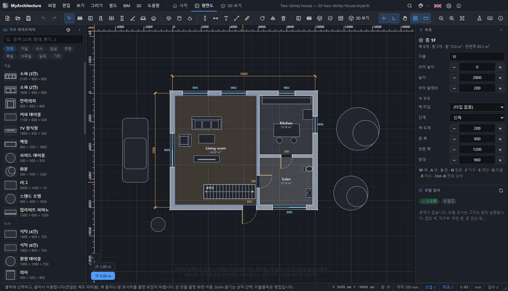
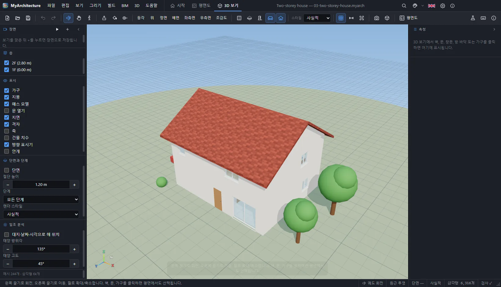

# MyArchitecture 10.0

건축 평면도를 그리고, 그 자리에서 3D 로 보고, BIM 정보와 공사비까지 다루는 건축 설계 프로그램입니다.
SketchUp 식 매스 모델링(밀기/끌기, 페인트 통, 줄자, 장면)과 CAD·BIM 파일 교환(DXF, IFC, OBJ, GLB …)을 함께 지원합니다.
같은 코드가 **웹 브라우저**와 **Windows / macOS / Linux 데스크톱 앱(Electron)** 에서 그대로 돌아갑니다.
번들러 없이 순수 브라우저 JavaScript ES 모듈로 작성되어 있습니다 (three.js r186 은 `src/vendor` 에 포함).

> **English summary** — MyArchitecture draws architectural floor plans (walls, rooms, doors, windows, furniture,
> stairs, columns, roofs, levels, dimensions, grids), shows them in 3D (walk-through, sections, sun study, styles),
> manages BIM data (wall types with layers, phases, classification, properties, schedules, cost estimates,
> model checks) and offers SketchUp-style massing (push/pull, paint bucket, tape measure, scenes). It imports and
> exports DXF, SVG, IFC 4 / 2x3, OBJ, STL, PLY, GLB / glTF, FBX, DAE, 3MF, 3DS, WRL, AMF and images, and prints
> scaled PDF sheets. Plain browser ES modules, no bundler; the same files run as a web page and as an Electron app.
> `npm start` runs the desktop app, `npm run serve` serves it at <http://localhost:8642>, `npm test` runs the unit
> tests, `npm run smoke` the GUI tests, and `npm run dist:win` / `dist:mac` / `dist:linux` build installers.





## 문서

| 문서 | 내용 |
| --- | --- |
| [Tutorial.md](Tutorial.md) | 처음 쓰는 사람을 위한 따라 하기. 모든 기능을 단계별로, 스크린샷과 함께 |
| [UsersGuide.md](UsersGuide.md) | 사용 설명서. 메뉴·도구·단축키·설정·형식을 빠짐없이 정리한 참고서 |
| [Architecture.md](Architecture.md) | 개발자용 구조 설명. 모듈, 데이터 모델, 3D, 파일 형식, 테스트, 빌드 |
| [docs/USERSGUIDE.ko.html](docs/USERSGUIDE.ko.html) · [en](docs/USERSGUIDE.en.html) | 앱 안의 설명서(도움말 → 사용 설명서, `F1`) |
| `MyArchitecture-Tutorial.mp4` | 대화형 튜토리얼 전체(16개 레슨, 83단계)를 녹화한 동영상 |

## 주요 기능

- **평면 그리기**: 벽(`W`, 클릭할 때마다 이어 그리기, 숫자로 길이 입력 `4500` · `3.6m` · `3600<90`, 모서리·T 자·십자
  이음 자동 정리), 방(`A`, 벽으로 둘러싸인 곳을 클릭 → 이름과 면적), 문(`D`)·창(`N`)(`X` 여는 방향, `H` 경첩),
  가구 약 45종(`F` 이름으로 찾기, 라이브러리에서 끌어 놓기), 계단(`S`), 기둥(`C`), 지붕(`O`, 박공·모임·외쪽·평지붕),
  층(아래층을 흐리게 겹쳐 보기), 치수(`K`, 자동 치수), 글자(`T`), 선(`L`), 측정(`M`), 구조 그리드(`G`)
- **편집**: 선택·상자 선택(Shift+끌기, 왼→오른쪽은 완전히 포함, 오른→왼쪽은 걸친 것), 이동(이어진 벽이 따라 늘어남),
  벽 끝 끌기, 복사·붙여넣기·복제, 회전(`R`)·대칭·배율·간격 띄우기, 그룹, 비슷한 것 선택, 찾기, 되돌리기 기록,
  더블클릭 속성 창, 오른쪽 클릭 메뉴(맨 위에 되돌리기/다시 실행)
- **3D**: 회전·이동·확대, 걷기(`V`, W/A/S/D), 보기 방향 7가지, 평행 투영, 스타일(사실적·흰색 모형·선 그림·X-레이),
  단면(`X`), 문 열기, 안개, 층·가구·지붕 표시, 2D 와 같은 **5×5 그리드**(확대해도 같은 간격으로 보이도록 칸 크기가 ×5 로 바뀜),
  대지 위치·날짜·시각으로 계산한 **태양 분석**과 그림자, 3D 에서 고른 요소를 평면에서도 선택
- **SketchUp 식 매스 모델링**: 상자(`B`)·원기둥(`U`)·다각형 매스와 테이퍼, **밀기/끌기**, **페인트 통**(재료 팔레트),
  **줄자**, **장면**(시점 저장·이동·애니메이션 재생), 그룹
- **BIM**: 재료 층으로 두께를 정하는 **벽 타입**, 공사 단계(기존·철거·신축)와 단계별 보기, 분류 코드, IFC 클래스와
  GlobalId, 사용자 속성(내화 등급 등), 실 번호·부서, **일람표**(방, 문과 창, 벽 타입, 층)와 CSV, 단가 기반 **공사비**,
  **모델 검사**(겹친 벽, 막힌 문, 가구·계단·기둥 간섭 등; 그리는 동안 실행), 프로젝트·대지 속성
- **파일**: `.myarch` 프로젝트(자동 저장, 최근 파일 10개 · 하나씩 지우기 · 목록 비우기)
  - 가져오기: DXF(레이어 유지), SVG, IFC 4 / 2x3, OBJ(+MTL), STL, PLY, GLB / glTF, FBX, DAE, 3MF, 3DS, WRL, AMF,
    이미지(따라 그리기 밑그림)
  - 내보내기: DXF(AutoCAD 표준 레이어, 층마다 한 파일), IFC 4 / 2x3, GLB, glTF, OBJ+MTL(zip), STL, PLY, DAE, 3MF, USDZ,
    평면 SVG / PNG, 축척과 표제란이 있는 인쇄 / PDF / SVG 도면, 일람표 CSV
  - DWG · SKP · RVT · PLN · 3DM 은 공개되지 않은 형식이라 직접 열지 않고, 원래 프로그램에서 DXF · DAE · IFC 로 내보내는
    방법을 안내합니다.
- **편의**: 제목 표시줄 안의 보기 탭(시작 · 평면도 · 3D 보기)과 검색 돋보기 버튼(또는 `Ctrl+K` — 명령·방·층·가구 검색;
  제목 표시줄의 메뉴·탭·버튼은 창을 줄여도 가려지지 않음), 도구 모음의
  되돌리기/다시 실행, 페이지마다 다른 정보를 보여 주는 상태 표시줄과 오른쪽 아래 **창 크기 조절 표시**, 40가지 테마
  (다크 20 + 라이트 20) + 사용자 테마, 한국어/영어, 접으면 아이콘과 제목이 남는 좌우 패널, 9개의 예제
- **대화형 튜토리얼**: 도움말 → 대화형 튜토리얼. 16개 레슨 · 83단계, **보기**(프로그램이 직접 실행) / **따라 하기**
  (할 곳을 표시하고 결과를 자동 확인). 튜토리얼 동안에는 정해진 그리기 설정을 쓰고, 닫으면 내 설정으로 돌아갑니다.
- 도구 모음 버튼은 숨겨지지 않습니다: 창의 최소 폭이 가장 넓은 도구 모음을 따르고(화면 밖으로 나가지 않게 위치를
  맞춤), 화면이 좁으면 글자 버튼이 아이콘으로 줄어들며, 그래도 넘치면 두 줄로 나뉩니다.

## 예제 (`sample/`)

| 파일 | 내용 |
| --- | --- |
| `01-studio.myarch` | 원룸: 주방 라인과 샤워실, 가구 배치, 평지붕 |
| `02-two-bedroom.myarch` | 방 두 개 아파트: 침실 2, 거실·식당·주방, 욕실, 현관 |
| `03-two-storey-house.myarch` | 2층 주택: 계단으로 연결된 2개 층, 박공지붕, 나무와 자동차가 있는 마당 |
| `04-small-office.myarch` | 소규모 사무실: 오픈 오피스, 유리 회의실, 기둥, 로비 |
| `05-wooden-cabin.myarch` | 목조 오두막: 목재 외장과 외쪽지붕 |
| `06-renovation-bim.myarch` | 리모델링: 기존·철거·신축 단계, 다층 벽 타입, 그리드, 실 번호, 속성, 공사비 |
| `07-massing-study.myarch` | 매스 스터디: 포디움·타워·원형 건물·테이퍼 지붕, 그룹, 장면 애니메이션 |
| `08-apartment-block.myarch` | 3층 공동주택: 계단실 중심 2세대 × 3개 층, 구조 그리드 위 기둥, 실 번호 |
| `09-cad-tracing.myarch` | DXF 도면 따라 그리기: CAD 레이어로 가져온 AutoCAD 도면을 벽으로 따라 그림 |

`npm run build:samples` 가 `scripts/create-samples.mjs` 로 예제를 다시 만들고, 각 예제가 모델 검사 오류·경고 0 개이며
DXF·IFC 로 내보낼 수 있는지 확인합니다.

## 요구 사항

- Node.js 22 이상
- `npm install` (Electron 37, electron-builder, three.js, 아이콘 생성용 pngjs / png-to-ico)
- 튜토리얼 동영상을 만들 때만: ffmpeg (`choco install ffmpeg`, 또는 환경 변수 `FFMPEG` 에 경로)

## 실행

| 명령 | 설명 |
| --- | --- |
| `npm start` | 데스크톱 앱 실행 (`scripts/build-info.mjs` 로 빌드 정보를 쓴 뒤 `scripts/start.mjs` 가 `ELECTRON_RUN_AS_NODE` 를 지우고 Electron 을 띄움) |
| `npm run serve` | 프로젝트 폴더를 <http://localhost:8642> 로 서비스 → 브라우저에서 바로 사용 |
| `npm run serve -- dist/web` | 웹 빌드 결과물을 서비스 |
| `PORT=9000 npm run serve` | 다른 포트 사용 |

웹 버전은 ES 모듈을 쓰므로 `file://` 로 `index.html` 을 직접 열면 동작하지 않습니다. 반드시 HTTP 서버로 여세요.

> VS Code 같은 Electron 기반 터미널은 `ELECTRON_RUN_AS_NODE=1` 을 물려주는 경우가 있어
> `electron .` 을 직접 실행하면 앱이 조용히 종료됩니다. `npm start` 를 쓰면 이 문제가 없습니다.

## 테스트

```bash
npm test                  # test/unit/*.test.mjs (737개 테스트)를 분류별로 실행
npm test -- ifc dxf       # 이름에 ifc 또는 dxf 가 들어간 파일만
npm run smoke             # 실제 Electron 앱을 CDP 로 조작하는 104개의 GUI 검사
npm run smoke -- --only "drawing,3d view"   # 일부 영역만 (--keep: 내보낸 파일 보존, --shots 폴더: 실패 화면 저장)
npm run i18n:check        # 한국어 사전(src/ui/i18n-ko.js)에 없는 t("…") 키 보고 (현재 974개 모두 번역됨)
```

`npm test` 는 테스트를 분류별(핵심 모델·기하, 평면 편집, 검사·일람표, 3D 모델, CAD 교환(DXF·SVG), BIM 교환(IFC),
3D 교환, 예제, 지역화)로 묶어 각 테스트의 시간과 함께 보여 주고 마지막에 색깔 있는 요약을 출력합니다.

`npm run smoke` 는 임시 프로필로 실제 창을 띄워(뷰포트 흉내가 아니라 **실제 창 크기**를 바꿔 가며) 마우스·키보드로
모든 메뉴·명령·예제, 벽·방·문·가구 그리기, 편집과 되돌리기, BIM 창, 3D 도구·장면·태양·그리드, 상태 표시줄과 창 크기
조절, 모든 내보내기(실제로 파일을 쓰고 다시 가져와 확인), 최근 파일, 설정·테마·언어, 좁은 화면의 도구 모음,
튜토리얼 전체(영어·한국어 보기 모드와 따라 하기 확인)를 검사합니다. 파일 대화 상자는 `MYARCH_FAKE_DIALOGS`
(임시 폴더에 저장)로 바뀌어 아무 창도 실행을 막지 않습니다. 렌더러에서 잡히지 않은 오류가 나면 그 단계가 실패합니다.

## 문서용 자료 만들기

| 명령 | 결과 |
| --- | --- |
| `npm run build:docs` | `scripts/docs-shots.mjs` 가 앱을 띄워 기능마다 스크린샷을 찍어 `docs/images/ko/*.webp`, `docs/images/en/*.webp` 와 캡션 목록 `shots.json` 을 만듦 (`--lang ko`, `--only 이름`) |
| `npm run record:tutorial` | `scripts/record-tutorial.mjs` 가 대화형 튜토리얼을 보기 모드로 처음부터 끝까지 실행하며 녹화해 `MyArchitecture-Tutorial.mp4`(1600×900, 25fps, H.264)를 만듦 (`--lang en`, `--speed 1.5`, `--lessons 1-3`, `--out 파일`) |
| `node scripts/build-manual.mjs` | `UsersGuide.md` 로 앱 안의 설명서 `docs/USERSGUIDE.ko.html` 을, `docs/UsersGuide.en.md` 로 `docs/USERSGUIDE.en.html` 을 만듦 |

## 빌드

| 명령 | 결과 |
| --- | --- |
| `npm run build:art` (= `build:icons`) | `scripts/render-art.mjs` 가 숨은 Electron 창에서 `scripts/art/art.js` (3D 로 그린 집을 올린 입체 정사각형 타일)를 그려 `assets/` 의 앱/문서 아이콘, `assets/art/hero.png`, NSIS 사이드바/헤더 BMP 를 만듦 |
| `npm run vendor` | `node_modules/three` 에서 필요한 three.js 파일과 addon 을 `src/vendor/three` 로 복사 |
| `node scripts/build-info.mjs` | 버전·커밋·브랜치·빌드 날짜를 `src/buildinfo.js` 에 기록(정보 창에 표시). `npm start` 와 모든 빌드가 자동 실행 |
| `npm run build:installer` | `build/installer-associations.nsh`, `build/file-types.json` 생성 (NSIS 파일 연결) |
| `npm run build:web` | `dist/web/` 에 웹 버전 (index.html, style, src, assets, sample, docs 복사) |
| `npm run build:clean` | `release/` 의 오래된 `*-unpacked`, `*.tmp` 폴더 정리, 이 폴더에서 띄운 MyArchitecture 프로세스 종료 |
| `npm run build:win` | **Windows 설치 파일** — NSIS 설치 프로그램 (x64) → `release/MyArchitecture-Setup-10.0.0.exe` |
| `npm run build:mac` | **macOS 설치 파일** — dmg + zip (서명 없음), macOS 에서 실행 |
| `npm run build:linux` | **Linux 설치 파일** — AppImage + deb + tar.gz, Linux 에서 실행 |
| `npm run build:all` | 웹 빌드 + 세 OS 설치 파일 한 번에 |

설치 파일은 위의 `npm run build:win` 같은 명령으로 만듭니다(각 명령은 빌드 정보 기록 → `release/` 정리 → 파일 연결
생성 → electron-builder 패키징 → 복사까지 한 번에 실행; `dist:win` · `dist:mac` · `dist:linux` · `dist:all` 은 같은 일을
하는 다른 이름). 완성된 설치 파일은 `release/` 에 만들어지고, 찾기 쉽도록 프로젝트 루트에도 복사됩니다
(`scripts/copy-installers.cjs`).

### Windows 설치 프로그램

- 설치 경로 선택 가능(one-click 아님), 바탕화면/시작 메뉴 바로 가기, 시작할 때 **한국어/영어** 선택.
- 이미 설치되어 있으면 이전 설치를 완전히 제거한 뒤 설치합니다(같은 버전을 다시 설치해도 파일이 확실히 바뀜).
- `%APPDATA%\MyArchitecture` 에 이전 데이터가 있으면 삭제할지 따로 묻습니다.
- `.myarch` 파일을 MyArchitecture 에 연결합니다.

## 데이터 위치

| OS | 설정 (`settings.json`) |
| --- | --- |
| Windows | `%APPDATA%\MyArchitecture` |
| macOS | `~/Library/Application Support/MyArchitecture` |
| Linux | `~/.config/MyArchitecture` |

웹 버전은 브라우저 `localStorage` 에 저장합니다. 자동 저장은 두 버전 모두 `localStorage` 를 씁니다.

## 프로젝트 구조

```text
index.html            앱 진입점 (웹·데스크톱 공용)
style/app.css         스타일 (테마는 CSS 변수만 바꿈)
src/
  core/               데이터 모델(project.js), 기하(geom.js), 벽 이음(walls.js), 방 찾기(rooms.js), 지붕(roof.js),
                      모델 검사(check.js), 일람표·공사비(schedule.js), 태양 위치(sun.js)
  plan/               평면 편집기(editor.js), 렌더러(render.js), 선택·스냅·변형(ops.js)
  view3d/             3D 모델 생성(build.js), 뷰어(viewer.js: 탐색·걷기·단면·스타일·태양·그리드·도구·내보내기)
  io/                 DXF, SVG, IFC, 3D 모델, OBJ/MTL, Collada, 3MF, ZIP
  lib/                가구 카탈로그, 재료
  ui/                 앱 셸(app.js), 패널, 대화 상자, 내보내기, 3D 탭, 시작 페이지, 튜토리얼, 테마, 한국어 사전,
                      platform.js (데스크톱/웹 차이를 감춤)
  vendor/three/       three.js r186 과 addon (npm run vendor)
sample/               예제 프로젝트 (index.json + *.myarch)
assets/               아이콘·그림 (npm run build:art 로 생성)
docs/                 앱 안의 설명서 HTML (ko/en) 과 스크린샷 (docs/images/ko, docs/images/en)
electron/
  main.cjs            Electron 메인 프로세스 (창, 파일 대화 상자, 인쇄, 창 크기, 단일 인스턴스)
  preload.cjs         렌더러에 window.myarch API 노출
build/                NSIS 스크립트
scripts/              실행·빌드·테스트·문서 스크립트
test/unit/            단위 테스트 (node --test)
test/smoke/           GUI 스모크 테스트 (CDP) 와 드라이버
```

## 데스크톱 API (`window.myarch`)

`electron/preload.cjs` 가 노출하고 `src/ui/platform.js` 가 감쌉니다. 웹에서는 `window.myarch` 가 없으므로
platform.js 가 브라우저 대체 동작(파일 선택/다운로드, `window.print()`, `localStorage`)을 씁니다.

`getVersion`, `loadSettings`, `saveSettings`, `openFile`, `readPath`, `saveFile`, `writeFile`, `print`, `printToPDF`,
`openExternal`, `openManual`, `setZoom`, `onOpenPath`, `onRequestClose` / `confirmClose`, `setMinSize`,
`windowSize` / `resizeWindow` / `onWindowState` (상태 표시줄의 창 크기 조절), `setTitleBar`, `listSamples`, `readSample`,
`pathForFile`.
