# MyArchitecture 10.0 사용자 가이드

**MyArchitecture** v10.0.0 · 저작자: **SHKWON** (`knix008@naver.com`)

평면도를 그리면 바로 3D 건물이 되는 건축 설계 프로그램입니다. 벽·문·창·방·계단·지붕·기둥으로 평면을 그리고, 스케치업식 매스로 볼륨을 잡고, 3D 에서 해와 그림자·걷기·단면·입면을 보고, 벽 타입·단계·분류·IFC 속성 같은 BIM 정보를 붙이고, 일람표와 공사비를 뽑고, DXF·IFC·glTF/GLB·OBJ·PDF 등으로 주고받는 일을 한 창에서 합니다.

이 문서는 **모든 기능의 참조 설명서**입니다. 처음이라면 1장과 3장을 차례로 읽고, 나머지는 필요할 때 찾아보세요. 프로그램 안의 **따라 하는 튜토리얼**(9장)로 같은 내용을 직접 해 볼 수도 있습니다.

> 표기 약속
> - 메뉴는 **파일 → 예제 열기…** 처럼 화면에 보이는 한국어 이름 그대로 씁니다. 영어 화면을 쓰는 분을 위해 필요한 곳에는 영어 이름을 괄호로 덧붙였습니다.
> - 키는 <kbd>Ctrl</kbd>+<kbd>Z</kbd> 처럼 씁니다. macOS 에서는 <kbd>Ctrl</kbd> 대신 <kbd>⌘</kbd>(Command)도 됩니다.
> - 길이 단위는 따로 말하지 않으면 **mm** 입니다. 프로그램 내부도 모두 mm 로 계산합니다.

---

## 목차

1. [시작하기](#1-시작하기)
2. [화면과 조작](#2-화면과-조작)
3. [평면 그리기](#3-평면-그리기)
4. [편집](#4-편집)
5. [3D 보기](#5-3d-보기)
6. [BIM](#6-bim)
7. [파일](#7-파일)
8. [설정과 꾸미기](#8-설정과-꾸미기)
9. [튜토리얼](#9-튜토리얼)
10. [단축키 전체 표](#10-단축키-전체-표)
11. [문제 해결과 FAQ](#11-문제-해결과-faq)
12. [부록](#12-부록)

---

## 1. 시작하기

### 1.1 설치

| 환경 | 방법 |
| --- | --- |
| Windows | `MyArchitecture-Setup-10.0.0.exe` 실행 → 설치 언어(한국어/English) 선택 → 이미 설치된 MyArchitecture 가 있으면 “이미 설치된 MyArchitecture 가 있습니다… 기존 프로그램을 완전히 삭제합니다” 안내(**확인** = 이전 설치를 지우고 계속, **취소** = 설치 중단) → `%APPDATA%\MyArchitecture` 에 이전 데이터가 있으면 “저장한 데이터(설정, 자동 저장)가 있습니다. 삭제하시겠습니까?”(예/아니요) → 설치 폴더 선택. 바탕 화면·시작 메뉴 바로 가기와 `.myarch` 파일 연결이 만들어집니다. |
| macOS | dmg 를 열고 응용 프로그램 폴더로 끌어 놓습니다. 서명이 없으므로 처음 한 번은 Control-클릭 → **열기**. |
| Linux | AppImage(`chmod +x` 후 실행), `.deb`(`sudo apt install ./MyArchitecture-…deb`), `.tar.gz` |
| 웹 | 소스 폴더에서 `npm run serve` 후 브라우저로 `http://localhost:8642` (다른 포트: `PORT=9000 npm run serve`). `file://` 로 직접 열면 동작하지 않습니다. |
| 소스 | Node.js 22 이상, `npm install`, `npm start` |
| 설치 프로그램 만들기 | `npm run build:win`(Windows NSIS), `npm run build:mac`(dmg·zip), `npm run build:linux`(AppImage·deb·tar.gz), `npm run build:all`(웹판 + 세 운영 체제 모두) |

### 1.2 실행과 저장 위치

- MyArchitecture 는 **한 번에 하나만** 실행됩니다. 이미 실행 중일 때 `.myarch` 파일(또는 연결된 DXF·IFC·3D 모델 파일)을 더블클릭하면 열려 있는 창에서 열립니다.
- 설정 파일 `settings.json` 위치: Windows `%APPDATA%\MyArchitecture`, macOS `~/Library/Application Support/MyArchitecture`, Linux `~/.config/MyArchitecture`. 웹판은 브라우저 `localStorage` 에 저장합니다.
- 자동 저장(복구용 사본)은 프로젝트 파일과 별개입니다. 비정상 종료 뒤 다음 실행 때 “…의 저장되지 않은 프로젝트를 복구했습니다. 복원할까요?”라고 묻습니다(7.2절).
- 처음 실행하면 **MyArchitecture 10.0에 오신 것을 환영합니다** 창이 뜹니다. 네 단계 요약(벽 그리기 → 방·계단·지붕 → 가구 배치 → 3D 로 보고 공유하기)과 **예제 열기 / 새 프로젝트 시작 / 확인** 단추가 있습니다. 다시 보려면 **도움말 → 빠른 둘러보기**, 시작할 때마다 보려면 설정 → 일반 → **시작할 때 환영 창 표시**.
- 프로그램 폴더에는 튜토리얼 전체를 녹화한 동영상 **`MyArchitecture-Tutorial.mp4`** 가 들어 있습니다(9.4절).

### 1.3 화면 구성

*평면도 화면: 메뉴·탭·도구 모음, 왼쪽 가구 라이브러리, 가운데 도면, 오른쪽 속성, 아래 상태 표시줄*

위에서 아래로:

| 영역 | 내용 |
| --- | --- |
| **제목 표시줄** | 프로그램 아이콘, 메뉴(파일·편집·보기·그리기·빌드·BIM·3D·도움말), 바로 뒤에 **보기 탭**(시작 / 평면도 / 3D 보기), 문서 제목, **돋보기 단추**(명령 팔레트, <kbd>Ctrl</kbd>+<kbd>K</kbd>), 오른쪽에 테마·언어·설정·정보 단추와 창 단추 |
| **도구 모음** | 보고 있는 탭에 맞는 도구. 맨 앞은 언제나 새로 만들기·열기·저장 / 되돌리기·다시 실행, 맨 끝은 튜토리얼·단축키·정보 |
| **왼쪽 패널** | 평면도: 가구 라이브러리와 CAD 레이어 / 3D: 장면·층·표시·단면과 단계·일조 분석 |
| **가운데** | 시작 페이지, 평면 도면(왼쪽 아래에 층 탭) 또는 3D 화면 |
| **오른쪽 패널** | 평면도: 고른 요소의 속성과 모델 검사 목록 / 3D: 클릭한 요소의 정보 |
| **상태 표시줄** | 힌트와 페이지별 정보 칸, 오른쪽 끝에 창 크기 조절 손잡이 |

자세한 내용은 2장에 있습니다.

### 1.4 시작 페이지

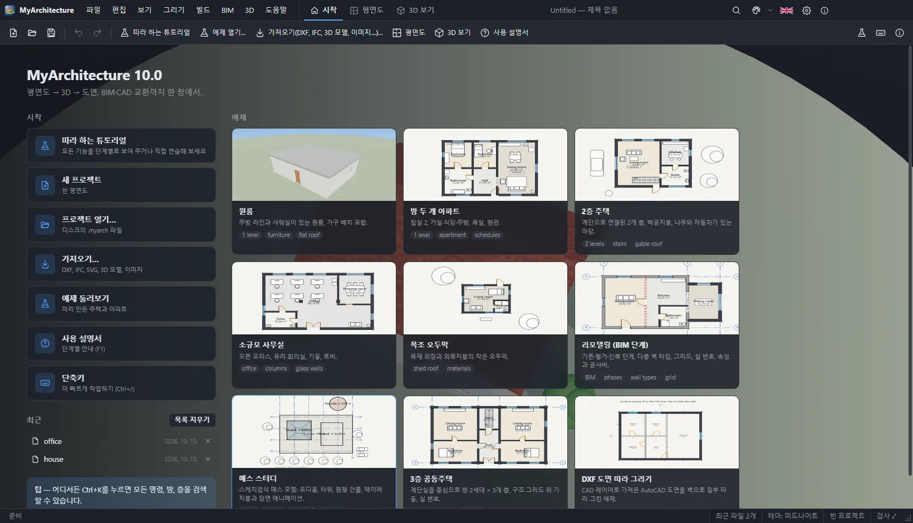
*시작 페이지: 튜토리얼, 새 프로젝트, 열기, 가져오기, 예제 카드, 최근 파일*

프로그램을 켜면 **시작** 탭이 열립니다(설정 → 일반 → **시작할 때**를 **마지막 프로젝트 다시 열기**로 바꾸면 데스크톱판은 마지막 파일을 바로 엽니다). 뒤에서는 2층 주택 예제가 3D 로 천천히 돌아갑니다(설정 → 모양 → **애니메이션**을 끄면 정지 그림).

왼쪽 **시작** 카드:

| 카드 | 하는 일 |
| --- | --- |
| 따라 하는 튜토리얼 | 모든 기능을 단계별로 보여 주거나 직접 연습(9장) |
| 새 프로젝트 | 빈 평면도(<kbd>Ctrl</kbd>+<kbd>N</kbd>) |
| 프로젝트 열기… | 디스크의 `.myarch` 파일(<kbd>Ctrl</kbd>+<kbd>O</kbd>) |
| 가져오기… | DXF, IFC, SVG, 3D 모델, 이미지(<kbd>Ctrl</kbd>+<kbd>I</kbd>) |
| 예제 둘러보기 | 미리 만든 주택과 아파트(예제 목록 창) |
| 사용 설명서 | 단계별 안내(<kbd>F1</kbd>) |
| 단축키 | 더 빠르게 작업하기(<kbd>Ctrl</kbd>+<kbd>/</kbd>) |

그 아래 **최근** 목록에는 최근에 열거나 저장한 파일이 설정 → 일반 → **최근 파일 기억 개수**만큼(기본 10개, 최대 30개) 보입니다. 항목을 누르면 열리고, 오른쪽 **×**(목록에서 제거)는 그 항목만 목록에서 지웁니다(파일은 디스크에 그대로). **목록 지우기**는 목록을 비웁니다. 맨 아래에는 날마다 바뀌는 **팁**이 하나 나옵니다.

오른쪽 **예제** 카드는 평면 그림으로 먼저 그려졌다가 잠시 뒤 3D 그림으로 바뀝니다. 카드를 누르면 그 예제가 열립니다.

시작 탭에서 도구 모음은 **따라 하는 튜토리얼 · 예제 열기… · 가져오기… · 평면도 · 3D 보기 · 사용 설명서** 글자 단추를 보여 줍니다.

### 1.5 예제

**파일 → 예제 열기…** 또는 시작 페이지 카드로 엽니다. 예제는 읽기 전용 원본에서 열리므로, 고친 내용을 남기려면 **다른 이름으로 저장**하세요(“예제 … 을(를) 열었습니다. 변경 내용을 남기려면 새 이름으로 저장하세요.”).

| # | 예제 (파일) | 내용 | 이런 기능을 보여 줍니다 |
| --- | --- | --- | --- |
| 1 | **원룸** (`01-studio.myarch`) | 주방 라인과 샤워실이 있는 원룸, 가구 배치 포함 | 1개 층, 가구 라이브러리, 평지붕 |
| 2 | **방 두 개 아파트** (`02-two-bedroom.myarch`) | 침실 2, 거실·식당·주방, 욕실, 현관 | 방과 면적, 문·창 태그, 일람표 |
| 3 | **2층 주택** (`03-two-storey-house.myarch`) | 계단으로 연결된 2개 층, 박공지붕, 나무와 자동차가 있는 마당 | 층, 계단, 박공지붕, 실외 가구. 시작 페이지 배경에 쓰이는 대표 예제 |
| 4 | **소규모 사무실** (`04-small-office.myarch`) | 오픈 오피스, 유리 회의실, 기둥, 로비 | 기둥, 유리 벽 재료, 사무 가구 |
| 5 | **목조 오두막** (`05-wooden-cabin.myarch`) | 목재 외장과 외쪽지붕의 작은 오두막 | 외쪽지붕, 재료(목재 외장재) |
| 6 | **리모델링 (BIM 단계)** (`06-renovation-bim.myarch`) | 기존·철거·신축 단계, 다층 벽 타입, 그리드, 실 번호, 속성과 공사비 | 단계와 단계 보기, 벽 타입, 구조 그리드, BIM 속성, 공사비 |
| 7 | **매스 스터디** (`07-massing-study.myarch`) | 스케치업식 매스 모델: 포디움, 타워, 원형 건물, 테이퍼 지붕과 장면 애니메이션 | 매스 상자·원기둥·다각형, 테이퍼, 그룹, 밀기/끌기, 장면 재생 |
| 8 | **3층 공동주택** (`08-apartment-block.myarch`) | 계단실을 중심으로 한 2세대 × 3개 층, 구조 그리드 위 기둥, 실 번호 | 여러 층, 그리드와 기둥, 실 번호, ‘2F 단면’ 장면 |
| 9 | **DXF 도면 따라 그리기** (`09-cad-tracing.myarch`) | CAD 레이어로 가져온 AutoCAD 도면을 벽으로 일부 따라 그린 예제 | DXF 가져오기, CAD 레이어 표시/숨김, 따라 그리기 |

---

## 2. 화면과 조작

### 2.1 제목 표시줄

제목 표시줄에는 왼쪽부터 다음이 있습니다. 별도의 탭 줄은 없습니다.

- **메뉴**: 파일 · 편집 · 보기 · 그리기 · 빌드 · BIM · 3D · 도움말. 메뉴 하나를 연 채 다른 메뉴 이름 위로 마우스를 옮기면 그 메뉴가 바로 열립니다.
- **보기 탭**: **시작** · **평면도**(<kbd>F2</kbd>) · **3D 보기**(<kbd>F3</kbd>). 평면도 탭에는 모델 검사 결과가 배지로 붙습니다 — 오류가 있으면 오류 개수(빨강), 오류 없이 경고만 있으면 경고 개수(노랑).
- **문서 제목**: 프로젝트 제목(프로젝트 속성의 제목), 저장하지 않은 변경이 있으면 **●**, 그 뒤에 파일 이름. 창 제목도 `● 파일이름 — MyArchitecture 10.0` 형식입니다.
- **돋보기 단추**: 명령 팔레트를 엽니다(<kbd>Ctrl</kbd>+<kbd>K</kbd>). 툴팁은 “명령, 방, 가구 검색… (Ctrl+K)”. 검색 입력 칸은 팔레트 안에 있습니다(2.6절).
- **오른쪽 단추**: 팔레트 아이콘(**무작위 테마**) + ▾(**테마 선택** 목록), 국기(한국어 화면에서는 영국 국기 = English 로, 영어 화면에서는 태극기 = 한국어로), 톱니바퀴(**설정…**), ⓘ(**MyArchitecture 정보**).

제목 표시줄의 어느 것도 숨겨지지 않습니다. 창의 최소 폭이 모든 메뉴·탭·단추가 보이도록 정해지고, 화면이 아주 좁으면 제목 표시줄이 두 줄로 나뉩니다.

### 2.2 메뉴 한눈에 보기

| 메뉴 | 항목 |
| --- | --- |
| **파일** | 새 프로젝트, 열기…, 예제 열기…, 최근 파일…, 최근 파일 지우기 / 저장, 다른 이름으로 저장… / 가져오기(DXF, IFC, 3D 모델, 이미지…)…, 가져오기 ▸, 내보내기 ▸ / 인쇄 / PDF…, 프로젝트 속성… / 끝내기 |
| **편집** | 되돌리기, 다시 실행, 되돌리기 기록… / 잘라내기, 복사, 붙여넣기, 복제, 삭제 / 모두 선택, 찾기… / 90° 회전, 좌우 대칭 / 문 뒤집기, 상하 대칭, 크기 조정…, 간격 띄우기… / 그룹, 그룹 해제, 속성… |
| **보기** | 시작 페이지, 평면도, 3D 보기 / 확대, 축소, 화면에 맞추기, 이동 (손) / 격자 표시, 눈금자 표시, 격자와 벽에 스냅, 직교 그리기 (45° 단위) / 치수 표시, 가구 표시, 방 면적 표시, 아래층 표시, 밑그림과 CAD 레이어 표시 / 단계: 모두 보기, 단계: 새 설계, 단계: 기존 건물 / 라이브러리 패널 표시, 속성 패널 표시 / 테마…, 어두운 테마, 밝은 테마, 시스템 테마 / 한국어, English |
| **그리기** | 선택, 벽, 방, 문, 창문, 기둥, 계단, 가구, 지붕 / 매스 상자, 매스 원기둥, 매스 다각형 / 그리드 선, 치수, 텍스트, 선, 측정 |
| **빌드** | 벽에서 방 감지, 맨 위층 지붕, 외벽 치수 넣기 / 맨 위에 층 추가, 층 속성…, 기본 크기 (벽, 문, 창문)…, CAD 레이어… / 모델 검사, 집계와 수량… |
| **BIM** | 벽 타입…, 선택 요소의 BIM 속성…, 비슷한 요소 선택 / 공사비…, 대지 위치 (일조 분석)… / IFC 내보내기(BIM)…, IFC 가져오기(BIM)… |
| **3D** | 3D 보기 / 등각 보기, 평면 보기, 정면 입면 / 걷기 (1인칭), 현재 층에서 단면, 직교 투영, 문 열기, 안개 / 밀기/끌기, 페인트 통, 줄자 / 장면 추가, 장면 애니메이션 재생 / 3D 이미지 저장 (PNG)…, 3D 모델 내보내기(GLB, glTF, OBJ, STL, DAE, 3MF, USDZ, PLY)… |
| **도움말** | 따라 하는 튜토리얼, 사용 설명서, 단축키, 지원 파일 형식…, 빠른 둘러보기 / 설정…, MyArchitecture 정보 |

켜고 끄는 항목(격자 표시, 스냅, 단계 보기, 걷기 등)은 켜져 있으면 ✓ 표시가 붙고, 지금 쓸 수 없는 항목은 흐리게 보입니다. 단축키가 있는 항목은 오른쪽에 키가 적혀 있습니다.

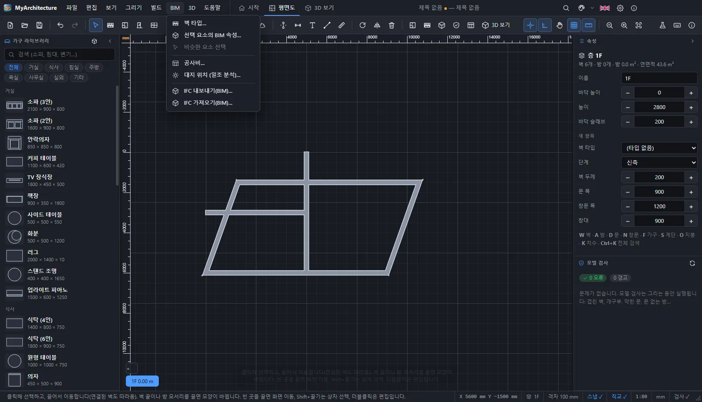
*BIM 메뉴*

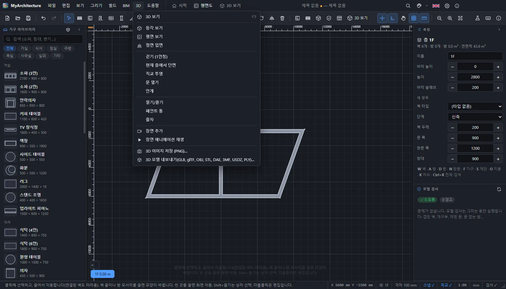
*3D 메뉴*

### 2.3 도구 모음

마우스를 올리면 이름과 단축키가 툴팁으로 나옵니다. 켜진 도구·옵션은 강조됩니다.

- **언제나**: 새 프로젝트 · 열기… · 저장 | **되돌리기 · 다시 실행** | … | (오른쪽 끝) 따라 하는 튜토리얼 · 단축키 · MyArchitecture 정보
- **되돌리기/다시 실행 단추**의 툴팁은 되돌릴 작업 이름까지 알려 줍니다(예: “되돌리기: 벽 추가 (Ctrl+Z)”). 되돌릴 것이 없으면 흐려집니다.
- **평면도 탭**: 선택 · 벽 · 방 · 문 · 창문 · 기둥 · 계단 · 가구 · 지붕 | 매스 상자 · 매스 원기둥 · 매스 다각형 | 그리드 선 · 치수 · 텍스트 · 선 · 측정 | 90° 회전 · 좌우 대칭 · 삭제 | 벽에서 방 감지 · 벽 타입… · 선택 요소의 BIM 속성… · 모델 검사 · 집계와 수량… · **3D 보기** | (오른쪽) 스냅 · 직교 · 이동(손) · 격자 · 눈금자 | 축소 · 확대 · 화면에 맞추기
- **3D 탭**: 5.1절 참고.
- **시작 탭**: 1.4절 참고.

도구 모음 단추도 **절대 숨겨지지 않습니다**. 창의 최소 폭이 지금까지 본 가장 넓은 도구 모음에 맞춰지고, 화면 자체가 좁으면 글자 단추가 아이콘으로 줄어들며(툴팁은 그대로), 그래도 넘치면 두 줄로 나뉩니다.

### 2.4 패널

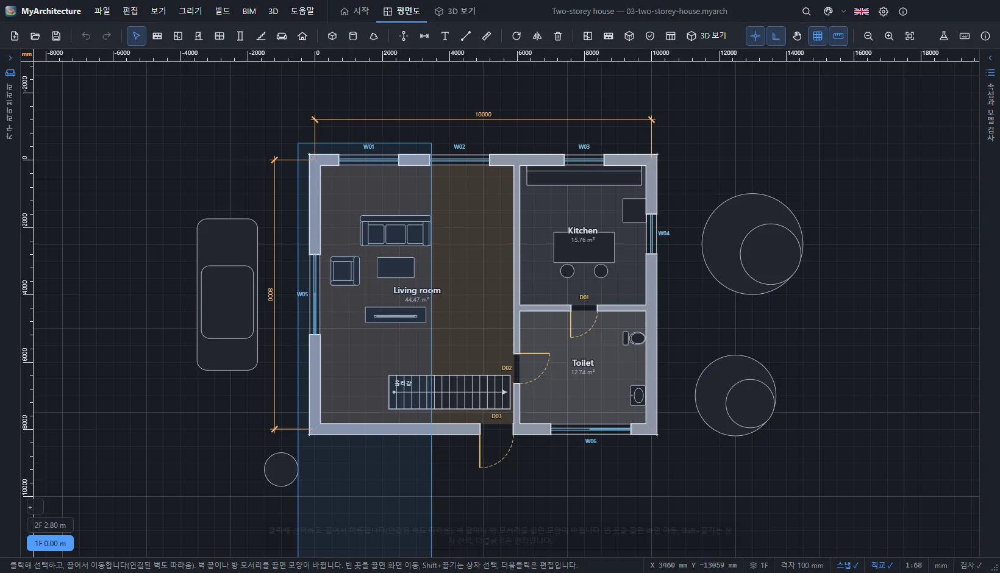
*패널 접기(Ctrl+1 / Ctrl+2): 접힌 패널은 아이콘과 제목으로 남습니다*

- **왼쪽 패널**(<kbd>Ctrl</kbd>+<kbd>1</kbd>, 보기 → 라이브러리 패널 표시)과 **오른쪽 패널**(<kbd>Ctrl</kbd>+<kbd>2</kbd>, 보기 → 속성 패널 표시)은 패널 제목의 **<** / **>** 단추(패널 숨기기)로도 접습니다.
- 접힌 패널은 사라지지 않고 **아이콘과 세로 제목이 있는 좁은 띠**로 남습니다(“가구 라이브러리”, “3D 보기 옵션”, “속성과 모델 검사”, “속성”). 띠를 누르면 다시 펼쳐집니다. 오른쪽 띠에는 모델 검사 오류·경고 개수 배지가 붙습니다.
- 패널과 도면 사이의 경계선을 끌면 폭이 200 ~ 520 px 사이에서 바뀌고, 다음 실행 때도 기억됩니다.
- 시작 탭에서는 양쪽 패널이 없습니다.

오른쪽 패널(속성)의 숫자는 모두 **스테퍼**입니다: 왼쪽 **−**, 오른쪽 **+**, 가운데 값은 직접 입력하고 <kbd>Enter</kbd>. 단추를 누르고 있으면 반복되고, 값 칸에서 방향키로도 한 단계씩 바뀝니다. 오른쪽 패널에서 바꾼 값은 하나하나가 되돌리기 한 단계입니다.

### 2.5 상태 표시줄과 창 크기

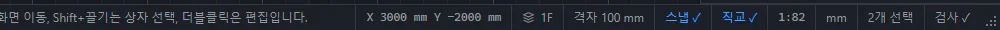
*상태 표시줄: 좌표·층·격자·스냅·직교·축척·단위·선택·검사, 오른쪽 끝은 창 크기 조절 표시*

맨 왼쪽 넓은 칸은 지금 도구의 힌트(없으면 “준비”)입니다. 그 뒤 칸들은 보고 있는 페이지에 따라 다르고, 단추처럼 생긴 칸은 눌러서 바꿀 수 있습니다.

| 페이지 | 칸 (왼쪽 → 오른쪽) |
| --- | --- |
| **평면도** | 커서 좌표 `X … Y …`(지금 단위, Y 는 위쪽이 +) · **층**(누르면 층 속성…) · **격자 100 mm**(누르면 10/25/50/100/250/500/1000 mm 중 선택) · **스냅 ✓/—**(누르면 전환, <kbd>F9</kbd>) · **직교 ✓/—**(누르면 전환, <kbd>F8</kbd>) · 화면 축척 `1:…`(96 dpi 기준 근사) · **단위**(누르면 mm → cm → m → ft → mm 순환) · `n개 선택`(고른 것이 있을 때) · **검사** |
| **3D 보기** | **탐색 방식**(궤도 회전/이동/걷기 — 누르면 걷기 켜기·끄기) · **원근 투영/평행 투영**(누르면 전환) · **단면 ✓/—**(누르면 전환) · 표현 스타일 이름 · `삼각형 n개` · `n개 선택` · **검사** |
| **시작** | `최근 파일 n개` · `테마: …` · `벽 n개`(또는 “빈 프로젝트”) · **검사** |

**검사** 칸은 `검사 ✓`(문제 없음), `검사 ⚠ n`(경고), `검사 ✖ n`(오류)으로 보이며 누르면 모델 검사(<kbd>F5</kbd>)를 실행합니다(평면도로 이동).

**창 크기 조절 손잡이**: 상태 표시줄 오른쪽 아래 모서리의 점 무늬를 끌면 창 크기가 바뀝니다(툴팁 “끌어서 창 크기 변경”). 데스크톱판에서만 보이며, 창이 최대화·전체 화면일 때는 숨습니다.

### 2.6 명령 팔레트와 찾기

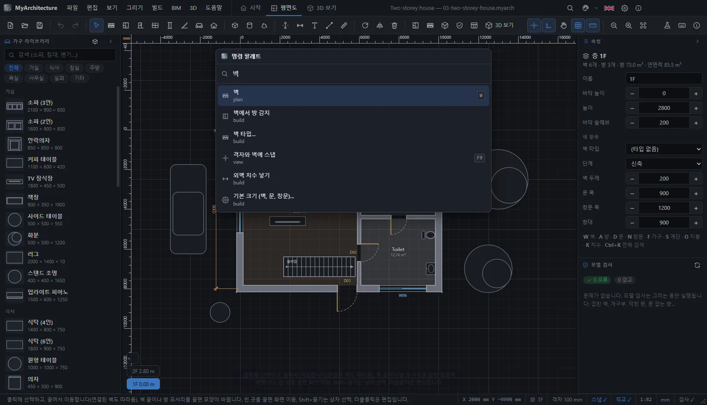
*명령 팔레트(Ctrl+K): 모든 명령·방·층·가구를 검색합니다*

- **명령 팔레트**(<kbd>Ctrl</kbd>+<kbd>K</kbd> 또는 제목 표시줄 돋보기): 모든 명령, 프로젝트의 모든 방(누르면 평면에서 그 방을 선택하고 가운데로), 모든 층(누르면 그 층으로)을 한 목록에서 찾습니다. 입력하면 바로 좁혀지고, <kbd>↑</kbd>/<kbd>↓</kbd> 와 <kbd>Enter</kbd> 로 실행, <kbd>Esc</kbd> 로 닫습니다. 보기 메뉴 끝의 테마·언어 명령(테마…, 어두운 테마, 밝은 테마, 시스템 테마, 한국어, English)도 여기서 실행할 수 있습니다.
- **찾기…**(<kbd>Ctrl</kbd>+<kbd>F</kbd>, 편집 메뉴): 방, 문·창문(태그로), 가구, 텍스트, 층을 찾아 그 자리로 갑니다.

### 2.7 확대·축소와 화면 이동 (평면도)

| 동작 | 방법 |
| --- | --- |
| 확대/축소 | 마우스 휠(커서 기준), 트랙패드 핀치(<kbd>Ctrl</kbd>+휠), <kbd>Ctrl</kbd>+<kbd>=</kbd> / <kbd>Ctrl</kbd>+<kbd>-</kbd>, 도구 모음 확대·축소. 한 칸 배율은 설정 → 단위와 격자 → **휠 확대/축소 속도**(× 0.5 ~ × 3) |
| 전체 보기 | <kbd>Home</kbd>, 도구 모음 **화면에 맞추기**, 빈 곳 오른쪽 클릭 메뉴 |
| 화면 이동 | **빈 곳을 왼쪽 버튼으로 끌기**(기본), 가운데 버튼 끌기, 오른쪽 버튼 끌기, <kbd>Space</kbd>+끌기, <kbd>Shift</kbd>+휠(가로 이동), 두 손가락 터치 |
| 손(이동) 도구 | 보기 → **이동 (손)** 또는 도구 모음 손 단추. 켜져 있으면 요소 위에서도 왼쪽 끌기가 화면 이동입니다. <kbd>Esc</kbd> 나 단추로 끕니다 |

가운데 끌기·오른쪽 끌기·<kbd>Space</kbd>+끌기는 어떤 도구를 쓰는 중에도 항상 화면 이동입니다. 오른쪽 버튼을 **움직이지 않고** 떼면 오른쪽 클릭 메뉴가 열립니다.

설정 → 단위와 격자 → **빈 캔버스에서 왼쪽 끌기**를 **상자 선택**으로 바꾸면 빈 곳 끌기가 상자 선택이 되고, 이동은 가운데·오른쪽·<kbd>Space</kbd> 끌기로 합니다.

### 2.8 격자와 눈금자

- **격자**: 기본은 **선 (5 × 5)** — 가는 선과 5칸마다 또렷한 선. 격자 간격(스냅 간격)은 설정 → 단위와 격자 → **격자**, 또는 상태 표시줄의 격자 칸에서 10 / 25 / 50 / 100 / 250 / 500 / 1000 mm 로 바꿉니다(기본 100 mm). **격자 모양**은 선(5 × 5)/점. 도구 모음·보기 메뉴의 **격자 표시**로 켜고 끕니다.
- **눈금자**: 도면 위·왼쪽 가장자리에 지금 단위로 표시되고, 커서 위치가 주황색으로 표시됩니다. **눈금자 표시**로 켜고 끕니다.

### 2.9 선택

| 동작 | 결과 |
| --- | --- |
| 클릭 | 하나 선택. 그룹에 속한 요소는 그룹 전체가 선택됨 |
| <kbd>Alt</kbd>+클릭 | 그룹 안에서 하나만 선택 |
| <kbd>Shift</kbd>+클릭 또는 <kbd>Ctrl</kbd>+클릭 | 선택에 넣기/빼기 |
| <kbd>Shift</kbd>+끌기 또는 <kbd>Ctrl</kbd>+끌기 | **상자 선택**(4.1절) |
| 빈 곳 클릭 | 선택 해제(<kbd>Esc</kbd> 도 같음) |
| <kbd>Ctrl</kbd>+<kbd>A</kbd> | 지금 층의 모두 선택 |
| 더블클릭 | 속성 창(4.10절) |

마우스를 요소 위에 올리면 강조되고, 커서가 이동(✥) 모양이 됩니다. 손잡이(벽 끝, 방·지붕 꼭짓점, 치수·그리드 끝) 위에서는 십자 커서가 됩니다.

**평면·3D 연동 선택**: 평면에서 고르면 3D 에서 같은 요소가 파랗게 강조되고, 3D 에서 클릭하면 평면에서 선택됩니다. 설정 → 평면도 → **평면·3D 연동 선택**(“평면에서 선택하면 3D에서 강조되고, 그 반대도 마찬가지”)으로 켜고 끕니다.

### 2.10 되돌리기와 다시 실행

- **되돌리기** <kbd>Ctrl</kbd>+<kbd>Z</kbd>, **다시 실행** <kbd>Ctrl</kbd>+<kbd>Y</kbd> 또는 <kbd>Ctrl</kbd>+<kbd>Shift</kbd>+<kbd>Z</kbd>. 실행하면 “되돌리기: 벽 추가”처럼 잠깐 알림이 뜹니다.
- 같은 명령이 **도구 모음**(툴팁에 단계 이름), **편집 메뉴**, 그리고 **평면 도면·층 탭·3D 화면의 오른쪽 클릭 메뉴 맨 위**에 있습니다.
- 한 번 끌기(이동, 모양 바꾸기, 밀기/끌기)는 되돌리기 한 단계입니다. 최대 200 단계까지 기억합니다.
- **편집 → 되돌리기 기록…**: 지난 작업 목록(맨 위가 최신)에서 한 항목을 누르면 그 작업 **이전까지** 한 번에 되돌립니다.

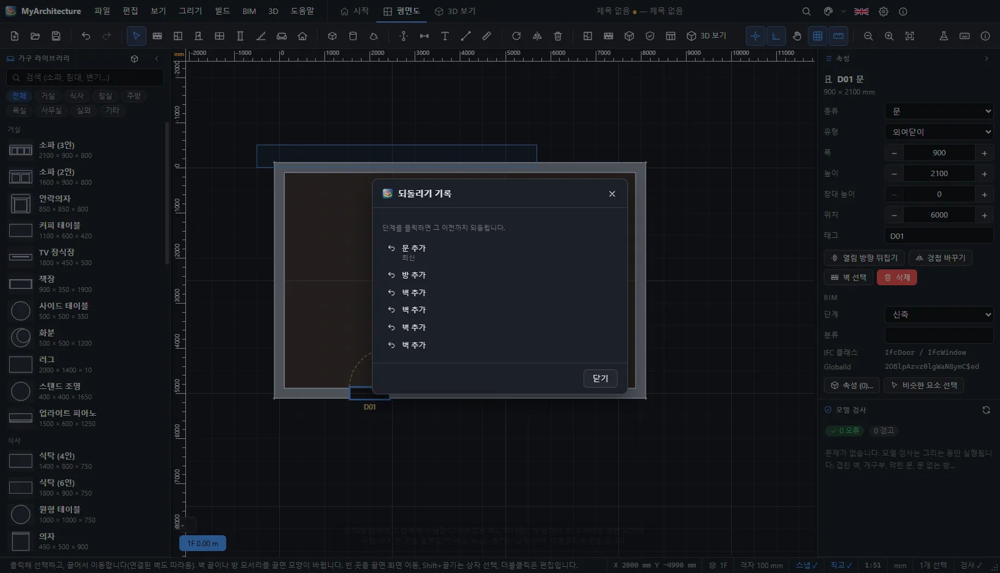
*되돌리기 기록: 지난 작업 목록에서 원하는 시점으로 돌아갑니다*

- 입력 칸에 글자를 쓰는 중에는 <kbd>Ctrl</kbd>+<kbd>Z</kbd> 가 그 칸의 글자 되돌리기로 동작합니다.

---

## 3. 평면 그리기

평면도 탭(<kbd>F2</kbd>)에서 그립니다. 도구 키를 누르거나 도구 모음·그리기 메뉴에서 고르면 도구가 바뀌고, 상태 표시줄(그리고 도면 아래쪽)에 그 도구의 힌트가 나옵니다. <kbd>Esc</kbd> 는 그리던 것을 끝내고, 한 번 더 누르면 **선택** 도구로 돌아갑니다.

### 3.1 도구 목록

| 도구 | 키 | 하는 일 |
| --- | --- | --- |
| 선택 (Select) | <kbd>Esc</kbd> | 클릭 선택, 끌어서 이동, 손잡이로 모양 바꾸기 |
| 벽 (Wall) | <kbd>W</kbd> | 모서리를 차례로 클릭해 벽 |
| 방 (Room) | <kbd>A</kbd> | 벽 안쪽 클릭 → 방과 면적 |
| 문 (Door) | <kbd>D</kbd> | 벽 위 클릭 |
| 창문 (Window) | <kbd>N</kbd> | 벽 위 클릭 |
| 기둥 (Column) | <kbd>C</kbd> | 클릭해 놓기 |
| 계단 (Stair) | <kbd>S</kbd> | 아래쪽, 위쪽 두 점 |
| 가구 (Furniture) | <kbd>F</kbd> | 가구 검색 창 → 클릭해 놓기 |
| 지붕 (Roof) | <kbd>O</kbd> | 건물 안 클릭 → 외곽선 지붕 |
| 매스 상자 (Mass box) | <kbd>B</kbd> | 마주 보는 두 모서리 |
| 매스 원기둥 (Mass cylinder) | <kbd>U</kbd> | 중심, 원 위의 점 |
| 매스 다각형 (Mass shape) | — | 모서리를 차례로 클릭 |
| 그리드 선 (Grid line) | <kbd>G</kbd> | 구조 그리드 선의 두 끝 |
| 치수 (Dimension) | <kbd>K</kbd> | 두 점 → 간격 → 클릭 |
| 텍스트 (Text) | <kbd>T</kbd> | 클릭하고 입력 |
| 선 (Line) | <kbd>L</kbd> | CAD 레이어에 작도선 |
| 측정 (Measure) | <kbd>M</kbd> | 두 점 사이 거리(도면에 남지 않음) |

### 3.2 스냅과 직교

그리는 동안 커서 표시가 무엇에 붙었는지 알려 줍니다.

| 표시 | 뜻 |
| --- | --- |
| 주황 **네모** | 벽 끝점, 방·CAD 선의 꼭짓점, 기둥 중심 |
| 초록 **삼각형** | 벽 중심선 위(벽을 따라 격자 간격으로) |
| **십자** | 격자점 또는 직교 방향 위의 점 |
| 주황 **점선** | 다른 벽 끝과 가로·세로로 줄이 맞음(정렬 안내선) |

- **스냅**(<kbd>F9</kbd>, 보기 → 격자와 벽에 스냅, 상태 표시줄): 끝점·꼭짓점 → 벽 → 격자 순서로 붙습니다. 끄면 커서 위치 그대로입니다.
- **직교**(<kbd>F8</kbd>, 보기 → 직교 그리기 (45° 단위)): 벽·선·방·지붕·계단을 그릴 때 방향이 45° 단위로, 길이가 격자 단위로 맞춰집니다. 그 방향으로 가다 다른 벽의 중심선과 만나면 정확히 그 위에서 끝납니다.
- <kbd>Shift</kbd> 를 누른 채 그리면 그 순간만 **자유 각도**입니다.

### 3.3 벽

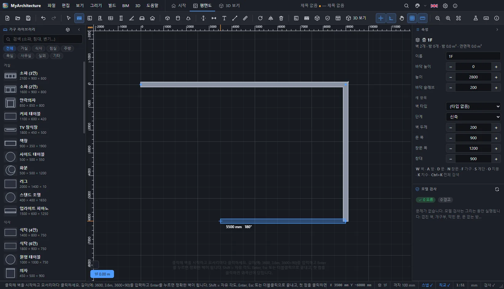
*벽 그리기(W): 클릭할 때마다 벽이 이어지고 길이·각도가 표시됩니다*

1. <kbd>W</kbd> 를 누르고 시작점을 클릭합니다.
2. 모서리마다 클릭합니다. 커서 옆에 지금 벽의 **길이와 각도**(화면 기준 반시계 방향, 0° = 오른쪽)가 표시되고, 두께만큼의 파란 미리 보기가 따라옵니다.
3. 끝내기: <kbd>Enter</kbd>, <kbd>Esc</kbd>, 더블클릭, 같은 점을 다시 클릭, 또는 **첫 점을 클릭**(외곽선이 닫히며 끝남). 오른쪽 클릭도 그리기를 끝냅니다.
4. <kbd>Backspace</kbd> 는 그리는 중에 **마지막 모서리(벽)를 되돌립니다**.

다 그리면 방금 그린 벽들이 선택되고 “벽 n개를 그렸습니다. A를 누르고 그 안쪽을 클릭하면 방이 만들어집니다.”라고 안내합니다.

새 벽의 두께·재료·벽 타입·단계는 다음을 따릅니다.

- 오른쪽 패널(아무것도 고르지 않았을 때)의 **새 항목** 칸: 벽 타입, 단계, 벽 두께(그리고 문 폭, 창문 폭, 창대).
- 빌드 → **기본 크기 (벽, 문, 창문)…** 의 벽 두께·벽 재료.
- 벽 타입을 고르면 두께는 그 타입 레이어 두께의 합입니다.
- 새 벽의 높이는 따로 정하지 않으면 **층 높이**를 따릅니다.

#### 길이 입력

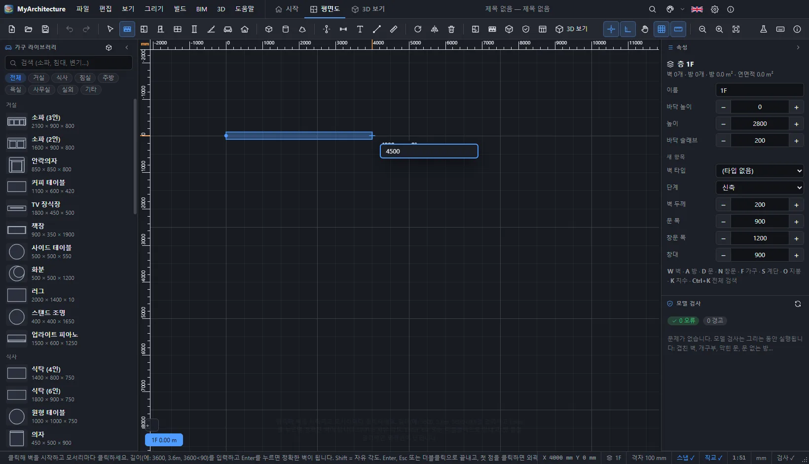
*길이 입력: 그리는 중에 숫자를 치면 정확한 길이(예: 4500, 3.6m, 3600<90)로 벽이 놓입니다*

벽(또는 선)을 그리는 중에 숫자나 `.` 을 치면 커서 옆에 **길이 입력 칸**(“길이(mm, 3.6m, 3600<90)”)이 열립니다. 입력하고 <kbd>Enter</kbd> 를 누르면 지금 커서 방향으로 정확한 길이의 벽이 놓이고 그리기는 계속됩니다.

| 입력 예 | 뜻 |
| --- | --- |
| `3600` | 3600 mm (단위가 없으면 mm) |
| `3.6m` | 3.6 m = 3600 mm |
| `360cm` | 360 cm |
| `3600mm` | 3600 mm |
| `120in`, `120"` | 120 인치 |
| `12'6"`, `12'6`, `12'` | 12 피트 6 인치 / 12 피트 |
| `3600<90` | 길이 3600, **각도 90°**(화면 기준 반시계 방향: 0° 오른쪽, 90° 위, 180° 왼쪽, 270° 아래) |
| `3,6m` | 쉼표도 소수점으로 읽습니다 |

각도를 주지 않으면 지금 커서가 있는 방향(직교가 켜져 있으면 45° 단위로 맞춘 방향)으로 놓입니다.

#### 벽 이음

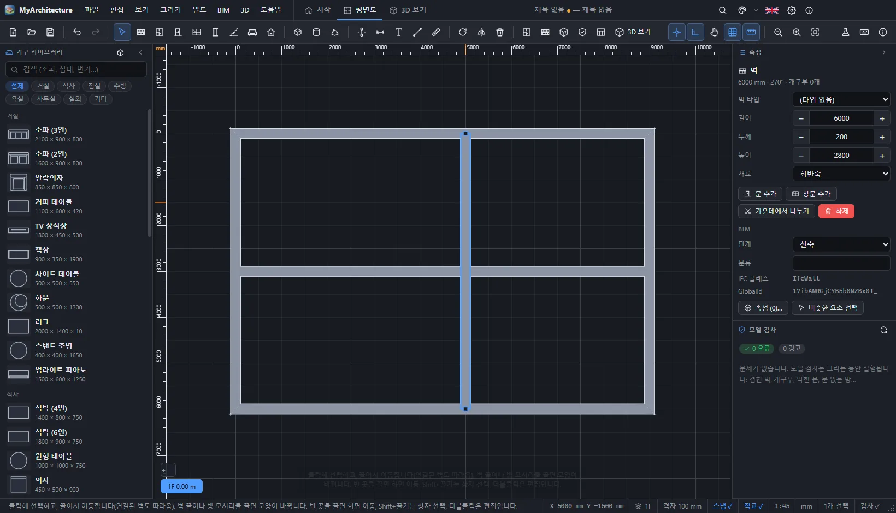
*벽 이음: 모서리는 자동으로 맞물리고, T 자·십자 이음도 깨끗하게 그려집니다*

벽 끝이 다른 벽의 끝이나 중심선에 닿으면 L 자, T 자, 십자 이음이 자동으로 깔끔하게 그려집니다(벽을 잘라 붙일 필요가 없습니다). 칸막이 벽은 끝을 외벽 위에 놓기만 하면 됩니다.

#### 벽 고치기

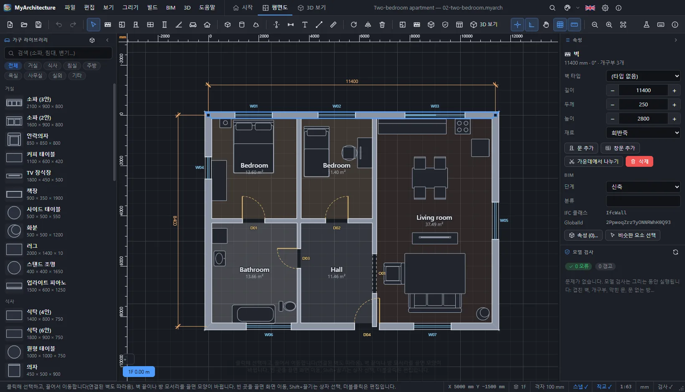
*벽을 고르면 오른쪽에서 두께·높이·벽 타입·재료·단계 등을 바로 고칩니다*

벽을 선택하면 오른쪽 패널 제목에 길이 · 각도 · 개구부 수가 보이고, 다음 칸이 있습니다.

| 칸 | 설명 |
| --- | --- |
| 벽 타입 | (타입 없음) 또는 벽 타입 목록. 고르면 두께가 레이어 합으로 바뀜 |
| 길이 | 바꾸면 끝점이 움직이고 그 끝에 이어진 벽도 따라감 |
| 두께 | 직접 바꾸면 벽 타입이 풀림 |
| 높이 | 층 높이와 같으면 층 높이를 따름(층 높이를 바꾸면 함께 바뀜) |
| 재료 | 벽 재료(12.3절) |

단추: **문 추가**, **창문 추가**(누른 뒤 벽을 클릭), **가운데에서 나누기**, **삭제**. 그 아래 BIM 칸(6장).

- 벽 **끝 손잡이**(작은 네모)를 끌면 그 끝만 움직입니다. 벽 **몸통**을 끌면 벽 전체가 움직이고 이어진 벽들이 늘어나며 따라옵니다(<kbd>Alt</kbd>+끌기는 이어진 벽을 늘리지 않고 이동).
- 벽 위 오른쪽 클릭 메뉴: **여기에 문 추가**, **여기에 창문 추가**, **여기서 벽 나누기**, **일직선 벽 합치기**(지금 층에서 한 줄로 이어진 벽들을 하나로).
- 더블클릭(또는 <kbd>E</kbd>)하면 **벽 속성** 창: 길이, 두께, 높이(+ **층 높이와 같게**), 재료.

### 3.4 방

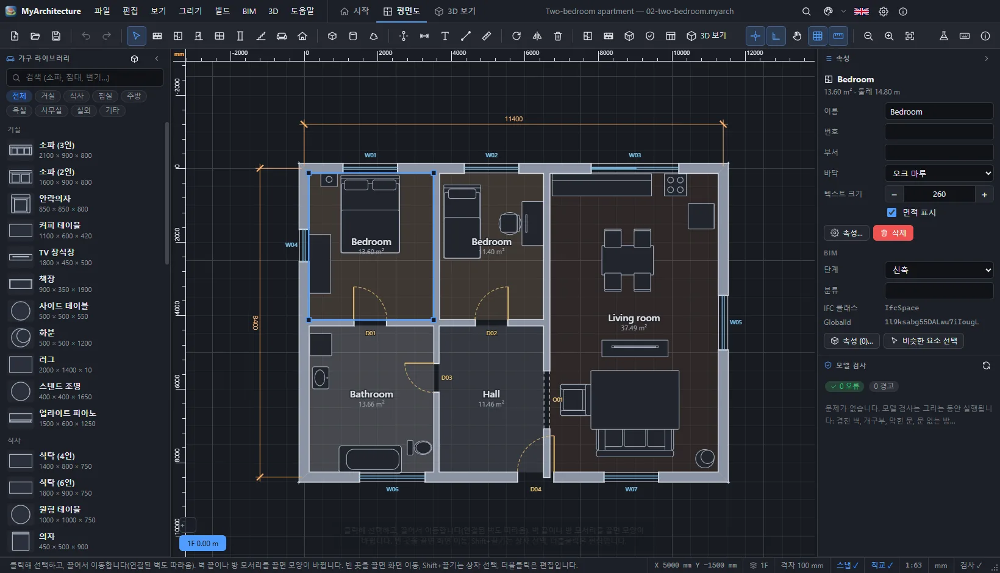
*방(A): 벽으로 둘러싸인 곳을 클릭하면 방이 생기고 이름과 면적이 붙습니다*

- <kbd>A</kbd> 를 누르고 **닫힌 벽 안쪽을 클릭**하면 벽 안쪽 면을 따라 방이 생깁니다. 이름은 크기에 맞게 자동으로 붙고(예: 거실, 침실, 욕실 …), 면적이 알림으로 나옵니다(“방 "…"을(를) 추가했습니다: … m². 두 번 클릭하면 이름을 바꿀 수 있습니다.”).
- **<kbd>Shift</kbd>+클릭**으로 시작하면 모서리를 직접 찍어 그립니다. 첫 점을 다시 클릭하거나 <kbd>Enter</kbd> 로 끝냅니다. 그리는 동안 면적이 커서 옆에 보입니다.
- **빌드 → 벽에서 방 감지**(빈 곳 오른쪽 클릭 → **방 감지**): 지금 층에서 닫힌 공간 중 아직 방이 없는 곳을 모두 방으로 만듭니다.
- 바닥 재료는 기본 **오크 마루**(기본 크기 창의 바닥 재료로 바꿈).

방을 선택하면 오른쪽 패널에 면적·둘레가 보이고, **이름**, **번호**(실 번호), **부서**(용도), **바닥**(재료), **텍스트 크기**, **면적 표시** 칸이 있습니다. 꼭짓점 손잡이를 끌면 모양이 바뀝니다(방 하나만 골랐을 때). 더블클릭하면 **방 속성** 창(이름은 거실·침실·주방·식당·욕실·변기·홀·현관·서재·다용도실·창고·드레스룸·발코니·차고·사무실·회의실·복도·계단 목록에서 고르거나 직접 입력).

### 3.5 문과 창문

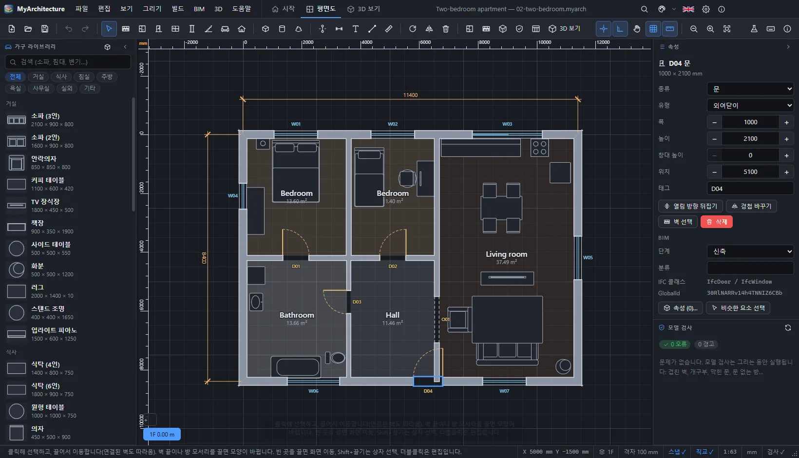
*문(D)·창(N): 벽 위를 클릭하면 들어가고, X 로 여는 방향, H 로 경첩을 바꿉니다*

- <kbd>D</kbd>(문) 또는 <kbd>N</kbd>(창문)을 누르고 벽 위로 커서를 옮기면 미리 보기와 폭이 나옵니다. 클릭하면 들어갑니다.
- 위치는 벽을 따라 격자의 반 칸 단위로 맞춰지고, 벽 끝을 넘지 않도록 조정됩니다.
- 문은 **커서가 있는 쪽으로** 열리고, 경첩은 클릭한 곳에 가까운 쪽 끝에 붙습니다.
- 벽이 너무 짧으면 “이 벽은 너무 짧아 넣을 수 없습니다.”, 이미 문·창이 있으면 “그 자리에 이미 문이나 창문이 있습니다.”
- 새 문·창의 크기와 종류: 기본 크기 창(문 폭 900, 문 높이 2100, 창문 폭 1200, 창문 높이 1200, 창대 900 이 처음 값), 오른쪽 패널의 새 항목 칸.

선택한 문·창:

| 키·단추 | 하는 일 |
| --- | --- |
| <kbd>X</kbd> / **열림 방향 뒤집기** | 문이 열리는 쪽(벽의 어느 면) 바꾸기 |
| <kbd>H</kbd> / **경첩 바꾸기** | 경첩을 반대쪽 끝으로 |
| **벽 선택** | 이 문·창이 달린 벽 선택 |

오른쪽 패널 칸: **종류**(문 / 창문 / 개구부), **유형**(문: 외여닫이·양개·미닫이·차고, 창문: 여닫이창·고정·미닫이), **폭**, **높이**, **창대 높이**, **위치**(벽 시작점에서 중심까지 거리), **태그**. 태그는 비워 두면 문 `D01, D02…`, 창 `W01…`, 개구부 `O01…` 이 층·위치 순서로 자동으로 붙습니다. 더블클릭하면 **문 속성 / 창문 속성** 창(위 항목 + 여닫는 쪽 “벽 왼쪽/벽 오른쪽”, 경첩 “벽 시작점에서/벽 끝에서”).

> 문·창은 벽에 붙어 있으므로 벽을 옮기거나 늘이면 함께 움직입니다. 벽을 지우면 그 벽의 문·창도 지워집니다.

### 3.6 가구

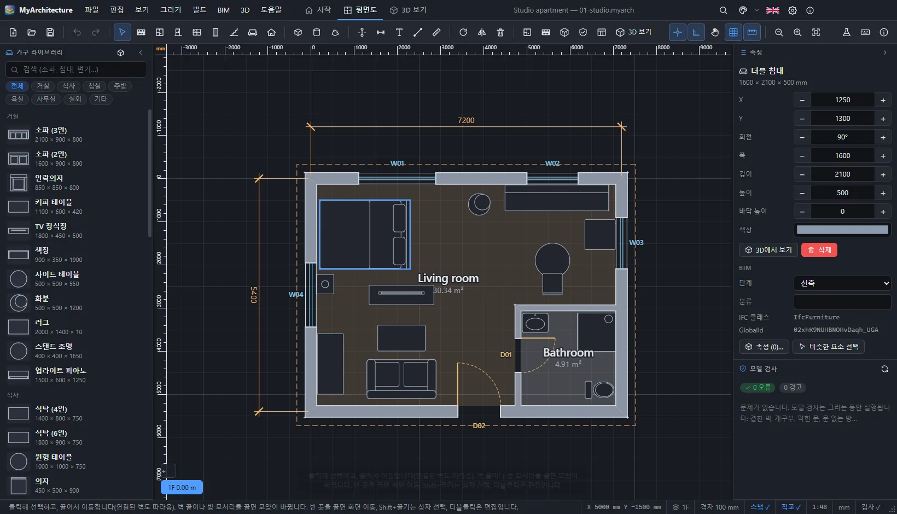
*가구 라이브러리: 분류·검색 후 끌어다 놓거나 눌러서 배치합니다*

**가구 라이브러리**(왼쪽 패널):

- 위쪽 검색 칸(“검색 (소파, 침대, 변기…)”)과 분류 칩: 전체 · 거실 · 식사 · 침실 · 주방 · 욕실 · 사무실 · 실외 · 기타. 검색 칸에서 <kbd>Enter</kbd> 를 누르면 첫 항목을 고릅니다.
- 검색어도 분류도 없을 때는 맨 위에 **최근 사용** 가구(최대 10개)가 나옵니다.
- 항목마다 평면 모양 그림과 `폭 × 깊이 × 높이`.
- 항목을 **누른 뒤 도면을 클릭**하거나, 항목을 **도면으로 끌어다 놓으면** 배치됩니다.
- **가져온 3D 모델**(7.4절)도 목록 아래에 나와 같은 방법으로 놓습니다. 패널 제목의 3D 모델 단추는 **3D 모델 가져오기(OBJ, FBX, GLB, STL…)…**.

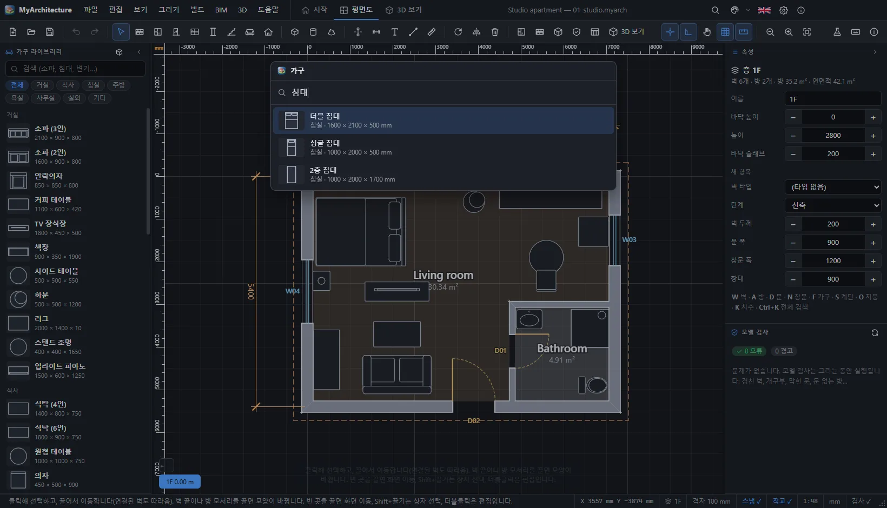
*F 키: 가구를 이름으로 찾아 바로 배치합니다*

**<kbd>F</kbd>(가구 검색)**: “가구 — 이름을 입력하세요(소파, 침대, 싱크대, 자동차 …)” 창에서 이름을 치고 <kbd>Enter</kbd> → 도면을 클릭. 최근에 쓴 가구가 위쪽에 옵니다.

놓는 중에는:

| 키 | 하는 일 |
| --- | --- |
| <kbd>R</kbd> | 미리 보기를 90° 회전 |
| <kbd>Shift</kbd>+<kbd>R</kbd> | 15° 회전 |
| <kbd>Shift</kbd>+클릭 | 놓고 나서도 같은 가구를 계속 놓기 |
| <kbd>Esc</kbd> | 놓기 멈춤 |

가구는 격자의 **반 칸** 단위로 놓이고 움직입니다(끌 때 <kbd>Shift</kbd> 를 누르면 가로·세로로만). 선택하면 오른쪽 패널에 **X, Y, 회전, 폭, 깊이, 높이, 바닥 높이(바닥에서 띄운 높이), 색상** 칸과 **3D에서 보기** 단추가 있습니다. 더블클릭하면 이름·종류(다른 가구로 바꾸기)까지 바꿀 수 있습니다. 전체 목록은 12.3절.

### 3.7 계단

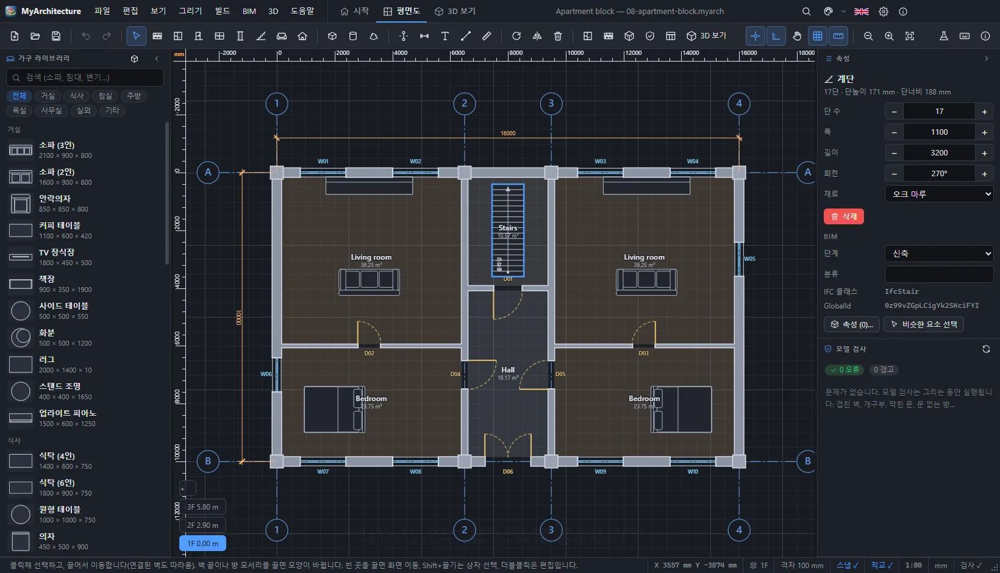
*계단(S)과 기둥(C): 계단은 두 점으로, 기둥은 한 번 클릭으로 놓습니다*

- <kbd>S</kbd> 를 누르고 계단 **아래쪽**을 클릭, 그다음 **위쪽**을 클릭합니다(직교가 켜져 있으면 45° 단위). 600 mm 보다 짧으면 만들어지지 않습니다.
- 단 수는 층 높이(+ 슬래브)를 약 175 mm 로 나눠 자동으로 정해집니다(최소 3단). 폭은 기본 크기의 계단 폭(처음 1000 mm).
- 선택하면 제목에 “n단 · 단높이 … mm · 단너비 … mm” 가 보이고, **단 수, 폭, 길이, 회전, 재료** 칸이 있습니다. 단높이가 200 mm 를 넘으면 “챌판이 200 mm를 넘으면 가파릅니다. 단을 늘리세요.” 경고가 나옵니다.
- 평면에는 진행 방향 화살표와 “올라감” 글자가 그려지고, 3D 에서는 디딤판으로 만들어집니다.

### 3.8 기둥

- <kbd>C</kbd> 를 누르고 클릭합니다. 벽 끝(모서리)에 잘 붙습니다. 놓기 전에 <kbd>R</kbd> 로 돌릴 수 있습니다.
- 크기는 프로젝트 기본 400 × 400 mm. 선택하면 **모양**(사각형/원형), **폭, 깊이, 회전, 재료**. 높이는 층 높이를 따릅니다.

### 3.9 지붕

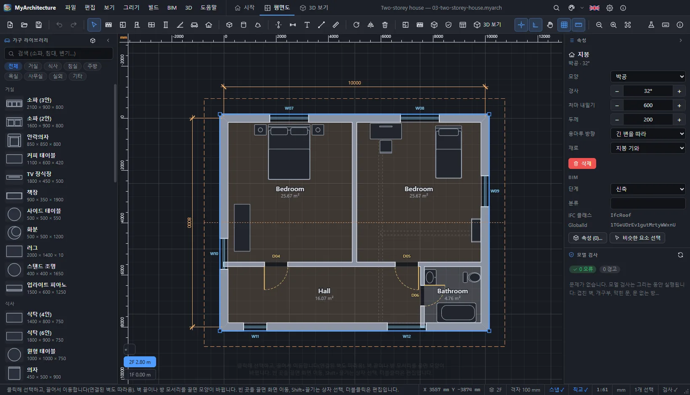
*지붕(O): 맨 위층 위에 박공·모임·외쪽·평지붕을 얹습니다*

지붕을 만드는 세 가지 방법:

1. **빌드 → 맨 위층 지붕**: 맨 위층의 닫힌 외벽 윤곽마다 지붕을 얹습니다(모양은 설정 → 평면도 → **새 지붕**, 기본 박공, 경사 30°, 처마 500). 다시 실행하면 이전에 자동으로 만든 지붕을 바꿔 줍니다. 닫힌 윤곽이 없으면 “맨 위층에 닫힌 벽 윤곽이 없습니다.”
2. <kbd>O</kbd> 를 누르고 **건물 안을 클릭**: 그 층 외벽 윤곽 위에 지붕(처마 400).
3. <kbd>O</kbd> 다음 **<kbd>Shift</kbd>+클릭**으로 지붕 외곽선을 직접 그리기(<kbd>Enter</kbd> 로 마침).

지붕은 그 층 벽 위에 얹힙니다. 평면에서는 점선으로 표시됩니다(설정 → 평면도 → **지붕 (점선)**).

선택하면: **모양**(박공 / 모임 / 외쪽 / 평), **경사**(0 ~ 75°), **처마 내밀기**, **두께**, **용마루 방향**(긴 변을 따라 / 가로질러), **재료**(지붕 기와·슬레이트·금속 지붕·콘크리트). 꼭짓점 손잡이로 모양을 바꿉니다.

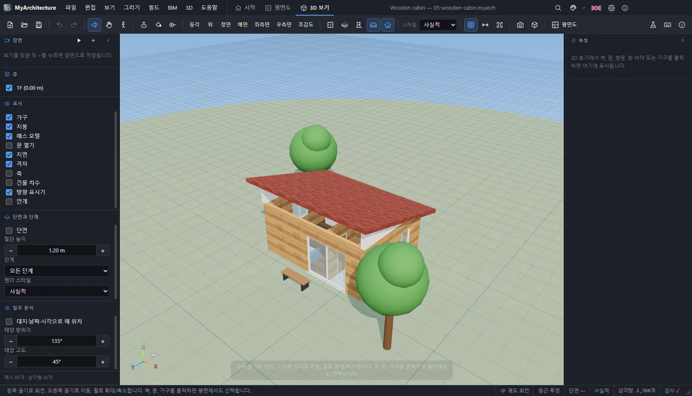
*지붕과 2층이 3D 로 바로 만들어집니다*

### 3.10 층

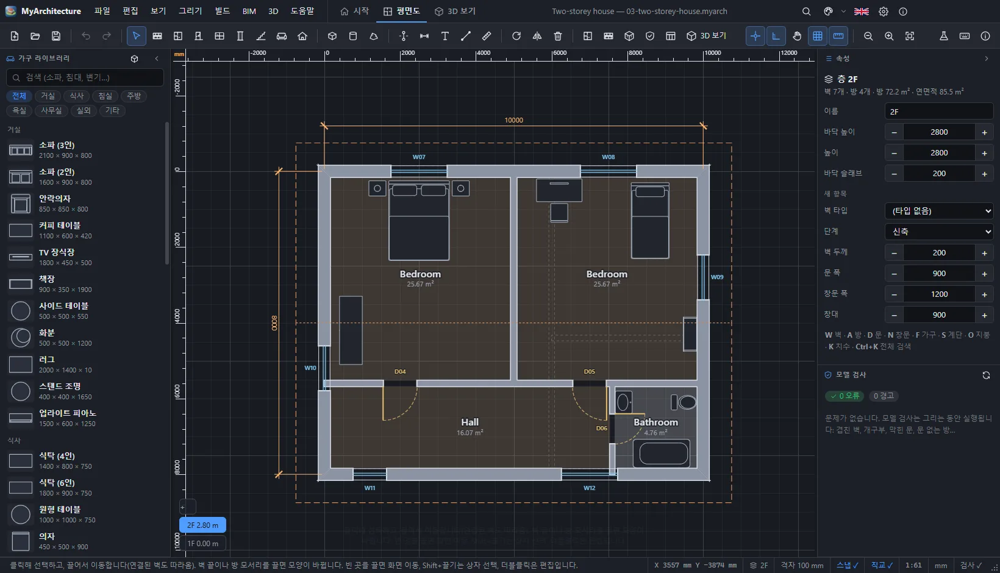
*층 탭: 층을 고르고(+ 로 추가), 아래층은 흐리게 겹쳐 보입니다*

도면 왼쪽 아래에 **층 탭**이 아래층부터 위로 쌓여 있습니다(`1F  0.00 m` 처럼 이름과 바닥 높이).

| 동작 | 결과 |
| --- | --- |
| 탭 클릭 | 그 층 편집. 그리기는 지금 층에만 됩니다 |
| 탭 더블클릭 | 이름 바꾸기 |
| **+** 탭 | 맨 위에 층 추가 — 맨 위층의 **벽과 창문**을 복사(문은 복사하지 않음) |
| 탭 오른쪽 클릭 | 되돌리기 · 다시 실행 / 층 이름 바꾸기… · 층 속성… · 층 복제(벽, 문, 창문) / 층 삭제 |

- **빌드 → 맨 위에 층 추가**는 + 탭과 같습니다. 새 층 이름은 `2F`, `3F`…, 바닥 높이는 아래층 높이 + 층고.
- **층 복제(벽, 문, 창문)** 는 그 층의 벽·문·창·방을 복사해 맨 위에 새 층을 만듭니다.
- **층 삭제**는 그 층과 그 위의 모든 요소를 지웁니다(확인을 묻고, 층이 하나뿐이면 지울 수 없음).
- **층 속성…**(빌드 메뉴, 상태 표시줄 층 칸): 이름, 바닥 높이, 높이(층고, 최소 1000), 바닥 슬래브. “높이를 따로 지정하지 않은 벽은 층 높이를 사용합니다. 층을 위아래로 옮기면 그 층의 모든 요소가 3D에서 함께 움직입니다.” 아무것도 선택하지 않았을 때 오른쪽 패널에도 같은 칸이 있고 층 요약(벽·방 수, 방 면적, 연면적)이 나옵니다.
- 아래층은 흐리게 겹쳐 보입니다(보기 → **아래층 표시**).
- 구조 그리드 선은 모든 층에 공통입니다.

### 3.11 치수, 텍스트, 선, 측정

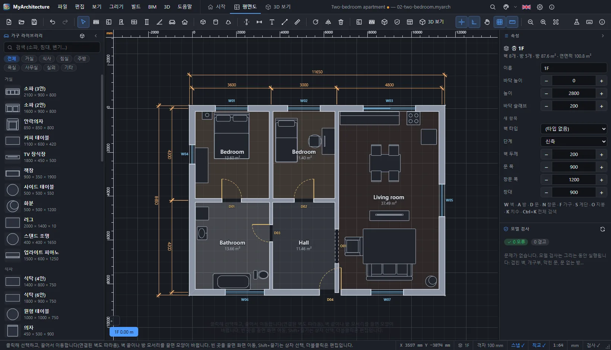
*치수(K)·글자(T)·선(L)·줄자(M): 자동 치수는 바깥 벽을 한 번에 잽니다*

- **치수 <kbd>K</kbd>**: 두 점을 클릭하고, 마우스를 움직여 치수선 위치(간격, 50 mm 단위)를 정한 뒤 한 번 더 클릭. 점은 벽 끝·벽에 붙습니다. 선택하면 **간격**과 **텍스트 재정의**(숫자 대신 쓸 글자), 끝 손잡이로 점 이동.
- **빌드 → 외벽 치수 넣기**(빈 곳 오른쪽 클릭 → **자동 치수**): 지금 층 건물의 전체 가로·세로 치수와 벽 사이 치수 줄을 바깥에 넣습니다. 다시 실행하면 이전 자동 치수를 바꿔 줍니다.
- **텍스트 <kbd>T</kbd>**: 클릭한 곳에 입력 칸이 열립니다. <kbd>Enter</kbd> 로 확정. 선택하면 글자(여러 줄), **크기, 회전, 정렬**(왼쪽/중앙/오른쪽).
- **선 <kbd>L</kbd>**: CAD 레이어에 작도선(폴리선). 점을 차례로 클릭, <kbd>Enter</kbd>·더블클릭으로 끝, 첫 점을 클릭하면 닫힘. 왼쪽 CAD 레이어 목록에서 누른 레이어(강조된 줄)에 그려지고 DXF 로 내보내집니다. 선택하면 **레이어, 색상**.
- **측정 <kbd>M</kbd>**: 두 점을 클릭하면 “거리: … (… m)” 알림. 도면에는 남지 않습니다. 세 번째 클릭은 새 측정, <kbd>Esc</kbd> 로 지움.

보기 → **치수 표시**로 치수를 숨길 수 있습니다(인쇄 옵션은 따로).

### 3.12 구조 그리드

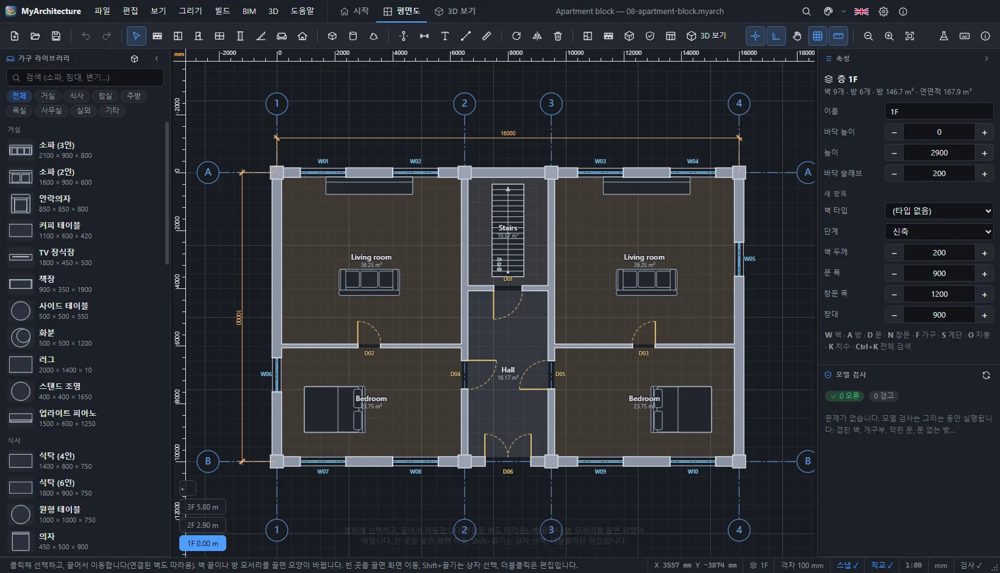
*구조 그리드(G): A, B, C … / 1, 2, 3 … 그리드 선과 버블*

- <kbd>G</kbd>(빈 곳 오른쪽 클릭 → **그리드 선**)를 누르고 그리드 선의 두 끝을 클릭합니다(500 mm 이상).
- 세로선은 `1, 2, 3 …`, 가로선은 `A, B, C …`(26개 넘으면 `A1, A2…`)로 비어 있는 다음 번호가 붙고, 양 끝에 버블이 그려집니다. **모든 층**에 나타납니다.
- 선택하면 **레이블**을 바꿀 수 있고, 끝 손잡이로 길이를 조정합니다. IFC 로 `IfcGrid` 로 내보내집니다.

### 3.13 매스 (스케치업식 매스 모델)

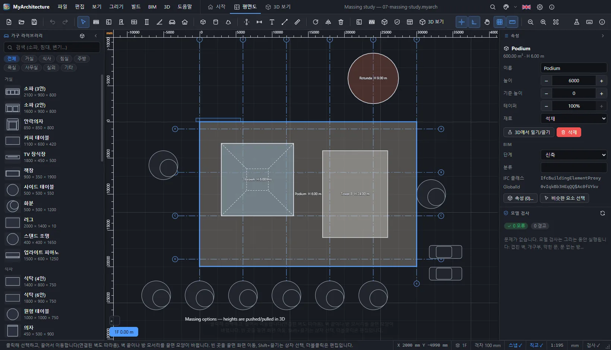
*매스(B 상자 · U 원기둥 · 다각형): 평면에서 그리고 높이·테이퍼를 정합니다*

벽·바닥이 없는 덩어리로 볼륨을 검토할 때 씁니다.

| 도구 | 그리는 법 |
| --- | --- |
| **매스 상자** <kbd>B</kbd> | 마주 보는 두 모서리 클릭 |
| **매스 원기둥** <kbd>U</kbd> | 중심 클릭, 원 위의 점 클릭(32각형) |
| **매스 다각형** | 모서리를 차례로 클릭, <kbd>Enter</kbd> 나 첫 점 클릭으로 돌출 |

새 매스는 높이 3000 mm, 재료 콘크리트, 단계 신축으로 만들어집니다. 선택하면:

| 칸 | 설명 |
| --- | --- |
| 이름 | 매스 이름 |
| 높이 | 매스 높이 |
| 기준 높이 | 층 바닥에서 띄운 높이(포디움 위 타워 등) |
| 테이퍼 | 윗면 크기 비율 0 ~ 100%. 100% = 수직, 0% = 피라미드/원뿔 |
| 재료 | 벽·지붕 재료 |

**3D에서 밀기/끌기** 단추는 3D 탭으로 가서 밀기/끌기 도구를 켭니다(5.9절). 매스도 이동·회전·대칭·크기 조정·간격 띄우기·그룹이 됩니다.

*매스 스터디 예제의 3D 모습*

### 3.14 이미지 밑그림과 CAD 도면 따라 그리기

- 스캔한 도면 이미지를 **이미지 밑그림**으로 가져와(7.4절) 그 위에 벽을 그립니다. 밑그림을 선택하면 **X, Y, 폭, 회전, 불투명도** 칸과 팁(“M으로 이미지에서 길이를 아는 부분을 잰 다음, 그 길이에 맞도록 폭을 설정하세요.”)이 있습니다.
- DXF/SVG 도면은 CAD 레이어로 들어옵니다(7.4절). 그 위에 <kbd>W</kbd> 로 벽을 따라 그리고 레이어를 숨기세요.
- 보기 → **밑그림과 CAD 레이어 표시**로 둘 다 한 번에 숨기고 보입니다.

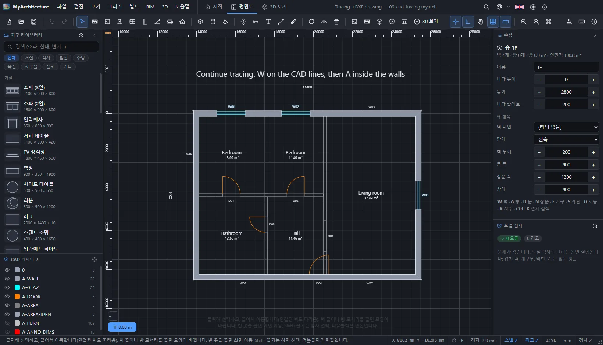
*DXF 따라 그리기: 가져온 CAD 선을 레이어별로 보이고 그 위에 벽을 그립니다*

**CAD 레이어 목록**(왼쪽 패널, 도면이 있거나 레이어가 2개 이상일 때): 눈 아이콘으로 표시/숨기기, 색 견본, 이름, 요소 수. 줄을 누르면 그 레이어가 **선 도구로 그릴 레이어**가 됩니다. 톱니바퀴(또는 빌드 → **CAD 레이어…**)는 레이어 창을 엽니다.

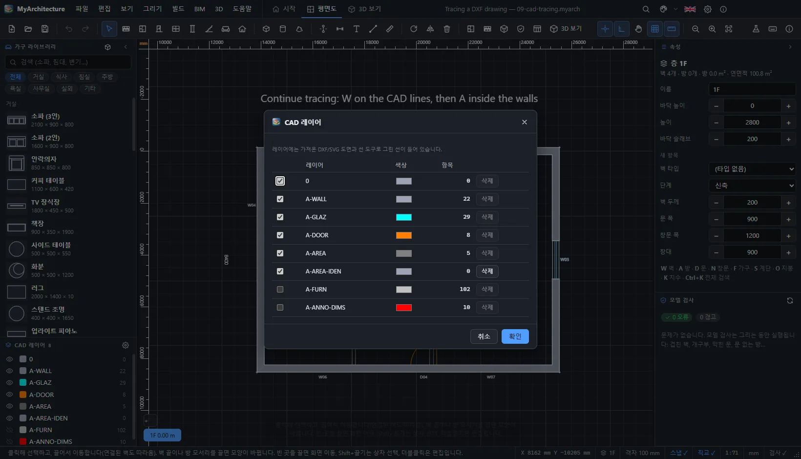
*CAD 레이어 창: 레이어별 표시·색·잠금*

CAD 레이어 창: 레이어마다 표시 체크, 색상, 항목 수, **삭제**(요소가 없는 레이어만, 레이어 `0` 은 지울 수 없음). 10개씩 쪽으로 나뉩니다.

---

## 4. 편집

편집 명령은 대부분 **평면도 탭**에서 동작합니다.

### 4.1 상자 선택

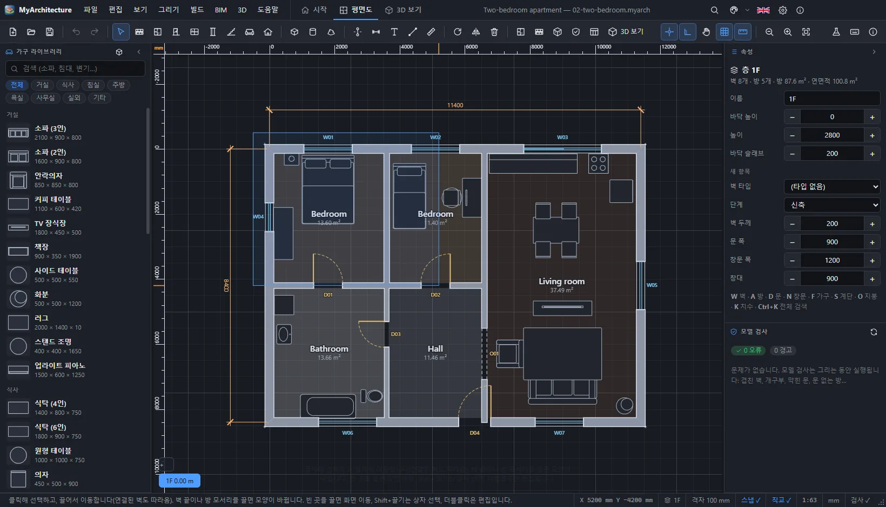
*상자 선택: Shift+끌기(왼→오른쪽은 완전히 포함, 오른→왼쪽은 걸친 것)*

<kbd>Shift</kbd>+끌기(또는 <kbd>Ctrl</kbd>+끌기, 설정에 따라 그냥 끌기):

- **왼쪽 → 오른쪽**(파란 실선 상자): 상자 안에 **완전히 들어간** 것만(윈도 선택).
- **오른쪽 → 왼쪽**(초록 점선 상자): 상자에 **걸친** 것까지(크로싱 선택).
- 상자 선택은 지금 선택에 더해집니다.

### 4.2 이동

- 선택한 것을 끌면 이동합니다. 이동 거리는 격자 단위(가구는 반 칸)로 맞춰지고, <kbd>Shift</kbd> 를 누르면 가로 또는 세로로만.
- 벽을 옮기면 **이어진 벽이 늘어나며 따라오고**, 그 벽의 문·창은 벽 안에 남습니다. <kbd>Alt</kbd>+끌기는 이어진 벽을 늘리지 않습니다.
- 방향키: 격자 한 칸, <kbd>Shift</kbd>+방향키: 열 칸.
- 손잡이 끌기는 이동이 아니라 **모양 바꾸기**(벽 끝, 방·지붕 꼭짓점, 치수·그리드 끝)입니다.

### 4.3 복사, 잘라내기, 붙여넣기, 복제, 삭제

| 명령 | 키 | 설명 |
| --- | --- | --- |
| 복사 | <kbd>Ctrl</kbd>+<kbd>C</kbd> | “n개 항목을 복사했습니다” |
| 잘라내기 | <kbd>Ctrl</kbd>+<kbd>X</kbd> | 복사 후 삭제 |
| 붙여넣기 | <kbd>Ctrl</kbd>+<kbd>V</kbd> | **커서 위치**(격자에 맞춤)에 붙여 넣음. 커서가 도면 밖이면 원래 자리에서 1 m 비켜서. 지금 층에 들어갑니다(다른 층으로 복사할 때 유용) |
| 복제 | <kbd>Ctrl</kbd>+<kbd>D</kbd> | 1 m 오른쪽 아래에 사본 |
| 삭제 | <kbd>Del</kbd> 또는 <kbd>Backspace</kbd> | 벽을 지우면 그 벽의 문·창도 지워짐 |

빈 곳 오른쪽 클릭 메뉴의 **붙여넣기**는 오른쪽 클릭한 자리에 붙여 넣습니다.

### 4.4 회전과 대칭

| 명령 | 키 | 설명 |
| --- | --- | --- |
| 90° 회전 | <kbd>R</kbd> | 선택의 중심을 기준으로 90° |
| 15° 회전 | <kbd>Shift</kbd>+<kbd>R</kbd> | 반대 방향으로 15° |
| 좌우 대칭 / 문 뒤집기 | <kbd>X</kbd> | 선택에 문·창이 있으면 **문의 여는 쪽만 뒤집기**, 아니면 좌우 대칭 |
| 상하 대칭 | <kbd>Y</kbd> | 위아래 대칭 |
| 경첩 바꾸기 | <kbd>H</kbd> | 선택한 문의 경첩 |

### 4.5 크기 조정

**편집 → 크기 조정…**(여러 개 선택 시 오른쪽 패널 **크기 조정…** 단추): “배율 (예: 1.5 또는 50%)”을 입력하면 선택을 그 중심 기준으로 키우거나 줄입니다. `50%` 처럼 퍼센트도 됩니다. 가구는 높이까지 바뀝니다.

### 4.6 간격 띄우기

**편집 → 간격 띄우기…**: “간격 띄우기 거리(mm, 음수 = 안쪽)”를 입력하면 선택한 **방, 매스, 지붕, 닫힌 선**의 평행한 사본을 만듭니다. 양수는 바깥, 음수는 안쪽입니다. 다른 요소에는 쓸 수 없습니다(“간격을 띄울 방, 매스, 지붕 또는 닫힌 선을 선택하세요.”).

### 4.7 그룹

- **그룹** <kbd>Ctrl</kbd>+<kbd>G</kbd>: 두 개 이상 골라 묶습니다(문·창과 그리드 선은 그룹에 들어가지 않음). 그 뒤 아무 항목이나 클릭하면 그룹 전체가 선택되고 함께 움직입니다. <kbd>Alt</kbd>+클릭은 하나만.
- **그룹 해제** <kbd>Ctrl</kbd>+<kbd>Shift</kbd>+<kbd>G</kbd>.
- 그룹 요소를 선택하면 오른쪽 패널에 “그룹의 일부입니다 (n개 항목)…”와 **그룹 해제** 단추가 나옵니다.

### 4.8 여러 개 선택했을 때

오른쪽 패널에 “항목 n개 선택됨”, 종류별 개수와 **회전 · 대칭 · 복제 · 삭제 · 그룹 · 크기 조정…** 단추가 나옵니다. 벽만 골랐다면 **두께**와 **재료**를 한꺼번에 바꿀 수 있습니다.

### 4.9 비슷한 요소 선택

**BIM → 비슷한 요소 선택**(오른쪽 클릭 메뉴, BIM 칸 단추): 지금 층에서 처음 고른 요소와 같은 것을 모두 고릅니다.

- 벽: 같은 벽 타입이면서 같은 두께
- 가구: 같은 종류
- 문·창: 같은 종류, 같은 폭
- 그 밖: 같은 종류 전부(그리드 선은 전체)

### 4.10 속성 창

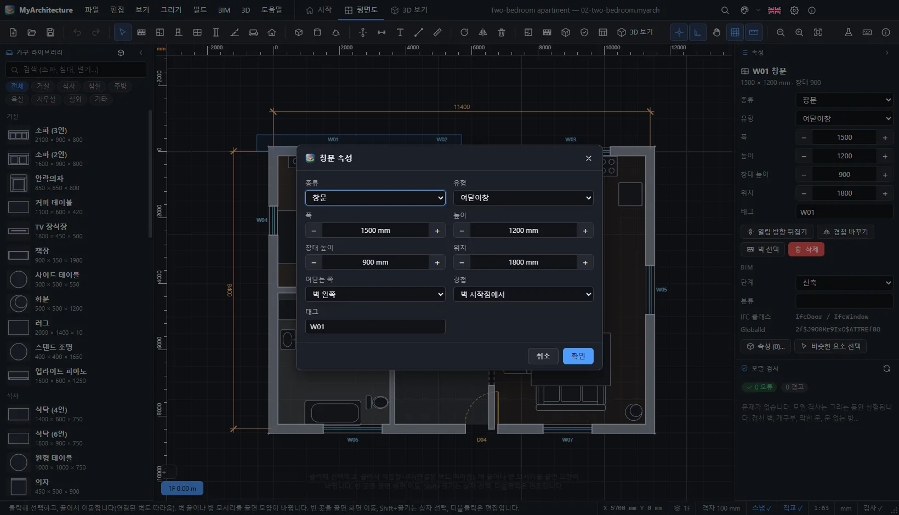
*더블클릭(또는 E): 요소의 모든 속성을 한 창에서 고칩니다*

선택 도구에서 요소를 **더블클릭**하거나 하나를 고르고 <kbd>E</kbd>(편집 → **속성…**)를 누르면 속성 창이 열립니다. 창 안에서 바꾼 것은 **확인**을 누를 때 한 번에(되돌리기 한 단계로) 적용됩니다. 아무것도 고르지 않고 속성…을 실행하면 프로젝트 속성이 열립니다.

| 요소 | 창 이름 | 항목 |
| --- | --- | --- |
| 벽 | 벽 속성 | 길이, 두께, 높이, 층 높이와 같게, 재료 |
| 문·창 | 문 속성 / 창문 속성 | 종류, 유형, 폭, 높이, 창대 높이, 위치, 여닫는 쪽, 경첩, 태그 |
| 방 | 방 속성 | 이름(목록), 바닥, 면적(읽기 전용), 텍스트 크기, 면적 표시 |
| 가구 | (가구 이름) | 이름, 종류, 폭, 깊이, 높이, 바닥에서 높이, 회전, 색상 |
| 계단 | 계단 속성 | 단 수, 폭, 길이, 회전, 재료 |
| 지붕 | 지붕 속성 | 모양, 경사, 처마 내밀기, 두께, 재료 |
| 기둥 | 기둥 속성 | 모양, 폭, 깊이, 회전 |
| 텍스트 | 텍스트 | 글자, 크기, 회전 |
| 그 밖(매스, 치수, 그리드, 선, 밑그림) | — | “오른쪽에서 편집하세요.” — 오른쪽 패널에서 고칩니다 |

### 4.11 오른쪽 클릭 메뉴 (평면)

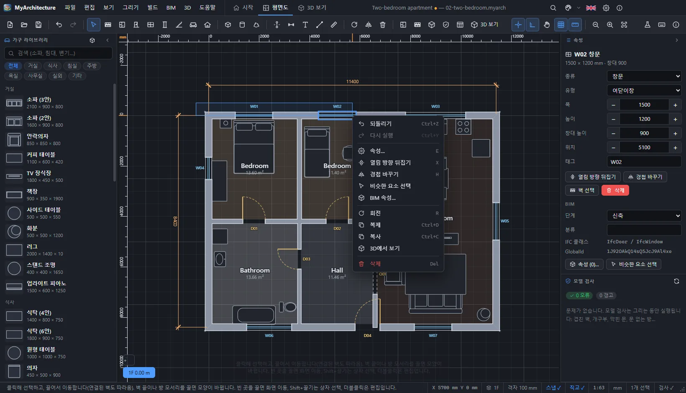
*오른쪽 클릭 메뉴: 맨 위에 되돌리기/다시 실행, 그 아래 고른 요소에 맞는 명령*

선택 도구에서 마우스 오른쪽 버튼을 움직이지 않고 누르면 메뉴가 열립니다. (그리는 중이면 오른쪽 클릭은 그리기를 끝내고, 다른 도구일 때는 선택 도구로 돌아갑니다.)

**요소 위**(그 요소가 선택됨):

1. 되돌리기 · 다시 실행
2. 속성… (<kbd>E</kbd>)
3. 벽이면: 여기에 문 추가 · 여기에 창문 추가 · 여기서 벽 나누기 · 일직선 벽 합치기
4. 문·창이면: 열림 방향 뒤집기 (<kbd>X</kbd>) · 경첩 바꾸기 (<kbd>H</kbd>)
5. 비슷한 요소 선택 · BIM 속성…
6. 회전 (<kbd>R</kbd>) · 복제 (<kbd>Ctrl</kbd>+<kbd>D</kbd>) · 복사 (<kbd>Ctrl</kbd>+<kbd>C</kbd>) · 3D에서 보기
7. 삭제 (<kbd>Del</kbd>)

**빈 곳**: 되돌리기 · 다시 실행 / 붙여넣기 · 방 감지 · 자동 치수 · 모두 선택 · 그리드 선 / 화면에 맞추기.

**층 탭**: 3.10절. **3D**: 5.14절.

---

## 5. 3D 보기

*3D 보기: 왼쪽에 장면·층·표시·단면·태양, 오른쪽에 고른 요소의 속성*

**3D 보기** 탭(<kbd>F3</kbd>, <kbd>F4</kbd> 도 같음)은 평면에서 그린 것을 바로 3D 건물로 보여 줍니다. 평면을 고치면 3D 도 곧 다시 만들어집니다. 처음 열 때 등각 보기로 건물 전체를 맞춥니다.

### 5.1 3D 도구 모음

| 묶음 | 단추 |
| --- | --- |
| 탐색 | 궤도 회전 · 이동 (P) · 걷기 (V) |
| 도구 | 밀기/끌기 · 페인트 통 · 줄자 |
| 시점 | 등각 · 위 · 정면 · 배면 · 좌측면 · 우측면 · 조감도 (키 <kbd>1</kbd> ~ <kbd>7</kbd>) |
| 표시 | 직교 투영 (O) · 현재 층에서 단면 (X) · 문 열기 · 가구 · 지붕 |
| 스타일 | 렌더 스타일 목록(사실적 / 흰색 모형 / 선 그림 / X-레이) |
| 보조 | 격자 (G) · 건물 치수 · 화면에 맞추기 |
| 출력 | 3D 이미지 저장 (PNG)… · 3D 모델 내보내기… |
| 이동 | 평면도 |

### 5.2 탐색 (궤도 회전 · 이동)

| 동작 | 궤도 회전(기본) | 이동 모드 (<kbd>P</kbd>) |
| --- | --- | --- |
| 왼쪽 끌기 | 회전 | 화면 이동 |
| 오른쪽 끌기 | 화면 이동 | 회전 |
| 휠 / 가운데 끌기 | 확대·축소 | 확대·축소 |

- 방향키: 회전(한 번에 7.5°), <kbd>Shift</kbd>+방향키: 화면 이동.
- 모델을 **더블클릭**하면 그 점을 중심으로 가까이 다가갑니다.
- <kbd>Home</kbd>(화면에 맞추기)은 지금 방향 그대로 건물 전체를 맞춥니다.
- 회전 속도와 시야각은 설정 → 3D 보기.
- 오른쪽 위 구석의 **방향 표시기**(X 빨강, Y 파랑, Z 초록)는 지금 방향을 보여 줍니다(표시 옵션 **방향 표시기**).

### 5.3 시점

<kbd>1</kbd> 등각 · <kbd>2</kbd> 위 · <kbd>3</kbd> 정면 · <kbd>4</kbd> 배면 · <kbd>5</kbd> 좌측면 · <kbd>6</kbd> 우측면 · <kbd>7</kbd> 조감도. 카메라가 부드럽게 날아가 건물 전체를 맞춥니다. 3D 메뉴에는 **등각 보기**, **평면 보기**(위), **정면 입면**이 있습니다.

### 5.4 걷기 (1인칭)

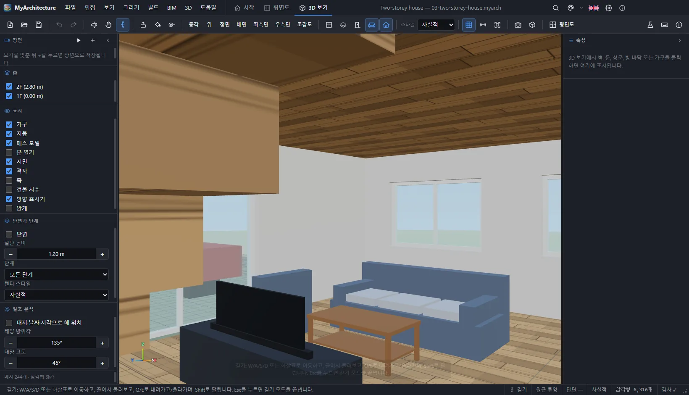
*걷기(V): 사람 눈높이에서 W/A/S/D 로 걸어 다닙니다*

<kbd>V</kbd>(또는 걷기 단추, 3D → **걷기 (1인칭)**, 상태 표시줄의 탐색 칸)를 누르면 보이는 가장 낮은 층 바닥에서 눈높이 1.6 m 로 섭니다.

| 키·동작 | 하는 일 |
| --- | --- |
| <kbd>W</kbd> / <kbd>↑</kbd> | 앞으로 |
| <kbd>S</kbd> / <kbd>↓</kbd> | 뒤로 |
| <kbd>A</kbd> / <kbd>D</kbd> | 왼쪽 / 오른쪽으로 옆걸음 |
| <kbd>←</kbd> / <kbd>→</kbd> | 왼쪽 / 오른쪽으로 돌기 |
| <kbd>E</kbd> / <kbd>Page Up</kbd> | 올라가기 |
| <kbd>Q</kbd> / <kbd>Page Down</kbd> | 내려가기 |
| <kbd>Shift</kbd> 누른 채 | 달리기(약 3배 빠르게) |
| 끌기 | 둘러보기 |
| 휠 | 앞뒤로 한 걸음(0.5 m) |
| <kbd>Esc</kbd> 또는 <kbd>V</kbd> | 걷기 끝내기 |

걷기는 원근 투영에서만 됩니다(평행 투영이었다면 자동으로 원근으로). 시점 단추를 누르거나 다른 탭으로 가면 걷기가 끝납니다.

### 5.5 평행 투영과 입면

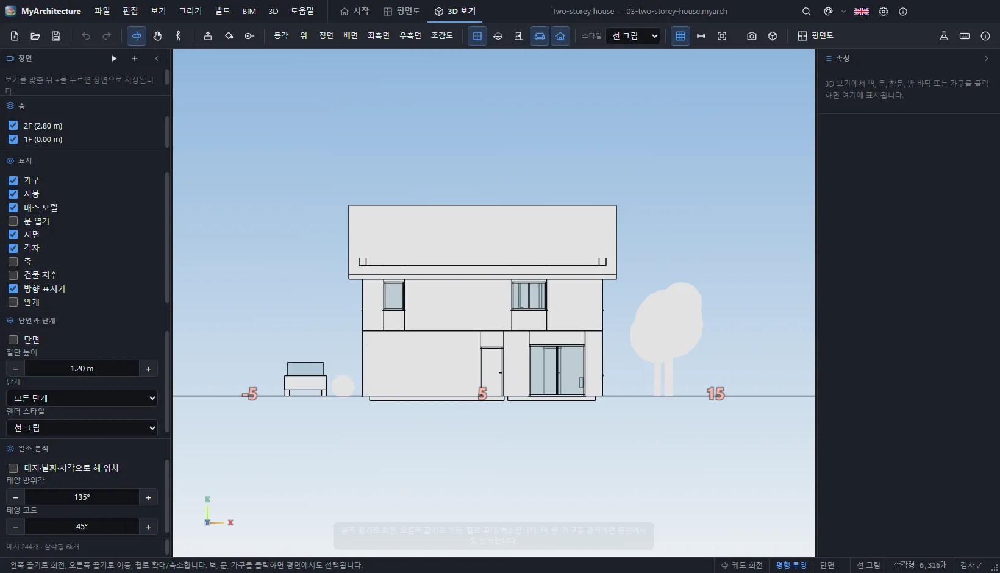
*정면도: 평행 투영(O)으로 입면을 그대로 봅니다*

- <kbd>O</kbd>(직교 투영)는 원근 없이 평행하게 봅니다. 상태 표시줄에는 “평행 투영 / 원근 투영”으로 표시됩니다.
- **3D → 정면 입면**은 평행 투영 + 선 그림 스타일 + 정면 시점을 한 번에 켜서 입면도처럼 보여 줍니다. 그 상태에서 <kbd>4</kbd> ~ <kbd>6</kbd> 으로 다른 입면을 봅니다.

### 5.6 표현 스타일

도구 모음 **스타일** 목록이나 왼쪽 **단면과 단계** 패널의 **렌더 스타일**에서 고릅니다.

| 스타일 | 모습 |
| --- | --- |
| 사실적 | 재료 색·무늬, 해와 그림자 |
| 흰색 모형 | 모형처럼 모두 흰색, 그림자 |
| 선 그림 | 흰 면 + 검은 모서리선(입면도·스케치 느낌), 그림자 없음 |
| X-레이 | 반투명 푸른 면으로 속을 들여다봄 |

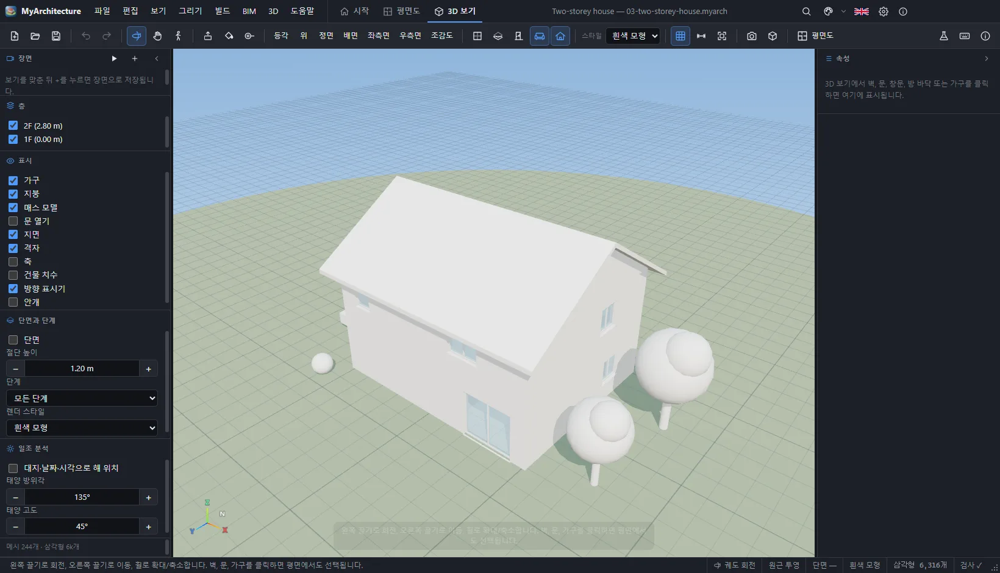
*표현 스타일: 흰색 모형*

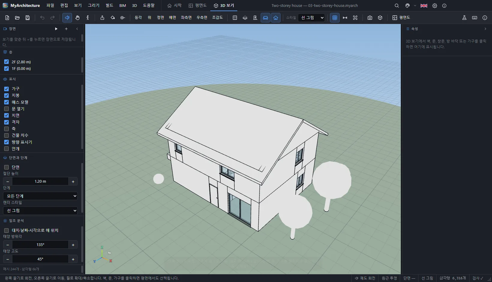
*표현 스타일: 선 그림*

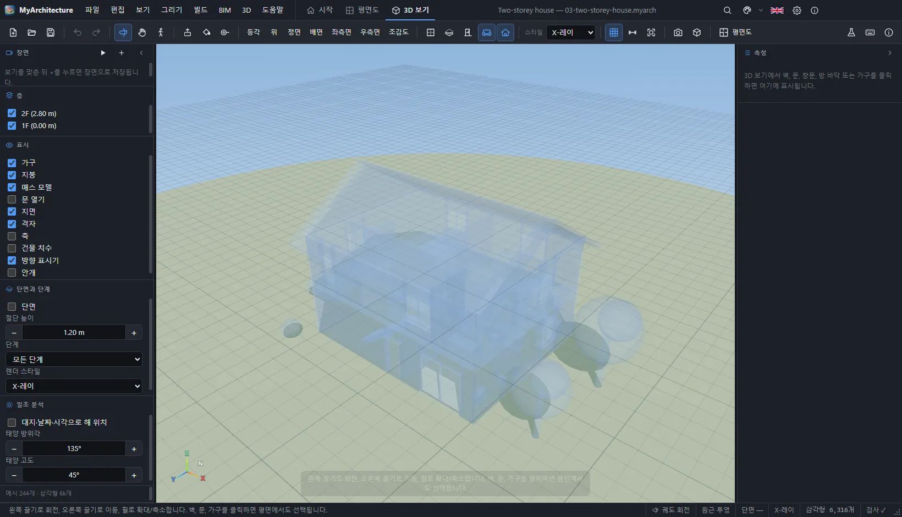
*표현 스타일: X-레이*

### 5.7 단면

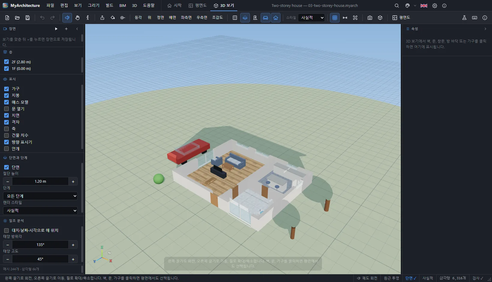
*단면(X): 지금 층을 바닥에서 1.2 m 높이로 잘라 내부를 보여 줍니다*

- <kbd>X</kbd>(단면 단추, 3D → **현재 층에서 단면**, 상태 표시줄 단면 칸)는 **평면에서 편집 중인 층의 바닥 + 1.2 m** 높이에서 건물을 수평으로 잘라 위를 걷어 냅니다. 3D 평면도처럼 내부가 보입니다. 다시 누르면 꺼집니다.
- 왼쪽 **단면과 단계** 패널: **단면** 체크, **절단 높이** 스테퍼(0.1 m 단위)로 높이를 바꿉니다.
- 잘려 나간 부분은 클릭해도 선택되지 않습니다.

### 5.8 왼쪽 패널 (3D 보기 옵션)

위에서부터:

- **페인트 통** 팔레트(페인트 통 도구가 켜져 있을 때만, 5.10절)
- **장면**(5.13절)
- **층**: 층마다 체크(위층부터). 끄면 그 층이 3D 에서 숨습니다(내보내기에서도 빠짐).
- **표시**: 가구 · 지붕 · 매스 모델 · 문 열기 · 지면 · 격자 · 축 · 건물 치수 · 방향 표시기 · 안개
- **단면과 단계**: 단면, 절단 높이, **단계**(모든 단계 / 새 설계 (철거 없음) / 기존(공사 전)), 렌더 스타일
- **일조 분석**(5.12절)
- 맨 아래: 메시 수 · 삼각형 수

표시 항목 설명:

| 항목 | 설명 |
| --- | --- |
| 문 열기 | 문짝을 열린 상태로(걸어 다닐 때 편리) |
| 지면 | 건물 아래 바닥면 |
| 격자 (<kbd>G</kbd>) | 5.8.1 참고 |
| 축 | 원점에서 X(빨강)·Y(파랑)·Z(초록) 축 |
| 건물 치수 | 건물 전체의 W(폭)·D(깊이)·H(높이)를 노란 치수로 |
| 안개 | 멀수록 흐려지는 공기 원근(3D 메뉴 **안개**도 같음) |

#### 5.8.1 3D 격자

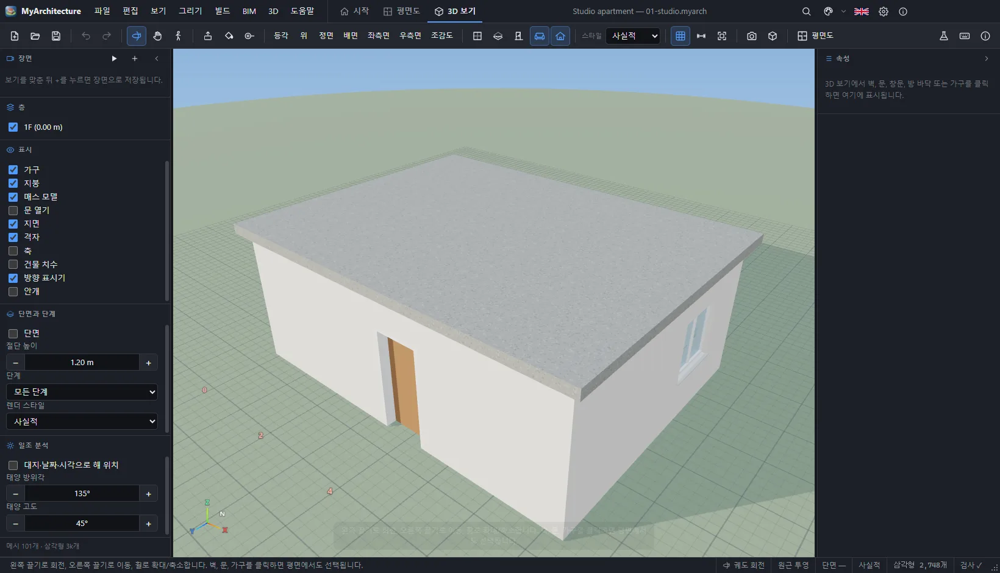
*3D 그리드: 2D 처럼 5칸마다 또렷한 선(5×5), 확대·축소해도 같은 간격으로 보입니다*

3D 격자는 평면의 격자처럼 그려집니다.

- 가는 선 한 칸, **5칸마다 또렷한 선**(5 × 5 블록).
- 확대·축소하면 칸 크기가 **×5 / ÷5** 로 바뀝니다(… 0.2 m · 1 m · 5 m · 25 m …). 그래서 어떤 거리에서 보아도 화면에서 고른 간격을 유지하고, 또렷한 선은 너무 진하지 않은 1.5 px 로, 화면 기준으로 일정합니다.
- 격자는 지금 보는 곳(걷기에서는 서 있는 곳)을 중심으로 펼쳐지고, 또렷한 선을 따라 거리 눈금(m 또는 ft — 설정 → 3D 보기 → **3D 측정 단위**)이 붙습니다.
- <kbd>G</kbd>, 도구 모음 격자 단추, 표시 패널로 켜고 끕니다. 3D 를 처음 열 때 켜져 있을지는 설정 → 3D 보기 → **시작 시 표시: 축척 표시 격자**.

### 5.9 밀기/끌기

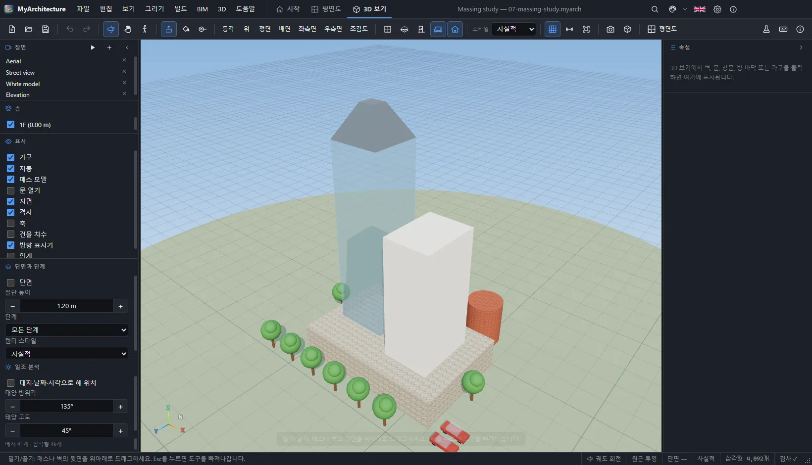
*밀기/끌기: 매스나 벽의 윗면을 위아래로 끌어 높이를 바꿉니다*

**밀기/끌기**(도구 모음, 3D 메뉴, 매스의 **3D에서 밀기/끌기** 단추)를 켜고 **매스나 벽의 윗면**을 위아래로 끌면 높이가 50 mm 단위로 바뀝니다(매스 최소 100 mm, 벽 최소 300 mm). 끄는 동안 힌트 칸에 `높이: … m` 가 보입니다. 한 번 끌기가 되돌리기 한 단계입니다. 같은 단추를 다시 누르거나 <kbd>Esc</kbd> 로 도구를 끝냅니다.

### 5.10 페인트 통

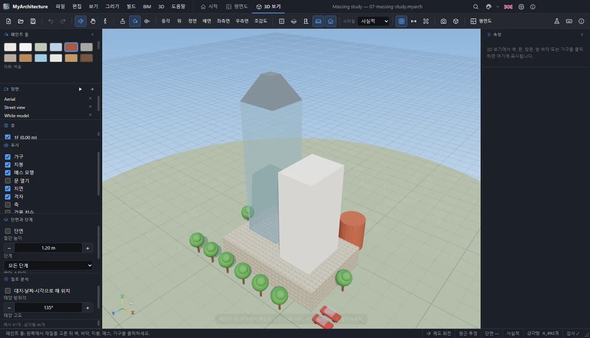
*페인트 통: 왼쪽 팔레트에서 재료를 고르고 벽·바닥·지붕·매스를 클릭합니다*

**페인트 통**을 켜면 왼쪽에 재료 견본(벽·바닥·지붕 재료 전부)이 나옵니다. 견본을 고르고(“재료: …”) 모델을 클릭하면:

| 클릭한 것 | 바뀌는 것 |
| --- | --- |
| 벽, 지붕, 매스, 기둥, 계단 | 재료 |
| 방 바닥 | 바닥 재료 |
| 가구 | 그 재료의 색 |
| 문·창 | 바뀌지 않음 |

### 5.11 줄자

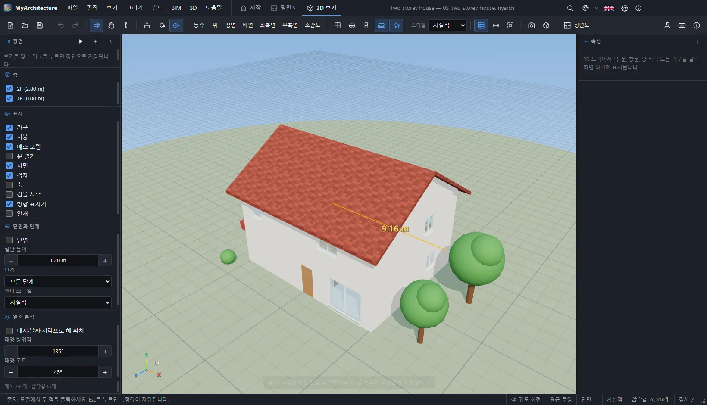
*줄자: 3D 모델 위 두 점 사이의 거리*

**줄자**를 켜고 모델 위 두 점을 클릭하면 두 점 사이에 노란 선과 거리 글자가 남고 “거리: … m” 알림이 뜹니다. 여러 개를 잴 수 있고, <kbd>Esc</kbd>(도구 끄기) 때 지워집니다.

### 5.12 일조 분석

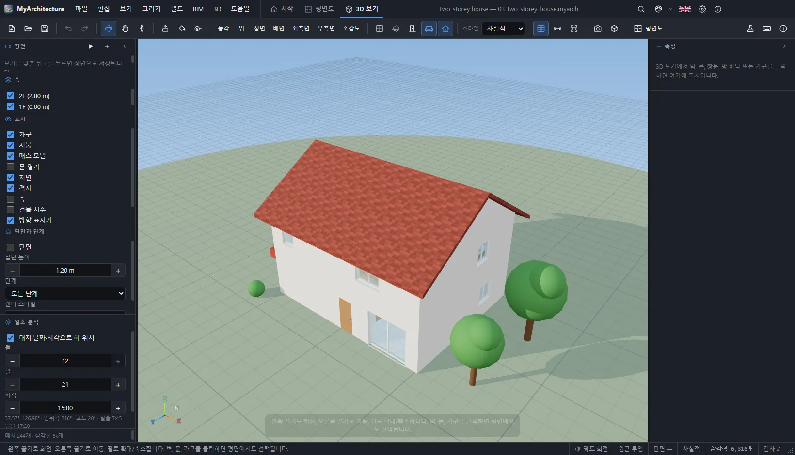
*태양 분석: 대지 위치와 날짜·시각으로 실제 그림자를 봅니다*

왼쪽 **일조 분석** 패널:

- **대지·날짜·시각으로 해 위치**를 끄면: **태양 방위각**(15° 단위)과 **태양 고도**(5° 단위)를 직접 정합니다(기본 135°, 45°).
- 켜면: **월**, **일**, **시각**(30분 단위)으로 실제 해 위치를 계산합니다. 아래에 위도·경도, 방위각, 고도, **일출·일몰** 시각이 표시되고, 해가 지평선 아래면 고도가 `<0` 으로 나옵니다. **대지 위치…** 단추는 프로젝트 속성을 엽니다(위도, 경도, 시간대, 북쪽 방향 — 6.8절).
- 방위각은 북쪽에서 시계 방향이며, 프로젝트의 **북쪽** 회전이 반영됩니다.
- 그림자는 설정 → 3D 보기 → **3D 그림자: 태양 그림자**로 켜고 끕니다(선 그림 스타일에서는 그림자 없음).

### 5.13 장면

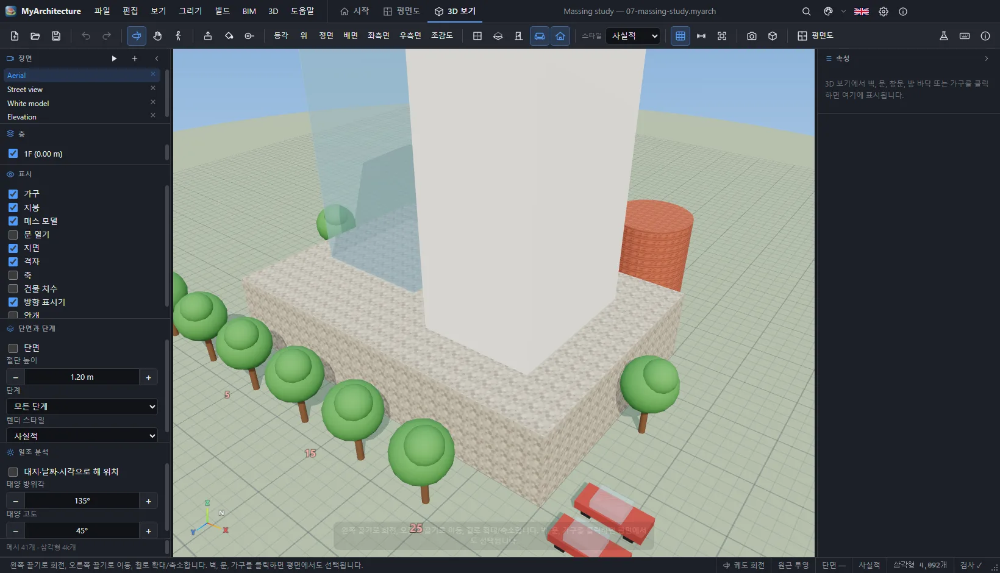
*장면: 지금 시점을 저장하고(+), 눌러서 이동하고, ▶ 로 차례로 재생합니다*

- **장면** 패널의 **+**(또는 3D → **장면 추가**, 3D 오른쪽 클릭 메뉴)는 지금 카메라·투영·표현 스타일·단면 높이·단계 보기를 “장면 1, 장면 2…”로 프로젝트에 저장합니다.
- 장면 이름을 누르면 그 시점으로 부드럽게 날아갑니다. **×** 로 지웁니다.
- **▶**(장면 재생, 3D → **장면 애니메이션 재생**)은 장면을 차례로 돌며 계속 재생합니다(장면마다 약 2.5초). 다시 누르면(■ 정지) 멈춥니다. 장면이 없으면 “먼저 장면을 추가하세요…”.

### 5.14 3D 에서 선택과 오른쪽 클릭

- 벽, 문, 창, 방 바닥, 가구 등을 클릭하면 파랗게 강조되고, 평면에서도 선택됩니다. 오른쪽 패널에 이름, 층, 클릭한 높이와 **평면에서 보기 / 속성…** 단추가 나옵니다.
- 평면의 요소에서 **3D에서 보기**(오른쪽 클릭, 가구 속성 단추)를 누르면 3D 탭에서 강조됩니다.

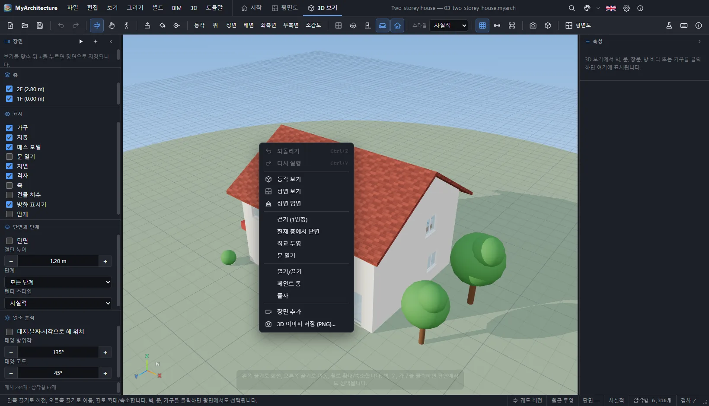
*3D 오른쪽 클릭 메뉴: 되돌리기/다시 실행, 보기 방향, 도구*

오른쪽 버튼을 움직이지 않고 떼면 메뉴: (요소를 클릭한 상태면 맨 위에 **평면에서 보기**) · 되돌리기 · 다시 실행 / 등각 보기 · 평면 보기 · 정면 입면 / 걷기 (1인칭) · 현재 층에서 단면 · 직교 투영 · 문 열기 / 밀기/끌기 · 페인트 통 · 줄자 / 장면 추가 · 3D 이미지 저장 (PNG)…. 오른쪽 끌기는 여전히 화면 이동입니다.

### 5.15 이미지 저장과 3D 내보내기

- **3D 이미지 저장 (PNG)…**: 지금 3D 화면을 그대로 `제목-3d.png` 로 저장합니다.
- **3D 모델 내보내기…**: 7.5절.

---

## 6. BIM

평면의 요소(벽, 문·창, 방, 기둥, 계단, 가구, 지붕, 매스, 그리드)는 BIM 정보를 함께 가집니다. 요소를 고르면 오른쪽 패널 아래 **BIM** 칸에 나옵니다.

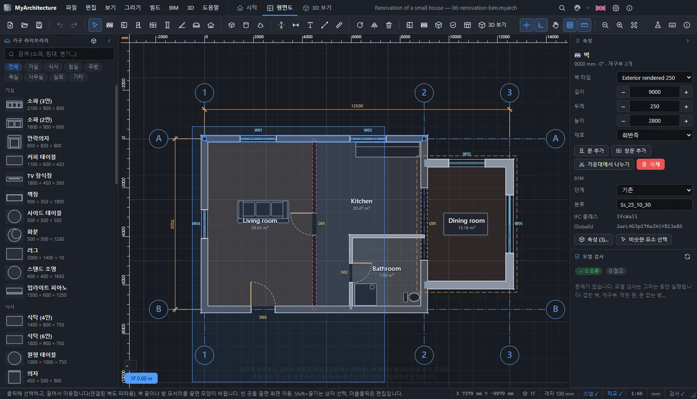
*BIM 속성: 단계, 분류 코드, IFC 클래스, GlobalId, 사용자 속성*

| 칸 | 설명 |
| --- | --- |
| 단계 | 기존 / 신축 / 철거 (그리드에는 없음) |
| 분류 | 분류 코드(예: Uniclass 2015 코드). 분류 체계 이름은 프로젝트 속성에서 |
| IFC 클래스 | 내보낼 IFC 클래스(읽기 전용) — 벽 `IfcWall`, 문·창 `IfcDoor / IfcWindow`, 방 `IfcSpace`, 기둥 `IfcColumn`, 계단 `IfcStair`, 가구 `IfcFurniture`, 지붕 `IfcRoof`, 그리드 `IfcGrid`, 매스 `IfcBuildingElementProxy` |
| GlobalId | IFC GlobalId(22자). 누르면 클립보드에 복사 |
| **속성 (n)…** | 사용자 속성 창(6.4절) |
| **비슷한 요소 선택** | 4.9절 |

### 6.1 벽 타입

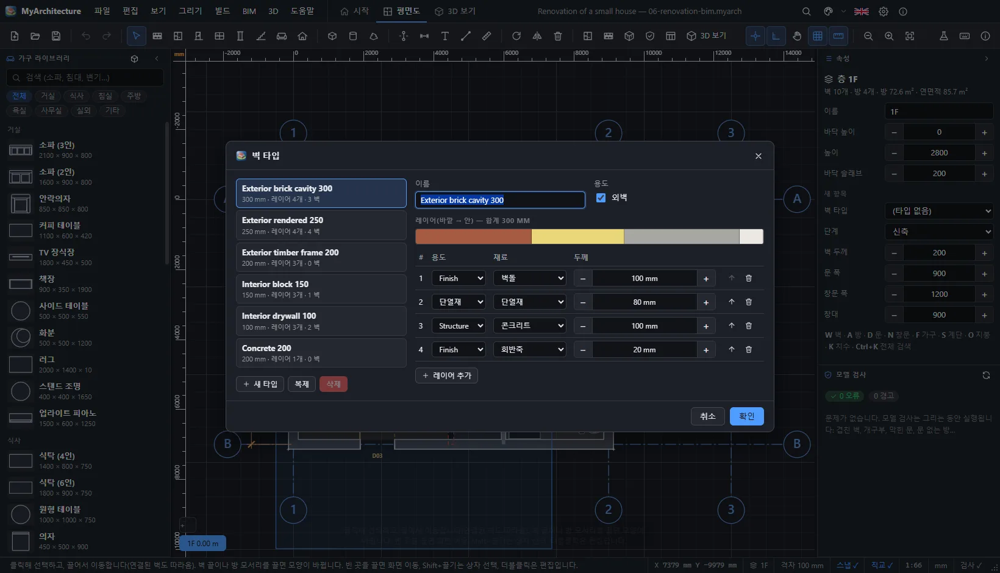
*벽 타입: 재료 층(구조·단열·마감)으로 두께를 정하고 벽에 지정합니다*

**BIM → 벽 타입…**(도구 모음 벽 타입 단추):

- 왼쪽 목록: 타입마다 전체 두께 · 레이어 수 · 그 타입을 쓰는 벽 수. **새 타입**, **복제**, **삭제**(타입이 2개 이상이고 쓰는 벽이 없을 때만).
- 오른쪽: **이름**, **용도: 외벽** 체크, 레이어 단면 그림(바깥이 왼쪽), 레이어 표 — **용도**(마감 / 단열재 / 구조 / 공기층), **재료**(벽 재료 + 단열재·공기층), **두께**(5 mm 단위 스테퍼), 위로 이동, 삭제. **레이어 추가**.
- “레이어(바깥 → 안) — 합계 … mm”. **확인**을 누르면 그 타입을 쓰는 모든 벽의 두께가 새 합계로 바뀝니다.

새 프로젝트에 들어 있는 벽 타입:

| 이름 | 레이어 (바깥 → 안) | 합계 |
| --- | --- | --- |
| Exterior brick cavity 300 | 벽돌 100 · 단열재 80 · 콘크리트 100 · 회반죽 20 | 300 |
| Exterior rendered 250 | 회반죽 20 · 단열재 60 · 콘크리트 150 · 회반죽 20 | 250 |
| Exterior timber frame 200 | 목재 외장재 25 · 단열재 150 · 회반죽 25 | 200 |
| Interior block 150 | 회반죽 15 · 콘크리트 120 · 회반죽 15 | 150 |
| Interior drywall 100 | 흰색 페인트 13 · 단열재 74 · 흰색 페인트 13 | 100 |
| Concrete 200 | 콘크리트 200 | 200 |

벽에 타입 지정: 벽을 고르고 오른쪽 패널 **벽 타입**에서 선택(여러 벽은 고른 뒤 비슷한 요소 선택 등으로). 평면에는 레이어 경계선이 그려집니다. 새로 그릴 벽의 타입은 아무것도 고르지 않았을 때 오른쪽 패널 **새 항목 → 벽 타입**. 벽의 두께를 직접 바꾸면 타입이 풀립니다.

### 6.2 단계 (리모델링)

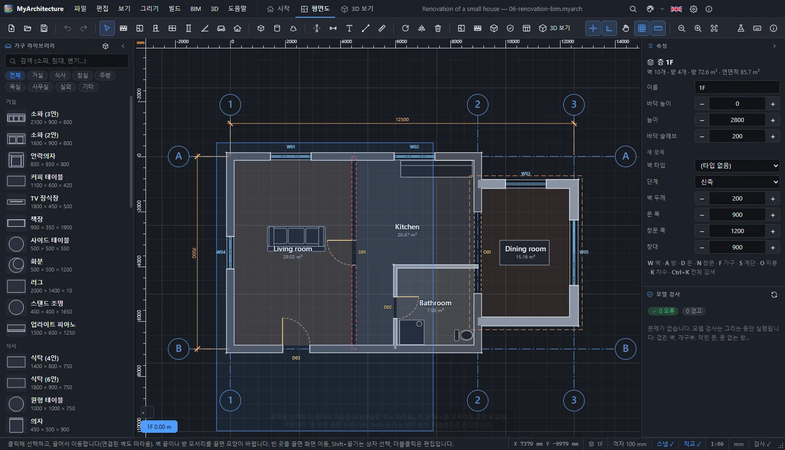
*단계: 기존(회색)·철거(빨간 점선)·신축 벽을 함께 그리고, 보기 → 단계 로 전후를 비교합니다*

- 요소마다 **단계**: **기존**(옅게), **신축**(보통), **철거**(빨간 점선 윤곽).
- 새로 그릴 요소의 단계: 오른쪽 패널 **새 항목 → 단계**.
- **보기 → 단계: 모두 보기 / 단계: 새 설계 / 단계: 기존 건물**(3D 왼쪽 패널 **단계**도 같음):

| 단계 보기 | 보이는 것 |
| --- | --- |
| 모든 단계 | 전부 |
| 새 설계 (철거 없음) | 기존 + 신축 (공사 후 모습) |
| 기존(공사 전) | 기존 + 철거 (공사 전 모습) |

- 공사비에는 **신축**만 들어갑니다(기존은 0, 철거는 제외).

### 6.3 분류와 IFC

- **분류** 칸에 분류 코드를 적고, **프로젝트 속성 → 분류 체계**(기본 `Uniclass 2015`)에 체계 이름을 적으면 IFC 의 분류 참조로 나갑니다.
- 단계, 벽 타입(레이어 재료), 그리드, 사용자 속성은 모두 IFC 내보내기에 포함됩니다(7.5절).

### 6.4 사용자 속성 (BIM 속성)

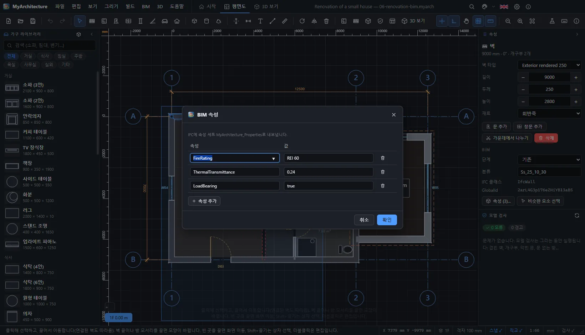
*BIM 속성 창: 고른 요소에 내화 등급 같은 속성을 붙입니다*

**BIM → 선택 요소의 BIM 속성…**(오른쪽 클릭 **BIM 속성…**, BIM 칸 **속성 (n)…**):

- **속성 / 값** 표. **속성 추가**로 줄을 더하고 휴지통으로 지웁니다. 속성 이름 칸은 `FireRating, AcousticRating, ThermalTransmittance, LoadBearing, Manufacturer, Model, Cost, Mark, Comments` 를 제안합니다.
- 값이 숫자면 숫자로, `true`/`false` 면 참/거짓으로 저장됩니다.
- 여러 요소를 고르면 “속성이 선택한 요소 n개 모두에 기록됩니다.” 하나면 “IFC에 속성 세트 MyArchitecture_Properties로 내보냅니다.”
- 텍스트·치수·CAD 선·밑그림에는 붙일 수 없습니다. 아무것도 고르지 않으면 “먼저 요소를 하나 이상 선택하세요.”
- 가구에 `price` 속성을 붙이면 공사비의 가구 금액으로 쓰입니다.

### 6.5 일람표 (집계와 수량)

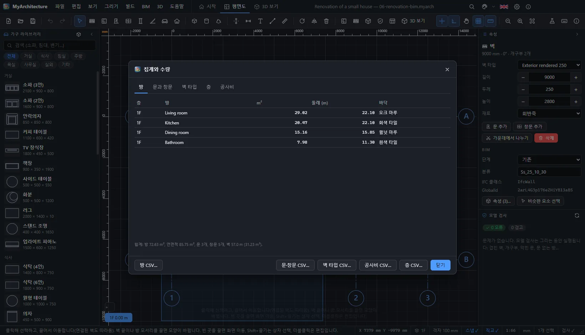
*일람표: 방 · 문과 창 · 벽 타입 · 공사비 · 층 — CSV 로 내보냅니다*

**빌드 → 집계와 수량…**(도구 모음, 파일 → 내보내기 ▸ **집계표 내보내기(CSV)…** 도 같은 창. BIM → **공사비…** 는 같은 창을 **공사비** 탭으로 엽니다):

| 탭 | 열 |
| --- | --- |
| 방 | 층, 방, m², 둘레 (m), 바닥 |
| 문과 창문 | 태그, 종류, 유형, 층, 폭, 높이, 창대 높이 |
| 벽 타입 | 벽 타입(타입 없는 벽은 두께별), 두께, 레이어, 벽 수, 길이(m), 벽 면적 (m²) |
| 층 | 층, 바닥 높이, 벽, 벽 길이 (m), 벽 면적 (m², 개구부 뺀 한 면), 방, 방 면적 (m²), 총면적 (m², 벽 바깥 기준), 문, 창문 |
| 공사비 | 6.6절 |

긴 표는 12줄씩 쪽으로 나뉩니다. 아래에 **합계**(방 면적, 연면적, 문·창 수, 벽 길이와 부피)가 나옵니다.

아래 단추 **방 CSV… · 문·창문 CSV… · 벽 타입 CSV… · 공사비 CSV… · 층 CSV…** 는 그 표를 `제목-rooms.csv` 처럼 저장합니다. CSV 는 UTF-8(BOM 포함)이라 Excel 에서 한글이 깨지지 않습니다.

### 6.6 공사비

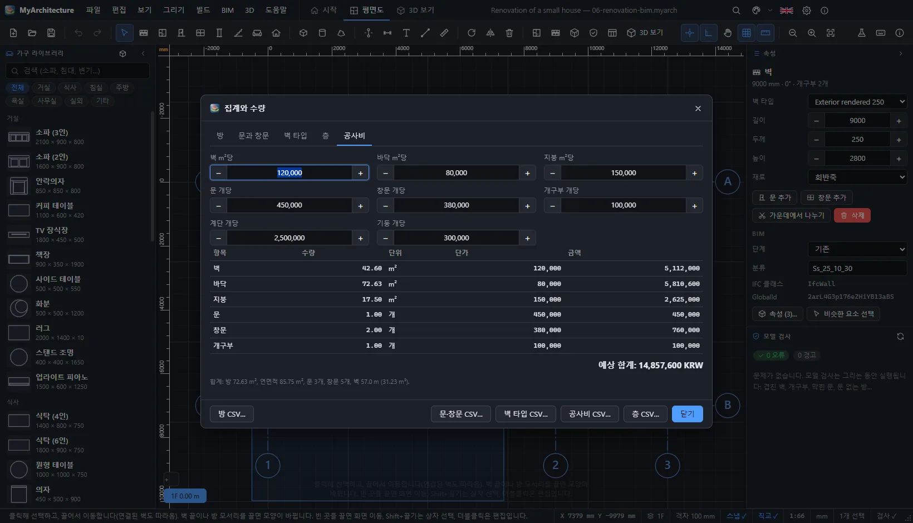
*공사비 탭: 단가 × 수량으로 개략 공사비를 냅니다*

**공사비** 탭 위쪽의 단가(스테퍼, 10,000 단위, 직접 입력 가능)를 바꾸면 표가 바로 다시 계산되고, 창을 닫을 때 프로젝트에 저장됩니다(되돌리기 “단가” 한 단계).

| 단가 칸 | 표의 항목 | 수량 | 기본 단가 (KRW) |
| --- | --- | --- | --- |
| 벽 m²당 | 벽 | 신축 벽의 한 면 면적(개구부 제외), m² | 120,000 |
| 바닥 m²당 | 바닥 | 신축 방 면적, m² | 80,000 |
| 지붕 m²당 | 지붕 | 신축 지붕의 평면 면적, m² | 150,000 |
| 문 개당 | 문 | 신축 문 수, 개 | 450,000 |
| 창문 개당 | 창문 | 신축 창 수, 개 | 380,000 |
| 개구부 개당 | 개구부 | 신축 개구부 수, 개 | 100,000 |
| 계단 개당 | 계단 | 신축 계단 수, 개 | 2,500,000 |
| 기둥 개당 | 기둥 | 신축 기둥 수, 개 | 300,000 |
| — | 가구 | 신축 가구, 개 | 가구마다 `price` 속성 합계 |

열: 항목, 수량, 단위, 단가, 금액. 맨 아래 “예상 합계: … KRW”. 수량이 0 인 항목은 표에서 빠집니다.

### 6.7 모델 검사

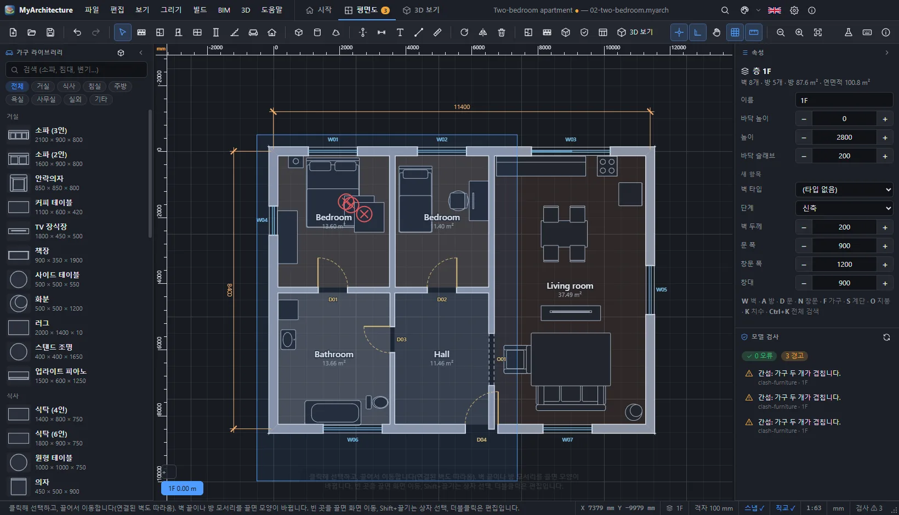
*모델 검사(F5): 겹친 벽, 막힌 문, 간섭(가구·계단·기둥) 등을 찾고 눌러서 그곳으로 갑니다*

모델 검사는 회로 설계의 ERC/DRC 에 해당하는 건축 검사입니다.

- 기본으로 **그리는 동안 계속** 실행됩니다(설정 → 평면도 → **그리는 동안 모델 검사 실행**).
- <kbd>F5</kbd>(빌드 → 모델 검사, 도구 모음, 상태 표시줄 검사 칸)는 지금 검사하고 “모델 검사: 오류 n개, 경고 n개” 또는 “모델 검사 통과 — 문제가 없습니다.”를 알리며 오른쪽 패널을 엽니다.
- 오른쪽 패널 아래 **모델 검사** 목록: 오류·경고 개수 알약, 항목마다 메시지와 `코드 · 층`. 항목을 누르면 그 층으로 가서 문제 위치를 확대하고 주황 원으로 깜박이며 관련 요소를 선택합니다. ↻ 단추는 다시 검사.
- 문제 위치는 평면에도 표시됩니다. 평면도 탭과 접힌 오른쪽 패널에 개수 배지가 붙습니다.

검사 규칙 전체(메시지는 화면에 나오는 그대로)는 12.2절에 있습니다.

### 6.8 프로젝트 속성과 대지

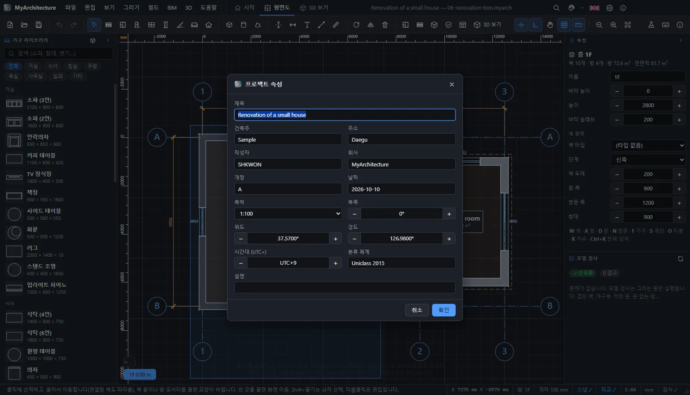
*프로젝트 속성: 제목·주소·대지 위도/경도·시간대·분류 체계*

**파일 → 프로젝트 속성…**(BIM → **대지 위치 (일조 분석)…** 도 같은 창):

| 항목 | 쓰임 |
| --- | --- |
| 제목 | 문서 제목, 파일 이름 제안, 도면 표제란, IFC 프로젝트 이름 |
| 건축주, 주소 | 표제란 작은 글씨 |
| 작성자, 회사 | 표제란 “작성자”, IFC 작성자·조직 |
| 개정, 날짜 | 표제란 |
| 도면 축척 | 1:20 / 1:50 / 1:100 / 1:200 / 1:500 — 인쇄 기본 축척, SVG 내보내기 크기 |
| 북쪽 | 북쪽 방향 회전(−180° ~ 180°, 5° 단위) — 방위표와 해 방향 |
| 위도, 경도 | 일조 분석(기본 서울 37.57°, 126.98°) |
| 시간대 (UTC+) | 일조 분석 시각(기본 UTC+9, 0.5 단위) |
| 분류 체계 | IFC 분류 참조 이름(기본 Uniclass 2015) |
| 설명 | 메모 |

---

## 7. 파일

### 7.1 새로 만들기, 열기, 저장

| 명령 | 키 | 설명 |
| --- | --- | --- |
| 새 프로젝트 | <kbd>Ctrl</kbd>+<kbd>N</kbd> | 빈 평면(층 `1F`, 층고 2800, mm 단위). 평면도 탭으로 가며 “새 프로젝트입니다. W를 눌러 벽을 그리세요.” |
| 열기… | <kbd>Ctrl</kbd>+<kbd>O</kbd> | `.myarch`(그리고 가져올 수 있는 모든 형식 — 형식에 맞는 가져오기로 넘어감) |
| 저장 | <kbd>Ctrl</kbd>+<kbd>S</kbd> | 이미 경로가 있으면 묻지 않고 덮어씀 |
| 다른 이름으로 저장… | <kbd>Ctrl</kbd>+<kbd>Shift</kbd>+<kbd>S</kbd> | 새 파일 이름(기본: 제목`.myarch`) |
| 끝내기 | <kbd>Alt</kbd>+<kbd>F4</kbd> | 데스크톱판만 |

- 저장하지 않은 변경이 있으면 새로 만들기·열기·예제·튜토리얼·끝내기 전에 “닫기 전에 "…"의 변경 내용을 저장할까요?” — **취소 / 저장 안 함 / 저장**.
- 파일(프로젝트, DXF, 3D 모델, 이미지 …)을 창으로 **끌어다 놓아도** 열리거나 가져와집니다. 평면도 탭에 놓은 3D 모델과 이미지는 놓은 자리에 들어갑니다.
- `.myarch` 는 JSON 텍스트 파일로, 프로젝트의 모든 것(층, 요소, 벽 타입, 단가, 장면, 가져온 3D 모델과 밑그림 이미지)을 담습니다.

### 7.2 자동 저장과 복구

- 설정 → 일반 → **자동 저장: 복구용 사본 보관**(기본 켬), **자동 저장 간격**(10초 ~ 10분, 기본 30초).
- 저장하지 않은 변경이 있을 때만 복구용 사본을 씁니다. 정상적으로 저장하면 지워집니다.
- 다음 실행 때 사본이 있으면 **작업 복구** 창: “…의 저장되지 않은 프로젝트를 복구했습니다. 복원할까요?” — **복원**(변경 표시 ● 상태로 열림) / **버리기**.

### 7.3 최근 파일

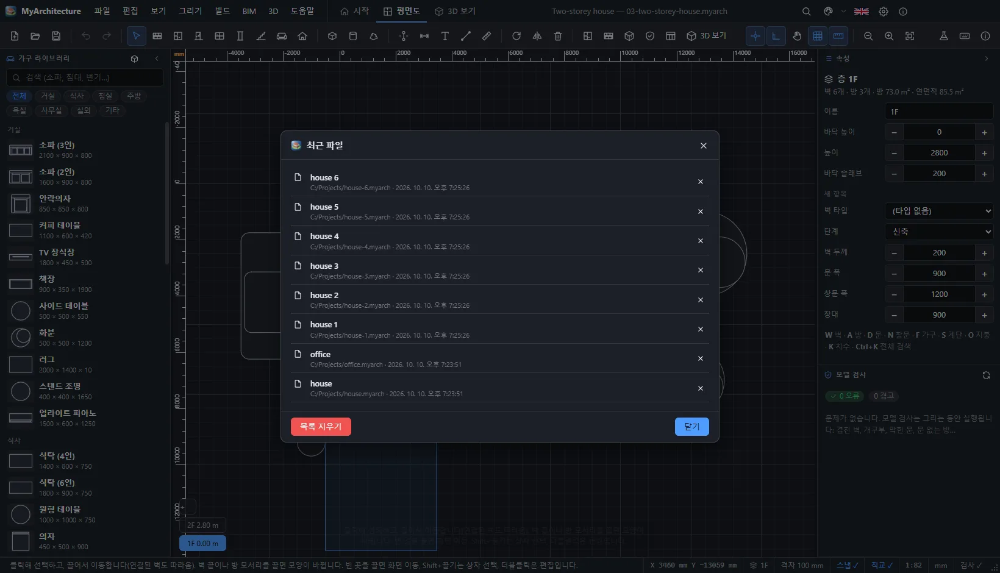
*최근 파일: 10개까지 기억하고 하나씩 지우거나 목록을 비웁니다*

- 열거나 저장한 파일(가져온 DXF·3D 모델 등 포함)을 새것부터 **10개**까지 기억합니다(설정 → 일반 → **최근 파일 기억 개수**, 1 ~ 30). 시작 페이지의 최근 목록에도 같은 개수가 보입니다.
- **파일 → 최근 파일…**: 이름·경로·시각 목록. 누르면 열고, **×**(목록에서 제거)는 하나만 지우고, **목록 지우기**는 전부 지웁니다. 파일 자체는 지워지지 않습니다.
- **파일 → 최근 파일 지우기**, 시작 페이지 **목록 지우기**도 같습니다(“최근 파일 목록을 지웠습니다.”).
- 열 수 없는 파일(옮겨졌거나 지워짐)은 열려고 할 때 목록에서 빠집니다.

### 7.4 가져오기

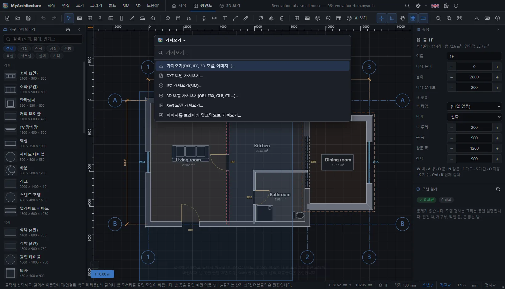
*가져오기: DXF·SVG·IFC·3D 모델·이미지*

**파일 → 가져오기(DXF, IFC, 3D 모델, 이미지…)…**(<kbd>Ctrl</kbd>+<kbd>I</kbd>)는 지원하는 모든 파일을 고르는 창을 엽니다. **파일 → 가져오기 ▸** 는 형식별 명령 목록입니다: 가져오기(전체) · DXF 도면 가져오기… · IFC 가져오기(BIM)… · 3D 모델 가져오기(OBJ, FBX, GLB, STL…)… · SVG 도면 가져오기… · 이미지를 트레이싱 밑그림으로 가져오기….

| 형식 | 가져오는 방법 |
| --- | --- |
| **DXF** (.dxf) | **DXF 도면 가져오기** 창: **파일의 단위**(자동 감지 / mm / cm / m / 인치 / 피트), **층**(넣을 층), **도면을 평면 원점으로 옮기기**. 선, 폴리선, 호, 원, 스플라인, 텍스트, 블록, 해치 윤곽이 각자의 CAD 레이어로 들어옵니다. 끝나면 “… 가져옴: 도면 요소 n개, 텍스트 n개 (단위)”, 주의할 점이 있으면 **가져오기 메모** 창 |
| **SVG** (.svg) | **SVG 도면 가져오기** 창(위와 같은 항목). 경로, 도형, 텍스트가 `SVG` 레이어로 들어옵니다 |
| **IFC** (.ifc) | **지금 프로젝트를 바꿉니다**(저장 확인). 층, 벽, 문·창, 방, 슬래브, 지붕, 계단, 기둥, 가구를 읽어 새 프로젝트(이름 `파일이름.myarch`, 저장 안 된 상태)로 엽니다. “… 가져옴: 층 n개, 벽 n개, 문/창문 n개, 방 n개.” |
| **3D 모델** (.obj .fbx .glb .gltf .stl .dae .3mf .3ds .ply .wrl .amf) | **3D 모델 가져오기 — 이름** 창: **파일의 단위**(자동 감지 …), **위쪽 축**(자동 / Y가 위쪽 / Z가 위쪽). 모델은 **가구 하나**가 되어 지금 층의 화면 가운데(또는 놓은 자리)에 들어오고 프로젝트 파일 안에 저장됩니다. 가구 라이브러리 “가져온 3D 모델”에서 몇 번이든 다시 놓을 수 있습니다. OBJ 는 같은 폴더의 같은 이름 `.mtl` 재질도 읽습니다 |
| **이미지** (.png .jpg .jpeg .webp .gif .bmp) | **이미지를 트레이싱 밑그림으로 가져오기** 창: **평면에서의 이미지 폭**(mm), **불투명도**(10 ~ 100%). 지금 층에 밑그림으로 깔립니다 |
| **프로젝트** (.myarch, .json) | 열기와 같습니다 |

### 7.5 내보내기

**파일 → 내보내기 ▸**: DXF 내보내기(AutoCAD)… · IFC 내보내기(BIM)… · 3D 모델 내보내기… · 평면을 PDF로 내보내기… · 평면을 SVG로 내보내기 · 평면을 PNG 이미지로 내보내기 · 집계표 내보내기(CSV)…. 파일 이름은 프로젝트 제목을 바탕으로 제안됩니다.

| 내보내기 | 옵션과 결과 |
| --- | --- |
| **DXF** | **층** 선택, **층마다 파일 하나**(체크하면 층마다 `제목-층.dxf`). AutoCAD R12 DXF, 밀리미터, 표준 레이어(A-WALL, A-DOOR, A-GLAZ, A-AREA, A-FURN, A-ANNO-DIMS …). 모든 CAD 프로그램에서 열립니다 |
| **IFC** | **IFC 버전**: IFC4 (Reference View) / IFC2X3 (Coordination View 2.0). 층, 개구부가 있는 벽, 문, 창, 공간, 바닥 슬래브, 지붕, 계단, 기둥, 가구 + 벽 타입, 단계, 분류, 그리드, 사용자 속성. Revit, ArchiCAD, BIMcollab, Solibri 등 IFC 뷰어용 |
| **3D 모델** | 7.5.1 참고 |
| **PDF** | 인쇄 창(7.6절)을 PDF 저장용으로 엽니다 |
| **SVG** | 지금 층 평면을 실제 축척(도면 축척)의 mm 크기 SVG 로 `제목-층.svg` |
| **PNG** | **이미지 폭**(1000 ~ 8000 px), **색상: 흑백**. 지금 층 평면을 흰 바탕 이미지로 |
| **CSV** | 일람표 창(6.5절) |

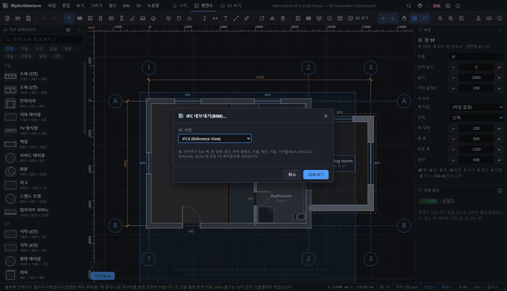
*IFC 내보내기: IFC4 또는 IFC2X3*

#### 7.5.1 3D 모델 내보내기

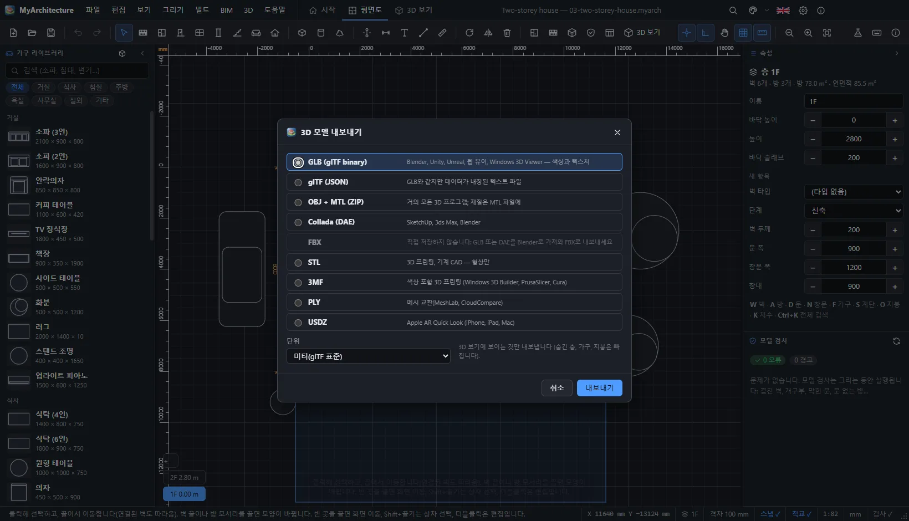
*3D 내보내기: GLB·glTF·OBJ·STL·DAE·3MF·USDZ·PLY, 단위 선택*

**3D → 3D 모델 내보내기…**(또는 3D 도구 모음, 내보내기 ▸):

| 형식 | 용도 | 파일 |
| --- | --- | --- |
| GLB (glTF binary) | Blender, Unity, Unreal, 웹 뷰어, Windows 3D Viewer — 색상과 텍스처 | `.glb` |
| glTF (JSON) | GLB와 같지만 데이터가 내장된 텍스트 파일 | `.gltf` |
| OBJ + MTL (ZIP) | 거의 모든 3D 프로그램; 재질은 MTL 파일에 | `제목-obj.zip` |
| Collada (DAE) | SketchUp, 3ds Max, Blender | `.dae` |
| FBX | 직접 저장하지 않습니다: GLB 또는 DAE를 Blender로 가져와 FBX로 내보내세요 | (선택 불가) |
| STL | 3D 프린팅, 기계 CAD — 형상만 | `.stl` (바이너리) |
| 3MF | 색상 포함 3D 프린팅 (Windows 3D Builder, PrusaSlicer, Cura) | `.3mf` (항상 mm) |
| PLY | 메시 교환(MeshLab, CloudCompare) | `.ply` |
| USDZ | Apple AR Quick Look (iPhone, iPad, Mac) | `.usdz` |

**단위**: 미터(glTF 표준) / 밀리미터(3D 프린팅, CAD). **3D 보기에 보이는 것만** 내보냅니다(숨긴 층, 가구, 지붕은 빠짐).

### 7.6 인쇄와 PDF

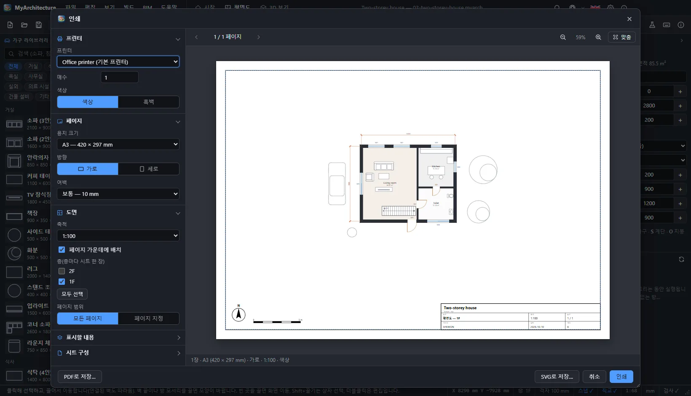
*인쇄 미리 보기: 용지·축척·표제란·방위표, PDF/SVG 로 저장*

**파일 → 인쇄 / PDF…**(<kbd>Ctrl</kbd>+<kbd>P</kbd>) — 왼쪽에 옵션, 오른쪽에 도면 시트 미리 보기(◀ ▶ 로 쪽 넘기기, “1 / 2 — 평면도 — 1F · 1:100”).

**목차** 탭:

- **층(층마다 시트 한 장)**: 인쇄할 층 체크(기본은 지금 층). 하나도 없으면 “층을 하나 이상 선택하세요”.
- **표시**: 가구, 치수, 방 면적, 지붕 (점선), CAD 레이어.
- **색상: 흑백**.

**페이지** 탭:

- **용지**: A4, A3, A2, A1, A0, Letter, Tabloid(기본은 설정 → 출력 → 기본 용지, 처음 A3).
- **방향**: 가로 / 세로.
- **축척**: 페이지에 맞춤, 1:20, 1:50, 1:75, 1:100, 1:150, 1:200, 1:250, 1:500, 1:1000(기본은 프로젝트의 도면 축척). 페이지에 맞춤은 들어가는 가장 가까운 표준 축척을 고릅니다.
- “도면 표제란은 파일 → 프로젝트 속성에서 가져옵니다.”

시트에는 테두리, 오른쪽 아래 **표제란**(제목, 건축주·주소, 도면 “평면도 — 층”, 축척, 도면 번호 n / 전체, 작성자, 날짜, 개정), 왼쪽 아래 **방위표**(북쪽 회전 반영)와 **축척 막대**가 들어갑니다.

단추:

| 단추 | 결과 |
| --- | --- |
| SVG로 저장… | 시트마다 mm 크기 SVG 파일 |
| PDF로 저장… | (데스크톱판) 모든 시트를 PDF 한 파일로 |
| 인쇄… | 운영 체제 인쇄 창(웹판에서는 여기서 “PDF로 저장” 프린터를 고르세요) |

### 7.7 닫힌 형식 (DWG, SKP, RVT, PLN, 3DM)

이 형식들은 제작사 전용 비공개 형식이라 직접 읽지 못합니다. 열려고 하면 **지원하지 않는 형식** 창이 다음 방법을 알려 주고 **지원 파일 형식…** 단추를 보여 줍니다.

| 파일 | 방법 |
| --- | --- |
| DWG (AutoCAD) | CAD 프로그램(AutoCAD, BricsCAD, ZWCAD, DraftSight, LibreCAD 또는 무료 ODA File Converter)에서 **DXF 로 저장**한 뒤 DXF 를 가져오세요 |
| SKP (SketchUp) | SketchUp 에서 파일 → 내보내기 → 3D 모델 → **Collada (.dae), OBJ 또는 glTF** 로 내보낸 뒤 가져오세요 |
| RVT (Revit) | Revit 에서 File → Export → **IFC** 로 내보낸 뒤 가져오세요 |
| PLN (ArchiCAD) | ArchiCAD 에서 **IFC 로 저장**한 뒤 가져오세요 |
| 3DM (Rhino) | Rhino 에서 **OBJ, STL 또는 glTF** 로 내보낸 뒤 가져오세요 |

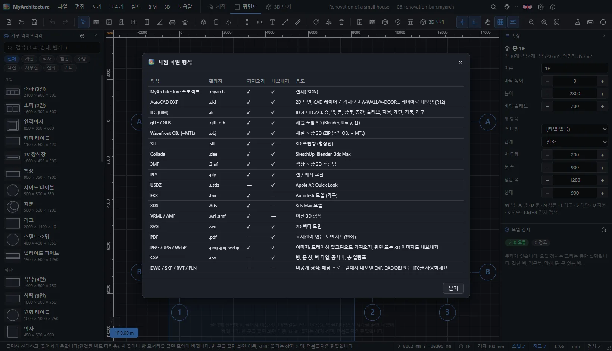
*지원 형식: 열기·가져오기·내보내기 형식 목록*

**도움말 → 지원 파일 형식…** 은 12.1절의 표를 보여 줍니다.

---

## 8. 설정과 꾸미기

### 8.1 설정 창

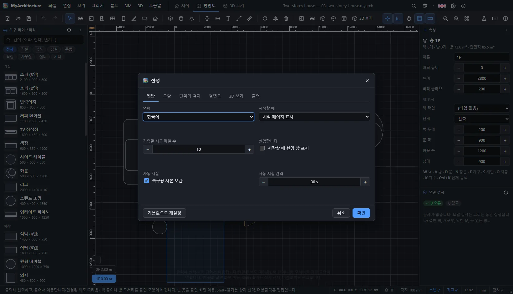
*설정(Ctrl+,): 일반·도면·벽·3D·출력 등 탭, 숫자는 − / + 로 조절*

**도움말 → 설정…**(<kbd>Ctrl</kbd>+<kbd>,</kbd>, 제목 표시줄 톱니바퀴). 탭은 **일반 · 모양 · 단위와 격자 · 평면도 · 3D 보기 · 출력**. **확인**으로 적용, **취소**로 버림, **기본값으로 재설정**(왼쪽 아래)은 확인을 거쳐 모든 설정을 처음 값으로(테마는 Midnight).

#### 일반

| 항목 | 값 | 기본 |
| --- | --- | --- |
| 언어 | 한국어 / English | 시스템 언어 |
| 시작할 때 | 시작 페이지 표시 / 마지막 프로젝트 다시 열기 | 시작 페이지 |
| 최근 파일 기억 개수 | 1 ~ 30 (시작 페이지·최근 파일 목록에 보이는 개수) | 10 |
| 환영합니다 | 시작할 때 환영 창 표시 | 끔 |
| 자동 저장 | 복구용 사본 보관 | 켬 |
| 자동 저장 간격 | 10 s, 15 s, 30 s, 1 min, 2 min, 5 min, 10 min | 30 s |

#### 모양

| 항목 | 값 | 기본 |
| --- | --- | --- |
| 테마 | 지금 테마 이름 + **테마…** 단추(테마 갤러리) | Midnight |
| 화면 크기 | 80% ~ 150% (80, 90, 100, 110, 125, 140, 150) | 100% |
| 애니메이션 | 대화 상자, 메뉴, 시작 페이지에 애니메이션 사용 | 켬 |
| 힌트 | 캔버스에 도구 힌트 표시 | 켬 |
| 힌트 표시 시간 | 항상, 3, 5, 7, 10, 15, 30 s | 7 s |

#### 단위와 격자

| 항목 | 값 | 기본 |
| --- | --- | --- |
| 단위 | mm / cm / m / 피트 / 인치(피트 단위 표시) | mm |
| 격자 | 10, 25, 50, 100, 250, 500, 1000 mm | 100 mm |
| 격자 모양 | 선 (5 × 5) / 점 | 선 |
| 격자 | 격자 표시 | 켬 |
| 눈금자 | 캔버스 가장자리에 눈금자 표시 | 켬 |
| 스냅 | 격자, 벽 끝점, 벽에 스냅 | 켬 |
| 도면 | 벽을 45° 단위로 그리기 (Shift를 누르면 임의 각도) | 켬 |
| 빈 캔버스에서 왼쪽 끌기 | 보기 이동 (Shift+드래그 = 상자 선택) / 상자 선택 | 보기 이동 |
| 휠 확대/축소 속도 | × 0.5 ~ × 3 | × 1 |

단위는 좌표·길이 표시와 눈금자에 쓰입니다(내부와 입력 기본은 mm, 길이 입력에는 단위를 붙일 수 있음). 상태 표시줄 단위 칸으로도 바꿉니다.

#### 평면도

| 항목 | 값 | 기본 |
| --- | --- | --- |
| 벽 그리기 | 채우기 (포셰) / 해치 / 윤곽선만 | 채우기 |
| 표시 | 치수 · 가구 · 방 면적 · 문·창문 태그 | 모두 켬 |
| 표시 | 아래층 (흐리게) · 지붕 (점선) · 이미지 밑그림 · CAD 레이어 | 모두 켬 |
| 검사 항목 | 그리는 동안 모델 검사 실행 | 켬 |
| 평면·3D 연동 선택 | 평면에서 선택하면 3D에서 강조되고, 그 반대도 마찬가지 | 켬 |
| 새 지붕 | 박공 / 모임 / 외쪽 / 평 | 박공 |

#### 3D 보기

| 항목 | 값 | 기본 |
| --- | --- | --- |
| 3D 배경 | 하늘 / 테마 색 | 하늘 |
| 3D 그림자 | 태양 그림자 | 켬 |
| 시야각 | 20° ~ 90° (5° 단위) | 45° |
| 회전 속도 | × 0.25 ~ × 3 | × 1 |
| 3D 측정 단위 | 미터(m) / 피트(ft) — 격자 눈금, 건물 치수, 줄자 | 미터 |
| 시작 시 표시 | 축척 표시 격자 · 지면 | 모두 켬 |
| 태양 방위각 | 0° ~ 355° | 135° |
| 태양 고도 | 5° ~ 90° | 45° |

#### 출력

| 항목 | 값 | 기본 |
| --- | --- | --- |
| 기본 용지 | A4, A3, A2, A1, A0, Letter, Tabloid | A3 |

#### 기본 크기 (빌드 메뉴)

**빌드 → 기본 크기 (벽, 문, 창문)…** 는 새로 그릴 요소의 크기입니다(“새 벽, 문, 창문에 이 크기가 쓰입니다.”): 벽 두께(200), 계단 폭(1000), 문 폭(900), 문 높이(2100), 창문 폭(1200), 창문 높이(1200), 창대(900), 텍스트 크기(300), 문 종류(외여닫이/양개/미닫이), 창문 유형(여닫이창/고정/미닫이), 벽 재료(회반죽), 바닥 재료(오크 마루). 괄호는 처음 값입니다. 이 값들은 프로그램 설정으로 저장되어 다른 프로젝트에도 쓰입니다.

### 8.2 테마

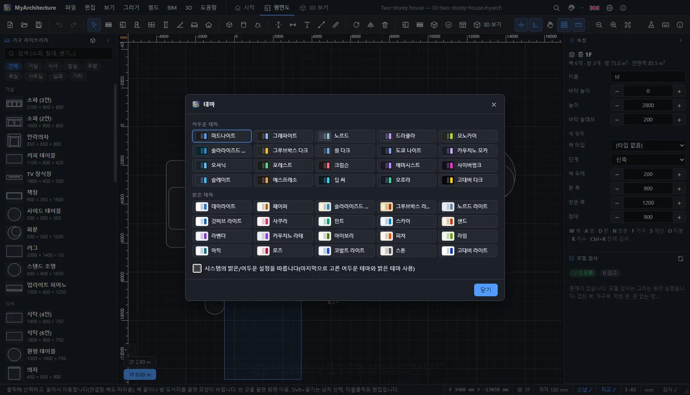
*테마: 다크·라이트 40가지와 사용자 테마*

- 제목 표시줄 **팔레트 단추**: 무작위 테마(“테마: 이름” 알림).
- **▾ (테마 선택)**: 어두운 테마 20 · 밝은 테마 20 · **사용자 테마** 세 열. 지금 테마가 강조됩니다. **새 사용자 테마…**, 사용자 테마의 **×**(삭제), **자동 → 시스템 설정 따르기**.
- **테마 갤러리**(설정 → 모양 → 테마…, 명령 팔레트 “테마…”): 견본 카드 갤러리와 “시스템의 밝은/어두운 설정을 따릅니다(마지막으로 고른 어두운 테마와 밝은 테마 사용)” 체크.
- **사용자 테마** 창: 이름, 유형(어둡게/밝게), 강조색, 배경, 패널, 텍스트 색. 바꾸는 즉시 프로그램 전체와 평면 캔버스에 미리 적용됩니다. **테마 저장**.
- 평면 도면과 3D 배경(하늘 그라데이션)도 테마의 밝기를 따릅니다.

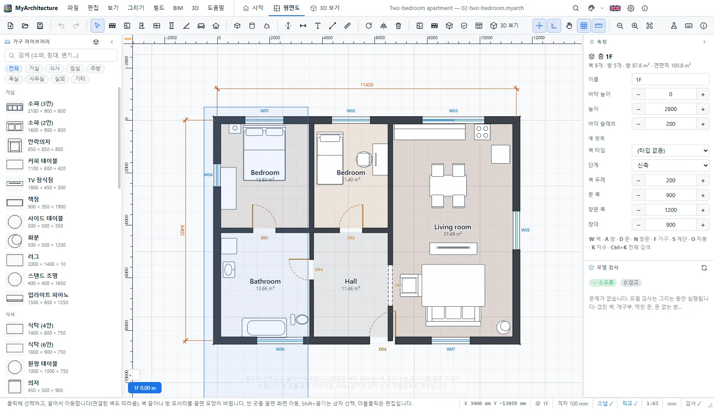
*라이트 테마의 평면도*

**보기** 메뉴 끝의 **테마…**, **어두운 테마**, **밝은 테마**, **시스템 테마**(그리고 명령 팔레트)로도 바로 바꿀 수 있습니다.

### 8.3 언어

제목 표시줄의 **국기 단추**(한국어 ↔ English), 설정 → 일반 → 언어, 또는 명령 팔레트의 **한국어 / English**. 바로 바뀌며 다시 시작할 필요가 없습니다. 처음 실행할 때는 시스템 언어가 한국어면 한국어로 시작합니다.

### 8.4 화면 크기 (UI 배율)

설정 → 모양 → **화면 크기**로 글자·단추·패널 전체를 80% ~ 150% 로 키우거나 줄입니다. 고해상도 화면이나 발표할 때 유용합니다.

### 8.5 정보 창

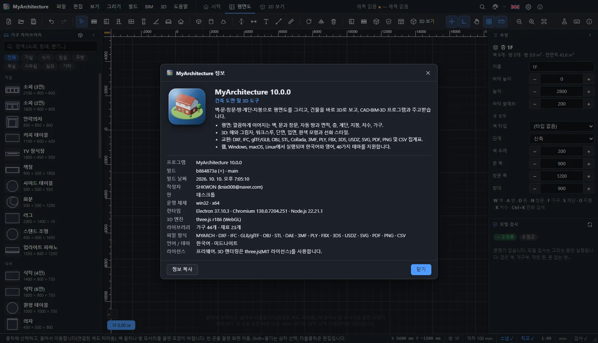
*정보 창: 버전과 빌드 정보*

**도움말 → MyArchitecture 정보**(제목 표시줄 ⓘ): 프로그램 아이콘, “건축 도면 및 3D 도구” 설명과 기능 네 줄, 그리고 프로그램 · 빌드(커밋·브랜치) · 빌드 날짜 · 작성자 · 판(데스크톱/웹) · 운영 체제 · 런타임 · 3D 엔진(three.js) · 라이브러리(가구·재료 수) · 파일 형식 · 언어 / 테마 · 라이선스(프리웨어) 표. **정보 복사**는 이 표를 클립보드로 복사합니다(문의할 때 붙여 넣으세요).

---

## 9. 튜토리얼

**도움말 → 따라 하는 튜토리얼**(시작 페이지 첫 카드, 도구 모음의 플라스크 단추)은 실제 프로그램을 움직이며 모든 기능을 가르칩니다. 지금 프로젝트를 바꾸므로 저장하지 않은 변경이 있으면 먼저 저장 여부를 묻습니다.

### 9.1 두 가지 모드

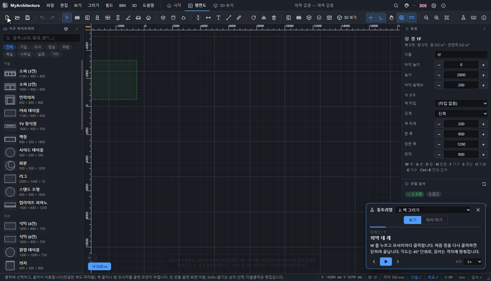
*튜토리얼 보기 모드: 프로그램이 직접 각 단계를 실행합니다*

- **보기**: 프로그램이 커서를 움직이며 각 단계를 직접 실행합니다. ▶ **자동 재생** / ■ **일시 정지**, **이전 단계**, **다음 단계 실행**, **속도** 0.5× · 1× · 2× · 4×.

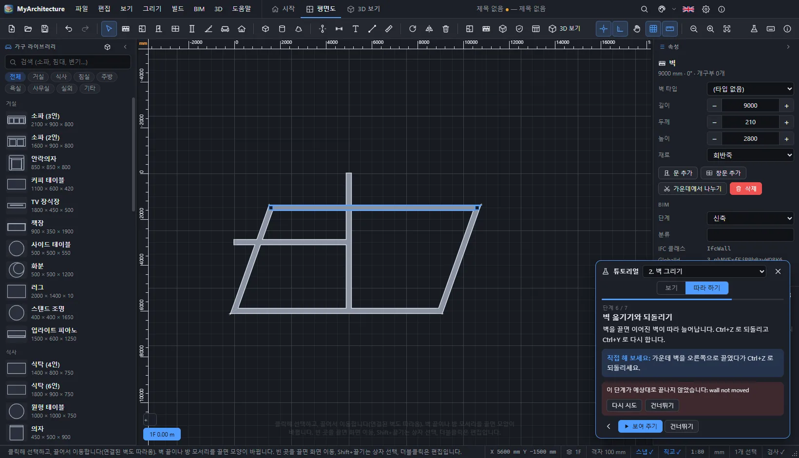
*튜토리얼 따라 하기 모드: 할 곳이 표시되고, 직접 하면 자동으로 확인합니다*

- **따라 하기**: “직접 해 보세요:” 아래 할 일이 나오고, 눌러야 할 곳이 화면에 표시됩니다. 해내면 자동으로 확인하고(“✓ 잘했습니다!”) 잠시 뒤 다음 단계로 넘어갑니다. 막히면 **보여 주기**(프로그램이 대신 실행), 할 일이 없는 설명 단계는 **다음**, 건너뛰려면 **건너뛰기**.

튜토리얼 창은 제목 부분을 끌어 옮길 수 있고, 위쪽 목록에서 레슨을 바로 고를 수 있습니다. 진행 막대와 “단계 n / 전체”가 보입니다. 앞 레슨의 결과가 필요한 레슨을 바로 고르면 “앞 레슨의 결과를 빠르게 만드는 중…” 후에 시작합니다. 단계가 예상대로 끝나지 않으면 **다시 시도 / 건너뛰기**를 고릅니다.

### 9.2 레슨 목록 (16개 레슨, 83단계)

| # | 레슨 | 다루는 것 |
| --- | --- | --- |
| 1 | 화면 둘러보기 | 예제 열기, 전체 보기, 화면 이동, 층 바꾸기, 3D 보기, 평면으로 돌아가기, Ctrl+K |
| 2 | 벽 그리기 | 새 프로젝트, 외벽 네 개, 칸막이 벽(T 이음), 길이 입력, 벽 두께, 벽 옮기기와 되돌리기, 되돌리기·다시 실행 단추 |
| 3 | 문과 창문 | 현관문, 창문, 안쪽 문, 여는 방향(X/H), 문 폭 |
| 4 | 방과 면적 | 벽 안을 클릭해 방, 이름 바꾸기, 방 번호와 면적 |
| 5 | 가구 배치 | 라이브러리, 회전, F 검색, 끌어서 옮기기, 속성 창 |
| 6 | 편집: 선택, 복사, 그룹 | 상자 선택, 복제와 삭제, 되돌리기 기록, 그룹, 그룹 해제, 크기 조정 |
| 7 | 치수, 문자, 그리드 | 자동 치수, 치수, 텍스트, 측정, 구조 그리드, CAD 선 |
| 8 | 층과 계단 | 계단, 위층 추가, 층 속성, 아래층으로 |
| 9 | 지붕과 기둥 | 지붕 자동 생성, 모임지붕, 기둥 |
| 10 | 매스 모델링 (스케치업 방식) | 매스 상자, 높이와 테이퍼, 원기둥, 밀기/끌기, 페인트 통, 줄자, 장면 |
| 11 | BIM: 벽 타입, 속성, 단계 | 벽 타입, 타입 지정, BIM 속성, 시공 단계, 비슷한 요소 선택, 집계표와 공사비 |
| 12 | 모델 검사 | 문제 만들기, 검사 실행, 고치기 |
| 13 | 3D 보기 자세히 | 시점, 표현 스타일, 단면, 직교 투영과 입면, 걷기, 일조 분석, 3D 에서 선택 |
| 14 | 가져오기와 내보내기 | DXF·3D 모델·이미지 가져오기, 3D·DXF·IFC 내보내기, 인쇄와 PDF |
| 15 | 설정과 화면 꾸미기 | 설정, 테마, 단위, 상태 표시줄과 창 크기, 패널 접기 |
| 16 | 예제로 고급 기능 익히기 | 리모델링 단계, 매스 장면 재생, 공동주택 단면, DXF 따라 그리기 |

레슨 2 ~ 14 는 작은 집 하나를 차례로 완성합니다. 레슨 1, 2, 16 은 혼자서도 시작할 수 있습니다. 모든 레슨을 마치면 만든 프로젝트가 그대로 열려 있으니 저장하거나 계속 고쳐 보세요.

### 9.3 튜토리얼과 내 설정

튜토리얼이 열려 있는 동안에는 레슨이 설명한 대로 동작하도록 그리기 설정(격자, 스냅, 직교, 단위, 단계 보기, 패널 표시, 3D 보기 상태 등)을 **잠시 기본값으로** 바꿉니다. 튜토리얼을 닫으면(✕ **튜토리얼 끝내기**) **내 설정이 그대로 돌아옵니다**. 테마, 언어, 화면 크기, 애니메이션, 힌트, 자동 저장, 최근 파일 수, 시작 설정은 처음부터 건드리지 않습니다.

### 9.4 튜토리얼 동영상

프로그램 폴더의 **`MyArchitecture-Tutorial.mp4`** 는 튜토리얼 전체(16개 레슨)를 보기 모드로 녹화한 동영상입니다. 프로그램을 켜지 않고 미리 보거나, 강의 자료로 쓰세요.

---

## 10. 단축키 전체 표

**도움말 → 단축키**(<kbd>Ctrl</kbd>+<kbd>/</kbd>, 도구 모음 키보드 단추)에서도 같은 키를 일반 · 평면도 · 탐색 · 3D 묶음으로 볼 수 있습니다.

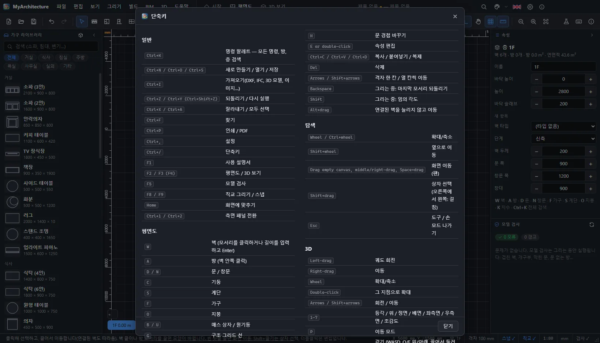
*단축키 목록(Ctrl+/ 또는 도움말 → 단축키)*

### 일반

| 키 | 동작 |
| --- | --- |
| <kbd>Ctrl</kbd>+<kbd>K</kbd> | 명령 팔레트 — 모든 명령, 방, 층 검색 |
| <kbd>Ctrl</kbd>+<kbd>N</kbd> | 새 프로젝트 |
| <kbd>Ctrl</kbd>+<kbd>O</kbd> | 열기 |
| <kbd>Ctrl</kbd>+<kbd>S</kbd> | 저장 |
| <kbd>Ctrl</kbd>+<kbd>Shift</kbd>+<kbd>S</kbd> | 다른 이름으로 저장 |
| <kbd>Ctrl</kbd>+<kbd>I</kbd> | 가져오기 (DXF, IFC, 3D 모델, 이미지…) |
| <kbd>Ctrl</kbd>+<kbd>P</kbd> | 인쇄 / PDF |
| <kbd>Ctrl</kbd>+<kbd>Z</kbd> | 되돌리기 |
| <kbd>Ctrl</kbd>+<kbd>Y</kbd> 또는 <kbd>Ctrl</kbd>+<kbd>Shift</kbd>+<kbd>Z</kbd> | 다시 실행 |
| <kbd>Ctrl</kbd>+<kbd>F</kbd> | 찾기 |
| <kbd>Ctrl</kbd>+<kbd>,</kbd> | 설정 |
| <kbd>Ctrl</kbd>+<kbd>/</kbd> | 단축키 |
| <kbd>Ctrl</kbd>+<kbd>1</kbd> / <kbd>Ctrl</kbd>+<kbd>2</kbd> | 왼쪽 / 오른쪽 패널 접기·펴기 |
| <kbd>F1</kbd> | 사용 설명서 |
| <kbd>F2</kbd> | 평면도 |
| <kbd>F3</kbd> (또는 <kbd>F4</kbd>) | 3D 보기 |
| <kbd>F5</kbd> | 모델 검사 |
| <kbd>F8</kbd> | 직교 그리기 켜기/끄기 |
| <kbd>F9</kbd> | 스냅 켜기/끄기 |
| <kbd>Home</kbd> | 화면에 맞추기 (평면·3D) |
| <kbd>Alt</kbd>+<kbd>F4</kbd> | 끝내기 (데스크톱) |

### 평면도 — 도구

| 키 | 도구 |
| --- | --- |
| <kbd>W</kbd> | 벽 |
| <kbd>A</kbd> | 방 |
| <kbd>D</kbd> / <kbd>N</kbd> | 문 / 창문 |
| <kbd>C</kbd> | 기둥 |
| <kbd>S</kbd> | 계단 |
| <kbd>F</kbd> | 가구 (검색 창) |
| <kbd>O</kbd> | 지붕 |
| <kbd>B</kbd> / <kbd>U</kbd> | 매스 상자 / 매스 원기둥 |
| <kbd>G</kbd> | 그리드 선 |
| <kbd>K</kbd> | 치수 |
| <kbd>T</kbd> | 텍스트 |
| <kbd>L</kbd> | 선 |
| <kbd>M</kbd> | 측정 |
| <kbd>Esc</kbd> | 그리기 끝 → 측정·계단 취소 → 손 모드 끄기 → 선택 도구 → 선택 해제 (차례로) |

### 평면도 — 편집

| 키 | 동작 |
| --- | --- |
| <kbd>R</kbd> / <kbd>Shift</kbd>+<kbd>R</kbd> | 90° 회전 / 반대로 15° 회전 (가구·기둥을 놓는 중에는 미리 보기 회전) |
| <kbd>X</kbd> / <kbd>Y</kbd> | 좌우 대칭(문이면 여는 쪽 뒤집기) / 상하 대칭 |
| <kbd>H</kbd> | 문 경첩 바꾸기 |
| <kbd>E</kbd> 또는 더블클릭 | 속성 편집 |
| <kbd>Ctrl</kbd>+<kbd>C</kbd> / <kbd>Ctrl</kbd>+<kbd>X</kbd> / <kbd>Ctrl</kbd>+<kbd>V</kbd> | 복사 / 잘라내기 / 붙여넣기(커서 위치) |
| <kbd>Ctrl</kbd>+<kbd>D</kbd> | 복제 |
| <kbd>Ctrl</kbd>+<kbd>A</kbd> | 모두 선택 |
| <kbd>Ctrl</kbd>+<kbd>G</kbd> / <kbd>Ctrl</kbd>+<kbd>Shift</kbd>+<kbd>G</kbd> | 그룹 / 그룹 해제 |
| <kbd>Del</kbd> / <kbd>Backspace</kbd> | 삭제 |
| 방향키 / <kbd>Shift</kbd>+방향키 | 격자 한 칸 / 열 칸 이동 |
| <kbd>Ctrl</kbd>+<kbd>=</kbd> / <kbd>Ctrl</kbd>+<kbd>-</kbd> | 확대 / 축소 |

### 평면도 — 그리는 중

| 키 | 동작 |
| --- | --- |
| 숫자 또는 `.` | 길이 입력 칸 열기 (벽·선) |
| <kbd>Enter</kbd> | 그리기 끝(벽·선·방·지붕·매스 다각형) |
| <kbd>Backspace</kbd> | 마지막 모서리 되돌리기 |
| <kbd>Shift</kbd> 누른 채 | 자유 각도 |
| <kbd>Shift</kbd>+클릭 | 방·지붕: 모서리 직접 그리기 / 가구: 계속 놓기 |
| <kbd>Alt</kbd>+끌기 | 이어진 벽을 늘리지 않고 이동 |
| <kbd>Alt</kbd>+클릭 | 그룹 안의 하나만 선택 |

### 탐색 (평면도)

| 키·동작 | 결과 |
| --- | --- |
| 휠 / <kbd>Ctrl</kbd>+휠 / 핀치 | 확대·축소 |
| <kbd>Shift</kbd>+휠 | 가로 이동 |
| 빈 곳 끌기, 가운데·오른쪽 끌기, <kbd>Space</kbd>+끌기 | 화면 이동 |
| <kbd>Shift</kbd>+끌기, <kbd>Ctrl</kbd>+끌기 | 상자 선택 (오른쪽에서 왼쪽: 걸침) |
| 오른쪽 클릭 (움직이지 않고) | 오른쪽 클릭 메뉴 |

### 3D

| 키·동작 | 결과 |
| --- | --- |
| 왼쪽 끌기 / 오른쪽 끌기 / 휠 | 회전 / 이동 / 확대·축소 (이동 모드에서는 왼쪽·오른쪽이 바뀜) |
| 더블클릭 | 그 점으로 다가가기 |
| <kbd>1</kbd> ~ <kbd>7</kbd> | 등각 / 위 / 정면 / 배면 / 좌측면 / 우측면 / 조감도 |
| <kbd>P</kbd> | 이동 모드 |
| <kbd>V</kbd> | 걷기 (WASD, Q/E 위/아래, 끌어서 둘러보기) |
| <kbd>O</kbd> | 직교(평행) 투영 |
| <kbd>X</kbd> | 단면 |
| <kbd>G</kbd> | 격자 |
| 방향키 / <kbd>Shift</kbd>+방향키 | 회전 / 이동 |
| <kbd>Esc</kbd> | 도구(밀기/끌기·페인트 통·줄자) 끄기 → 걷기·이동 모드 끝내기 |

### 걷기 중

| 키 | 동작 |
| --- | --- |
| <kbd>W</kbd> <kbd>A</kbd> <kbd>S</kbd> <kbd>D</kbd> | 앞 / 왼쪽 / 뒤 / 오른쪽 |
| <kbd>↑</kbd> <kbd>↓</kbd> | 앞 / 뒤 |
| <kbd>←</kbd> <kbd>→</kbd> | 왼쪽 / 오른쪽으로 돌기 |
| <kbd>E</kbd> / <kbd>Page Up</kbd>, <kbd>Q</kbd> / <kbd>Page Down</kbd> | 올라가기, 내려가기 |
| <kbd>Shift</kbd> | 달리기 |
| 끌기 / 휠 | 둘러보기 / 한 걸음 앞뒤 |
| <kbd>Esc</kbd>, <kbd>V</kbd> | 걷기 끝 |

---

## 11. 문제 해결과 FAQ

**프로그램이 열리지 않거나 두 번째 창이 안 열립니다.**
MyArchitecture 는 하나만 실행됩니다. 이미 실행 중이면 그 창이 앞으로 나오고 파일이 그 창에서 열립니다. 작업 표시줄에서 기존 창을 찾아 보세요.

**벽이 원하는 각도로 안 그려집니다 / 길이가 100 단위로만 바뀝니다.**
직교(<kbd>F8</kbd>)가 켜져 있으면 45° 단위·격자 단위로 맞춰집니다. <kbd>Shift</kbd> 를 누른 채 그리거나, 직교·스냅(<kbd>F9</kbd>)을 끄거나, 격자 간격을 줄이거나, 숫자로 길이와 각도(`3600<30`)를 입력하세요.

**A 로 클릭했는데 방이 안 생깁니다.**
벽이 완전히 닫혀 있어야 합니다. 벽 끝이 서로(또는 다른 벽 위에) 정확히 닿았는지 확인하세요 — 벽을 그릴 때 끝점(주황 네모)이나 벽(초록 삼각형) 스냅 표시가 떠야 닿은 것입니다. 닫히지 않은 곳은 <kbd>Shift</kbd>+클릭으로 모서리를 직접 그려 방을 만들 수 있습니다. 너무 작은 영역(0.01 m² 미만)은 무시됩니다.

**문을 넣으려는데 “이 벽은 너무 짧아 넣을 수 없습니다.”**
벽 길이가 문 폭 + 20 mm 보다 짧습니다. 오른쪽 패널 **새 항목 → 문 폭**을 줄이거나 벽을 늘리세요. 벽이 여러 조각으로 나뉘어 있으면 오른쪽 클릭 → **일직선 벽 합치기**.

**빈 곳을 끌었는데 상자 선택이 아니라 화면이 움직입니다.**
기본값입니다. <kbd>Shift</kbd>+끌기를 쓰거나, 설정 → 단위와 격자 → 빈 캔버스에서 왼쪽 끌기 → **상자 선택**으로 바꾸세요.

**요소를 끌었는데 화면만 움직입니다.**
손(이동) 모드가 켜져 있습니다. <kbd>Esc</kbd> 나 도구 모음의 손 단추로 끄세요.

**3D 가 비어 있거나 일부가 안 보입니다.**
3D 왼쪽 패널의 **층** 체크, **표시**(가구·지붕·매스 모델), **단계** 보기, **단면**을 확인하세요. 탐색이 꼬였으면 <kbd>1</kbd>(등각) 또는 <kbd>Home</kbd>. “3D 보기를 사용할 수 없습니다”가 나오면 그래픽 드라이버(WebGL)를 확인하세요.

**3D 에서 클릭해도 선택이 안 됩니다.**
밀기/끌기·페인트 통·줄자 도구가 켜져 있으면 클릭이 도구로 갑니다. <kbd>Esc</kbd> 로 끄세요. 단면으로 잘려 나간 부분은 선택되지 않습니다.

**모델 검사 경고를 무시하고 싶습니다.**
경고는 작업을 막지 않습니다. 그리는 동안 계속 검사하는 것이 거슬리면 설정 → 평면도 → **그리는 동안 모델 검사 실행**을 끄고 필요할 때 <kbd>F5</kbd> 를 누르세요.

**가져온 DXF 가 너무 크거나 작습니다 / 엉뚱한 곳에 있습니다.**
가져오기 창에서 **파일의 단위**를 직접 고르고, **도면을 평면 원점으로 옮기기**를 체크하세요. 그다음 <kbd>Home</kbd>.

**가져온 3D 모델 크기가 이상합니다 / 누워 있습니다.**
가져오기 창의 **파일의 단위**와 **위쪽 축**(Y가 위쪽 / Z가 위쪽)을 바꿔 다시 가져오세요. 들어온 뒤에도 오른쪽 패널에서 폭·깊이·높이를 바꾸거나 크기 조정…을 쓸 수 있습니다.

**DWG / SKP / RVT 파일을 열고 싶습니다.**
직접 읽을 수 없습니다. 7.7절처럼 DXF / DAE·OBJ·glTF / IFC 로 바꿔서 가져오세요.

**PDF 로 저장 단추가 없습니다.**
웹판에는 없습니다. **인쇄…** 를 누른 뒤 브라우저 인쇄 창에서 “PDF로 저장”을 고르세요. 또는 **SVG로 저장…**.

**저장 안 하고 꺼졌습니다.**
자동 저장이 켜져 있었다면 다음 실행 때 **작업 복구** 창에서 **복원**을 누르세요(7.2절).

**튜토리얼을 하고 나니 격자·단위 설정이 바뀌었습니다.**
튜토리얼은 닫을 때 설정을 되돌립니다. 튜토리얼 창의 ✕(튜토리얼 끝내기)로 닫았는지 확인하세요. 프로그램을 강제로 껐다면 설정 창에서 다시 맞추세요.

**화면이 너무 작거나 큽니다 / 창을 더 좁힐 수 없습니다.**
설정 → 모양 → **화면 크기**를 바꾸세요. 창의 최소 크기는 메뉴·탭·도구 모음 단추가 하나도 가려지지 않도록 정해지므로, 화면 크기를 줄이면 창도 더 좁힐 수 있습니다.

**설정을 처음으로 돌리고 싶습니다.**
설정 → **기본값으로 재설정**. 완전히 지우려면 프로그램을 끄고 `settings.json`(1.2절 위치)을 지우세요.

**F1 을 눌렀는데 설명서가 안 열립니다.**
<kbd>F1</kbd> 은 프로그램 폴더의 `docs/USERSGUIDE.ko.html`(영어 화면에서는 `USERSGUIDE.en.html`)을 별도 창으로 엽니다. 이 HTML 은 이 문서(`UsersGuide.md`)로 만들어지므로, 열리지 않으면 `UsersGuide.md` 를 직접 열어도 같은 내용입니다.

---

## 12. 부록

### 12.1 지원 형식 표

| 형식 | 확장자 | 가져오기 | 내보내기 | 용도 |
| --- | --- | :---: | :---: | --- |
| MyArchitecture 프로젝트 | .myarch | ✓ | ✓ | 전체(JSON) |
| AutoCAD DXF | .dxf | ✓ | ✓ | 2D 도면; CAD 레이어로 가져오고 A-WALL/A-DOOR… 레이어로 내보냄 (R12) |
| IFC (BIM) | .ifc | ✓ | ✓ | IFC4 / IFC2X3: 층, 벽, 문, 창문, 공간, 슬래브, 지붕, 계단, 기둥, 가구 |
| glTF / GLB | .gltf .glb | ✓ | ✓ | 재질 포함 3D (Blender, Unity, 웹) |
| Wavefront OBJ (+MTL) | .obj | ✓ | ✓ | 재질 포함 3D (ZIP 안의 OBJ + MTL) |
| STL | .stl | ✓ | ✓ | 3D 프린팅 (형상만) |
| Collada | .dae | ✓ | ✓ | SketchUp, Blender, 3ds Max |
| 3MF | .3mf | ✓ | ✓ | 색상 포함 3D 프린팅 |
| PLY | .ply | ✓ | ✓ | 점 / 메시 교환 |
| USDZ | .usdz | — | ✓ | Apple AR Quick Look |
| FBX | .fbx | ✓ | — | Autodesk 모델 (가구) |
| 3DS | .3ds | ✓ | — | 3ds Max 모델 |
| VRML / AMF | .wrl .amf | ✓ | — | 이전 3D 형식 |
| SVG | .svg | ✓ | ✓ | 2D 벡터 도면 |
| PDF | .pdf | — | ✓ | 표제란이 있는 도면 시트(인쇄) |
| PNG / JPG / WebP | .png .jpg .webp (가져오기는 .jpeg .gif .bmp 도) | ✓ | ✓ | 이미지: 트레이싱 밑그림으로 가져오기, 평면 또는 3D 이미지로 내보내기 |
| CSV | .csv | — | ✓ | 방, 문/창문, 벽 타입, 공사비, 층 집계표 |
| DWG / SKP / RVT / PLN (/ 3DM) | | — | — | 비공개 형식: 해당 프로그램에서 내보낸 DXF, DAE/OBJ 또는 IFC를 사용하세요 |

Windows 설치본은 `.myarch` 와 함께 DXF, IFC, SVG, OBJ, STL, PLY, GLB, glTF, FBX, DAE, 3MF, 3DS, WRL, AMF 를 MyArchitecture 로 열 수 있게 연결할 수 있습니다.

### 12.2 모델 검사 규칙 표

| 코드 | 규칙 | 등급 | 화면 메시지 | 기준 |
| --- | --- | --- | --- | --- |
| `wall-short` | 두께보다 짧은 벽 | 경고 | 벽 길이가 {len} mm밖에 되지 않습니다. | 길이 < max(50 mm, 두께 × 0.75) |
| `wall-duplicate` | 겹친 벽 | 오류 | 두 벽이 {len} mm 겹칩니다. | 같은 선 위의 두 벽이 두께(최소 50 mm)보다 많이 겹침 |
| `opening-outside` | 벽 끝을 벗어난 개구부 | 오류 | {tag}이(가) 벽 끝을 넘어갑니다. | 문·창이 벽 시작·끝 밖으로 나감 |
| `opening-overlap` | 겹친 개구부 | 오류 | {a}와(과) {b}이(가) 겹칩니다. | 한 벽의 이웃한 문·창이 겹침 |
| `opening-tall` | 벽보다 높은 개구부 | 오류 | {tag}이(가) 벽보다 높습니다 ({h} mm > {wh} mm). | 창대 + 높이 > 벽 높이 |
| `door-blocked` | 가구가 문 열림을 막음 | 경고 | {tag}을(를) 끝까지 열 수 없습니다: 여닫는 범위에 가구가 있습니다. | 여닫이 문(미닫이·차고문 제외)의 회전 범위에 높이 150 mm 이상 가구 |
| `furniture-wall` | 벽 안에 놓인 가구 | 경고 | 가구가 벽과 겹칩니다. | 가구가 벽 몸체와 겹침(러그·2 m 이상 높이에 띄운 가구·개구부 앞 제외) |
| `room-small` | 아주 작은 방 | 경고 | 방 "{name}"은(는) {a} m²밖에 되지 않습니다. | 면적 < 1.5 m² |
| `room-overlap` | 겹친 방 | 경고 | 방 "{a}"와(과) "{b}"이(가) 겹칩니다. | 같은 층 두 방이 겹침 |
| `room-no-door` | 문이나 개구부가 없는 방 | 경고 | 방 "{name}"에 문이나 개구부가 없습니다. | 방 둘레 가까이에 문·개구부가 없고 방 안에 계단도 없음 |
| `stair-top` | 맨 위층의 계단 | 경고 | 맨 위층의 계단이 어디로도 이어지지 않습니다. | 위층이 없는 층의 계단 |
| `clash-furniture` | 간섭: 가구끼리 | 경고 | 간섭: 가구 두 개가 겹칩니다. | 높이 범위가 겹치는 두 가구(의자·바 스툴·사무용 의자, 러그 제외) |
| `clash-stair` | 간섭: 계단과 벽 | 오류 | 간섭: 계단이 벽과 부딪칩니다. | 계단 평면이 벽과 겹침 |
| `clash-column` | 간섭: 문이나 창문 안의 기둥 | 오류 | 간섭: 기둥이 {tag}을(를) 막고 있습니다. | 기둥이 문·창 자리와 겹침 |

`{tag}` 는 문·창 태그(D01, W02 …), `{name}` 은 방 이름입니다.

### 12.3 재료 목록

| 재료 | 벽 | 바닥 | 지붕 | 벽 타입 레이어 |
| --- | :---: | :---: | :---: | :---: |
| 회반죽 | ✓ | | | ✓ |
| 흰색 페인트 | ✓ | | | ✓ |
| 세이지 페인트 | ✓ | | | ✓ |
| 하늘색 페인트 | ✓ | | | ✓ |
| 벽돌 | ✓ | | | ✓ |
| 콘크리트 | ✓ | ✓ | ✓ | ✓ |
| 석재 | ✓ | ✓ | | ✓ |
| 목재 외장재 | ✓ | | | ✓ |
| 유리 | ✓ | | | ✓ |
| 흰색 타일 | ✓ | ✓ | | ✓ |
| 오크 마루 | | ✓ | | |
| 월넛 마루 | | ✓ | | |
| 회색 타일 | | ✓ | | |
| 대리석 | | ✓ | | |
| 카펫 | | ✓ | | |
| 잔디 | | ✓ | | |
| 지붕 기와 | | | ✓ | |
| 슬레이트 | | | ✓ | |
| 금속 지붕 | | | ✓ | |
| 단열재 | | | | ✓ |
| 공기층 | | | | ✓ |

기둥은 벽 재료, 계단은 바닥 재료, 매스는 벽·지붕 재료를 씁니다.

### 12.4 가구 목록

기본 크기는 폭 × 깊이 × 높이(mm)이며, 놓은 뒤 자유롭게 바꿀 수 있습니다.

| 분류 | 가구 (기본 크기) |
| --- | --- |
| **거실** | 소파 (3인) 2100×900×800 · 소파 (2인) 1600×900×800 · 안락의자 850×850×800 · 커피 테이블 1100×600×420 · TV 장식장 1800×450×500 · 책장 900×350×1900 · 사이드 테이블 500×500×550 · 화분 500×500×1200 · 러그 2000×1400×10 · 스탠드 조명 400×400×1650 · 업라이트 피아노 1500×600×1250 |
| **식사** | 식탁 (4인) 1400×800×750 · 식탁 (6인) 1800×900×750 · 원형 테이블 1000×1000×750 · 의자 450×500×900 · 바 스툴 400×400×750 |
| **침실** | 더블 침대 1600×2100×500 · 싱글 침대 1000×2000×500 · 2층 침대 1000×2000×1700 · 옷장 1200×600×2100 · 협탁 450×400×500 · 서랍장 1000×500×800 · 책상 1200×600×750 |
| **주방** | 주방 조리대 2400×600×900 · 싱크대 1200×600×900 · 쿡탑 600×600×900 · 냉장고 700×700×1800 · 아일랜드 식탁 1800×900×900 · 식기세척기 600×600×850 |
| **욕실** | 변기 400×700×800 · 세면대 600×450×850 · 욕조 1700×750×550 · 샤워기 900×900×2000 · 세탁기 600×600×850 |
| **사무실** | 사무용 책상 1600×800×750 · 사무용 의자 600×600×1000 · 파일 캐비닛 500×600×1300 · 회의 탁자 2400×1200×750 |
| **실외** | 자동차 1800×4500×1500 · 나무 3000×3000×5000 · 관목 1000×1000×900 · 벤치 1500×450×450 |
| **기타** | 상자 1000×1000×1000 · 원기둥 600×600×1000 |

모두 44가지이며, 이 밖에 가져온 3D 모델을 가구처럼 쓸 수 있습니다(7.4절).

### 12.5 프로젝트 기본값

| 항목 | 값 |
| --- | --- |
| 벽 두께 / 벽(층) 높이 | 200 / 2800 mm |
| 문 폭 × 높이 | 900 × 2100 mm |
| 창 폭 × 높이, 창대 | 1200 × 1200 mm, 900 mm |
| 바닥 슬래브 | 200 mm |
| 기둥 크기 | 400 × 400 mm |
| 계단 폭 | 1000 mm |
| 텍스트 크기 | 300 mm |
| 도면 축척 | 1:100 |
| 대지 | 위도 37.57°, 경도 126.98°, UTC+9, 북쪽 0° |
| 통화 | KRW |
