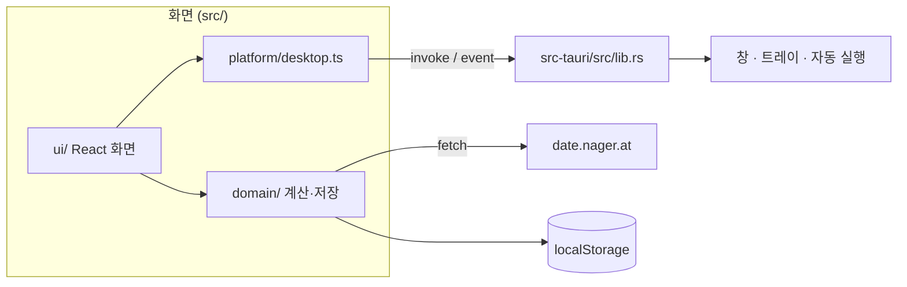

# 구조 안내

마이 캘린더는 웹 화면 하나를 브라우저와 데스크톱 앱이 함께 씁니다.

- 화면: React 19 + TypeScript, Vite 7로 빌드합니다.
- 데스크톱: Tauri 2(Rust)가 이 화면을 운영체제의 WebView에 띄웁니다.
  - Windows는 WebView2, macOS는 WKWebView, Linux는 WebKitGTK를 씁니다.
  - 창, 시스템 트레이, 자동 실행 같은 운영체제 기능은 Tauri가 맡습니다.



## 폴더와 계층

계층은 세 가지이고, 의존은 `ui → domain`, `ui → platform` 방향으로만 흐릅니다.

| 계층 | 경로 | 하는 일 |
|---|---|---|
| domain | `src/domain/` | React와 Tauri를 모르는 순수 로직: 달력 계산, 공휴일, 음력, 일정, 알림, 설정, 인쇄 배치, 번역 문구 |
| platform | `src/platform/desktop.ts` | Tauri API 호출을 감쌉니다. 웹에서는 `isTauri()`가 거짓이라 모든 함수가 아무 일도 하지 않습니다. |
| ui | `src/ui/` | React 화면, 컴포넌트, 훅 |

### domain

| 파일 | 내용 |
|---|---|
| `calendar.ts` | 날짜 형식 변환, 5주 달력 격자(`buildMonthGrid`, `buildMonthWeeks`), 달 제목 |
| `holidays.ts` | Nager.Date 조회, 국가·연도별 캐시, 실패 시 대체 순서 |
| `builtinHolidays.ts` | `date-holidays-parser`로 계산하는 내장 공휴일 (필요할 때 동적으로 불러옴) |
| `holidayRules.ts` | 내장 공휴일 규칙과 시간대 데이터를 JSON 파일로 불러옴 |
| `countries.ts` | 국가 목록과 이름 정렬 |
| `lunar.ts` | `Intl.DateTimeFormat`의 `dangi`/`chinese` 달력으로 음력을, 태양 황경 계산으로 24절기를 구합니다. 음력 연도의 달 목록(`lunarMonths`)과 음력 → 양력 변환(`fromLunar`)도 여기 있습니다. |
| `events.ts` | 일정 모델, 반복 전개, 정규화, 저장. 일정의 `calendar`가 `"lunar"`면 매월·매년 반복을 음력 날짜로 계산합니다. |
| `reminders.ts` | 알림 시각 계산, 대기열, 다시 알림(5분), 이미 울린 알림 기록 |
| `settings.ts` | 설정 모델과 정규화, 창과 전체 화면의 날짜 글꼴 |
| `print.ts` | 용지·방향·여백, 인쇄할 달과 주, 인쇄 옵션 저장 |
| `themes.ts` | 테마 40종, CSS 변수 적용 |
| `messages.ts`, `ko.ts`, `en.ts`, `i18n.ts` | 화면 문구. `{name}` 같은 자리는 `formatMessage`가 채웁니다. |

### ui

| 파일 | 내용 |
|---|---|
| `App.tsx` | 창 종류를 판별해 알맞은 화면을 띄웁니다. 언어 선택 게이트(`Gate`), ESC 처리, 웹 대화상자 |
| `CalendarScreen.tsx` | 메인 캘린더: 툴바, 날짜 격자, 일정 목록, 우클릭 메뉴, 최대화(전체 화면), 창 크기 맞춤과 기억 |
| `SettingsScreen.tsx` | 설정 다섯 탭: 일반, 모양, 달력, 공휴일, 정보 |
| `EventsScreen.tsx`, `EventManager.tsx`, `EventEditor.tsx` | 일정 관리 창, 목록, 편집 시트 |
| `PrintScreen.tsx` | 인쇄 미리 보기와 페이지 설정 |
| `ReminderPopup.tsx` | 알림 스케줄러(`useReminderScheduler`)와 알림 팝업 |
| `DayMenu.tsx` | 아이콘이 붙은 우클릭 메뉴 |
| `WindowChrome.tsx` | 별도 창의 제목 줄(아이콘, 이름, 닫기) |
| `RangeField.tsx`, `Dropdown.tsx` | 감소·증가 버튼이 붙은 슬라이더, 드롭다운 |
| `useSettings.ts`, `useEvents.ts`, `useCountries.ts` | 저장된 데이터를 읽고 다른 창의 변경을 따라가는 훅 |
| `usePanelDrag.ts`, `usePanelResize.ts` | 창 끌기와 크기 조절 |

## 창

데스크톱에는 다섯 가지 창이 있습니다. 모두 같은 `index.html`을 열고, `App.tsx`가 창 라벨로 화면을 고릅니다.

| 라벨 | 화면 | 만드는 곳 |
|---|---|---|
| `main` | 캘린더 | `tauri.conf.json` (투명, 테두리 없음, 작업 표시줄에 표시하지 않음) |
| `settings` | 설정 | `open_aux` (Rust) |
| `events` | 일정 관리 | `open_aux` (Rust) |
| `print` | 인쇄 미리 보기 | `open_aux` (Rust) |
| `reminder` | 알림 팝업 | `show_reminder_window` (Rust), 화면 오른쪽 아래 |

- 웹에서는 별도 창 대신 메인 화면 위의 대화상자로 같은 화면을 엽니다. 알림은 화면 위에 겹쳐 표시합니다.
- 허용된 Tauri 권한은 `src-tauri/capabilities/default.json`에 있습니다.

### 메인 창의 층(z-order)

- 보통 창은 "다른 창보다 위에 두기" 설정을 따릅니다.
- 최대화되면 Rust의 `apply_main_layer`가 창을 모든 창 아래(always on bottom)로 내립니다. 그래서 배경화면처럼 보입니다.
  - 버튼, Win+↑, 화면 위쪽 끝으로 끌기 등 어떤 방법으로 최대화해도 `Resized` 이벤트에서 같은 처리를 합니다.
- 최대화가 풀리면 원래 층으로 돌아오고, `raise_main`이 창을 앞으로 올립니다.
- 전체 화면에서 ESC를 누르면 `CalendarScreen`이 최대화를 풉니다. 이때 앱 전체의 "ESC로 트레이로 숨기기"보다 먼저 처리합니다.
- 최대화된 동안에는 `setWindowSize`와 `setWindowMinSize`가 아무 일도 하지 않습니다. Windows에서는 최대화된 창의 크기를 바꾸면 최대화가 풀리기 때문입니다.

## Rust 명령과 이벤트

`src-tauri/src/lib.rs`

| 명령 | 하는 일 |
|---|---|
| `install_language` | 설치 프로그램이 저장한 언어(`install-language.txt`)를 읽습니다. |
| `update_tray_labels` | 트레이 메뉴와 툴팁 문구를 현재 언어로 바꿉니다. |
| `set_main_always_on_top` | "다른 창보다 위에 두기"를 적용합니다. |
| `hide_main`, `minimize_main`, `toggle_maximize_main` | 메인 창을 숨기고, 최소화하고, 최대화하거나 되돌립니다. |
| `open_aux_window` | 설정, 일정 관리, 인쇄 창을 엽니다. 이미 열려 있으면 앞으로 가져옵니다. |
| `show_reminder_window`, `fit_reminder_window` | 알림 창을 띄우고 내용 높이에 맞춥니다. |
| `open_external` | 공휴일 출처 같은 외부 주소를 기본 브라우저로 엽니다. |

| 이벤트 (Rust → 화면) | 하는 일 |
|---|---|
| `tray-about` | 트레이의 "프로그램 정보": 설정 창을 "정보" 탭으로 엽니다. |
| `tray-language` | 트레이의 언어 전환: 모든 창의 언어를 바꿉니다. |

트레이 메뉴 항목은 캘린더 표시/숨기기, 일정 관리, 설정, 언어 전환, 프로그램 정보, 종료입니다. 트레이 아이콘을 왼쪽 클릭하면 캘린더를 보이거나 숨깁니다.

## 데이터 저장과 창 사이 동기화

모든 데이터는 WebView의 `localStorage`에 저장합니다. 서버나 계정은 없습니다.

| 키 | 내용 |
|---|---|
| `mycalendar.settings.v1` | 설정 전체 (언어, 테마, 투명도, 국가, 날짜 글꼴, 창 크기 등) |
| `mycalendar.events.v1` | 일정 |
| `mycalendar.holidays.v1.<국가>.<연도>` | 공휴일 캐시 |
| `mycalendar.reminders.queue`, `mycalendar.reminders.fired` | 표시할 알림, 이미 울린 알림 |
| `mycalendar.print.v1` | 인쇄 옵션 |
| `mycalendar.fullscreen` | 메인 창이 전체 화면인지 (설정 창이 어느 글꼴을 고칠지 정할 때 씀) |
| `mycalendar.settings-tab`, `mycalendar.print-request`, `mycalendar.holiday-refresh` | 다른 창에 보내는 일회성 요청 (열 탭, 인쇄할 달, 공휴일 다시 확인) |

- 창들은 같은 출처(origin)를 쓰므로 `localStorage`를 함께 봅니다.
- 한 창이 값을 쓰면 다른 창은 `storage` 이벤트로 바뀐 내용을 받아 화면을 다시 그립니다.
- 같은 창 안에서는 `mycalendar-settings`, `mycalendar-events` 같은 사용자 정의 이벤트로 알립니다.
- 저장된 값은 읽을 때마다 `normalize*` 함수로 검사합니다. 잘못되었거나 이전 버전에 없던 값은 기본값으로 채웁니다.

## 공휴일

1. 인터넷에서 확인합니다 (`https://date.nager.at/api/v3/PublicHolidays/{연도}/{국가}`). 10분 안에 확인한 내용이 있으면 다시 묻지 않습니다.
2. 실패하면 마지막으로 확인한 캐시를 보여 줍니다.
3. 캐시도 없으면 `date-holidays`의 내장 규칙으로 계산합니다.
   - 규칙(`date-holidays/data/holidays.json`, 약 800 kB)과 시간대 데이터(`moment-timezone/data/packed/latest.json`, 약 700 kB)는 스크립트에 넣지 않고 JSON 파일로 함께 배포합니다. `holidayRules.ts`가 처음 필요할 때 두 파일을 불러옵니다.
   - `vite.config.ts`는 `moment-timezone`을 데이터 없는 코어(`moment-timezone/moment-timezone.js`)로 바꿔 연결합니다. 그래서 공휴일 계산 코드 묶음이 약 220 kB로 줄고, 500 kB 묶음 크기 경고가 나지 않습니다.
   - 테스트는 `fetch`를 막아 오프라인을 흉내 내므로, `test/setup.ts`가 `holidayRules.ts`를 패키지 데이터를 바로 읽는 버전으로 바꿉니다.

화면 아래 상태 줄에 "실시간 확인됨", "마지막 확인 내용", "내장 공휴일" 중 어느 상태인지 표시합니다. 한국어 화면은 현지 이름을, English 화면은 영어 이름을 씁니다.

## 알림

- 메인 창의 `useReminderScheduler`가 15초마다 일정을 확인합니다.
  - 알릴 시각이 된 일정이 있으면 대기열에 넣고 알림 창을 띄웁니다.
  - 종일 일정은 그날 오전 9시를 기준으로 계산합니다.
  - 앱이 꺼져 있어 놓친 알림은 일정 시작 후 1시간까지는 늦게라도 띄웁니다.
- 알림 창은 대기열을 보여 주고, "5분 후 다시"와 "확인"을 처리합니다.

## 화면 크기와 글꼴

- **날짜 크기:** 날짜 격자의 폭에 비례합니다 (CSS 컨테이너 단위 `cqw`).
  - 설정의 글자 크기 비율(`--date-font-scale`)을 곱합니다.
  - 창에서는 80px, 전체 화면에서는 160px까지 커집니다.
- **날짜 글꼴:** 창과 전체 화면을 따로 저장합니다 (`dateFont*`, `fullscreenDateFont`).
  - 전체 화면 글꼴을 한 번도 바꾸지 않았다면 창 글꼴을 씁니다.
- **아래 영역 버튼:** 상태 줄의 ⟳·접기와 일정 줄의 +·일정 관리는 `.footer-actions` 묶음에 담겨 같은 오른쪽 여백(그립을 피하는 30px)에 붙습니다. 일정 목록을 접어도 상태 줄 버튼이 움직이지 않고, 네 버튼이 한 열에 섭니다.
- **창 높이:** 데스크톱 창은 정사각형 날짜 칸, 일정 추가 줄, 일정 한 줄보다 작아지지 않습니다.
  - 폭이 넓어지면 이 최소 높이도 함께 커집니다.
- **창 크기 기억:**
  - 사용자가 정한 크기는 0.5초 동안 변화가 없으면 저장되고, 다음 실행과 전체 화면에서 돌아올 때 쓰입니다.
  - 화면 전체 크기로 저장된 값은 전체 화면에서 나오던 중에 잘못 저장된 것으로 보고 쓰지 않습니다.

## 인쇄

- `PrintScreen`이 고른 용지 크기로 페이지를 그립니다. 크기는 mm 단위이고, 여백은 안쪽 여백으로 넣습니다.
- `@page { size; margin: 0 }` 스타일을 문서에 넣습니다.
- 인쇄할 페이지는 `body` 바로 아래의 `.print-root`에 따로 그립니다. 인쇄할 때는 나머지 화면을 모두 숨깁니다(`@media print`).
- 미리 보기 배율은 창 크기에 맞춘 값에 사용자가 고른 확대·축소를 곱해, CSS `zoom`으로 적용합니다.

## 설치 언어

- Windows NSIS 설치 프로그램은 설치 전에 언어를 묻습니다. 고른 언어는 `src-tauri/windows/hooks.nsh`가 앱 폴더의 `install-language.txt`에 씁니다.
- Linux와 macOS는 `installer/` 아래 스크립트가 같은 파일을 만듭니다.
- 앱은 시작할 때 `install_language` 명령으로 이 파일을 읽습니다. 파일이 없으면 첫 화면에서 언어를 고르게 합니다.

## 다시 설치

- 설치 프로그램은 기존 설치를 찾으면 완전히 삭제한 뒤 새로 설치하고, 사용자 데이터를 지울지는 사용자에게 묻습니다.
- **Windows:** `hooks.nsh`가 시작 화면보다 앞에 `MC_PageRemovePrevious` 페이지를 넣습니다.
  - 등록된 `UninstallString`이 있으면 예/아니요/취소 질문을 띄우고, 기존 제거 프로그램을 `/S _?=<설치 폴더>`로 실행합니다. 제거 프로그램이 실행 중인 앱을 먼저 닫습니다.
  - 그다음 남은 `uninstall.exe`, `install-language.txt`, 빈 설치 폴더를 지웁니다.
  - 데이터 삭제를 고르면 `%APPDATA%`와 `%LOCALAPPDATA%`의 `com.mycalendar.multios`(WebView2 저장소)도 지웁니다.
  - 등록 정보가 없어지므로 Tauri의 기본 재설치 페이지는 나오지 않습니다.
  - `/S`는 페이지가 없어서 `NSIS_HOOK_PREINSTALL`에서 데이터를 남긴 채 제거합니다. `/P`도 묻지 않고 데이터를 남깁니다. Tauri 업데이트(`/UPDATE`)는 기존 방식 그대로 덮어씁니다.
  - `hooks.nsh`는 Tauri의 `!define`보다 먼저 포함되므로 제품 이름, 식별자, 실행 파일 이름을 직접 적습니다. `installer.test.ts`가 이 값이 설정 파일과 같은지 확인합니다. 한글 문구 때문에 파일은 UTF-8 BOM으로 저장합니다.
- **Linux:** `install.sh`는 `my-calendar` deb·rpm 패키지나 `~/.local/bin/my-calendar.AppImage`를 지웁니다. 데이터를 지우면 `~/.local/share`, `~/.config`, `~/.cache` 아래 `com.mycalendar.multios`와 `~/.config/my-calendar`도 지웁니다.
- **macOS:** `install.command`는 `My Calendar.app`을 지웁니다. 데이터를 지우면 `~/Library`의 Application Support, WebKit, Caches, Preferences, Saved Application State에서 `com.mycalendar.multios` 항목도 지웁니다.

## 아이콘

- `scripts/generate-icon.mjs`가 `assets/`에 아이콘 원본을 그립니다. 크기마다 따로 그리고, 작은 크기에서는 달력 칸 수를 줄여 알아보기 쉽게 합니다.

  | 파일 | 쓰는 곳 |
  |---|---|
  | `assets/app.ico` | 프로그램 exe에 들어가는 아이콘. 바탕화면·시작 메뉴 바로가기, 작업 표시줄, 실행 중인 창, 트레이, 프로그램 추가/제거에 표시됩니다. |
  | `assets/installer.ico` | Windows 설치 파일(setup.exe) 아이콘. 달력에 초록 다운로드 표시가 붙어 있습니다. |
  | `assets/app.png` | 1024px 원본. `tauri icon`이 이 파일로 `src-tauri/icons/`의 macOS(`icon.icns`)·Linux PNG 아이콘을 만듭니다. |
  | `assets/installer.png` | 설치 파일 아이콘 1024px 미리 보기 |

- Windows 바로가기는 exe에 들어 있는 아이콘을 그대로 쓰므로, 바로가기와 실행 중인 프로그램의 아이콘은 같은 `app.ico`에서 나옵니다.
- `tauri.conf.json`의 `bundle.icon` 첫 항목이 `../assets/app.ico`이고, `bundle.windows.nsis.installerIcon`이 `../assets/installer.ico`입니다.
- 제목 줄과 프로그램 정보에 쓰는 `public/favicon.png`(128px)도 같은 스크립트가 만듭니다.
- `npm run icon`으로 모두 다시 만듭니다. `node scripts/generate-icon.mjs --assets-only`는 `assets/`와 favicon만 다시 그립니다.
- `scripts/generate-tray-icons.mjs`는 트레이 메뉴와 별도 창 제목에 쓰는 아이콘을 `src-tauri/icons/tray/`에 만듭니다.
- `scripts/png.mjs`는 외부 패키지 없이 PNG를 쓰는 도우미입니다.

## 테스트

```bash
npm test          # test/run.mjs → Vitest (happy-dom)
npx tsc --noEmit  # 타입 검사
cd src-tauri && cargo check
```

| 파일 | 다루는 내용 |
|---|---|
| `calendar`, `lunar`, `holidays`, `countries`, `events`, `reminders`, `settings`, `themes`, `print` | domain 로직 |
| `interface.test.tsx` | 화면 동작: 메뉴, 설정, 일정, 인쇄, 전체 화면, 글꼴 |
| `desktop.test.ts` | Tauri 연동, 권한, Rust 코드 약속 |
| `languages.test.ts` | 한국어와 English 문구가 모두 채워져 있는지 |
| `installer.test.ts` | 설치 언어 처리, 다시 설치할 때 기존 프로그램 삭제와 사용자 데이터 질문 |

- 네트워크는 `test/network.ts`가 막고 가짜 응답을 줍니다.
- `test/reporter.ts`는 기능별 통과·실패 표를 출력합니다.

## 개발할 때 지킬 것

- **화면 문구:** 반드시 `messages.ts`에 키를 추가하고, `ko.ts`와 `en.ts`를 모두 채웁니다. `languages.test.ts`가 빠진 문구를 잡습니다.
- **데스크톱 기능:** `platform/desktop.ts`에 함수를 두고, 웹에서는 아무 일도 하지 않게 합니다.
  - 새 창 권한이 필요하면 `capabilities/default.json`에 추가합니다.
- **창을 만드는 Rust 명령:** `async`로 둡니다. 동기 명령에서 창을 만들면 Windows에서 이후 명령이 멈춥니다.
- **새 설정 항목:** `Settings`, `DEFAULT_SETTINGS`, `normalizeSettings`에 함께 추가합니다. 그래야 이전 버전 사용자의 저장값도 안전하게 읽힙니다.
