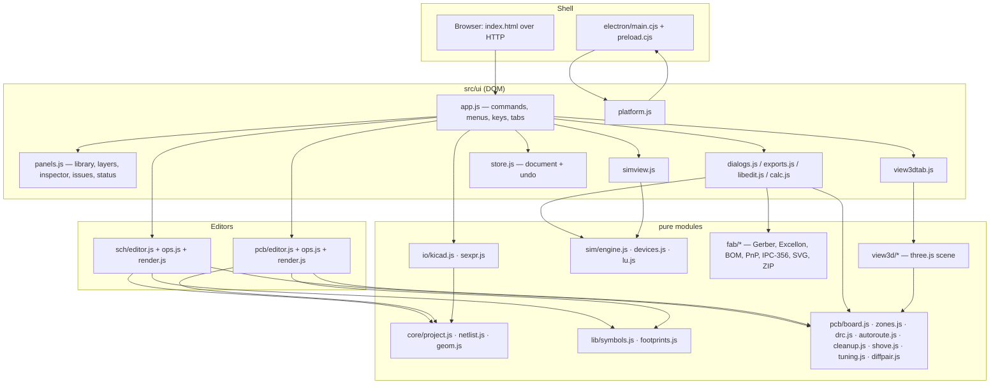

# Architecture

**MyCircuit 10.0** — schematic, PCB, 3D and simulation electronics design for Web, Windows, macOS and Linux
Author: shkwon (`knix008@naver.com`) · Version 10.0.0

## 1. Goals

- One codebase for the **browser** and the **Electron desktop app** — plain ES modules, no bundler, no framework.
- The whole design is **one plain JSON object** (`.mycircuit`), so saving is `JSON.stringify`, undo is a snapshot, and every engine can be unit-tested in Node without a DOM.
- Engines (connectivity/ERC, DRC, autorouter, zones, simulator, fabrication writers) are **pure functions of the project** — the UI only calls them and draws their results.
- Korean and English UI, 40 derived themes plus custom themes, keyboard-first editing.

## 2. High-level structure



## 3. Module map (`src/`)

| Folder / file | Responsibility |
| --- | --- |
| `core/project.js` | Project model: `newProject`, `normalizeProject` (fills defaults, ids, pages), `parseProject`, copper layer sets, default design rules, engineering-number `parseValue` / `formatValue` (`4k7`, `10u`, `1Meg`) |
| `core/netlist.js` | Schematic connectivity (union-find over pins, wire ends, T-joints, junctions, labels, power symbols, **per page**), hierarchical label ↔ sheet pin joins (`sheetPinPoint`), vector-label expansion (`busMembers`: `D[0..7]` → `D0…D7`, max 256), multi-unit parts (same-numbered pins of one `unitGroup` share a net; hidden power-input pins join the same-named net), net naming, `annotate` (page by page, then top-to-bottom, left-to-right; units share a reference with a unit letter), `runERC` (14 checks incl. `sheet-target`, `hier-unconnected`; each issue carries its `page`), `boardNetlist`. Page helpers `pageOf`, `pageView`, `writePageView` |
| `core/geom.js` | Geometry: rotations (CCW on screen, y-down), transforms, segment/pad distances, polygons |
| `lib/symbols.js` | Built-in symbol library (59, incl. multi-unit `LM358_DUAL` and `74HC00` with per-unit pin sets and a power unit; transistors numbered like TO-92 parts: BJT 1=E 2=B 3=C, MOSFET 1=S 2=G 3=D), `makeBoxSymbol`, user (project) symbols registry |
| `lib/footprints.js` | Built-in footprints (56, incl. `SOT-23_Q` with transistor pad numbering) with pads (layers `F`, `*`, or `B` = SMD on the far side), silk, courtyard and 3D model kind; `makeFootprint` generators for the wizard; user footprints registry |
| `io/sexpr.js` | KiCad S-expression parser/writer and accessors (`child`, `children`, `value`, `num`, `at`, `pts`, `walk`) |
| `io/kicad.js` | KiCad 6–9 import: `importKicadSchematic`, `importKicadPcb`, `importKicadProject({schText, pcbText, name, sheetTexts})` (root detection, hierarchical sheets → sheet blocks + pages up to 8 levels, footprint name mapping, 3D model guess); simplifications are collected in `project.importWarnings` |
| `sch/editor.js` | Interactive schematic editor: tools (select, place — advancing through the units of multi-unit parts —, wire, bus, net/global/**hierarchical** labels `H`, power, no-connect, junction, text, **measure** `M`, **dimension** `D`, **sheet** `S`), Shift/Ctrl-drag window/crossing selection (plain drag on empty canvas pans by default), rubber-band drag, field drag, clipboard, page bar (add/rename/move/delete pages), `syncSheets()` keeps sheet pins in step with the hierarchical labels of the target page. Works on a **page view** and writes changes back through `mutate()/edit()` |
| `sch/ops.js` | Pure schematic edits: hit-testing, snapping, orthogonal paths, drag/rotate/mirror with wire following, clean-up (merge collinear, split at junctions, automatic junctions), copy/paste, label auto-increment |
| `sch/render.js` | Canvas drawing of parts, wires, labels, sheet and title block (`Sheet: i/N name`), themes; also used for SVG export and thumbnails |
| `pcb/board.js` | Board geometry: placed pads, courtyards, copper items, copper connectivity, ratsnest (MST per net), `updateBoardFromSchematic`, net classes |
| `pcb/editor.js` / `pcb/ops.js` | Interactive PCB editor (select, route with 45° posture and live clearance check in three routing modes — highlight / shove / block —, via, zone, outline, text, line, measure, dimension, board-size overlay), move/rotate/flip/lock, snapping |
| `pcb/shove.js` | Push-and-shove: `shoveForSegment` / `shoveResult` move other-net tracks on the layer (parallel shift, sliding shared ends, 45° jogs at pads/vias, two cascade levels); fails when pads, vias, NPTH holes or the edge are in the way |
| `pcb/tuning.js` | Length tuning: `netLength` (tracks + vias), `tuneTrack`, `matchLengths`, `skewReport`; meanders (rounded / mitered / square, both / left / right) shrunk or dropped where clearance to other nets or the edge fails |
| `pcb/diffpair.js` | Differential pairs: `findPairs` (name pairs `+/-`, `_P/_N`), `pairSkew`, `routeDiffPair` (A* centre line between pad midpoints, `offsetPolyline` to both sides at the gap, short fan-outs) |
| `pcb/zones.js` | Zone fill as an ordered list of dark/clear drawing ops (knockouts, thermal spokes, priorities) — rendered identically by canvas, Gerber and 3D texture |
| `pcb/drc.js` | Design rule check (18 codes) with a spatial hash |
| `pcb/autoroute.js` | Grid A* maze router (outer layers or all copper layers, grid 0.05–0.5 mm from settings) with obstacle maps per net-class profile, via map, rip-up-and-retry, 15 s budget |
| `pcb/cleanup.js` | Track clean-up and net length report |
| `pcb/render.js` | Canvas drawing of the board (layer order, high contrast, highlight) |
| `sim/engine.js` | MNA + Newton-Raphson simulator: operating point (gmin/source stepping), transient (BE/trapezoidal, breakpoints), AC (complex solve), DC sweep; SPICE netlist export |
| `sim/devices.js` | Device stamps: R, POT, C, L, V/I sources (dc/sine/pulse), diode (+breakdown, rs), BJT (Ebers-Moll), MOSFET (square law), op-amp (tanh-clamped VCVS), regulator |
| `sim/lu.js` | Dense real/complex LU solver |
| `fab/layers.js` | Per-layer drawing primitives shared by Gerber and SVG writers; drill hole list |
| `fab/gerber.js`, `excellon.js`, `package.js`, `bom.js`, `pnp.js`, `netlistExport.js`, `svgExport.js`, `zip.js`, `gerberParse.js`, `strokefont.js` | Gerber X2 writer, Excellon writer, fabrication package + job file + README, BOM, pick & place, KiCad/IPC-356 netlists, PCB SVG, STORE-only ZIP reader/writer, Gerber/Excellon parser + canvas renderer for the viewer, vector font |
| `view3d/viewer.js`, `boardmesh.js`, `texture.js`, `models.js` | three.js scene, orbit controls (rotate / pan navigation modes, FOV and rotate speed from settings), views, picking, adaptive 5×5 grid with labels, X/Y/Z axes with ticks, orientation gizmo, W×D×H board dimensions in cm or inch, STL/GLB export; board body mesh; canvas textures for copper/mask/silk/finish; parametric component models |
| `ui/app.js` | Application controller: settings, theme, tabs, commands registry (`app.run(id)`), menus, toolbar (`fitToolbar`: labelled buttons go icon-only (`compact`) on a narrow screen, then the bar wraps (`wrap`); the window minimum width follows the toolbar via `platform.setMinSize`), keyboard map, files, KiCad import, autosave, cross-probing, ERC/DRC scheduling |
| `ui/themes.js` | 40 themes (20 dark, 20 light) defined by a few key colours; `uiTokens` / `canvasColors` derive all CSS tokens and canvas palettes (contrast-checked), `randomTheme`, custom themes |
| `ui/flags.js` | UK / Korean flag SVGs for the language toggle |
| `ui/tutorial.js`, `tutorial-lessons.js`, `tutorial-practice.js` | Interactive tutorial: `TutorialPlayer` (watch mode drives the real UI with an animated cursor, 0.5–4×; practice mode checks each step), 14 lessons / 62 steps, practice checks |
| `buildinfo.js` | Generated by `scripts/build-info.mjs` (version, commit, branch, dirty flag, build date, author) for the About window; git-ignored |
| `ui/store.js` | Document store: `edit(label, fn)` snapshots JSON before mutating, `begin/commit/cancel` for drags, 200-step undo/redo |
| `ui/panels.js` | Left panel (library / layers / nets), inspector (every numeric field is an editable `stepper`), issue list, status bar |
| `ui/dialogs.js` | Part pickers, properties, settings (`SETTING_DEFAULTS`, 9 fixed-size tabs, steppers), board setup, footprint assignment (paged), find, history, reports, samples, help, welcome, About (icon + description + build rows), theme menu / gallery / custom theme editor, KiCad import notes (paged), length tuning, differential pairs, shortcut table |
| `ui/exports.js` | Print (preview, one sheet per schematic page, 1:1, PDF), SVG/PNG/netlist/SPICE/PnP export, BOM, fabrication dialog, Gerber viewer |
| `ui/libedit.js` | Symbol editor and footprint wizard (incl. custom pads) storing into `project.library` |
| `ui/calc.js` | Calculators (pure maths exported for tests) |
| `ui/simview.js` | Simulation tab: settings, plot with cursor, tables, probes |
| `ui/view3dtab.js` | 3D tab host (lazy-loads three.js) |
| `ui/start.js` | Start page with live sample thumbnails |
| `ui/i18n.js`, `i18n-ko.js`, `issuetext.js` | `t()` with English text as key and the Korean dictionary; Korean rewriting of ERC/DRC messages |
| `ui/platform.js` | Desktop/web abstraction: files, print, settings, autosave, title bar |
| `ui/widgets.js`, `viewport.js`, `svgctx.js`, `icons.js` | DOM helpers (modal, quick pick, context menu, toast, `stepper` — − / value / +, hold to repeat after 450 ms every 90 ms), pan/zoom canvas (`gridCell` ×5 re-spacing 5×5 grid, `drawRulers` in mm/mil with 1-2-5 steps and a cursor marker, empty-drag pan vs box select, hand mode, wheel zoom speed), Canvas-2D-compatible SVG context, icons |
| `vendor/three/` | three.js (vendored, MIT) |

## 4. Data model

```
project = {
  format: "mycircuit", version: 1, meta: {...},
  library:   { symbols: [...], footprints: [...] },          // project-local parts
  schematic: { sheet, pages: [{id, name}], parts, wires, buses, junctions, labels, noconnects, texts,
               sheets, dimensions },
             // every schematic item may carry `page`; missing = first page
             // parts: unit, unitGroup (multi-unit); labels.kind: local | global | hier
             // sheets: {id, page, x, y, w, h, name, target, pins: [{id, name, side: L|R, offset}]}
             // dimensions: {id, page, x1, y1, x2, y2, offset}
  pcb:       { layerCount, thickness, maskColor, silkColor, finish, outline,
               footprints, tracks, vias, zones, texts, graphics, dimensions, rules{..., netClasses} },
  sim:       { mode, tStop, tStep, fStart, fStop, points, probes, dcSource, dcStart, dcStop, dcStep },
}
```

- Schematic units are mils, PCB units millimetres; both y-down. Angles are counter-clockwise on screen.
- The schematic is the master: `updateBoardFromSchematic` adds/updates/removes footprints (matched by part id or reference) and renames nets on existing copper.
- Multi-page: all items live in the same arrays tagged with `page`. Geometry connects only within a page; net labels are page-local; global labels and power symbols join across pages. The editor edits a `pageView` and writes it back with `writePageView`.
- Hierarchy: a sheet block shows its `target` page; its pins are derived from that page's hierarchical labels (`syncSheets`, no undo step) and connect parent-page wires to those labels.
- Multi-unit: each unit is its own `parts` entry; units placed together share `unitGroup` and reference, and become one footprint on the board.
- Live DRC: once run (`app.drcRan`), DRC reruns after every edit, also after a clean pass.

## 5. Rendering pipeline

- `ui/viewport.js` owns a canvas (device-pixel ratio, pan/zoom, grid, rulers, pointer events, pinch) and calls the editor's `render(ctx, vp)` on demand (`request()` → one `requestAnimationFrame`). The displayed grid cell is the snap grid times a power of 5 so a cell stays 10–50 px; rulers (20 px) are drawn last in screen space.
- Editors draw in world units: `sch/render.js` (parts, wires, labels, sheet) and `pcb/render.js` (layers back to front, active layer last; zones painted from `zoneOps` into an offscreen canvas with `destination-out` knockouts).
- The same draw functions render to `svgctx.js` for schematic SVG export and print; the PCB SVG and Gerber writers share `fab/layers.js` primitives, and the 3D board texture paints the same zone ops — so screen, print, Gerber and 3D agree.
- Store events: `change` (edit/undo/load) → redraw, re-run ERC (debounced 350 ms), refresh inspector/tabs/status; `preview` (during drags) → redraw only.

## 6. How the engines plug in

- **Commands**: every menu item, toolbar button, shortcut and palette entry is a command registered in `app.registerCommands()` and executed with `app.run(id)`.
- **Checks**: `runERC(schematic)` and `runDRC(project)` return `[{severity, code, message, x, y, ids, page?, layer?}]`; the issue list localises `message` via `issuetext.js` and focuses `x, y` (switching page).
- **Simulation**: `simulate(project, {mode,...})` builds the circuit from `buildNetlist` + symbol `sim` specs + part fields and returns voltages/currents or signal arrays; `toSpiceNetlist(project)` writes SPICE.
- **Autorouter**: `autoroute(project, opts)` returns `{tracks, vias, routed, failed, stats}` without mutating; the app appends the result in one undo step.
- **Routing helpers**: `shoveResult`, `matchLengths` and `routeDiffPair` likewise compute new tracks from the project; the editor/dialogs apply them in one undo step (`pcb.tuneLengths`, `pcb.diffPair`, `pcb.modeHighlight|modeShove|modeBlock`).
- **Import**: `file.importKicad` reads the chosen files (on desktop also the partner and sub-sheet files beside them), calls `importKicadProject` and opens the result unsaved, then shows `importWarnings`.
- **Fabrication**: `fabricationFiles(project, opts)` returns `[{name, data, kind, layer?}]`; `fabricationZip` wraps them. The Gerber viewer parses the same files back.
- Heavy modules (DRC, autorouter, simulator, fab, three.js) are loaded lazily with `import()`.

## 7. Desktop shell

- `electron/main.cjs`: single-instance lock (per user-data dir), window 1440×900 (min 1024×700, raised by the renderer through `setMinSize` to the widest toolbar, capped by the screen) with a themed title-bar overlay, file dialogs, `settings.json` in `userData` (`%APPDATA%\MyCircuit`, `~/Library/Application Support/MyCircuit`, `~/.config/MyCircuit`; `--user-data-dir` overrides), print / printToPDF, sample listing, open-file from argv / `second-instance` / macOS `open-file`, close confirmation via the renderer.
- `electron/preload.cjs` exposes `window.mycircuit`; `src/ui/platform.js` falls back to browser APIs when it is absent.

## 8. Build and packaging

| Script | Purpose |
| --- | --- |
| `npm start` | `scripts/build-info.mjs`, then `scripts/start.mjs` — clears `ELECTRON_RUN_AS_NODE` and launches Electron |
| `npm run serve` | `scripts/serve.mjs` — static server on port 8642 |
| `npm run build:web` | build info, then copy `index.html`, `style`, `src`, `assets`, `sample`, `docs` to `dist/web` |
| `npm run build:art` (= `build:icons`) | `scripts/render-art.mjs` renders `scripts/art/art.js` (three.js, a straight top-down view of a circuit board) in a hidden Electron window and writes `assets/icon.*`, `assets/icons/NxN.png`, `assets/file-icon.*`, `assets/art/hero.png` and the NSIS sidebar/header BMPs |
| `npm run build:installer` | NSIS association include and `build/file-types.json` |
| `scripts/build-info.mjs` | writes `src/buildinfo.js`; run by `npm start` and every build |
| `npm run dist:win` / `dist:mac` / `dist:linux` / `build:all` | electron-builder (NSIS x64; dmg+zip unsigned; AppImage+deb+tar.gz) via `scripts/package.mjs` (retries EPERM), copied to the root by `scripts/copy-installers.cjs` |

`docs/` is packed inside `app.asar` (so the in-app manual loads; the manual dialog shows “Open in browser” only in the web build), `sample/` ships as `extraResources`. Manual screenshots are WebP (`docs/images/*.webp`). `build/installer.nsh` offers a Korean/English language choice, announces (OK/Cancel) that an existing installation will be removed completely and runs its uninstaller silently, then asks separately (yes/no) whether to delete `%APPDATA%\MyCircuit`, and writes the file associations. `.gitignore` excludes `node_modules/`, `dist/`, `release/`, `*.blockmap`, root installer copies, `src/buildinfo.js`, test output and logs, and editor/OS files. Samples are generated by `scripts/create-samples.mjs`, which also verifies them (tidy schematic, ERC clean, fully routed, DRC clean, simulation runs, fab package builds).

## 9. Tests

| Command | What runs |
| --- | --- |
| `npm test` | `scripts/test.mjs` (+ `test-reporter.mjs`) runs every `test/unit/*.test.mjs` file separately with `node --test` — about 189 tests — and prints them grouped by category (core model & connectivity, schematic & PCB editing, PCB checks & routing, simulation, manufacturing outputs, 3D view, import / exchange, samples, tools & calculators, localization) with per-test times and a coloured summary; includes placing every library footprint and checking silk/pad clearance; `npm test -- sim drc` filters by name |
| `npm run smoke` | `test/smoke/gui-smoke.mjs` launches the real Electron app, attaches over CDP and performs about 173 GUI checks with real mouse and keyboard input — every command, every sample, routing, push and shove, stop at obstacles, differential pair, length tuning, page tabs, navigation, grid, rulers, dimensions, 3D units, settings and right-panel steppers, settings fixed size, About layout, sheet Properties panel, toolbar fit incl. a narrow screen, tutorial — catching renderer-only failures |
| `npm run i18n:check` | `scripts/i18n-keys.mjs` reports `t("…")` keys missing from `src/ui/i18n-ko.js` |

## 10. Documentation

- `README.md` — build/run overview
- `USERSGUIDE.md` — condensed Korean user guide
- `docs/USERSGUIDE.ko.html`, `docs/USERSGUIDE.en.html` — full illustrated manuals (screenshots in `docs/images/`), shown in-app by Help → User manual (F1)
