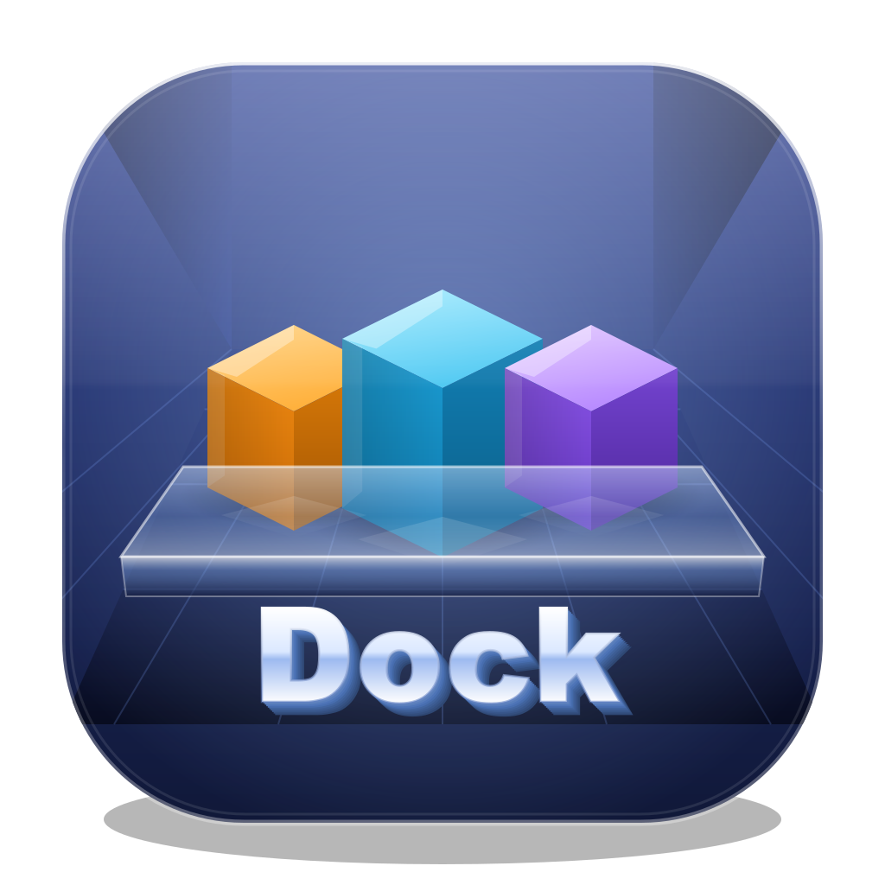

# MyDockBar

A themeable application dock for **Windows, macOS and Linux**, built with Electron.
It takes its cues from RocketDock: a translucent bar pinned to a screen edge, icons
that magnify under the pointer, reflections, auto-hide, and drag-and-drop shortcuts.



---

## Features

**Dock**
- Magnifying icons with a parabolic / cosine / linear falloff curve (or none)
- Icon reflections (always cast downwards, on every screen edge), hover labels,
  and a running-application indicator
- Bounce or pop animation on launch; a shake when a target is missing
- Any screen edge (bottom / top / left / right) with start / center / end alignment
- Icons always sit centred: the padding setting adjusts only the bar's thin
  sides, and the gap at the two ends stays fixed
- Separate dock and background opacity, plus an explicit background height
- Window priority (above everything / above normal windows / normal)
- Multi-monitor: pin to the primary display, a named display, or "wherever the
  pointer is", with a live monitor map in settings
- Auto-hide with independent show and hide delays and a peek sliver
- Optionally shows icons for applications that are currently open, alongside
  the pinned ones
- Drag files onto the dock — or onto the Dock Items tab — to add them. The
  landing position is shown by the icons **parting around a gap**, not by an
  outline drawn over the bar, and the same gap drives reordering. The icons
  slide between positions rather than jumping: the gap is a slot in the layout
  maths, not a node in the list, so nothing is rebuilt and a CSS transition can
  carry them.
- **Drag an icon off the dock to remove it** — it shrinks away as it goes.
  Blocked while the dock is locked, and never for the built-in entries.
- Anything added from the dock's context menu — an application, a folder, a
  separator — lands where the pointer was, not at the end.
- Lock / unlock the dock and toggle auto-hide from the tray menu or the dock's
  own context menu
- Clicking an application that is already open **raises its window** instead of
  starting a second copy; with several windows open it offers a chooser. The
  window lookup is cached and warmed as soon as the pointer settles on an icon,
  which takes it off the click path.
- The Trash shows whether it is holding anything, and can be emptied from its
  context menu
- A custom icon is remembered per target: remove an entry, add it back later,
  and the icon you chose comes back with it
- Separators, folders, URLs and built-in actions (Home, Show Desktop, Trash,
  Settings). The built-in ones cannot be deleted.
- **Lock items** freezes the dock: no adding, removing or reordering, enforced
  in the main process rather than only in the UI
- The window is click-through everywhere except the dock plate itself, so it
  never swallows clicks meant for the desktop

**Theming**
- 48 built-in themes: 24 palettes, each in a **dark and a light** variant, so
  the two families are always the same size. Hues are spread around the wheel
  so no two cards in the picker read alike, and five of the palettes are reds
  (Ruby, Scarlet, Crimson, Ember, Rose). Near-neutral palettes cannot be
  separated by hue — two greys three degrees apart are the same grey — so they
  are separated by lightness instead, and the test that guards this measures
  the colour that actually comes out rather than the hue that went in.
- Each card previews its theme's real shape and colours, with the name centred
- Themes change **shape as well as colour**, the way RocketDock skins do: ten
  forms — `bar`, `pill`, `slab`, `tray`, `shelf`, `shelf3d`, `notched`, `tile`,
  `slot` and `floating` — clip the plate differently and, for `tile` and `slot`,
  give every icon its own raised or recessed backing
- Six of the palettes are modelled on the classic RocketDock skins: **Classic**
  (the default glossy bar), **Leopard** (the perspective shelf with a lit front
  edge), **Aero**, **Timber**, **Brushed** and **Midnight**
- Four surface styles on top of that: glass, solid, neon and matte
- Choosing a theme re-skins the settings window too, not just the bar
- Every card previews the theme with its own colours and an accent stripe
- Themes are plain folders — drop your own in and it appears in the picker

**Icons**
- Extracts real application icons and caches them
- A RocketDock-style icon picker: choose from **every** icon stored inside a
  program file (`.exe` / `.dll`, including the `.mun` resource files Windows 10+
  splits system icons into), a built-in glyph, or any image on disk. This is the
  fix for an application whose icon comes out wrong or blank.

**Integration**
- Tray menu with theme / position / language / auto-hide shortcuts —
  every menu entry carries an icon
- English and Korean throughout, in the menus and the settings window
- Scans installed applications per platform (Start Menu shortcuts on Windows,
  `/Applications` bundles on macOS, `.desktop` entries on Linux)
- Start at login
- Import / export settings as JSON

**Settings window**
- Fixed size, and never scrolls: eight tabs, each laid out to fit, with the two
  unbounded lists (dock items, installed applications) paged rather than scrolled
- Every tab carries the same glyph the native menus use for that idea
- Every numeric setting has −/+ step buttons beside its slider, on one line
- OK and Reset buttons in a persistent action bar

**Running applications**
- Optionally shows an icon for every application that is currently open
- Restricted to what the signed-in user actually launched: processes in the
  services session, binaries inside the Windows directory, shell surfaces such
  as Explorer and the search host, and MyDockBar itself are all excluded

---

## Running from source

```bash
npm install
npm start
```

That is the whole of it. The artwork under `build/` is generated rather than
committed, and `prestart` builds it on the first run — see
[Generated files](#generated-files).

> On Windows, if the app exits immediately with no window, check that
> `ELECTRON_RUN_AS_NODE` is not set in your shell — it makes the Electron binary
> behave as a plain Node runtime.

Run the tests with:

```bash
npm test          # grouped, colourised summary
npm run test:tap  # plain TAP, for CI log scraping
```

`npm test` uses the reporter in
[`scripts/test-reporter.js`](scripts/test-reporter.js): results are grouped
under the `describe()` block they belong to, timings are shown per test, and a
summary line closes with the totals. Colour is dropped automatically when the
output is not a terminal, or when `NO_COLOR` is set.

```
  MyDockBar - test suite

  dock layout
    ✔ leaves every icon at rest when the pointer is away       1.2ms
    ✔ magnifies the icon under the pointer the most            0.5ms
    ✔ keeps the hovered icon under the pointer                 0.3ms

  ──────────────────────────────────────────────────────────────
  groups 23  |  tests 100  |  passed 100  |  failed 0
```

The suite covers the magnification maths (including that the row holds one
length, that the end icons never move, that nothing more than three icons from
the pointer shifts, and that no gap balloons), settings merging, the
translation table (every string translated, every `data-i18n` key defined), the
theme generator and its colour separation, PE icon extraction, `.desktop`
parsing, the first-run seed, running-process filtering, and menu icon coverage.

---

## Generated files

Two parts of the tree are produced by scripts rather than written by hand.

| Path | Produced by | In git? |
| --- | --- | --- |
| `build/` (except `installer.nsh`) | `npm run icons` | no — ~2MB of binaries that would churn on every tweak to the drawing code |
| `themes/` | `npm run themes` | yes — small JSON, shipped with the app, and the worked example the theme format is documented against |

`build/installer.nsh` is hand-written and is tracked.

`prestart`, `predev` and `pretest` run
[`scripts/ensure-icons.js`](scripts/ensure-icons.js), which regenerates the
artwork when it is missing or older than the scripts that draw it. A fresh
clone therefore needs nothing beyond `npm install`. `npm run icons` rebuilds
unconditionally.

---

## Building installers

```bash
npm run build:win     # NSIS installer (.exe)
npm run build:mac     # DMG + zip
npm run build:linux   # AppImage + deb + rpm
npm run build         # every target this host can produce
npm run pack          # unpacked app tree only, for a quick look
```

Output lands in `dist/`. Each of these regenerates the artwork first, so there
is no separate step to remember.

**Each platform must be built on that platform.** A Windows host cannot produce a
macOS `.dmg` (it needs macOS tooling) or an AppImage (its assembly step needs
symlinks). `.github/workflows/build.yml` builds all three on their own runners;
run it with a `v*` tag or via *workflow_dispatch*.

### The Windows installer

`build/installer.nsh` customises electron-builder's NSIS installer:

- **Existing-installation prompt.** Before installing, the installer reads the
  uninstall registry key (per-user, then per-machine). If a previous MyDockBar
  is found it asks once, in English or Korean depending on the installer
  language: **Yes** removes the installed version and installs this one, **No**
  ends the installer leaving the existing version untouched. A silent `/S`
  install answers Yes automatically.

  The removal itself is left to electron-builder, whose install section already
  runs `uninstallOldVersion`. Doing it in `customInit` as well would uninstall
  twice, and clearing the registry that early would make the licence and
  destination-folder pages — which are meant to be skipped on an upgrade —
  appear again.
- **Shortcuts.** A desktop shortcut and a Start Menu shortcut are created and
  removed with the app, and Explorer is notified so they appear immediately.
- The installer lets the user choose the install directory, and offers an
  English / Korean language selector.

---

## Themes

A theme is a folder containing `theme.json`:

```json
{
  "id": "my-theme",
  "name": "My Theme",
  "description": "Shown in the theme picker",
  "dark": true,
  "css": "extra.css",
  "variables": {
    "--plate-bg": "linear-gradient(180deg, #333, #111)",
    "--plate-radius": "16px",
    "--icon-shadow": "0 6px 12px rgba(0,0,0,.5)"
  }
}
```

`variables` become CSS custom properties on the dock root — both the colours
above and the shape ones (`--plate-radius`, `--plate-clip`, `--item-bg`,
`--item-radius`, `--item-shadow`, `--item-inset`, `--icon-radius`). The optional
`ui` block is the palette the settings window paints itself with; `css` is an
optional extra stylesheet. `url(...)` references in either resolve against the theme
folder. Every variable has a sensible fallback in
[`src/renderer/css/dock.css`](src/renderer/css/dock.css), so a theme that sets
two or three of them still renders correctly.

Built-in themes live in [`themes/`](themes/) and are generated by
`npm run themes` from the palette table in
[`scripts/make-themes.js`](scripts/make-themes.js): add a hue there and both a
dark and a light theme appear. User themes go in the folder that
*Settings → Appearance → Open theme folder…* opens:

| Platform | Location |
| --- | --- |
| Windows | `%APPDATA%\MyDockBar\themes` |
| macOS | `~/Library/Application Support/MyDockBar/themes` |
| Linux | `~/.config/MyDockBar/themes` |

---

## Artwork

All artwork is generated from code by `npm run icons`
([`scripts/make-icons.js`](scripts/make-icons.js)):

- **Application icon** — an isometric scene (three glossy cubes on a glass shelf,
  with reflections, contact shadows and a bevelled rim) drawn as SVG with
  gradients only — no SVG filters — so every rasteriser produces the same result.
  Rendered to `icon.png` (1024²), a multi-size `icon.ico`, and a Linux icon set.
- **Menu glyphs** — every native menu item carries an icon
  ([`scripts/menu-glyphs.js`](scripts/menu-glyphs.js)), emitted at 16px and 32px
  (`@2x`). Because a menu item that owns an icon cannot also show a radio tick,
  the "currently selected" theme and position entries use a variant glyph with a
  check badge instead. `test/menu-icons.test.js` fails the build if a menu entry
  is ever added without one.
- **Installer artwork** — the NSIS header and sidebar bitmaps, written through a
  small 24-bit BMP encoder since sharp cannot emit BMP.

---

## How it is put together

```
src/shared/        i18n table, loaded by both the main process and the renderer
src/main/          Electron main process
  main.js            lifecycle, single-instance lock, first-run seeding
  config.js          JSON settings with atomic writes and defaults merging
  dock-window.js     the transparent, always-on-top dock window and its placement
  pointer-watch.js   cursor polling -> click-through toggling and auto-hide
  ipc.js             every IPC handler; the renderer talks only through these
  themes.js          theme discovery and url() rewriting
  icons.js           icon extraction and on-disk caching
  app-scanner.js     per-platform installed-application discovery
  launcher.js        launching items, per platform
  running.js         process-table polling: running indicator + open applications
  trash.js           recycle bin state and emptying, per platform
  app-windows.js     listing and raising an application's open windows
  pe-icons.js        PE resource parser - every icon inside an .exe/.dll
  tray.js            tray icon and its menu
  menu-icons.js      NativeImage loader for menu glyphs
src/preload/       the contextBridge API surface
src/renderer/      dock UI (index.html) and settings UI (settings.html)
  js/magnify.js      the magnification maths, kept DOM-free
themes/            built-in themes
scripts/
  make-icons.js      the application icon, tray, installer art and menu glyphs
  menu-glyphs.js     the glyph drawings themselves
  make-themes.js     the palette/shape table that generates themes/
  ensure-icons.js    regenerates the artwork when it is missing or stale
  test-reporter.js   the grouped, colourised test output
test/              tests that run on plain Node
```

### npm scripts

| Script | Does |
| --- | --- |
| `start`, `dev` | run the app (`dev` adds `--dev`) |
| `test`, `test:tap` | run the suite, grouped or as plain TAP |
| `icons` | rebuild all artwork unconditionally |
| `themes` | regenerate `themes/` from the palette table |
| `pack` | unpacked app tree, no installer |
| `build`, `build:win`, `build:mac`, `build:linux` | installers |

Two details worth knowing:

- **Click-through.** The dock window is a rectangle far larger than the visible
  bar. `pointer-watch.js` polls the cursor and calls `setIgnoreMouseEvents` so
  the window only captures clicks over the plate. Polling is used rather than
  `forward: true` because event forwarding is not supported on Linux.
- **Magnification anchoring.** `magnify.js` maps a distance along the resting
  layout onto the magnified one, which keeps the icon under the pointer from
  sliding away as its neighbours grow. The plate resizes with the row so
  magnified icons never hang off its edge.
- **The bar is sized from the icons, not from the zoom.** At rest it is exactly
  the icons plus their end margins, with the row centred in it — reserving the
  magnification headroom up front left the row pinned against the left end of
  an over-wide bar. The bar grows into that headroom as the pointer arrives and
  shrinks again when it leaves, and its size depends on the hover intensity
  alone, never on where the pointer is, so travelling along the dock does not
  resize it. Measured: 622px at rest, 677px while hovering, identical at every
  pointer position, 12px of margin on each side throughout.

- **Only the icons near the pointer move.** The room the magnified row needs is
  *measured* from the actual set of icons (`peakSpread` sweeps the pointer
  across them), so a three-icon dock gets small end margins and a twenty-icon
  dock gets the full spread. While the pointer is over the dock the row is held
  at exactly that one length: whatever
  the magnification is not currently using is handed back as extra gap,
  weighted by the same falloff curve so it lands inside the magnified window
  and nowhere else.

  The effect is that the distance added across that window is the same at every
  pointer position, so icons outside it do not drift.

- **The zoom is centred on the pointer.** The row is drawn from an origin
  shifted half a spread to the left, so the expansion lands symmetrically
  around the pointer rather than all to one side. The falloff curve is measured
  from a *separate* resting origin — measuring it from the shifted one put the
  peak half a spread away from the pointer, which is what made the growth look
  heavier on one side. Measured, the pointer now sits within ±5px of the
  hovered icon's centre across the dock, and that icon is always the one that
  grows most. Measured, a 4px pointer
  step moves the icons under the pointer 1–3px and every icon more than two
  away exactly 0px — where the earlier anchored layout translated *every* icon
  by ~0.5px per step and swung the bar's own ends by ~30px across a sweep.
- **Steady magnification.** The layout is a pure function of the pointer
  position and one global `intensity` that eases 0→1 on enter. An earlier
  version eased each icon's scale separately and then re-derived the row's
  anchor from those eased widths — which fed the animation back into its own
  input and made the row visibly swim under a stationary pointer. Positions are
  also snapped to whole pixels, since fractional ones make the browser resample
  every icon each frame.

  `test/magnify.test.js` pins all of this down: the row keeps one length, the
  first and last icons never move, and nothing more than three icons from the
  pointer shifts on a pointer step.
- **Icon extraction.** `app.getFileIcon` returns only the one icon the shell
  picks. `pe-icons.js` walks the PE resource tree itself and rebuilds each
  `RT_GROUP_ICON` into a standalone `.ico`, which is what lets the picker offer
  all 300-odd icons a program like Notepad++ actually ships.

- **Raising someone else's window.** Windows only lets the process that
  currently owns the foreground hand it to another, and the dock deliberately
  never takes focus — so `WScript.Shell`'s `AppActivate` returns `False` and
  nothing happens. `app-windows.js` brackets `SetForegroundWindow` with
  `AttachThreadInput` against the foreground thread, which is the documented way
  round it, and un-minimises the window first so restoring it afterwards cannot
  put it back behind something else.

- **Holding the gaps even.** The row is held at one length so the bar and the
  outer icons stay put. That means absorbing the difference between the
  expansion the pointer is currently causing and the figure the row was sized
  for. Sizing for the *maximum* made that difference largest exactly where
  there were fewest gaps to take it — on an end icon, where half the
  magnification curve hangs off the row — and the neighbouring gap grew from
  10px to 23px. The row is now sized for the midpoint of the range and the
  difference is shared across every gap, which keeps them between 8.9 and
  10.3px wherever the pointer is.

---

## License

MIT — see [LICENSE.txt](LICENSE.txt).
