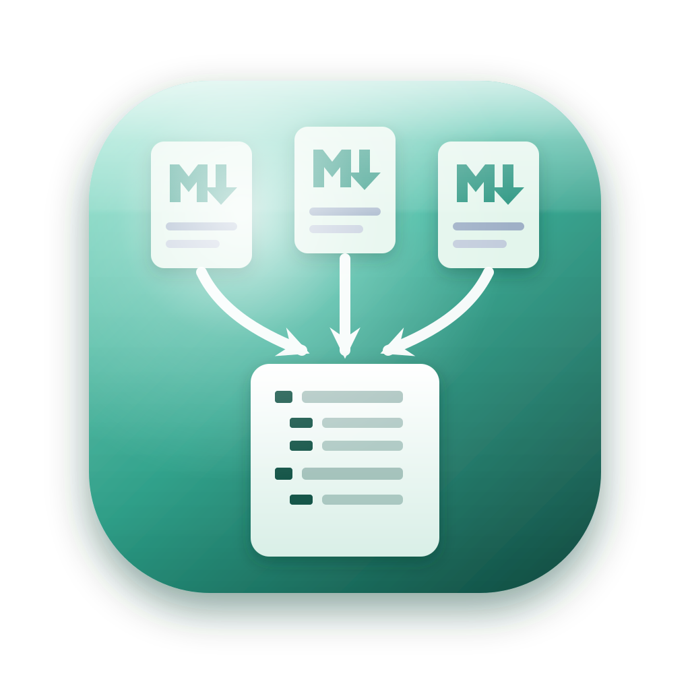

# MyMarkDownMaker

여러 개의 Markdown 파일을 하나로 **병합**하고, 병합된 문서의 **전체 구조(헤딩 트리)** 를 확인하며, 헤딩에 **새 계층 번호(1, 1.1, 1.1.1 …)** 를 생성·적용하고, **Markdown / HTML / PDF / Word** 로 내보내는 크로스플랫폼 도구입니다.

동일한 코드베이스로 **Web / Windows / macOS / Linux** 에서 동작합니다. (React + Vite + Electron)



## 주요 기능

### 파일 수집
- **폴더 추가 / 파일 추가** — 폴더를 고르면 하위의 `.md`/`.markdown` 파일을 재귀 수집하며, 폴더·파일을 **여러 번 누적**해서 추가할 수 있습니다(중복 자동 제거).
- **정렬 · 선택 · 순서** — 이름/날짜 정렬, 드래그 또는 ▲▼ 버튼으로 **직접 순서 지정**, 파일별 체크.

### 병합 · 구조 · 번호
- **자동 병합** — 별도의 병합 버튼 없이, 파일을 **선택/체크/재정렬**하거나 옵션을 바꾸면 곧바로 하나로 병합되어 미리보기가 갱신됩니다. 병합이 오래 걸리면 진행률 팝업이 표시됩니다. 각 파일은 `---` 구분선으로 이어 붙이며, 선택 시 `## 상대경로` 헤더를 자동 삽입합니다.
- **자동 번호 매기기** — 옵션 바의 **번호 매기기** 체크박스로 켜면 병합 시 문서 전체에 계층 번호(1, 1.1, 1.1.1 …)가 자동 부여됩니다(코드블록 내부 `#` 은 무시). 필요 시 우클릭 메뉴로 수동 재적용도 가능합니다.
- **전체 구조 보기** — 병합 결과의 헤딩(H1~H6)을 좌측 트리로 표시. 항목 클릭 시 미리보기의 해당 위치로 스크롤.

### 그림
- **그림 탭** — 문서에 포함된 모든 그림을 썸네일 + `그림 N` 번호로 좌측에 표시. 클릭하면 미리보기의 해당 그림으로 스크롤하고(편집 중이면 편집기의 해당 이미지 링크를 선택), 편집기 커서가 놓인 그림은 자동으로 강조됩니다.
- **미리보기·편집 창에서 그림 표시** — 미리보기에는 그림이 그대로 렌더링되고, 편집 탭에는 원문 옆에 그림 패널이 붙어 편집하면서도 실제 이미지를 볼 수 있습니다. 본문의 Base64 데이터는 편집 화면을 가리지 않도록 짧은 `mmm-img:N` 참조로 대체되며, **미리보기와 모든 내보내기(md/html/pdf/doc)에서 원본 이미지 데이터로 되살아나 문서에 내장**됩니다.
- **그림 크기 조절** — 그림 패널의 슬라이더로 각 그림의 표시 폭(문서 폭 대비 10~100%)을 조절합니다. 크기는 `` 형태로 원문에 기록되어 편집 탭에서도 보이며, 미리보기·PDF·Word·HTML에 그대로 반영됩니다(Markdown 내보내기는 `` 로 변환).
- **그림 목차(List of Figures) 페이지** — 목차 페이지 다음에 그림 목차 페이지가 별도로 생성되고, 각 항목에 실제 페이지 번호가 우측 정렬로 표시됩니다. 본문의 단독 그림에는 `그림 N. 설명` 캡션이 붙습니다. **문서에 그림이 없으면 그림 목차 페이지는 만들어지지 않습니다.**

### 편집 · 내보내기
- **미리보기 = 내보낼 문서 전체** — 표지 → 목차 → 그림 목차 → 본문을 그대로 보여 줍니다. 목차·그림 목차 항목을 클릭하면 해당 위치로 이동하며, 블록 사이 점선이 내보낼 때 페이지가 나뉘는 자리입니다. 선택한 내보내기 글꼴·크기·줄 간격도 미리보기에 반영됩니다.
- **편집 = 그 문서 전체를 그대로 편집** — 편집 탭은 표지·목차·그림 목차까지 포함한 문서 전체를 Markdown 원문으로 보여 주며, 고친 내용이 그대로 내보내집니다. 각 블록은 `<!-- mmm:cover -->` 같은 주석으로 감싸여 있어, 내보낼 때는 표지 페이지·페이지 번호가 붙은 목차 표로 다시 조판됩니다.
- **종료 시 저장 확인** — 내보내지 않은 변경 내용이 있으면 닫기 전에 **저장 / 저장 안 함 / 취소** 를 묻습니다. 저장은 Markdown(`.md`) 내보내기이며, 저장 대화상자를 취소하면 종료도 취소됩니다.
- **내보내기** — Markdown(`.md`), HTML(`.html`), PDF(`.pdf`), Word(`.doc`). 파일 이름은 첫 병합 파일 이름을 기본값으로 제안하며 직접 수정 가능.
- **표지(Cover) + 목차(Index) 페이지 자동 생성** — 표지 제목은 직접 입력할 수 있고(비우면 문서 제목), 목차는 본문 앞 별도 페이지로 만들어집니다. **PDF·Word·HTML 목차에 각 항목의 페이지 번호가 우측 정렬로 표시**됩니다(paged.js 페이지네이션으로 실제 페이지를 계산해 채움). 최상위(H1) 항목의 페이지 번호는 굵게 표시됩니다. *(Word는 자체 재페이지네이션 특성상 근사값)*
- **내보내기 서식** — 글꼴(시스템 설치 폰트 전체에서 선택)·크기(±버튼)·**줄 간격**(기본 1.5, ±0.5 버튼), 머리글/바닥글 문구와 정렬, 페이지 번호 표시/숨김·위치·표지 포함 여부를 설정할 수 있습니다. 내보내기 설정은 미리보기와 동일하게 적용됩니다.
- **페이지에 맞는 표** — 넓은 표는 PDF·Word 모두에서 페이지 폭에 맞춰 줄바꿈되어 오른쪽으로 잘리지 않습니다.
- **페이지에 맞는 ASCII 도형** — 코드블록 안의 넓은 박스 그림은 줄바꿈 없이 글자 크기만 줄여 페이지 안에 넣습니다(한글은 두 칸 폭으로 계산).
- **페이지에 맞는 그림** — 내보낼 때 각 그림의 실제 크기를 재어 페이지 폭·높이에 맞게 비율을 유지한 채 줄입니다. Word 는 `max-width` 를 무시하고 원본 픽셀 크기로 인쇄하기 때문에, 크기를 픽셀 값으로 못박아 넣어야 그림이 여백을 넘지 않습니다.

### 사용성
- **툴바의 빠른 설정 버튼** — 표지 / 목차 / 그림 목차 / 페이지 번호를 한 번의 클릭으로 켜고 끄고, 본문 글꼴 크기를 **− +** 로 조절합니다. 켜진 옵션은 강조 색으로 표시되며, 설정 창의 같은 항목과 실시간으로 연동됩니다. **번호 다시 매기기** 도 툴바 버튼으로 바로 실행합니다.
- **화면 확대 / 축소** — 툴바의 **− 100% +** 로 미리보기·편집 화면을 50~300% 로 조절합니다(비율 숫자를 누르면 100%). **Ctrl +/−/0**, **Ctrl + 휠** 도 지원하며, 화면 표시에만 적용되고 내보낸 문서에는 영향을 주지 않습니다.
- **충실한 컨텍스트 메뉴** — 미리보기·편집 창의 우클릭 메뉴에서 복사/붙여넣기와 실행 취소는 물론 확대·축소, 탭 전환, 번호 다시 매기기, 네 가지 형식 내보내기까지 바로 실행합니다.
- **설정 창(별도의 이동 가능한 창)** — 언어·테마·내보내기 서식을 2단 레이아웃의 별도 창에서 변경(메인 창 밖으로 이동 가능). **설정 초기화** 버튼으로 기본값 복원.
- **16가지 테마** — Dark / Light / White / Midnight / Nord / Forest / Rose / Solarized / Contrast / Ocean / Mocha / Sky / Violet / Amber / Mint / Sand. 테마마다 툴바 아이콘이 다르게 표시되며, 툴바 버튼으로 순환할 수 있습니다.
- **컨텍스트 메뉴** — 파일·구조·그림·미리보기·편집 영역에서 우클릭 메뉴(아이콘 + 레이블).
- **툴팁 · 상태바** — 모든 버튼에 빠른 툴팁, 상태바에 파일 수·헤딩 수·그림 수·단어/글자 수·폰트·테마 표시.
- **한국어 / 영어(ko/en)** — 지구본 아이콘 버튼으로 전환하며, 선택 상태는 저장됩니다.
- **창 정리** — 메인 창을 닫으면 열려 있던 설정·정보 창도 함께 종료됩니다.

## 실행 (개발)

```bash
npm install
npm start
```

- `npm start` 는 Vite 개발 서버와 Electron 앱을 함께 띄웁니다(코드 수정이 즉시 반영).
- 웹 버전만 보려면 `npm run web` 후 브라우저에서 `http://localhost:5178` 접속.

> 최초 설치 시 이 npm 환경은 install 스크립트를 차단할 수 있습니다. Electron 바이너리가 없다는 오류가 나면
> `npm install-scripts approve electron sharp esbuild` 후 다시 `npm install` 하거나, `node node_modules/electron/install.js` 를 실행하세요.

## 빌드 / 설치

```bash
npm run build:win     # Windows NSIS 설치 파일(.exe)
npm run build:mac     # macOS DMG
npm run build:linux   # Linux AppImage + deb
npm run build         # 웹 정적 배포본 (dist/)
```

- 설치 파일은 `release/` 에 생성되며, 빌드 후 자동으로 프로젝트 루트에도 복사됩니다.
- Windows 설치 시 **바탕화면 / 시작 메뉴 바로가기** 생성 여부를 개별 선택할 수 있습니다.
- 아이콘은 `assets/icon.svg` 로부터 `npm run generate:icons`(win/mac/linux 빌드 전 자동 실행)에서 `.ico/.icns/.png` 로 생성됩니다.

## 기술 스택

| 영역 | 사용 |
|------|------|
| UI / 번들링 | React 18 + Vite 5 |
| 데스크톱 셸 | Electron 31 (Windows/macOS/Linux) |
| Markdown 렌더링 | marked |
| HTML 살균 | DOMPurify |
| Word(.doc) 변환 | MHT(multipart/related) — Office 네임스페이스 + 이미지 파트 |
| PDF 페이지네이션(목차 페이지 번호) | paged.js (메인 프로세스 오프스크린 렌더) |
| 아이콘 래스터화 | sharp |
| 인스톨러 패키징 | electron-builder (NSIS / DMG / AppImage / deb) |

자세한 내용은 [Architecture.md](Architecture.md) 와 [UsersGuide.md](UsersGuide.md) 를 참고하세요.

## 라이선스

MIT © 2026 SHKWON
