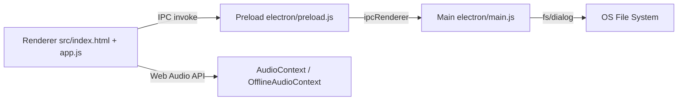

# Architecture

## 개요

Sound Effect Studio는 Electron 메인 프로세스와 렌더러(UI)로 구성됩니다.

- 메인 프로세스: 파일 대화상자, 파일 저장/읽기, 앱 창 관리
- 렌더러: UI 렌더링, 오디오 엔진, 편집/믹싱 로직

## 런타임 구성



## 주요 모듈

## 1) Electron Layer

- `electron/main.js`
  - BrowserWindow 생성
  - 오디오/프로젝트 열기/저장 다이얼로그 핸들러
  - 최근 다이얼로그 경로 상태 저장(`dialog-state.json`)
- `electron/preload.js`
  - `window.electronAPI` 브리지 노출
  - 렌더러에서 안전하게 IPC 호출

## 2) Renderer Layer

- `src/app.js`
  - 전역 상태(state) 관리
  - 트랙/클립/오토메이션 렌더링
  - 재생/정지/루프/컨텍스트 메뉴 이벤트 처리
  - 테마/언어/밀도 설정 관리
- `src/audio/exporter.js`
  - `AudioBuffer -> WAV` 인코딩
  - Electron/Web 저장 경로 분기
- `src/audio/formats.js`
  - 지원 확장자/ MIME 판별

## 3) UI & Style

- `src/index.html`
  - 앱 레이아웃과 UI 요소 정의
- `src/styles/main.css`
  - 패널/버튼/캔버스/컨텍스트 메뉴 스타일
  - `data-theme` 및 `data-ui-density` 기반 오버라이드
- `src/styles/themes.css`
  - 테마 변수 정의(보조)

## 4) Localization

- `src/i18n/i18n.js`
  - 번역 카탈로그 로드, DOM 자동 적용(`data-i18n`)
- `src/i18n/ko.json`, `src/i18n/en.json`
  - 로케일 리소스

## 데이터 모델(요약)

`state` 중심 구조:

- `tracks[]`: 오디오 버퍼, 볼륨/팬, FX, mute/solo/cue
- `clips[]`: 트랙별 배치 시간/길이
- `automationCurves`: volume/pan/master 곡선
- `loopIn`, `loopOut`, `isPlaying`, `playStartOffset`

## 오디오 흐름

1. 파일/톤 입력
2. `decodeAudioData`로 버퍼 생성
3. 트랙 체인(EQ/Comp/Reverb/Pan/Gain) 구성
4. 마스터 버스 합산
5. 실시간 분석(미터) + 오프라인 렌더링(믹스 저장)

## 설정 영속화

로컬 저장소 키:

- `ses.locale`: UI 언어
- `sms_theme`: 테마(light/dark)
- `sms_ui_density`: UI 밀도(studio/compact)

## 최근 적용 아키텍처 개선

- 테마 전환 범위 확대: 상위 패널 + 하위 모듈 오버라이드 추가
- 컨텍스트 메뉴 액션과 단축키 명시적 매핑
- 동적 라벨의 i18n 반영 강화(토글형 버튼 포함)

## 아키텍처 스크린샷 매핑

아래 이미지를 문서에 추가하면 구조 설명과 UI가 연결됩니다.

- `docs/screenshots/arch-ui-regions.png`: 상단 바/워크스페이스/도크/상태바 영역 구분
- `docs/screenshots/arch-theme-compare.png`: 동일 화면의 Dark/Light 비교
- `docs/screenshots/arch-context-menu-flow.png`: 웨이브폼 우클릭 -> 메뉴 액션 흐름

삽입 예시:

```md


```
